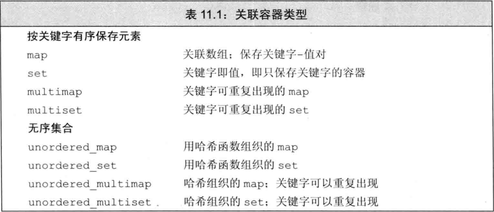
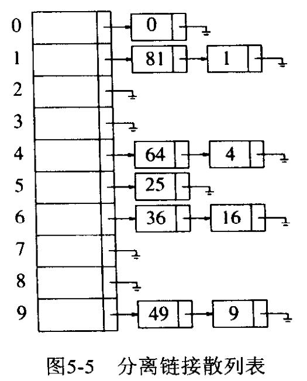

## 1. 关联容器特点简介

关联容器和顺序容器是两种适用范围不同的容器。许多C++程序员只用过顺序容器诸如vector和string，但他们从未使用过set和map等关联数据结构。



`set`是元素的简单集合，用来保存类型相同的一组元素。当你只是想知道一个值**是否存在**时，`set`是最有用的。

- `set`**不会出现重复元素**
- 内部元素永远**有序**
- `set`中的元素一经添加就**不能修改**。

`map`可以看做特殊的`vector`，其特殊之处在于此`map`中的每个元素都由两部分 `(key, value)` 构成，C++将每个这样的 `(key, value)` 封装成一个对象，其类别为`pair`。`map`内部元素都为`pair`类型。

- `map`**不会出现重复`key`**
- 内部元素永远有序，按照`pair`类型元素的key字段排序（key字段必须能够被排序）。
- `map`中的key一经添加就**不能修改**。

## 2. 有序容器基本操作

以下所有操作需要添加头文件：
```cpp
#include <map>
#include <set>
```

### 2.1 初始化

#### 2.1.1 map

```cpp
map<int, int> m; // 默认初始化
map<int, int> m{{1, 2}, {2, 4}}; // 初始化列表
map<int, int> m2(m); // 拷贝构造函数
map<int, int> m = {{1, 2}, {2, 4}}; // 初始化列表 + 拷贝构造函数

// pair和make_pair()在#include<utility>中
map<int, int> m3 = {
    std::pair<int, int>(1, 2), std::pair<int, int>(2, 4)
}; // 初始化列表的方法展开来说就是这样
map<int, int> m4{
    std::make_pair(1, 2), std::make_pair(2, 4)
}; // 或者使用make_pair函数，免得输入参数类型，效果等价。

// std::begin()和end()在#include <iterator> 中
map<int, int> m5 = {std::begin(m), std::end(m)}; // 迭代器，前提是被迭代的对象内部元素类型是pair
```

#### 2.1.2 set

```cpp
set<int> s; // 默认初始化
set<int> s{1, 2, 3, 6, 9, 10}; // 初始化列表
set<int> s2(s); // 拷贝构造函数
set<int> s = {1, 2, 3, 6, 9, 10}; // 初始化列表 + 拷贝构造函数

// std::begin()和end()在#include <iterator> 中
int arr[] = {1, 2, 5, 8, 9};
set<int> s2{std::begin(arr), std::end(arr)}; // 迭代器
```

#### 2.1.3 定义排序方法

可以给map或set初始化时输入一个比较器，用以替代原有的比较key大小的方法（原来一般是小于号）。这个比较器可以是一个函数，也可以是一个当做函数用的函数对象。下面是一个示例。

```cpp
struct comp {
    template<typename T>
    bool operator() (const T& l, const T& r) const {
        return l > r;
    }
};

int main() {
    map<int, int, comp> m = {
        {1, 5}, {2, 3}, {7, 6}
    };
    for (auto&& [key, val] : m) {
        cout << key << " " << val << endl;
    }
}
output
>> 7 6
>> 2 3
>> 1 5
```
实现自己写的比较器，简单来说就是实现一个自定义的“<”小于号。
原有的比较器`bool compare(object& left, object& right)`作用如下：
1. compare输出true，map 认为 left 小于 right ，把left放在right前面。
2. compare输出false，map 认为 left 大于等于 right。
3. 如果compare(left, right)为false，compare(right, left)也为false，就认为left==right。否则left放在right后面。

>自己实现的比较器，必须让关键字集合满足以下性质：
>- 关键字自己不能小于自己
>- 两个关键字不能互相小于对方
>- 如果按照比较器，key1小于key2，key2小于key3，则key1小于key3
>
>学过离散数学的同学应该知道，上面描述的这种二元关系满足反自反性、反对称性和传递性。满足这三个性质的关系称之为“严格偏序关系”。我们日常生活中见到的数字比较的小于号、集合中“真包含于”都是这种关系。

### 2.2 添加元素

#### 2.2.1 insert

对于map
```cpp
map<string, int> m;

m.insert({"str", 1});
m.insert(make_pair("ser", 1));
m.insert(pair<string, int>("ssr", 1));
m.insert(map<string, int>::value_type("sdr", 1));
```

对于set
```cpp
vector<int> ivec = {2, 4, 6, 8};
set<int> set2;

set2.insert(1);
set2.insert({2, 4, 6, 8});
set2.insert(ivec.cbegin(), ivec.cend());
```

insert函数和emplace函数返回pair对象，pair.first为迭代器，指向刚插入的元素，pair.second为bool，表示插入是否成功。如果由于存在重复导致插入失败，则除了second为false之外，first指向那个重复元素。

```cpp
set<int> s;
const auto [iter, success] = s.insert(x); // 返回值拆成两个
```

#### 2.2.2 对map使用下标[]操作

map使用下标操作首先会查找该key的元素，找不到就新建一个key的pair，将其初始化。最后执行赋值操作。

```cpp
map<char, int> mp;
mp['a'] = 5;
mp['b'] = 4;
mp['c'] = 3;
```

### 2.3 访问和查找元素

map除了使用下标操作访问元素之外，还可以用`at()`函数。
```cpp
map<char, int> mp;
mp.at(k) // 查找关键字为k的元素，找不到就抛出异常
```

关联容器内置的`find`函数和`count`函数可以执行查找操作

```cpp
//c为一个map容器
c.find(k) // 返回一个迭代器，指向关键字为k的元素。若k不在容器中，则返回尾后迭代器
c.count(k) // 返回关键字等于k的元素数量。对于map和set而言，返回值永远是0或1。 
```
当我们要在map容器中查找一个元素时，我们可以使用find函数查找。
```cpp
auto it = word_count.find("foobar");
if(it==word_count.end())
   cout<<"foobar is not in the map"<<endl;
else
   cout<<it->first<<" "<<it->second<<endl;
```
在有序容器中，我们还可以找到关键字k附近的元素。
```cpp
s.lower_bound(k); // 返回迭代器，指向第一个关键字**不小于**k的元素
s.upper_bound(k); // 返回迭代器，指向第一个关键字**大于**k的元素
s.equal_range(k); // 返回pair<iter, iter>，表示关键字为k的元素范围。适用于multiset/multimap。若是没有k，则返回两个end()
```

在对于允许重复关键字的容器来说，查找元素的过程稍微复杂些，因为一个关键字可能对应多个值，我们需要把这么对应的值都找出来。
如果multimap中有多个元素具有相同的关键字，则这些关键字在容器中会相邻存储。我们可以通过这一特性，将一个关键字对应的多个值全部找出来。

```cpp
//《C++ Primer》示例，查找某作者对应的所有书籍
//authors是一个multimap容器
string search_item("Alain");
int numbers=authors.count(search_item);
auto it=authors.find(search_item);
while(numbers)
{
   cout<<iter->second<<endl;
   ++it;
   numbers--;
}

// 或者采用一种其他方式
for (auto beg = authors.lower_bound(search_item),
          end = authors.upper_bound(search_item);
     beg != end; ++beg) 
{
    cout << beg->second << endl; 
}

// 或者采用一种更加直接的方式
for (auto pos = authors.equal_range(search_item);
     pos.first != pos.second; ++pos.first)
{
    cout << pos.first->second << endl; // 打印每本书
}
```

### 2.4 删除元素

使用erase

```cpp
// s为关联容器，可能为set/map/multiset/multimap
s.erase(k); // 删除指定关键字的元素，返回删除的个数。
s.erase(iter); // iter必须指向s中的一个真实元素，返回指向删除元素之后的元素的迭代器。
s.erase(iter1, iter2); // 删除迭代器[iter1, iter2)，其中必须是真是的元素。iter2指向的元素不删除。返回iter2
```

## 3. 无序容器特有操作

### 3.1 无序容器特点

如果我们不关心容器中元素的次序，那么我们就可以使用无序容器。在无序容器中，元素没有明确的排列次序，当你迭代容器内的所有元素时，会发现他们的次序个有可能。我们唯一关心的是某个元素特定元素是否位于容器内。

无需容器，常常以Hash table实现出来，内部结构是一个类似于`vector<list>`的列表，列表的元素是链表`linked list`。通过某个hash函数的运算，确定元素落于这个列表的位置。

Hash函数的运算目标是让每个元素的落点（位置）有助于用户快速访问任何一个元素（前提则是哈希函数本身也必须够快）。

由于这样一个快速而完美的哈希函数不一定存在。抑或由于造成array耗费巨额内存而显得不切实际，因此退而求其次的哈希函数有可能让多个元素落于同一位置上，所以设计上就让vector的元素再被放进一个linked list中。如此一来，vector的每个位置就得以存放一个以上的元素。



无序容器的主要优点是，当你打算查找一个特定值的元素，其速度甚至可能快过有序关联式容器（时间复杂度O(1)）。前提是你有一个良好的哈希函数。然而这样的哈希函数可能需要许多内存。

以下所有操作需要添加头文件：
```cpp
#include <unordered_map>
#include <unordered_set>
```

`unordered_map`/`unordered_multimap`/`unordered_set`/`unordered_multiset`的初始化、插入、查找和删除的方法与普通的`map`/`multimap`/`set`/`multiset`没有大的区别。注意以下主要区别要点：
1. 无序容器内部不含比较器，因此你也不能提供自定义比较器。
2. 每次对无序容器的添加操作可能会引起无序容器次序的改变。即便是相同元素，在不同的电脑上也可能得到不同的次序。
3. 删除元素虽然不会引起无序容器次序改变，但是删除之后的第一次插入必然会引发次序改变。

次序究竟会不会变化、怎样变化取决于使用的rehashing策略，该策略可由程序员自定义，就像在有序关联容器里定义排序函数那样。

### 3.2 管理桶

1.桶接口
```cpp
m.bucket_count()        正在使用的桶的数目
m.max_bucket_count()    容器能容纳的最多的桶的数量
m.bucket_size(n)        第n个桶中有多少个元素
m.bucket(k)             关键字为k的元素在哪个桶
```
2.桶迭代
```cpp
local_iterator            可以用来访问桶中元素的迭代器类型
const_local_iterator      桶迭代器的const版本
m.begin(n)、m.end(n)      桶n的首元素迭代器和尾后迭代器（n是什么类型？）
m.cbegin(n)、m.cend(n)    与前两个函数类似，但返回const_local_iterator
```
3.哈希策略

```cpp
//每个桶的平均元素数量，返回float值
m.load_factor() 
//m试图维护的平均桶大小，返回float值，要求创建的新桶的load_factor<=max_load_factor         
m.max_load_factor() 
//重新存储，使得bucket_count>=n，且bucket_count>size/max_load_factor         
m.rehash(n)  
//重新存储，使得m可以保存n个元素且不必rehash 
m.reserve(n) 
```   

### 3.3 自定义哈希函数和比较函数

默认情况下，无序容器使用`==`来判断两key是否相等，并使用系统内置的哈希函数生成哈希值。不同类型的key会应用到不同的哈希函数，如下都是STL内置的哈希函数对象：

```cpp
struct hash<char*>
struct hash<const char*>
struct hash<char> 
struct hash<unsigned char> 
struct hash<signed char>
struct hash<short>
struct hash<unsigned short> 
struct hash<int> 
struct hash<unsigned int>
struct hash<long> 
struct hash<unsigned long>
```

如果key使用的是以上类型中的一种，可以使用缺省的hash函数。当然你程序员可以定义自己的hash函数。对于自定义对象，只能自定义hash函数。

下面是《C++ Primer》的一个自定义哈希函数的一个例子：

```cpp
/* 定义哈希函数和判等器 */
size_t hasher(const Sales_data &sd)
{
    // 对书籍对象的哈希
    return hash<string>() (sd.isbn()); // 返回其isbn编号的哈希，调用内置的string哈希函数
}
bool eqOp(const Sales_data &lhs, const Sales_data &rhs)
{
    // 如何判断两本书是否相等？
    return lhs.isbn() == rhs.isbn(); // 判断两书的isbn编号是否相等
}
/* 使用哈希函数和判等器 */
using SD_multiset = unordered_multiset<Sales_data, decltype(hasher)*, decltype(eqOp)*>; // 类型名太长了，将类型名保存成别的变量名
SD_multiset bookstore(42, hasher, eqOp);
```

## 4. 小结

对C++ 关联容器的总结到此告一段落。本篇文章从开始着手写作到完成，不间断地工作了八个小时，期间不断重温已经遗忘的知识，查阅资料，其中很多还是自己曾经收藏过的资料。

写作时，我多次问自己：写一篇不会有人看的文章值得吗？我也多次想要像我以前很多文章、像CSDN大多数的文章那样，随便水水，记录一下，反正只有自己看。

但是这次我觉得，我要为自己负责，要为已经付出的精力和时间负责。我相信大家都会有这种迷茫的时候，怀疑自己手头上的工作有没有意义，甚至想放弃。

不要轻言放弃，尤其是当你怀疑它的意义的时候。因为这个时候你可能是在为自己的懒惰找借口。将一件事情的意义贬低，这种想法出现的太容易，又太能让自己解脱了。这是一种让人没有负罪感的放弃方式。但是回头看，很多好想法，明明只要坚持一下就可以实现。因为对意义的评价，近乎于预测未来，我们大多数平凡人是没有这种本事的。

Be a better man, 每天进步一点点。大家共勉！