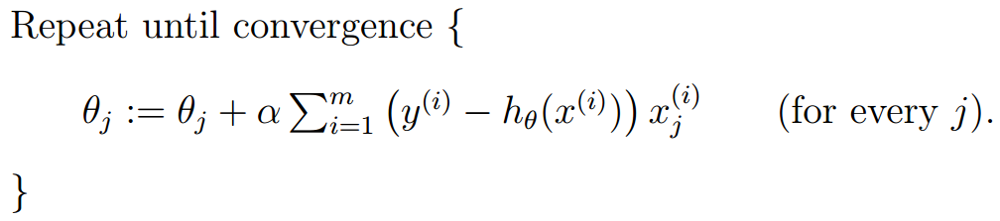

## 1. Supervised learning
机器学习，机器从数据中学习固定的问题-答案模式，形成固定的问答模型的过程。

机器学习的过程可用下图表示：

机器通过特定的学习方法Learning Algorithm学习已知的问题-答案数据集Training Set，Learning Algorithm最终会得到一个与真实模型相差无几的假说模型hypothesis。得到该模型之后，我们就可以利用它，对全新的问题的答案作出预测。

机器通过问题-答案训练模型的过程，称之为监督学习过程。问题是由一组已知数据构成的输入，比如房屋的面积、照射率、卧室数目等等；答案则是一个确切的结论，比如房屋的价格。刚才举的例子就是依照房屋的面积和其他信息来预测房屋的价格，输出值是一个实数（连续变量）。这在统计学上称之为回归问题。假设房屋的价格和面积成正比，则称上个问题为线性回归问题。

好了，那么机器怎么实现学习的呢？我们可以以预测房屋价格为例，构建一个学习模型。

首先，回归问题的本质就是通过给定一系列的参数，拟合出一个函数h(x)，这个函数应该与真实函数y(x)越接近越好。h(x)大概长成这样：

$$ h_{\vec\theta}(\vec x)=\theta_0+\theta_1x_1+\theta_2x_2+\cdots\\=\vec\theta^T\vec x $$

今后为了方便起见，$\vec x$和$\vec \theta$等等就不加上箭头了，他们都表示由许多分量的向量。

可以看到，学习效果的好坏，取决于$\theta$选择的好坏，选择的好了$h_{\theta}(x)$就更逼近真实的y。学习的过程，就是不断修改$\theta$的过程。

那我们怎么改$\theta$呢？回想我们的数学建模过程，我们可以构造一个函数，自变量为$\theta$，检验y(x)与h(x)的距离（即差值），距离越小则说明$\theta$越完美。这不就转化成了一个最优化问题了吗？如果构造出来的函数还能够求导的话，求一次导，找到最低点，岂不是美滋滋？因此我们构造出来了以下函数：

$$ J(\theta)=\frac{1}{2}\Sigma_{i=1}^{m}(h_{\theta}(x^{(i)})-y^{(i)}) $$

其中m是样本个数，以上就是**线性回归**问题的**损失函数**，损失函数越小，训练得越好。

## 2. 求解损失函数最小值的迭代思路

按理说，我们直接对损失函数求导，马上就知道二次函数的最低点了。求这个函数的导数可不太容易，首先我们以非解析方法来迭代求解该函数。我们采用梯度下降法，逐步逼近全局最优点：

$$ \theta_j:=\theta_j-\alpha\frac{\partial}{\partial\theta_j}J(\theta) $$

$\theta$维度太多，求导是个困难的事情。如果对$\theta$求梯度，得到某一点处下降速度最快的方向，即可逐步实现优化。下面是对$J(\theta)$求偏导数的过程：

$$ 
\frac{\partial J(\theta)}{\partial \theta_j}=\frac{1}{2}\Sigma_{i=i}^{m}\frac{\partial(\theta^Tx^{(i)}-y^{(i)})^2}{\partial\theta_j}\\=\Sigma_{i=i}^{m}(\theta^Tx^{(i)}-y^{(i)})\cdot x_j^{(i)}
$$

因此我们得到了以下学习算法：

该算法具有“离终点越近，收敛速度越慢”的特点。该算法还有一个特点，即每计算一个$\theta$的分量$\theta_j$，算法都需要遍历一遍整个数据集。效率是O(n\*n\*m\*k),n是维度，m是数据集大小，k是直到收敛为止循环的次数。

因为每判断一次，都需要整批数据的支持，因此这种梯度下降方式又称之为**批梯度下降**(batch gradient descent)。

做一个不恰当的比喻：批梯度下降好比每做一次选择，总是要询问周边所有的人的意见，之后给出一个让所有人都比较满意的方向。

与之相对应，如果我只问一个人的意见，就给出结论，这不就节约了遍历整个数据集的时间了吗？这种方法叫做**随机梯度下降**(stochastic gradient descent)。

算法表示如下：

该算法的效率是O(n*\n\*k)。虽然性能得到了提升，但是牺牲了一部分准确性。事实证明随机梯度下降能在一定程度上代替批梯度下降，我们更多地使用小批量梯度下降法，即结合二者的优势，做决定之前问问一部分人的意见即可。

## 3. 求解损失函数最小值的代数证明

前文说过，对$J(\theta)$求导不是不行，而是因为如果$\theta$维度变高，求导相对困难。下面我们就来硬肛这个方法。

先要做一些数学知识铺垫，即矩阵的求导运算：

1. 函数对矩阵求导  
对于一个函数$f:\mathbb{R}^{m\times n}\mapsto\mathbb{R}$，即输入一个矩阵，输出一个值的此类函数，定义f对矩阵A求导(the derivative of f with respect to A)为：
$$ 
\nabla_{A} f(A)=\left[ \begin{array}{ccc}{\frac{\partial f}{\partial A_{11}}} & {\cdots} & {\frac{\partial f}{\partial A_{1 n}}} \\ {\vdots} & {\ddots} & {\vdots} \\ {\frac{\partial f}{\partial A_{m 1}}} & {\cdots} & {\frac{\partial f}{\partial A_{m n}}}\end{array}\right]
$$

举个例子，若定义$A=\left[ \begin{array}{ll}{A_{11}} & {A_{12}} \\ {A_{21}} & {A_{22}}\end{array}\right]$，$f(A)=\frac{3}{2} A_{11}+5 A_{12}^{2}+A_{21} A_{22}$，那么有$\nabla_{A} f(A)=\left[ \begin{array}{cc}{\frac{3}{2}} & {10 A_{12}} \\ {A_{22}} & {A_{21}}\end{array}\right]$。

2. 矩阵的迹(trace, tr)  
矩阵的迹特指方阵的迹。矩阵的迹就是上文所定义的函数f的一个代表。定义如下：

$$\operatorname{tr} A=\sum_{i=1}^{n} A_{i i}$$

矩阵的迹有以下性质：

$tr(AB)=tr(BA)\\
tr(ABC)=tr(CAB)=tr(BCA)\\
tr(ABCD)=tr(DABC)=tr(CDAB)=tr(BCDA)\\
trA=trA^T\\
tr(A+B)=trA+trB\\
traA=atrA$

矩阵的转置的性质：

$(AB)^T= B^TA^T \\
(A+B)^T=A^T+B^T$

对迹求导的几个结论：
$\begin{aligned} \nabla_{A} \operatorname{tr} A B &=B^{T} \\ \nabla_{A^{T}} f(A) &=\left(\nabla_{A} f(A)\right)^{T} \\ \nabla_{A} \operatorname{tr} A B A^{T} C &=C A B+C^{T} A B^{T} \\ \nabla_{A}|A| &=|A|\left(A^{-1}\right)^{T} \end{aligned}$

3. 一些符号的定义
如果X是由样本构成的矩阵，
$$
X=\left[ \begin{array}{c}{-\left(x^{(1)}\right)^{T}-} \\ {-\left(x^{(2)}\right)^{T}-} \\ {\vdots} \\ {-\left(x^{(m)}\right)^{T}-}\end{array}\right]
$$
y是由真实结果组成的向量，
$$
\vec{y}=\left[ \begin{array}{c}{y^{(1)}} \\ {y^{(2)}} \\ {\vdots} \\ {y^{(m)}}\end{array}\right]
$$

由于$h_{\theta}\left(x^{(i)}\right)=\left(x^{(i)}\right)^{T} \theta$，所以我们可以得到下式：
$$
X \theta-\vec{y}=\left[ \begin{array}{c}{\left(x^{(1)}\right)^{T} \theta} \\ {\vdots} \\ {\left(x^{(m)}\right)^{T} \theta}\end{array}\right]-\left[ \begin{array}{c}{y^{(1)}} \\ {\vdots} \\ {y^{(m)}}\end{array}\right]
$$$$
=\left[ \begin{array}{c}{h_{\theta}\left(x^{(1)}\right)-y^{(1)}} \\ {\vdots} \\ {h_{\theta}\left(x^{(m)}\right)-y^{(m)}}\end{array}\right]
$$
则我们的损失函数可以化成：
$$
\begin{aligned} \frac{1}{2}(X \theta-\vec{y})^{T}(X \theta-\vec{y}) &=\frac{1}{2} \sum_{i=1}^{m}\left(h_{\theta}\left(x^{(i)}\right)-y^{(i)}\right)^{2} \\ &=J(\theta) \end{aligned}
$$

4. 开始推导
根据上面的结论，让损失函数对$\theta$求导，得到：
$$
\begin{aligned} \nabla_{\theta} J(\theta) &=\nabla_{\theta} \frac{1}{2}(X \theta-\vec{y})^{T}(X \theta-\vec{y}) \\ &=\frac{1}{2} \nabla_{\theta}\left(\theta^{T} X^{T} X \theta-\theta^{T} X^{T} \vec{y}-\vec{y}^{T} X \theta+\vec{y}^{T} \vec{y}\right) \\ &=\frac{1}{2} \nabla_{\theta} \operatorname{tr}\left(\theta^{T} X^{T} X \theta-\theta^{T} X^{T} \vec{y}-\vec{y}^{T} X \theta+\vec{y}^{T} \vec{y}\right) \\ &=\frac{1}{2} \nabla_{\theta}\left(\operatorname{tr} \theta^{T} X^{T} X \theta-2 \operatorname{tr} \vec{y}^{T} X \theta\right) \\ &=\frac{1}{2}\left(X^{T} X \theta+X^{T} X \theta-2 X^{T} \vec{y}\right) \\ &=X^{T} X \theta-X^{T} \vec{y} \end{aligned}
$$

令导数为零，求得零点的$\theta$值为：
$$
\theta=\left(X^{T} X\right)^{-1} X^{T} \vec{y}
$$

# 4. 为什么使用最小二乘作为损失函数？

除了易于数学处理之外，还有更深刻的道理。我们将从概率的角度解释为什么使用最小二乘法作为损失函数。

我们说，现实生活中的大多数模型，甚至是全部模型，其输入都含有一定的误差$\epsilon$。这些误差各自符合不同的分布。

$$
y^{(i)}=\theta^{T} x^{(i)}+\epsilon^{(i)}
$$

根据大数定律，多个随机变量的结果趋近于高斯分布（正态分布），即$\epsilon^{(i)}\sim\mathcal{N}\left(0, \sigma^{2}\right)$。则$\epsilon^{(i)}$的概率是：

$$
p\left(\epsilon^{(i)}\right)=\frac{1}{\sqrt{2 \pi} \sigma} \exp \left(-\frac{\left(\epsilon^{(i)}\right)^{2}}{2 \sigma^{2}}\right)
$$

将$y^{(i)}=\theta^{T} x^{(i)}+\epsilon^{(i)}$带入得：

$$
p\left(y^{(i)} | x^{(i)} ; \theta\right)=\frac{1}{\sqrt{2 \pi} \sigma} \exp \left(-\frac{\left(y^{(i)}-\theta^{T} x^{(i)}\right)^{2}}{2 \sigma^{2}}\right)
$$

上式左边是在第i个样本为x、参数为θ的条件下，得到y的概率。上式完全是一个与θ有关的函数，因为样本x和y都是固定的。别忘了，我们需要求的是θ。问题转化成了**我们已知事件发生的概率，想要反推具有最大可能性时，θ的值**。

这边就要稍微插一句了，机器学习学术界有两种学派，一派是*频率学派*，另一派是*贝叶斯学派*。二者各自有用武之地，都能解决上面提出的问题。下面我们利用频率学派的方法：**最大似然估计**解决这个问题。首先构造下面的函数：

$$
L(\theta)=L(\theta ; X, \vec{y})=p(\vec{y} | X ; \theta)
$$

我们的样本扩大到整个样本集，则整体的概率分布就如上面的公式。因为我们假设每个样本集中的样本独立同分布（IID），所以根据概率的乘法定理，我们可以把每个事件概率相乘，得到整体的概率。

$$
\begin{aligned} L(\theta) &=\prod_{i=1}^{m} p\left(y^{(i)} | x^{(i)} ; \theta\right) \\ &=\prod_{i=1}^{m} \frac{1}{\sqrt{2 \pi} \sigma} \exp \left(-\frac{\left(y^{(i)}-\theta^{T} x^{(i)}\right)^{2}}{2 \sigma^{2}}\right) \end{aligned}
$$

又回到了最优化问题的思路来了，这是一个关于θ的函数，那我们对它求导，就有希望得到极值。连乘$\prod$不好求导的话，我们不妨对整个似然函数L(θ)取对数，因为对数在其定义域上是单调增的，所以不改变函数的单调性，我们可以利用对数函数的性质。

$$
\begin{aligned} \ell(\theta) &=\log L(\theta) \\ &=\log \prod_{i=1}^{m} \frac{1}{\sqrt{2 \pi} \sigma} \exp \left(-\frac{\left(y^{(i)}-\theta^{T} x^{(i)}\right)^{2}}{2 \sigma^{2}}\right) \\ &=\sum_{i=1}^{m} \log \frac{1}{\sqrt{2 \pi} \sigma} \exp \left(-\frac{\left(y^{(i)}-\theta^{T} x^{(i)}\right)^{2}}{2 \sigma^{2}}\right) \\ &=m \log \frac{1}{\sqrt{2 \pi} \sigma}-\frac{1}{\sigma^{2}} \cdot \frac{1}{2} \sum_{i=1}^{m}\left(y^{(i)}-\theta^{T} x^{(i)}\right)^{2} \end{aligned}
$$

看到了吗？式子最右端，出现了，我们的最小二乘优化项：

$$
\frac{1}{2} \sum_{i=1}^{m}\left(y^{(i)}-\theta^{T} x^{(i)}\right)^{2}
$$

## 5. 局部加权回归

局部加权回归的思想很简单，它可以解决欠拟合(underfitting)与过拟合(overfitting)问题。

左图对数据的预测效果不是很好，数据明显的趋势被忽略了；右图好的过分了，模型考虑了过多的噪音和误差，导致拟合产生的函数不能良好的预测未知数据。对于现实世界的复杂模型，很难说一定能找到一个完美的函数，恰好拟合所有的数据，同时对未知数据又具有良好的预测能力。

局部加权回归的思想就是，在咨询别人意见时，对于我周围的意见着重考虑，对于离我很远的意见我略微考虑，即根据离自己的距离，来决定权值大小。则优化目标就从$\sum_{i}\left(y^{(i)}-\theta^{T} x^{(i)}\right)^{2}$变成了$\sum_{i} w^{(i)}\left(y^{(i)}-\theta^{T} x^{(i)}\right)^{2}$。其中$\omega$定义为
$$w^{(i)}=\exp \left(-\frac{\left(x^{(i)}-x\right)^{2}}{2 \tau^{2}}\right)$$

其中$\tau$定义为带宽，我将会于近期更新文章解释局部加权回归。

## 6. 总结
我们介绍了机器学习中监督学习的概念，并引入了回归问题的解决方案，使用了最小二乘法对回归问题进行机器学习。对于最小二乘项，有两种方法可以对其优化，一种是逐步求精的梯度下降法，另一种则是一步到位的数学推导法。梯度下降适用于工程实现，而数学推导则是归纳总结背后的原理。

我们还从概率角度讨论了为什么回归问题要采用最小二乘法，并引入了欠拟合与过拟合的概念，最后采用局部加权回归方法尽可能避免拟合不良的问题。