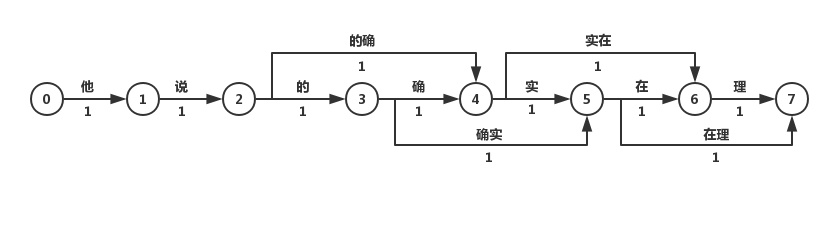

## 1. 分词的概念和实现细节

NLP的底层任务可分为词法分析、句法分析和语义分析，分词是词法分析中最基本的任务。中文分词是在一个中文序列的词与此之间加上空格或者其他边界标志进行分割，从而方便接下来步骤的处理。

分词算法可分为两种，一种是基于词典的分词算法，另一种是基于字的分词算法。

### 1.1 基于词典的分词算法：

**最大匹配分词算法**，有正向和反向两种。主要思路是将词典构造成一颗Trie树，也成为词典树。以“他说的确实在理”这句话为例，构造Trie树如图所示：


Trie树由词的公共前缀构成节点，降低了存储空间的同时提升查找效率。最大（正向）匹配分词将句子与Trie树进行匹配，在匹配到根结点时由下一个字重新开始进行查找。比如正向（从左至右）匹配“他说的确实在理”，得出的结果为“他／说／的确／实在／理”。如果进行反向最大匹配，则为“他／说／的／确实／在理”。

单独依仗这种方法达不到很好的分词效果，而且分词时间复杂度为O(N)，即随着字符串长度线性上升。

**最短路径分词算法**，讲一句话中所有的词匹配出来构成**词图**，词图是一个有向无环图。之后分词问题转化为求开始节点和结束节点之间的最短路径的问题。有迪杰斯特拉算法以及其他算法。不一定只保存最短的路径，有可能保存前N短的路径。图的边上也有可能按照不同词汇出现的概率大小不同安排不同的权值。



如何构建不同权值的词图？有基于n-gram的分词算法。最后我们可以得到词的概率图。


### 1.2 基于字的分词算法

与基于词典的分词不同的是，基于字的分词事先不对句子进行词的匹配，而是将分词看成序列标注问题，把一个字标记成B(Begin), I(Inside), O(Outside), E(End), S(Single)。因此也可以看成是每个字的分类问题，输入为每个字及其前后字所构成的特征，输出为分类标记。对于分类问题，可以用统计机器学习或神经网络的方法求解。

在NLP中，最常用的神经网络为循环神经网络（RNN，Recurrent Neural Network），它在处理变长输入和序列输入问题中有着巨大的优势。LSTM为RNN变种的一种，在一定程度上解决了RNN在训练过程中梯度消失和梯度爆炸的问题。双向（Bidirectional）循环神经网络分别从句子的开头和结尾开始对输入进行处理，将上下文信息进行编码，提升预测效果。

## 2. 词、字符频率统计

统计一篇文章中单词出现的次数，首先应该知道该文章中，有多少个单词（去重后），然后再统计单词在文章中的出现频率。这里使用最简单的方式来实现该功能。

```python
def statistics():
    path = ...
    with open(path, 'r', encoding='UTF-8') as text:
        print(string.punctuation)
        words = [raw_word.strip(string.punctuation).lower() for raw_word in text.read().split()]
        words_index = set(words)
        counts_dict = {index: words.count(index) for index in words_index}

    for word in sorted(counts_dict, key=lambda x: counts_dict[x], reverse=True):
        print('{}--{} times'.format(word, counts_dict[word]))
```

## 3. 语言模型中unigram、bigram、trigram的概念

简单地说，语言模型就是用来计算一个句子的概率的模型。为了解决參数空间过大的问题。引入了马尔科夫假设：随意一个词出现的概率只与它前面出现的有限的一个或者几个词有关。

如果一个词的出现与它周围的词是独立的，那么我们就称之为unigram也就是一元语言模型：


如果一个词的出现仅依赖于它前面出现的一个词，那么我们就称之为bigram：


同理，trigram：


一般来说，N元模型就是假设当前词的出现概率只与它前面的N-1个词有关。在实践中用的最多的就是bigram和trigram了。

## 4. 文本矩阵化

```python
a ="自然语言处理是计算机科学领域与人工智能领域中的一个重要方向。它研究能实现人与计算机之间用自然语言进行有效通信的各种理论和方法。自然语言处理是一门融语言学、计算机科学、数学于一体的科学"
b = "因此，这一领域的研究将涉及自然语言，即人们日常使用的语言，所以它与语言学的研究有着密切的联系，但又有重要的区别。自然语言处理并不是一般地研究自然语言，而在于研制能有效地实现自然语言通信的计算机系统，特别是其中的软件系统。"
c ="因而它是计算机科学的一部分。自然语言处理（NLP）是计算机科学，人工智能，语言学关注计算机和人类（自然）语言之间的相互作用的领域。"
import jieba
all_list= ['  '.join(jieba.cut(s,cut_all = False)) for s in [a,b,c]]
print(all_list)
```

```python
#从文件导入停用词表
stpwrdpath ="C:\\Users\\Administrator\Desktop\lect09_codes\lect09_proj\stop_words\\中文停用词库.txt"
with open(stpwrdpath, 'rb') as fp:
    stopword = fp.read().decode('utf-8')  # 提用词提取
#将停用词表转换为list  
stpwrdlst = stopword.splitlines()
# 从sklearn.feature_extraction.text里导入CountVectorizer
from sklearn.feature_extraction.text import CountVectorizer
# 对CountVectorizer进行初始化（去除中文停用词）
count_vec=CountVectorizer(stop_words=stpwrdlst) #创建词袋数据结构
X_count_train = count_vec.fit_transform(all_list[:2])  #<class 'scipy.sparse.csr.csr_matrix'>
# 将原始训练和测试文本转化为特征向量
X_count_train= X_count_train.toarray()
X_count_test = count_vec.transform(all_list[2]).toarray()
print(X_count_train)
#词汇表
print('\nvocabulary list:\n\n',count_vec.get_feature_names())
print( '\nvocabulary dic :\n\n',count_vec.vocabulary_)
print ('vocabulary:\n\n')
for key,value in count_vec.vocabulary_.items():
    print(key,value)
```