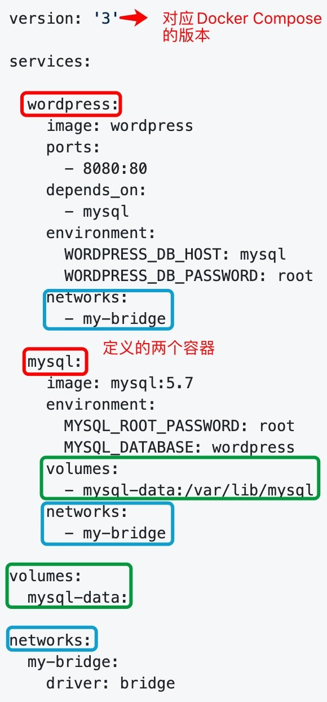

Datawhale Docker学习笔记第五篇
<!--more--->

# 什么是docker compose

要实现一个 Web 项目，除了 Web 服务容器本身，往往还需要再加上后端的数据库服务容器，甚至还包括负载均衡容器等，这些需要多个容器相互配合来完成。

Docker Compose 允许用户通过一个单独的 docker-compose.yml 模板文件（YAML 格式）来定义一组相关联的应用容器为一个项目（project）。

下面是一个 docker-compose.yml 示例：



里面多了image、ports、networks等标签。

# 如何使用docker compose

在Compose 中有两个重要的概念：

**服务 (service)**：一个应用的容器，实际上可以包括若干运行相同镜像的容器实例。

**项目 (project)**：由一组关联的应用容器组成的一个完整业务单元，在 docker-compose.yml 文件中定义。

Compose的默认管理对象是**项目**，也就是通过docker-compose.yml定义的一组服务集合，通过一些命令来对项目中的一组容器进行便捷地生命周期管理。

下面我们来看一个真实的场景，在该场景下我们是通过Python来写一个能够记录页面访问次数的 web 网站。

## web 应用示例

**app.py**

```py
from flask import Flask
from redis import Redis
import os
import socket

app = Flask(__name__)
redis = Redis(host=os.environ.get('REDIS_HOST', '127.0.0.1'), port=6379)


@app.route('/')
def hello():
    redis.incr('hits')
    return 'Hello Container World! I have been seen %s times and my hostname is %s.\n' % (redis.get('hits'),socket.gethostname())


if __name__ == "__main__":
    app.run(host="0.0.0.0", port=5000, debug=True)
```

**Dockerfile**

```docker
FROM python:2.7
COPY . /app
WORKDIR /app
RUN pip install flask redis
EXPOSE 5000
CMD [ "python", "app.py" ]
```

**docker-compose.yml**

```yaml
version: "3"

services:

  redis:
    image: redis

  web:
    build:
      context: .
      dockerfile: Dockerfile
    ports:
      - "5000:5000"
    environment:
      REDIS_HOST: redis
```

**运行 compose 项目**

`$ docker-compose up -d`

此时访问本地 5000 端口http://localhost:5000，每次刷新页面，计数就会加 1。

# docker compose基本使用

## 启动服务

在创建好docker-compose.yml文件后，可以通过下面这个命令将文件中定义的容器都启动起来，在docker compose中我们更习惯于将每一个容器叫做service。
```
docker-compose up
```
命令后会自动接一个默认值-f docker-compose.yml，也就是默认是使用docker-compose.yml文件的。我们也可以给文件起名为docke-test.yml，这样在使用时指定文件名，但是为了符合规范，还是统一为docker-compose.yml。

```
docker-compose up -f docer-test.yml
```

但是直接通过这种方式的话会直接将启动时的输出打印到终端，所以我们常会加上-d参数。
```
docker-compose up -d
```
## 查看服务状态

接下来可以查看一下我们创建的service状态
```
docker-compose ps
```
要是想要查看所有service的状态可以使用-a参数：
```
docker-compose ps -a
```
## 停止或删除服务

如何停止已经运行的services呢，可以使用以下两个命令
```
docker-compose stop
docker-compose down
```
其中stop是直接停止services，而down则会停止并删除创建的service，volume和network。

## 进入服务

有些情况下我们还需要进入容器来执行一些命令，可以通过如下方式进入容器
```
docker-compose exec mysql bash
```
exec后面接的就是我们要进入具体的service的名字，名字后面就是我们要执行的命令。

## 查看服务输出日志

有些情况下一些服务可能无法正常启动，这时可以使用命令查看日志并定位发生错误的原因
```
docker-compose logs
```