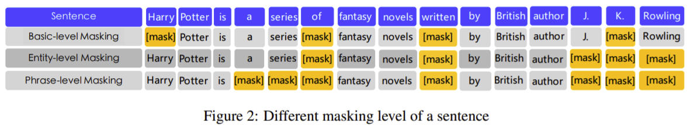
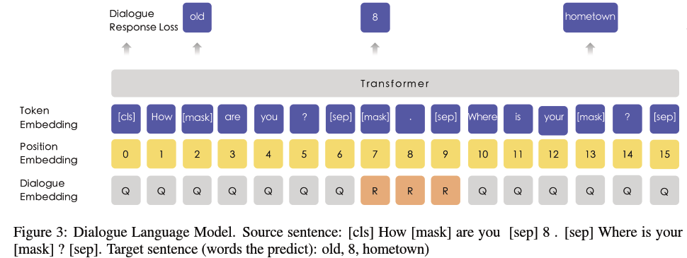
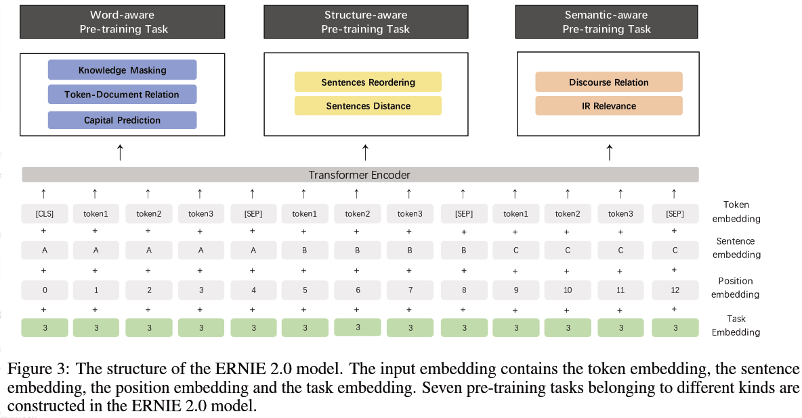
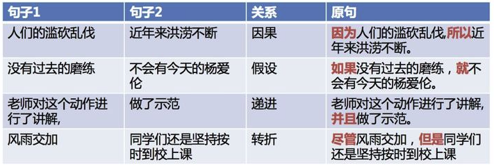
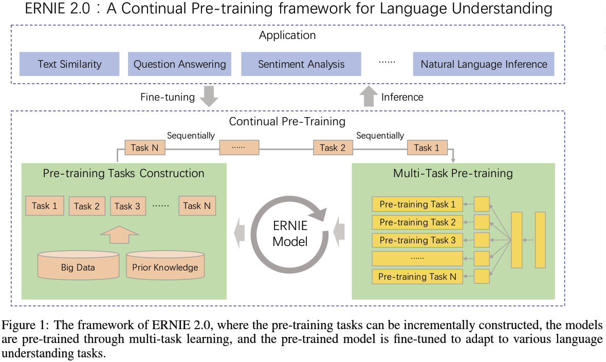
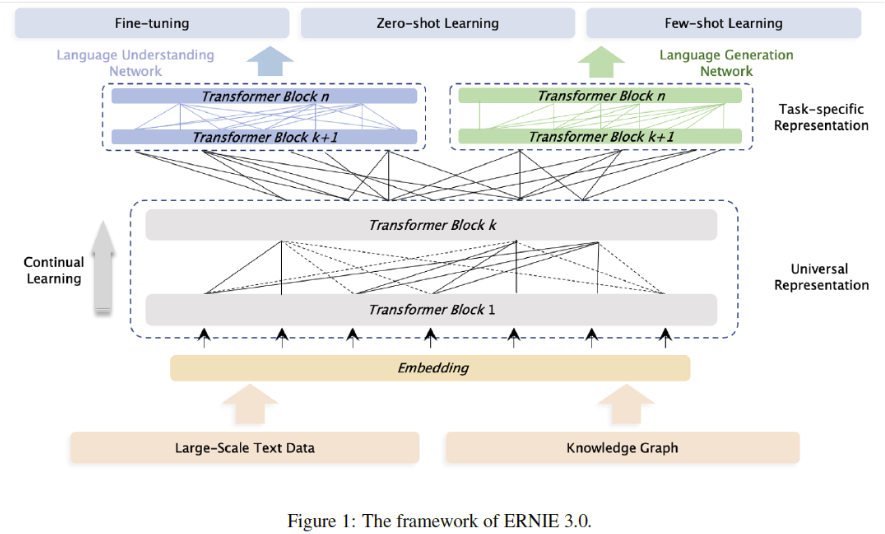
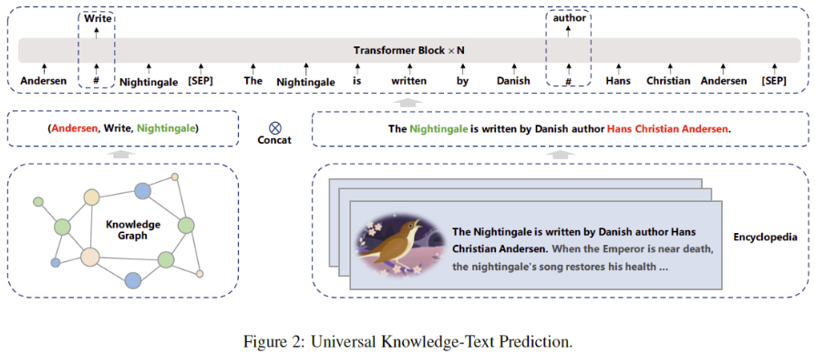

<!--more--->

文心大模型ERNIE是百度发布的产业级知识增强大模型。

https://github.com/PaddlePaddle/ERNIE

## Roadmap

| 时间 | 发布模型 |
| --- | --- |
| 2019.3.16 | ERNIE 1.0 |
| 2019.7.7 | ERNIE 2.0 |
| 2021.5.20 | 多粒度语言知识模型 ERNIE-Gram、超长文本双向建模预训练模型ERNIE-Doc ，以及其他图文多模态模型 |
| 2021.12.3 | 多语言 ERNIE-M |
| 2022.5.20 | ERNIE 3.0 系列: 110M参数通用模型ERNIE 3.0 Base、280M参数重量级通用模型ERNIE 3.0 XBase、74M轻量级通用模型ERNIE 3.0 Medium |

## Ernie 1.0

Ernie: Enhanced representation through knowledge integration

相较于 BERT，Ernie 1.0 在模型结构上没有改动，都是采用若干 Transformer 的 Encoder 结构。

Ernie 1.0 的改动在预训练任务。

### 1. Knowledge Masking

BERT 的预训练采用 masked language-model（MLM）的方法，即在训练的时候随即从输入预料上mask掉一些单词，然后通过的上下文预测这些单词，该任务非常像我们在中学时期经常做的完形填空；以及Next Sentence Prediction（NSP）的方法，即判断连个句子是否是具有前后顺承关系的两句话。

ERNIE提出了`Knowledge Masking`的策略，其包含三个级别：ERNIE将Knowledge分成了三个类别：`token级别(Basic-Level)`、`短语级别(Phrase-Level)` 和 `实体级别(Entity-Level)`。通过对这三个级别的对象进行Masking，提高模型对字词、短语的知识理解。

Basic-Level Masking 就是最基础的 masking 任务，和 BERT 一样，随机选取某些单词进行 mask，令模型来预测这些 mask 是什么词。

Phrase-Level Masking 是对语句中的短语进行 masking，如 a series of；

Entity-Level Masking 是对语句中的实体词进行 masking，如人名 J. K. Rowling。

### 2. Dialogue Language Model

在 Bert 已有的预训练任务中，加入了 Dialogue Language Model 任务，使 ERNIE 学习到对话中的隐含关系，增加模型的语义表达能力。

在生成预训练数据的时候，有一定几率用另外的句子替代里面的问题和答案，所以模型还要预测是否是真实的问答对。

DLM 中，不再构建如同 “[CLS] + Sentence_A + [SEP] + Sentence_B + [SEP]” 的句子对，

而是如同 “[CLS] + Query + [SEP] + Response_A + [SEP] + Response_B + [SEP]” 的对话三元组；

是否上下文连续的二分类训练目标转为预测该对话是否真实 (real/fake)。

三元组随机地采用 QRQ、QRR、QQR 其中一种构建形式，上面的例子便是其中的 QRR。

为了给处理后的数据添加噪声，部分的 Query 和 Response 使用不相关的语句进行随机替换，以强制模型学习对话中的语境关联。

在训练一般语料时，ERNIE 采用 Knowledge Masking Strategies 改造后的 Masked LM；而在训练对话型语料时，ERNIE 采用 DLM；两者交替使用。

### 3. 添加数据

Ernie 还采用多个来自不同源头的数据，比如百度贴吧，百度新闻，维基百科等等帮助模型训练。

### 参考

https://blog.csdn.net/u011150266/article/details/116479149

https://www.cnblogs.com/shona/p/11820492.html

## Ernie 2.0

Ernie 2.0: A continual pre-training framework for language understanding

### 1. 总体改动

ERNIE 2.0 将 1.0 版本中的功能特性全部予以保留，并在此基础上做更为丰富的扩展和延伸。

Ernie 2.0 添加了很多其他的自监督学习方法进行训练。该思想与 ALBERT（SOP）、SpanBERT（SBO）类似。

但是一味堆叠任务可能导致各种任务都学不好，Ernie 2.0 提出了一个持续学习的框架，模型可以持续添加任务但又不降低之前任务的精度。

目标是能够更好更有效地获得词法lexical，句法syntactic，语义semantic上的表达。

### 2. 添加预训练任务

**1）Word-aware Pretraining Tasks**，捕捉词汇 (lexical) 级别的信息

Knowledge Masking Task：沿袭 ERNIE 1.0 中的 Knowledge Masking Strategies，预测被 Mask 的对象。

Capitalization Prediction Task：预测对象是否大小写 (cased/uncased)；ERNIE 2.0 认为大写开头的词汇具备特定的含义，例如人名、地名、机构名等，这将对命名实体识别一类的下游任务有所帮助。

Token-Document Relation Prediction Task：预测对象是否在文档中其他文段有出现；正案例通常包含文档的关键词以及语言通用词，因此添加这一任务有助于模型将更多的注意力放在这一类词汇上。

**2）Structure-aware Pretraining Tasks**，捕捉语料中语法 (syntactic) 级别的信息

Sentence Recording Task：针对文档中的每一个段落，以句子为单位划分为 1~m 段，而后对整个文档所有文段进行打乱排列，对每一个文段预测原始位置，成为 k 分类问题。

Sentence Distance Task：取代 Next Sentence Prediction，预测输入句子对的相对距离；三分类问题，0 代表两个句子在同一篇文档且距离相近，1 代表两个句子在同一片文档但距离较远，2 代表两个句子在不同文档。

**3）Semantic-aware Pretraining Tasks**，提取语义 (semantic) 类的信息

Discourse Relation Task：预测两个句子之间的语法及修辞关联。

IR Relevance Task：专门为百度搜索引擎日志设计的任务，预测 Query-Title 对的相关性；三分类问题，0、1、2 分别代表强相关、弱相关以及不相关；这将有助于标题自动生成以及文本摘要类任务。

### 3. 预训练框架

任务叠加，不是一次性进行的（Multi-task learning），而是持续学习(Continual Pre-training)，所以必须避免模型在学了新的任务之后，忘记旧的任务，即在旧的任务上loss变高。

为此，ERNIE 2.0 首次引入 连续预训练机制 —— 以串行的方式进行多任务学习。

3、Sequential Multi-task Learning：ERNIE 2.0中新提出的方法，每当有新任务出现时，使用先前学习的参数来初始化模型，并同时训练新引入的任务和原始任务。这样解决了前两种方法的问题，可以随时引入新任务，并保留先前学到的知识。

### 参考

https://blog.csdn.net/qq_35386727/article/details/105947650

https://zhuanlan.zhihu.com/p/460151166

https://blog.csdn.net/weixin_43269174/article/details/98437096

https://www.jiqizhixin.com/articles/2020-04-28-3

https://aijishu.com/a/1060000000199742

## Ernie gram 和 Ernie doc

ERNIE-Gram: Pre-Training with Explicitly N-Gram Masked Language Modeling for Natural Language Understanding

ERNIE-Doc: A Retrospective Long-Document Modeling Transformer¶

### 1. Ernie-Gram 的改进

很简单，即在 MLM 任务中，把最小 mask 单位从字粒度变成 n-gram 粒度。这样做的理由是原有的 masking 粒度太细了，切分的时候容易破坏语义完整性。

因此 Ernie-Gram 直接去预测一个n-gram词，而不是预测一系列连续的token，从而保证n-gram词的语义完整性。

ERNIE-Gram主要提出了两种融合方式：Explictly N-gram MLM 和 Comprehensive N-gram Prediction。

此外，Ernie-Gram 还使用了RTD预训练任务，来识别每个token是否是生成的。

### 2. Ernie-Doc 的改进

Ernie-Doc 可以对更长的输入序列进行建模。

### 参考

https://zhuanlan.zhihu.com/p/376000666

https://blog.csdn.net/jokerxsy/article/details/116482035

https://www.sohu.com/a/468508378_129720

https://paddlepedia.readthedocs.io/en/latest/tutorials/pretrain_model/ERNIE-Gram.html

## Ernie 3.0 

ERNIE 3.0: Large-scale Knowledge Enhanced Pre-training for Language Understanding and Generation

ERNIE 3.0同时结合了将自回归和自编码网络，从而模型在文本生成和语言理解任务表现均很好。另外，ERNiE 3.0在预训练阶段中引入了知识图谱数据。

### 1. 网络结构改进

ERNIE 3.0设计了上下两层网络结构：Universal Representation Module 和 Task-specific Representation Module。

在模型底层结构上共享参数，用于获取词汇、句法等通用的抽象特征；在顶层对不同任务使用独立参数，用于获取特定任务的特征。

ERNIE 3.0认为不同的任务模式依赖的自然语言的底层特征是相同的，比如词法和句法信息，然而不同的任务模式需要的上层具体的特征是不同的。自然语言理解的任务往往倾向于学习语义连贯性，然而自然语义生成任务却期望能够看见更长的上下文信息。

由于自回归模型在文本生成任务上表现更好，自编码模型在语言理解任务上表现更好。因此，ERNIE 3.0在上层使用了两个网络，一个用于聚焦自然语言理解，一个用于聚焦自然语言生成任务。不同任务适配更合适的网络，能够提高模型在相应任务上的表现。

在fine-tuning阶段，可以固定Universal Representation Module，只微调Task-specific Representation Module参数，提高训练效率。

**1）Universal Representation Module**

使用Transformer-XL作为骨干网络，Transformer-XL允许模型使用记忆循环机制建模更长的文本序列依赖。

Transformer-XL 在普通 transformer 基础上增加了一个 recurrence memory module 用于建模长文本，避免了普通 transformer 中由于输入长度限制，不得不对长文本进行切分从而导致损失长距离依赖的问题。

**2）Task-specific Representation Module**

同样使用了Transformer-XL作为骨干网络，但使用了base size模型。

### 2. 引入新的预训练任务

除了 Ernie 2.0 引入的很多个预训练任务之外，Ernie 3.0 还增加了 universal knowledge-text prediction（UKTP）任务

给定一个三元组\<head, relation, tail\>和一个句子，ERNIE 3.0会mask掉三元组中的实体关系relation，或者句子中的单词word，然后让模型去预测这些内容。

模型在预测三元组中的关系时，需要找到对应句子中的head和tail词并确定他们之间的语义关系；而模型在预测句子中的词时，则需要同时考虑句子中的依存信息 (dependency information) 和三元组中的逻辑关系 (logical relationship)。

这个任务之所以有效，是因为我们假设：如果一个句子中同时出现head和tail两个实体，则这个句子能够表达这两个实体的关系。

### 3. 预训练 Trick

为了加快预训练过程中的模型收敛速度，本文提出了逐渐增加训练正则因子 (training regularization factor) 的方法。

具体来说就是在训练过程中逐步且同时增加输入序列长度、batch size、学习率和dropout rate。

在一般的transformer训练中都会使用warm-up策略逐步增加学习率，本文提出了将batch size等其他因子同时增加的策略。

### 参考

https://alexyxwang.com/2021/12/09/%E8%AE%BA%E6%96%87%E7%AC%94%E8%AE%B0-ERNIE-3-0-Large-scale-Knowledge-Enhanced-Pre-training-for-Language-Understanding-and-Generation/