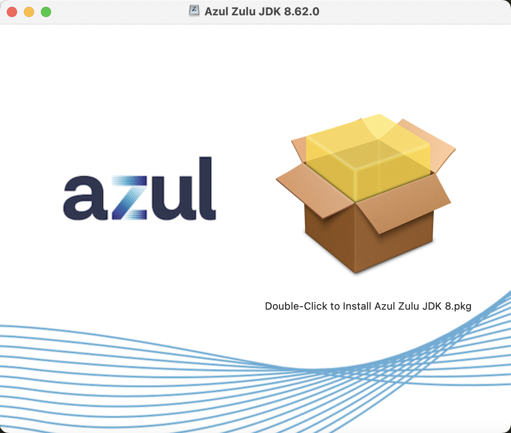
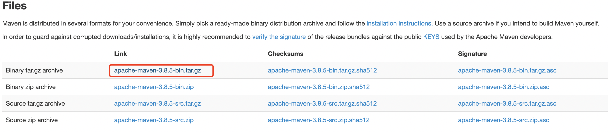

本文记录了在MacBook Pro M1Pro下部署Java开发环境遇到的问题和解决方法
<!--more--->

## 下载并安装JDK

M1芯片带来的坏处是许多jdk版本不支持arm架构。这里可以选择`Zulu JDK`，可以进入[此链接下载](https://www.azul.com/downloads/?version=java-8-lts&os=macos&architecture=arm-64-bit&package=jdk)并安装指定版本的JDK。



安装完毕后，不必设置环境变量，直接在命令行运行`java -version`检查是否运行成功：

```
% java -version
openjdk version "1.8.0_332"
OpenJDK Runtime Environment (Zulu 8.62.0.19-CA-macos-aarch64) (build 1.8.0_332-b09)
OpenJDK 64-Bit Server VM (Zulu 8.62.0.19-CA-macos-aarch64) (build 25.332-b09, mixed mode)
```

## 下载并安装Maven

可在[此链接中](https://maven.apache.org/download.cgi)选择如图所示的链接进行下载压缩包：



这是个压缩文件，或者说“绿色版”。然后将其解压到你想要放入的文件夹（我一般移动到`/opt`目录下）。

接下来需要我们自己配置环境变量。首先需要确认你的BASH类别。

查看当前使用的SHELL：
```
% echo $SHELL
/bin/zsh
```

查看本机可用的所有SHELL
```
% cat /etc/shells
# List of acceptable shells for chpass(1).
# Ftpd will not allow users to connect who are not using
# one of these shells.

/bin/bash
/bin/csh
/bin/dash
/bin/ksh
/bin/sh
/bin/tcsh
/bin/zsh
```

我这里显示是zsh，则我需要修改`~/.zshrc`
如果你的shell是`/bin/bash`，则需要修改`~/.bash_profile`

将以下文本加入配置文件末尾：

```sh
export MAVEN_HOME=/opt/apache-maven-3.8.5
export PATH=$PATH:$MAVEN_HOME/bin
```

然后立即载入环境变量：

```
% source ~/.zshrc
```

最后测试是否应用修改：

```
% mvn -v
Apache Maven 3.8.5 (3599d3414f046de2324203b78ddcf9b5e4388aa0)
Maven home: /opt/apache-maven-3.8.5
Java version: 1.8.0_332, vendor: Azul Systems, Inc., runtime: /Library/Java/JavaVirtualMachines/zulu-8.jdk/Contents/Home/jre
Default locale: zh_CN, platform encoding: UTF-8
OS name: "mac os x", version: "12.3.1", arch: "aarch64", family: "mac"
```