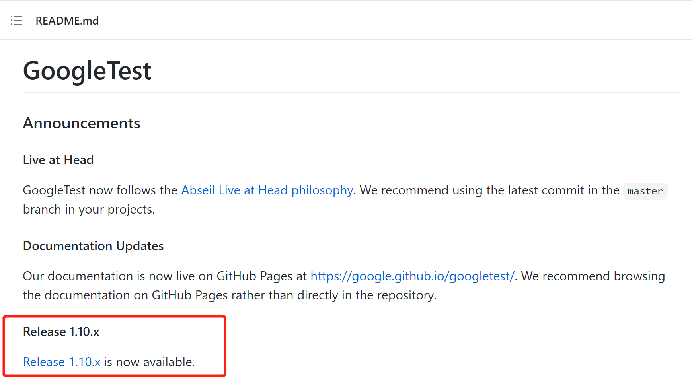
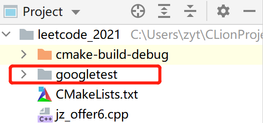
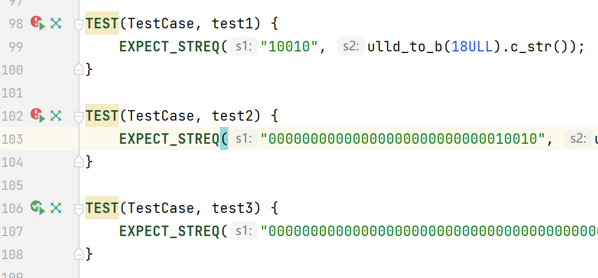

Google Test 是著名的 C++ 单元测试框架。如何在 CLion中使用 Google Test？
<!--more--->

# 1. 下载和安装

首先去[这个网站](https://github.com/google/googletest)下载 google test 最新版本。



笔者写作时， google test 的版本为 1.10。

然后下载最新版本的压缩文件。


解压得到文件夹`googletest-release-1.10.0`，打开文件夹后，把`googletest`文件夹复制到你的目标工程目录。




还没结束，我们需要修改工程根目录的`CMakeLists.txt`，以使 google test 生效。注意不要修改`googletest/CMakeLists.txt`！

向`CMakeLists.txt`添加如下代码：

```sh
add_subdirectory(./googletest)
include_directories(${PROJECT_SOURCE_DIR}/src/include ./googletest/include)
link_directories(${PROJECT_SOURCE_DIR}/lib ${PROJECT_SOURCE_DIR}/googletest)
target_link_libraries(${PROJECT_NAME} gtest)
```

如果我们想要使用 google test，就在任意cpp文件添加头`#include "gtest/gtest.h"`

# 2. 简单的用例

做一个简单的测试，我编写了一个将`unsigned long long`转为二进制数据的函数`ulld_to_b`，该函数能将一个无符号64位整数转换为64位长的二进制字符串。

```cpp
string ulld_to_b(uint64_t i) {
    return bitset<64>(i).to_string();
}
```

现在对其进行测试。测试用例为18，我的预期结果为10010，但是前面应该补零至64位长：

```cpp
TEST(TestCase, test1) {
    EXPECT_STREQ("10010", ulld_to_b(18ULL).c_str());
}

TEST(TestCase, test2) {
    EXPECT_STREQ("00000000000000000000000000010010", ulld_to_b(18ULL).c_str());
}

TEST(TestCase, test3) {
    EXPECT_STREQ("0000000000000000000000000000000000000000000000000000000000010010", ulld_to_b(18ULL).c_str());
}
```

写完测试用例后，需要改造下`main()`使其运行所有测试用例：

```cpp
int main(int argc, char** argv) {
    testing::InitGoogleTest(&argc, argv);
    return RUN_ALL_TESTS();
}
```

预期结果为前两个测试用例不通过，后一个测试用例通过。

编译运行后结果如下，完全符合我们的预期：


当然这里的使用是不恰当的，我们应当尽可能令所有单元测试都通过。

在CLion的代码编辑器中可以方便地查看出错的测试用例：



# 3. 批量开关测试用例

在大型工程中，项目上线前需要关闭所有测试用例，逐个删除未免显得笨拙。这个时候我们可以使用宏定义。

首先将`googletest`的头文件放在一个统一的头文件`stdafx.h`中，然后以`#ifdef`包裹起来：

```cpp
#ifndef LEETCODE_2021_STDAFX_H
#define LEETCODE_2021_STDAFX_H

#include <iostream>
#include <vector>
#include <string>
#include <map>
#include <set>
#include <algorithm>
#include <stack>
#include <memory>
#include <bitset>

// 开启测试模式
#define DEBUG_MODE

#ifdef DEBUG_MODE
#include "gtest/gtest.h"
#endif

#endif //LEETCODE_2021_STDAFX_H
```

如果我把`#define DEBUG_MODE`删除的话，`#include "gtest/gtest.h"`就不会执行了。

然后回到每个函数实现处，我们在这里写了很多的测试用例，以及修改了`main()`函数。同样将它们用`#ifdef`包裹起来：

```cpp
#ifdef DEBUG_MODE
TEST(TestCase, test1) {
    EXPECT_STREQ("10010", ulld_to_b(18ULL).c_str());
}

TEST(TestCase, test2) {
    EXPECT_STREQ("00000000000000000000000000010010", ulld_to_b(18ULL).c_str());
}

TEST(TestCase, test3) {
    EXPECT_STREQ("0000000000000000000000000000000000000000000000000000000000010010", ulld_to_b(18ULL).c_str());
}
#endif
```

这些测试用例会随着`"stdafx.h"`中`#define DEBUG_MODE`语句的删除而失效。

最后来看看`main()`函数如何处理：

```cpp
#ifndef DEBUG_MODE
int main() {
    /*...*/
    return 0;
}
#else
int main(int argc, char** argv) {
    testing::InitGoogleTest(&argc, argv);
    return RUN_ALL_TESTS();
}
#endif
```

如果没定义`DEBUG_MODE`，则执行正常的`main()`；否则执行所有测试用例的`main(int argc, char** argv)`。

在项目需要上线时，把`#define DEBUG_MODE`那一行删除即可。

# 4. 测试用例编写

## 4.1 `EXPECT`和`ASSERT`
google test 使用 TEST 宏声明测试用例。TEST() 有两个参数，`TestCaseName`，`TestName`。

我们之前使用了`EXPECT_STREQ`这个宏，其含义为验证内部的两个参数为相同的字符串。除此之外，还有很多以EXPECT开头的宏，它们功能各不相同，比如`EXPECT_EQ`这个宏比较两个数字是否相等。

EXPECT系列和ASSERT系列的区别是，EXPECT失败后，继续往下执行；ASSERT失败则直接终止程序。

EXPECT和ASSERT的返回是一个流对象，这意味着我们可以在之后使用`<<`运算符输出额外信息：

```cpp
for (int i = 0; i < x.size(); ++i) {
    EXPECT_EQ(x[i], y[i]) << "Vectors x and y differ at index " << i;
}
```

## 4.2 各种不同的宏断言

本节只列出了`ASSERT`，实际上每个`ASSERT`对应一个`EXPECT`版本。

**编写测试用例时，如果有两个参数，注意把待测函数输出放在后面！前面的参数是Ground Truth，也就是答案。**

### 布尔值断言，只有一个参数，参数只能为true或者false：
```cpp
ASSERT_TRUE(condition)
ASSERT_FALSE(condition)
```
### 数值断言：
```cpp
ASSERT_EQ(v1, v2) // v1 == v2
ASSERT_NE(v1, v2) // v1 != v2
ASSERT_LT(v1, v2) // v1 < v2
ASSERT_LE(v1, v2) // v1 <= v2
ASSERT_GT(v1, v2) // v1 > v2
ASSERT_GE(v1, v2) // v1 >= v2
```
### 字符串断言

这里的参数为C风格字符串，因此当参数为`string`类型时，你需要调用`c_str()`方法。

```cpp
ASSERT_STREQ(s1, s2) // s1和s2内容相同
ASSERT_STRNE(s1, s2) // s1和s2内容不同
ASSERT_STRCASEEQ(s1, s2) // 忽略大小写，s1和s2内容相同
ASSERT_STRCASENE(s1, s2) // 忽略大小写，s1和s2内容不同
```

### 断言返回成功或者失败

```cpp
TEST(ExplicitTest, Demo)
{
    ADD_FAILURE() << "Sorry"; // None Fatal Asserton，继续往下执行。
    FAIL(); // Fatal Assertion，不往下执行该案例。
    SUCCEED();
}
```

### 抛出异常的断言

```cpp
int Foo(int a, int b)
{
    if (a == 0 || b == 0)
    {
        throw "don't do that";
    }
    int c = a % b;
    if (c == 0)
        return b;
    return Foo(b, c);
}

TEST(FooTest, HandleZeroInput)
{
    EXPECT_ANY_THROW(Foo(10, 0)); // Foo应当抛出异常
    EXPECT_THROW(Foo(0, 5), char*); // Foo应当抛出字符串类型的异常
    EXPECT_NO_THROW(Foo(1, 1)); // Foo不应该抛出异常
}
```

### 浮点数断言

```cpp
ASSERT_FLOAT_EQ(exp, act) // 检验两个浮点数是否**几乎**相等
ASSERT_DOUBLE_EQ(exp, act) // 同上，只不过精度更高
ASSERT_NEAR(exp, act, abs_error) // exp和act之间的差值不会超过abs_error
```

# 参考

https://www.cnblogs.com/coderzh/archive/2009/04/06/1426755.html

https://blog.csdn.net/zhizhengguan/article/details/110313265