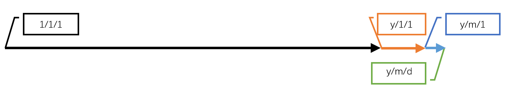

已知某年月日，如何得到这一天是星期几？
已知两日期的年月日，如何得到这两日期之间相差多少天？
如此种种问题，均可以利用蔡勒公式解决。

<!--more--->

# 一、已知日期y年m月d日，如何求解该日期是周几？

## 1. 问题转化

该问题容易转换为计算1年1月1日与y年m月d日之间的差值。如何计算两个日期之间的差值？

不难想到，首先求解前y年的天数$w_1$，然后求解从y年1月1日到y年m月1日之间的天数$w_2$，最后求解m月1日到m月d日之间的天数（即为d天），将这三个值相加即可得到结果$w$。



得到天数$w$之后，将值与7取余，$w\mod 7 == 1$ 就是星期一， $w\mod 7 == 2$ 就是星期二，$w\mod 7 == 0$ 就是星期天。

## 2. 判断闰年

这个问题的难点在于年和月的计算。一年有365天，闰年是366天（2月中多一天）。如何判断y是闰年还是平年？

按照我们一直以来学习的知识，闰年按照如下方法进行计算：

普通闰年：公历年份是4的倍数，且不是100的倍数的，为闰年（如2004年、2020年等就是闰年）。

世纪闰年：公历年份是整百数的，必须是400的倍数才是闰年（如1900年不是闰年，2000年是闰年）。

则y年对应的天数 $w_1$ 可以这样计算：

$$w_1 = 365\times y + \frac{y}{4} - \frac{y}{100} + \frac{y}{400}$$

## 3. 计算月份对应的天数

每个月的天数是不同的，并且根据当年是平年还是闰年，1月到m月之间的日期也有所不同，不能一概而论。难道我们需要使用各种情况分析，通过嵌套if语句，最后得到一个丑陋但能用的怪物吗？不必！下面两种情况都能在 O(1) 的空间和时间复杂度内计算得到 y年1月1日到y年m月1日之间的天数。

### 3.1 平凡解法：储存12个月对应的天数表

最容易想到的当然是将平年的12个月对应的天数存在数组中，闰年的另外保存12个月的天数。每次计算，直接取对应下标的值即可。

```python
def compute_date_normal(y, m, d):
    isleap = False
    if (y % 4 == 0 and y % 100 != 0) or y % 400 == 0:
        isleap = True
    y = y - 1  # 计算经过了完整的多少年
    yd = 365 * y + y // 4 - y // 100 + y // 400
    month_arr = [31, 28, 31, 30, 31, 30, 31, 31, 30, 31, 30, 31]
    leap_month_arr = [31, 29, 31, 30, 31, 30, 31, 31, 30, 31, 30, 31]

    if isleap:
        md = sum(leap_month_arr[:m - 1])
    else:
        md = sum(month_arr[:m - 1])
    # print(yd, md, d)
    return yd + md + d
```

### 3.2 蔡勒公式：24个参数 --> 3个参数

有没有更优雅、更酷的方法来改进该算法？有的！我们可以使用一个神奇的公式：蔡勒公式。

克里斯蒂安·蔡勒（Julius Christian Johannes Zeller，1822-1899）是一名德国数学家。蔡勒公式（Zeller’s congruence），是一种计算任何一天是一星期中哪一天的算法，由德国数学家克里斯提安·蔡勒发表。蔡勒公式的特点是不用判断闰年平年，不用判断大小月，直接在O(1)的复杂度下解决日期和星期的转换问题。很神奇是吧？

具体地，蔡勒公式计算的是从公元1年1月1日到某日期过了多少天。天数$w$的计算方法如下所示：

$$ w = 365\times y + \frac{y}{4} - \frac{y}{100} + \frac{y}{400} + \frac{153\times m-457}{5} + d - 306 $$

其中y为某一年，m为该年中的某一月，d为该月中的某一天。

___

好吧，你肯定会问 153、457和306这三个参数是从哪里来的了。

不要以为蔡勒公式中的前半部分还是$w_1$的解法，事实上蔡勒公式把y年全年都给算进去了！也就是说，蔡勒公式的前半部分$w_1$多计算了y年m月d日到y年12月31日这段日期。

接下来计算这段日期的长度。但是蔡勒公式不急着做这件事，而是计算了y年12月31日到y年3月1日之间经过了多少天。后半部分计算月份的分式我们将其命名为$w_2$：

$$w_2=M_3+M_4+\cdots+M_12=31+30+\cdots+31=306$$

上式中$M_n$为n月的天数。

___

为什么选择3月1日作为起始呢？因为3月到12月对于平年和闰年来说都是固定的，因此该数值也是固定的，为306天。

但是如果我们计算1月1日到12月31日的长度的话，就会因为2月的不稳定性而需要分类讨论了。

由此，只要我们计算的月份不是1月和2月，那么我们不必在乎这一年到底是闰年还是平年。

那么如果我计算的日期的确是1月或2月的某日怎么办呢？要想避免讨论平年闰年，无论如何都要避过计算2月！

蔡勒公式采取的方案是，不计算到y年12月31日，而是少计算一年(1.01.01)—(y-1.12.31)，再加上12个月。由此，原来的1月就变成了13月，原来的2月就变成了14月。

___

下面将是蔡勒公式中最难以理解的部分，那就是计算从y年3月1日到4月（X月）1日之间经过了多少天这一部分。

我们首先看一个统计表，这个表列出了3月1日到各个月份的首日（X月1日）之间经过了多少天：

月份|该月天数|该月首天与3/1的差值
:---:|:---:|:---:
3|31|0
4|30|31
5|31|61
6|30|92
7|31|122
8|31|153
9|30|184
10|31|214
11|30|245
12|31|275
13|31|306
14|X|337

我们想找到一个简单的映射关系，能把月份给换算成该月首天与3月1日之间的差值：$f(m)$。

细心观察我们可以发现，除了个位之外，该差值是一个等差数列，公差为30天。而个位的变化为1,1,2,2,3,4,4,5,5,6,7.

存不存在一个线性函数，能够拟合个位的变化呢？答案是有的，那就是：

$$ \lfloor\frac{m\times 3-7}{5}\rfloor $$

左右括号是向下取整。其实我现在也没能找到该式与该问题之间的逻辑关系，但是该式恰好能够拟合差值的个位数变化，因此我也就“拿来主义”了。

至此我们已经得到月份和差值之间的函数关系：
$$
w_3=30\times(m-3)+\lfloor(m\times3-7)/5\rfloor
$$
$$
=⌊(153×m-457)/5⌋
$$

在公式的最后，将日期d加上，我们就得到了最终的蔡勒公式。

下面是蔡勒公式的具体实现。可以看到，代码的确短了很多，而且参数也从24个变成了3个。

```python
def zellers(y, m, d):
    if m < 3:
        y -= 1
        m += 12
    return 365*y + y//4 - y//100 + y//400 + (153*m-457)//5 + d – 306

def test_zellers():
    w = zellers(2021,1,7)
    print((w%7+7)%7)
```

# 二、奇思妙想

知其然，更要知其所以然。我写这篇文章的目的，其实是因为我碰到了一道笔试题，在解题过程中，我无意发现了一些有趣的解法，但是网上的文章又不能解答我的疑问，所以我就想通过自己的调研，解答自己的问题。如果这个问题的回答能帮到你，那就再好不过了。

## 1. 为什么闰年这样计算

闰年是为了弥补因人为历法规定的年度天数365日和实际公转时间365.25日的差距而设立的。即是，每四年便会累积1日 ，所以四年便会有一次闰年。多出来的一天为2月29日。

其实闰年的计算方法一直是有争议的，因为一年的公转日纪年误差会随着年份的累计而不断扩大，最终必须以一天的的方式扩展开来。

“四年一闰，百年不闰，四百年再闰”，这就造成了在一些特殊年份，会出现八年一闰的现象。

闰年这个东西其实也是舶来品，因为中国传统纪年方式是按照农历纪年的，我们会在一年之中添加一个月，称之为闰月。

农历作为阴阳历的一种，每月的天数依照月亏而定，一年的时间以12个月为基准，平年比一回归年少约11天。为了合上地球围绕太阳运行周期即回归年，每隔2到3年，增加一个月，增加的这个月为闰月。闰月加到哪个月，以农历历法规则推断，主要依照与农历的二十四节气相符合来确定。在加有闰月的那一年有13个月，历年长度为383至385日，这一年也称为闰年。如2004年猴年的农历中，有两个二月，通常称为前二月和后二月（即闰月）。

而现在使用公元纪年，则是格里高利历所规定。

## 2. 公元纪年

公元是公历纪元的简称，是一个被当今国际社会最广泛地使用的纪年标准。其源自于西方国家使用的基督纪年，以当时认定的耶稣出生年为纪年的开始。第一年被称作基督元年（耶稣出生的那一年）。后来，由于西方文化的强势，西历纪元成为世界通用标准。

1911 年 10 月 10 日辛亥革命后，湖北军政府使用黄帝纪年。次年 （1912年），中华民国临时政府决定采用国际通用的公元历法做为国历，但纪元部分沿用中国独自的纪年传统，称民国纪年。

1949年9月27日，中国人民政治协商会议第一届全体会议决议，同年10月1日成立的中华人民共和国放弃使用民国纪年，改采用世界通用的公元纪年制度[5]，大陆地区改称“公元”，以昭明其是“国际共同”，避免“西方独用”的歧义。

## 2. 公元1年1月1日是星期几？

如果你以为你的程序特别厉害了，那我可要考考你了：公元1年1月1日是星期几？

按照上文分析，应该是周一。但是知乎上的回答指出，这样计算是不对的：


教皇格里戈八世在1582年2月24日颁布法令，永远抹去了1582年10月5日到1582年10月14日。历史上从来不曾有过这10天。1582年10月4日是星期四，它的第二天是1582年10月15日星期五。因此考虑到这10天的影响再去推算，公元元年1月1日就是星期六了。

这方面还是华为的手机日历比较厉害：


可以清楚地看到，从1582年10月5日到1582年10月14日的十天被永远抹去了。

华为，牛！

## 变化问题

假设存在平行世界，在这个世界中一年的每个月都比我们的世界少一天，除此之外该平行世界的平年闰年、大小月都与我们所处的世界一致。如何计算任意日期是该世界的星期几？

这个时候蔡勒公式就不太好使了，起码你一时半会儿想不出参数如何变化的。既然时间复杂度和空间复杂度都是O(1)，那我们不妨直接用传统的方法来计算：

```py
def compute_date_shrink(y, m, d):
    isleap = False
    if (y % 4 == 0 and y % 100 != 0) or y % 400 == 0:
        isleap = True
    y = y - 1  # 计算经过了完整的多少年
    yd = 353 * y + y // 4 - y // 100 + y // 400
    month_arr = [30, 27, 30, 29, 30, 29, 30, 30, 29, 30, 29, 30]
    leap_month_arr = [30, 28, 30, 29, 30, 29, 30, 30, 29, 30, 29, 30]

    if isleap:
        md = sum(leap_month_arr[:m - 1])
    else:
        md = sum(month_arr[:m - 1])
    # print(yd, md, d)
    return yd + md + d
```

其实我自己也实现了蔡勒公式的变种方法，但是解释起来过于复杂。由于虚拟历法没有现实参照，我也不知道我写的程序对不对，只能把程序放在最后，供大家参考。

```py
def zellers_shrinked(y, m, d):
    if m < 3:
        y -= 1
        m += 12
    return 353 * y + y // 4 - y // 100 + y // 400 + (148 * m - 447) // 5 + d - 295
```