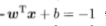
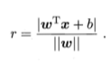
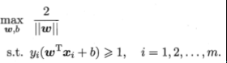

什么是SVM？SVM是如何用于分类的？为什么求解对偶问题？核函数的原理是什么？
<!--more--->

# 什么是支持向量机（Support Vector Machine, SVM）

支持向量机是一种二分类模型。它的基本模型是定义在特征空间上的间隔最大的线性分类器，间隔最大使它有别于感知机。通过核技巧，支持向量机可以处理非线性分类问题。

支持向量机的学习算法是求解凸二次规划的最优化算法。

由于算法确定超平面时需要使用距离超平面最近的几个训练样本点，这些样本被称为“支持向量”，支持向量机由此得名。

假设训练样本

则超平面可以这样表示

这也就意味着

选取那些离超平面最近的两个不同类别的数据点，将他们带入超平面方程，发现

则两个点到超平面距离之和为

这是由于点到直线的距离公式为

这几个令分子为1的数据点，就被称作支持向量。

# 支持向量机如何分类

支持向量机的学习算法的目标是在特征空间中找到一个分离超平面，能将实例分到不同的类。当数据线性可分时，存在无数个分离超平面能将实例正确分开。感知机利用误分类最小的策略，而支持向量机则利用间隔最大化求得最优超平面，这时解是唯一的。

选取那些支持向量，即距离超平面最近的两个样本点，计算它们到超平面的距离2/||w||
通过优化2/||w||使之最大化，便可使得边距扩大。为了寻找超平面 $ F(x)=wx+b $ ，支持向量机试图求解这个优化问题：

可以转化为

高等数学告诉我们，求解带有限制条件的优化问题，拉格朗日乘子法是经常用于考虑的方法。
问题转化为：

也就是说，将带N个约束条件的二次优化问题，转换为无约束优化问题。
这里注意限制条件变成了1-。。。这是因为拉格朗日乘数法要求参数必须大于等于零，限制条件需要相遇等于零。

由此，问题变成了$\min_{w,b}\max_{\lambda}\mathcal{L}(w,b,\lambda)$
先把$\lambda$视作参数，将$w,b$视作常数，求$\mathcal{L}$的最大值。

$\min_{w,b} \max_{\lambda} \mathcal{L}(w,b,\lambda)$和原问题是等价的。

# 为什么求解对偶问题

由于满足KKT条件，进而将原问题转化为对偶问题，即更换求解max和min 的次序。

可以看到，原问题的限制条件中包含较为复杂的线性不等式，这是阻碍我们进行优化的问题所在；而其对偶问题不但简化了限制条件，而且包含$\sum{\lambda_iy_i}=0$很容易消去，极大降低了求解难度。

# 核函数的原理

计算两个向量在隐式映射过后的空间中的内积的函数叫做核函数（Kernel Function）

核函数目的：把原坐标系里线性不可分的数据用Kernel投影到另一个空间，尽量使得数据在新的空间里线性可分。

核函数的特点：

1）核函数的引入避免了“维数灾难”，大大减小了计算量。而输入空间的维数n对核函数矩阵无影响，因此，核函数方法可以有效处理高维输入。

2）无需知道非线性变换函数$\phi$的形式和参数.

3）核函数的形式和参数的变化会隐式地改变从输入空间到特征空间的映射，进而对特征空间的性质产生影响，最终改变各种核函数方法的性能。

4）核函数方法可以和不同的算法相结合，形成多种不同的基于核函数技术的方法，且这两部分的设计可以单独进行，并可以为不同的应用选择不同的核函数和算法。

# 参考文献

《机器学习》周志华

《统计学习方法》李航

《机器学习基础》梅尔亚·莫里等

SVM入门（七）为何需要核函数：http://www.blogjava.net/zhenandaci/archive/2009/03/06/258288.html

如何通俗地讲解对偶问题？尤其是拉格朗日对偶lagrangian duality？知乎回答：https://www.zhihu.com/question/58584814

为什么支持向量机要用拉格朗日对偶算法来解最大化间隔问题？知乎回答：https://www.zhihu.com/question/36694952

简易解说拉格朗日对偶（Lagrange duality）：https://www.cnblogs.com/90zeng/p/Lagrange_duality.html

拉格朗日对偶性：https://www.cnblogs.com/nxf-rabbit75/p/11453355.html

机器学习白板推导：https://www.bilibili.com/video/BV1aE411o7qd