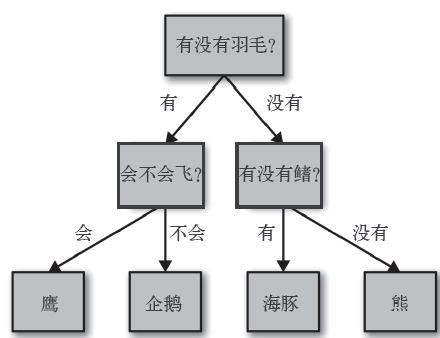
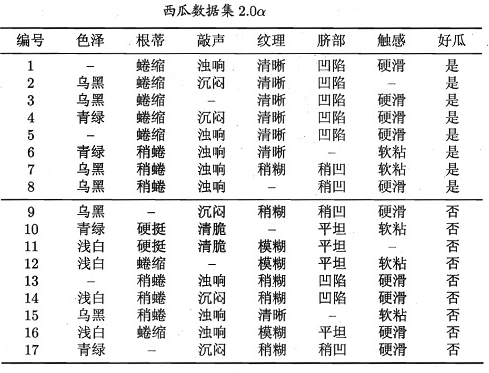

决策树算法是一类经典的监督学习算法，它的实现简单、可解释性强、能适应多种类型的输入数据，并且多颗决策树可以集成为强大的模型。常用于复杂问题的 baseline 解决方案，以及分析特征重要程度。

<!--more--->

## 1. 树的划分流程：原理与思想

### 1.1 决策树的工作原理

决策树是广泛用于分类和回归任务的模型。本质上，它从一层层的if/else 问题中进行学习，并得出结论。

在这张图中，树的每个结点代表一个问题或一个包含答案的终结点（也叫叶结点）。树的边将问题的答案与将问的下一个问题连接起来。

用机器学习的语言来说就是，为了区分四类动物（鹰、企鹅、海豚和熊），我们利用三个特征（“有没有羽毛”“会不会飞”和“有没有鳍”）来构建一个模型。我们可以利用监督学习从数据中学习模型，而无需人为构建模型。

### 1.2 决策树的思想

原则上讲，对于给定的属性集，可以构造的决策树的数目达指数级。尽管某些决策树比其他决策树更准确，但是由于搜索空间是指数规模的，遍历找出最佳决策树在计算上是不可行的。

尽管如此，人们还是开发出了一写有效的算法，这些算法通常基于贪心策略，在选择划分数据的属性时，采取一系列局部最优决策来构造决策树。

一种朴素的构建决策树的思路如下：

1. 如果某节点中所有记录都为同一类别，则无需分类，该节点为叶子结点；
2. 如果某节点中包含多个类别的记录，则按照某个特征的大小为参考，令节点分裂为多个子节点；比如该特征大于某值则令记录进入子节点 1，否则进入子节点 2；
3. 对所有子节点递归调用该算法，直到该节点内的所有记录都属于同一个类别，或者所有记录的选定特征都相同。

该算法会引出两个关键问题：

1. **如何选择特征进行分裂**？需要建立一种评估方法，评估不同特征对该节点的分类能力，并优先选择分类效果好的特征；
2. **如何停止分裂**？数据本身存在噪声，递归分裂过深会导致过拟合，如何剪枝来保证模型的泛化能力？

## 2. 如何选择特征进行分裂？

决策树最关键的是选择合适的划分方法，来使得问题的规模最大程度的简化。

一般来说，我们希望优先选择那些能够最大程度简化问题的特征。对于二分类任务，如果存在某个特征，大于某值的记录全都是类别 1，小于某值的记录全是类别 2，则该特征就能最大程度简化问题。

举例来说，男女性别分类任务，”有没有喉结“就是一个好特征，”头发长度“、”身高“则相对分类能力不那么强。

### 2.1 信息熵

为此，我们需要一个物理量，来度量某节点内的所有记录的类别单纯程度。如果一个节点中的记录全都是同一类别，则我们认为该节点十分纯洁。

然后判断特征的优劣，只需求目前的纯度，然后根据该特征进行分裂，再计算一遍纯度，则纯度下降的值，就可以用来度量该特征的分类能力了。

**纯度（purity）** 的定义有很多方法，比如信息熵（information entropy）。假设 $Y$ 为类别集合，$D$ 为节点中的样本集合，$p_k$ 为当前集合 $D$ 中第 $k$ 类样本占比，则信息熵的定义为：

$$\text{Entropy}(D)=-\sum_{k=1}^{|Y|} p_k\ln{p_k}$$

假设叶子结点有 10 个样本，它们的类别分别为： {1,2,2,3,3,3,3,3,3,3}，则此时该特征对应的信息熵为：

$$
\text{Entropy}=-(\frac{1}{10}\ln{\frac{1}{10}}+\frac{2}{10}\ln{\frac{2}{10}}+\frac{7}{10}\ln{\frac{7}{10}})\approx0.8
$$

对于样本集合 {1,1,1,2,2,2,3,3,3,3}，则此时的信息熵为：

$$
\text{Entropy}=-(\frac{3}{10}\ln{\frac{3}{10}}+\frac{3}{10}\ln{\frac{3}{10}}+\frac{4}{10}\ln{\frac{4}{10}})\approx1.09
$$

比较上述两个样本集合，集合 1 大部分样本是类别 3，集合 2 的类别分布比较均匀，则集合 1 的信息熵比集合 2 的要小，这说明集合 1 更纯。

### 2.2 信息增益

接下来我们需要选定特征，比如身高这个特征，可能产出三种分支节点：[0m, 1m), [1m, 2m], [2m, +inf] ，每个分支节点内部都对应了一些人。则身高这个特征划分节点后的信息熵之和，与未划分时的信息熵之差，就是**信息增益（ information gain）**。

假定特征 a 有 V 种取值，则对应 V 种叶子结点，每个节点包含的样本集合为 $D_v$ 。则 $D_v$ 的信息熵为：$\text{Entropy}(D_v)$，此时全部样本按照特征 a 进行分裂的信息增益为:

$$
\text{Gain}(D, a)=\text{Entropy}(D)-\sum^{V}_{v=1}\frac{|D_v|}{|D|}\text{Entropy}(D_v)
$$

信息增益越大，则意味着使用属性 a 来进行划分所获得的”纯度提升“越大。通过遍历所有特征，取当前节点对应的信息增益最大的特征进行分裂，这种做法就是 ID3 决策树生成算法 所采用的。

### 2.3 信息增益率

在实际使用中，我们发现单纯使用信息增益进行分裂，则决策树总是试图先使用那些取值数目较丰富的特征。假如样本存在编号，并把编号当做分类特征（这个特征当然没有意义），那么 ID3 将总会选择 编号特征作为叶片的分裂特征。因此需要惩罚那些具有过多取值的特征。

具体地，对每个特征的信息增益，除以固有值（intrinsic value），就得到了**信息增益率**（gain ratio）:

$$
\text{Gain Ratio}(D, a)=\frac{\text{Gain}(D, a)}{\text{IV}(a)}
$$

其中

$$
\text{IV}(a)=-\sum^{V}_{v=1}\frac{|D_v|}{|D|}\log{\frac{|D_v|}{|D|}}
$$

C4.5 决策树生成算法采用了该思想，并做了一定优化：先从候选特征集合中，选择那些信息增益高于平均水平的特征，再从中选择信息增益率最高的。这是为了防止一上来就选择信息增益率最大的特征，导致算法滑向另一个极端：总是选取可取值数目较少的那些特征。

### 2.4 基尼系数

除了使用信息熵作为衡量节点纯度的方法，我们还可以使用基尼值来衡量。数据集的**基尼系数（Gini）**可以定义为：

$$
\begin{align*}
\text{Gini}(D) &= \sum^{|Y|}_{k=1}\sum_{k'\neq k}p_k p_{k'} \\
               &= 1-\sum^{|Y|}_{k=1}p_k^{2}
\end{align*}
$$

直观来说，$\text{Gini}(D)$ 反映了从数据集 D 中随机抽取两个样本，其类别标签不一致的概率。$\text{Gini}(D)$ 越小，数据集的纯度越高。

则选择特征时，只需遍历特征并选择能够令节点的基尼系数最小的特征作为分裂特征即可。

$$
\text{Gini Index}(D, a)=\sum_{v=1}^{V}\frac{|D_v|}{|D|}\text{Gini}(D_v)
$$

该思想被应用在 CART 算法中，CART决策树的全称为Classification and Regression Tree，可以应用于分类和回归。

## 3. 如何停止分裂？

随着节点划分递归进行，决策树分支变得过多，甚至每个样本对应 1 个叶子。如果不对分裂过程加以干预，可能导致训练样本准确率 100%，但是实际预测时效果极差，这就是过拟合（overfitting）现象。

为了规避过拟合现象，我们可以提前终止分裂，或者在生成完毕的树结构上修剪部分分支。

### 3.1 预剪枝（提前终于规则）：

停止生长的方法有很多，比如可以当观察到的不纯性度量的增益低于某个确定的阈值时就停止扩展叶结点；当分裂后的准确率下降时停止分裂；或者干脆限制树的高度等。

通过这种方法，限制产出过于复杂的子树，减少了训练时间。在 Sklearn 中有具体的实现。

> **Sklearn 中的预剪枝操作**

Sklearn 是 python 的一个机器学习工具包，可以很方便地实现各种机器学习算法。在 Sklearn 中，决策树有如下参数，控制预剪枝过程：

1. max_depth， 最常用，限制树的最大深度。在样本量较少时很有用。
2. min_samples_leaf， 每个结点包含的最少样本量。如果分裂后，存在一个子叶，样本量过少，则没必要分裂。
3. min_samples_split， 每个节点包含的最少样本量。如果分裂前，节点包含过少的样本，则没必要分裂。和上个参数的含义相同。
4. max_features， 限制分裂时考虑的特征个数，超过限制个数的特征都会被舍弃。该参数比较暴力，使用频率较低。
5. min_impurity_decrease， 限制信息增益的大小，信息增益小于设定数值的分裂不会发生。

### 3.2 后剪枝：

初始决策树按照最大规模生长，然后进行剪枝的步骤，按照自底向上的方式修剪完全增长然后修剪。

修剪有两种做法：

1. 用新的叶子节点替换子树，该叶结点的类标号由子树下记录中的多数类决定。子树替换
2. 用子树中最常使用的分支代替子树。当模型不能再改进时终止剪枝步骤。子树提升

后剪枝的泛化性能往往强于只使用预剪枝的决策树，但是后剪枝需要先产出完整的树再剪枝，时间和空间成本要更高。另外，Sklearn 中没有专门针对后剪枝的实现方法。

## 4. 如何处理连续、缺失值

决策树的一大优势是可以不加预处理地应对离散和连续两种输入，并能够灵活应对数据集中部分样本的特征缺失情况，这令决策树算法的适用场景十分宽广。

需要提前声明，不同决策树生成算法会采用不同的处理策略，下面举的例子如果没有单独声明，都是 C4.5 算法的处理策略。

### 4.1 连续值如何划分？

如果我们要以”身高“为特征进行分裂，但是“身高”是一个连续值，无法枚举所有情况，如何分裂呢？

转换一下思路，虽然“身高”无法枚举，但是数据集是可以遍历的。将该节点内的所有数据的身高取出来，按照大小排序，然后遍历所有潜在的分裂点，依次计算纯度即可将连续值划分为两段不连续的区间，取最高的纯度为区间分割点，进而分裂为两个不同的节点。

### 4.2 如何处理特征缺失？

数据的特征缺失现象很普遍，常见的缺失数据处理方法有：

**1）抛弃缺失值**

抛弃极少量的缺失值的样本对决策树的创建影响不是太大。但是如果属性缺失值较多或是关键属性值缺失，创建的决策树将是不完全的，同时可能给用户造成知识上的大量错误信息，所以抛弃缺失值一般不采用。

只有在数据库具有极少量的缺失值同时缺失值不是关键的属性值时，且为了加快创建决策树的速度，才采用抛弃属性缺失值的方式创建决策树。

ID3 生成算法无法应对缺失值，因此要想使用 ID3 算法生成决策树就只能抛弃缺失值。

**2）补充缺失值**

可以使用一个常量来填充缺失值，比如“Unknown”或者 0；但是更常见的是使用缺失数值所在行或列的均值、中位数、众数来替代缺失值。后者这种方法称为插值法（Imputation），被应用在 QUEST、CRUISE 等决策树生成算法中。

缺失值较少时按照我们上面的补充规则是可行的。但如果数据库的数据较大、缺失值较多，这样根据填充后的数据库创建的决策树可能和根据正确值创建的决策树有很大变化。

**3）概率化缺失值**

概率权重（Probability weights），是 C4.5 算法所采纳的。

它的思想是对缺失值的样本赋予该属性所有属性值的概率分布，即将缺失值按照其所在属性已知值的相对概率分布来创建决策树。

首先需要选择最优特征。一共 1000 个西瓜，如果只知道 500 个的西瓜的品种，其他 500 个不知道，则该特征最终计算出来的信息增益率，就要乘上 500/1000=0.5。

其他特征如果存在缺失值，也是先忽略所有缺失值，计算出来信息增益率之后，乘上 1-缺失值占比。

但如果最优特征也存在缺失值，如何选择分裂点呢？

则我们需要降低缺失值在计算中的权重，不把缺失值当做一个完整的样本看待。

假设存在 1000 个样本，其中 500 个样本缺少该特征，剩余 500 个完整的样本。这 500 个完整的样本最终会分裂成五个子节点，分别对应 100/100/100/100/100个样本，则缺失的每个 500 个样本的权重就是 1/5。

除了该方法之外，还有很多其他的方法：

**4）替代法（Alternate/Surrogate Splits）**

该方法是 CART 决策树使用的方法。

在选择特征时，CART 使用和 C4.5 类似的方法，即最终的基尼系数乘以 1-缺失值占比，来选择分裂特征。

但是当决定分裂特征后，如果该特征存在缺失值，CART 会查找其他不存在缺失值的特征，选择一个与该特征分裂后基尼增益最接近的特征，借助该特征进行分裂。

但是如果没有不存在缺失值的特征，或者本特征与其他特征的基尼增益相差过大的情况，缺失值默认进入样本最多的叶子结点。

这样做的缺点是计算量非常大，我们需要遍历其他所有特征来决定选择哪个特征作为代理。

另外，sklearn 实现的 CART 树无法处理缺失值。

## 5. 总结

| 决策树算法 | 分类方法 | 优点 | 缺点 |
| --- | --- | --- | --- |
| ID3 | 信息增益 |  | 总是试图先使用那些取值数目较丰富的特征； 无剪枝策略，容易过拟合； 只能处理离散数据； 只能处理分类问题； 没有考虑缺失值 |
| C4.5 | 信息增益率 | 改进了 ID3 对取值丰富的特征的偏好； 引入了剪枝的概念（悲观剪枝）； 引入了对连续值的二分处理； 引入了对缺失值的处理 | 多叉树效率低； 增益的计算只能针对类别标签，因此只能用于分类； 计算熵的对数运算、连续值的排序很耗时 |
| CART | 基尼系数 | 使用二叉树，分裂效率高；可以处理连续和离散值；gini可以处理分类和回归问题；gini 计算量低 | 缺失值处理时需要遍历其他所有特征，计算量很大，但是效果提升有限 |

本篇笔记整理了决策树的经典生成算法，包括 ID3、C4.5、CART，比较了他们的异同，并单独讨论了剪枝和连续值、缺失值处理操作。

实际上在实际应用中，我们更多的是使用集成学习算法，整合多颗决策树，构建性能更好的模型，比如随机森林、梯度提升树等。

后续会介绍 随机森林、GBDT、XGBoost、LightGBM 。