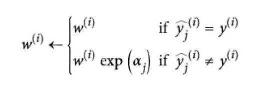
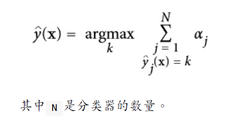

本文会介绍集成方法，bagging 和 boosting 两种思路，以及两种思路的代表性模型：随机森林和梯度提升树。

<!--more--->
## 1. 投票分类器

三个臭皮匠顶一个诸葛亮。即便是很多预测准确率仅强于随机的个体学习器的组合，经过一定的安排，也可以发挥令人惊讶的效果。在机器学习中，这种看起来没什么含金量的学习策略称之为**集成学习**。

集成学习首先需要一系列的个体学习器。之后采用某些策略结合它们的判断。

集成学习的要求：

- 构成集成学习器的个体学习器，其性能不能太差，至少要为强于随机的**弱学习器**。

当然强学习器更好。在最后的结果汇总阶段，也会更多听取强学习器的意见。

- 个体学习器要具有一定的多样性。

广泛吸收各种不同学习器的意见，做出的决策才有代表性。在机器学习中，体现出的要求就是模型之间的差别要尽可能的大。一方面可以通过划分不同的数据集，独立训练来得到差异性；另一方面我们也可以选取不同的训练模型，比如SVM、决策树、逻辑回归。

集成学习法的准确率比集成学习中表现最好的分类器准确率还高，这究竟是为什么？难道那一些不入流的臭鱼烂虾机器学习法，它们存在的意义就是提升集成学习中的准确率的吗？

我们来打个比方。假设我有一枚硬币，这枚硬币经过加工处理，正面朝上的可能性比背面要高那么一点点，51%的可能性是正面。问，如果我投掷1000次硬币，正面朝上次数大于背面朝上次数的可能性占比多少？一万次呢？

事实上，1000次投掷，最后正面次数比背面多的概率就达到了0.72，如果投掷10000次，那么就是0.94，几乎是必然事件。

将其类比到集成学习中来，如果相互独立的个体学习器足够多，那么我们得到正确结论的概率将大大提升。不过这里有一个最关键的点：**模型之间相互独立**。这个要求其实是蛮难达到的，因为即便是不同的机器学习模型，如果采用相同或者相似的数据集进行训练，那么他们之间必然存在某种相关性。更不用说连模型都是一模一样的情况了。

## 2. Boosting算法

Boosting算法的核心思想是分割训练集，用同一种机器学习算法得到差异化的一系列模型。

先从初始训练集训练出一个基学习器，再根据基学习器的表现对训练样本的分布进行调整，是的先前基学习器做错的训练样本在后续收到更多地关注。然后基于调整后的样本分布来训练下一个基学习器。如此反复进行，训练T个基学习器，最终加权投票。

### 梯度提升树

### 梯度提升树的实现：XGBoost

### LightGBM

## 3. Bagging算法

有放回采样被称为Bagging。采用Bagging的方法我们可以得到很多的可能有重复样本的数据子集。我们在之前的文章中已经提到，对于每个选取的子集，平均下来只有63%的训练实例被采样，剩下的37%正好当做测试集。

随机森林就采用了Bagging采样方法来训练很多的决策树。如果你观察单一的决策树，重要的特征会出现在更靠近根部的位置，不重要的特征会经常出现在靠近叶子的位置。因此我们可以通过计算一个特征在森林的全部树中出现的平均深度来预测特征的重要性。

### 随机森林