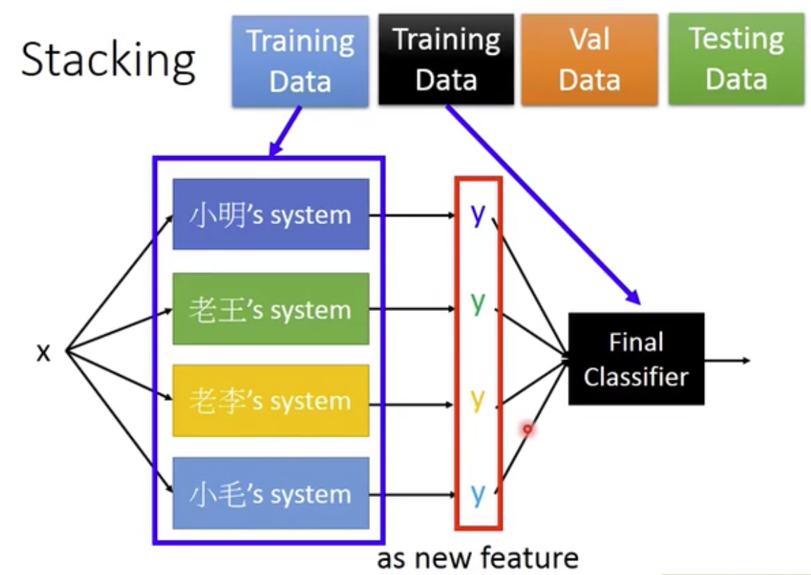

本文会介绍集成方法，bagging 和 boosting 两种思路，以及两种思路的代表性模型：随机森林和梯度提升树。

<!--more--->

三个臭皮匠顶一个诸葛亮。即便是很多预测准确率仅强于随机的个体学习器的组合，经过一定的安排，也可以发挥令人惊讶的效果。在机器学习中，这种看起来没什么含金量的学习策略称之为**集成学习**。

集成学习首先需要一系列的个体学习器。之后采用某些策略结合它们的判断。

## 1. 集成学习的要求

- 构成集成学习器的个体学习器，其性能不能太差，至少要为强于随机的**弱学习器**。当然强学习器更好。在最后的结果汇总阶段，也会更多听取强学习器的意见。
- 个体学习器要具有一定的多样性。模型之间的差别要尽可能的大。一方面可以通过划分不同的数据集，独立训练来得到差异性；另一方面我们也可以选取不同的训练模型，比如SVM、决策树、逻辑回归。

## 2. 为什么集成学习效果好

集成学习法的准确率比集成学习中表现最好的分类器准确率还高，**这究竟是为什么？**

我们来打个比方。假设我有一枚硬币，这枚硬币经过加工处理，正面朝上的可能性比背面要高那么一点点，51%的可能性是正面。问，如果我投掷1000次硬币，正面朝上次数大于背面朝上次数的可能性占比多少？一万次呢？

事实上，1000次投掷，最后正面次数比背面多的概率就达到了0.72，如果投掷10000次，那么就是0.94，几乎是必然事件。

将其类比到集成学习中来，如果相互独立的个体学习器足够多，那么我们得到正确结论的概率将大大提升。不过这里有一个最关键的点：**模型之间相互独立**。这个要求其实是蛮难达到的，因为即便是不同的机器学习模型，如果采用相同或者相似的数据集进行训练，那么他们之间必然存在某种相关性。更不用说连模型都是一模一样的情况了。

## 2. Boosting

Boosting 算法的核心思想是分割训练集，用同一种机器学习算法得到差异化的一系列模型。从偏差-方差分解的角度来看，**boosting 算法主要关注偏差**，因此能从弱学习器构建出很强的集成。

先从初始训练集训练出一个基学习器，再根据基学习器的表现对训练样本的分布进行调整，使得先前基学习器**做错的训练样本**在后续受到更多地关注。

然后基于调整后的样本分集合训练下一个基学习器。如此反复进行。训练T个基学习器，最终加权投票。

### 2.1 Adaboost

以 AdaBoost 为例介绍 boosting 算法。

AdaBoost 算法是 T 个基学习器的线性组合：

$$
H(\boldsymbol{x})=\sum_{t=1}^{T}\alpha_{t}h_{t}(\boldsymbol{x})
$$

其中 $\alpha_{t}$ 是第 t 个分类器的权重。

假设训练集 $D=\{(\boldsymbol{x}_1,y_1),(\boldsymbol{x}_2,y_2),\dots,(\boldsymbol{x}_m,y_m)\}$

则每个样本的初始权重为 $1/m$。

假设基学习器 $h_t$ 在数据集上的误差为 $\epsilon_t$，则其权重为 

$$
\alpha_t=\frac{1}{2}\ln{(\frac{1-\epsilon_t}{\epsilon_t})}
$$

对应的，数据集中的每个样本的权重也要发生变化：

$$
D_{t+1}(\boldsymbol{x})=D_t(\boldsymbol{x})\times\exp{(-\alpha_t)}, \text{if  } h_t(\boldsymbol{x})=f(\boldsymbol{x}) \\
D_{t+1}(\boldsymbol{x})=D_t(\boldsymbol{x})\times\exp{(\alpha_t)}, \text{if  } h_t(\boldsymbol{x})\neq f(\boldsymbol{x})
$$

以此迭代直至得到 T 个满足误差低于指定阈值的分类器，线性求和即可。

AdaBoost 只适用于二分类任务。

### 2.2 梯度提升树

梯度提升决策树（Gradient Boosting Decision Tree, GBDT）是 Boosting 算法中非常流行的模型，又叫做 MART（Multiple Additive Regression Tree)。

其基本原理是根据当前模型损失函数的负梯度信息来训练新加入的弱分类器，然后将训练好的弱分类器以累加的形式结合到现有模型中。

介绍梯度提升树之前需要了解下什么是梯度提升。梯度提升（Gradient Boosting） 是 Boosting 中的一大类算法，其含义为借助梯度下降思想的 Boosting 算法。注意，梯度提升并非梯度上升，其本质也是一种梯度下降。只不过相比于普通梯度下降通过直接更新参数来梯度下降，梯度提升通过累加弱学习器来梯度下降。

在梯度提升的第 t 步，我们已经得到了一个不完美的模型 $F_{t-1}$ 。梯度提升算法不会改变 $F_{t-1}$ ，而是会试图增加一个新模型 $f$ 来改进原模型的性能，使其更加逼近 Ground Truth：

$$
F_{t} = F_{t-1} + f \Rightarrow y
$$

因此我们希望能找到该 $f$ ，其中

$$
f = y - F_{t-1}
$$

那么新模型的任务就是尽可能接近上一个模型的输出值与真实值之间的差距，即残差（Residual），而不是真实值本身。

最终模型的产出就是 T 个子树的输出值之和。由于求子树过程中需要计算累加等操作，因此在这里使用的基分类器必须为回归树，也就是 CART 的回归树版本。

那么梯度在哪里呢？其实 GBDT 在解决回归问题时，残差就是损失函数的负梯度。因为我们在解决回归问题时，一般会选择平方损失函数：

$$
L(y,f_{t}(\boldsymbol{x}))=\frac{1}{2}(y-f(\boldsymbol{x}))^{2}
$$

对该式求负梯度，结果正好为残差。因此对于回归问题，负梯度跟残差是等价的。但是在分类问题，或者其他损失函数定义的问题时，我们就需要以损失函数的负梯度作为残差的近似值了。

梯度提升树的优势在于可解释性强，泛化能力也很强，最难能可贵的是，对输入数据的形式没有太高要求，不需要特殊预处理。

梯度提升树的劣势在于，必须串行训练导致速度慢，对高维且稀疏的问题，比如文本处理问题，效果不够好。所以一般都用来处理一些数值特征。

## 3. Bagging

bagging 算法的思路同样是通过构建不同的训练集，训练多个基学习器的。bagging 希望每个基学习器只使用全部训练集的子集，如果各个基学习器使用的子集完全不同，则预期各个基学习器之间便有了差异。

但是这样存在风险，尤其是在数据量不大时，每个基学习器只用到了一小部分训练数据，甚至无法有效学习。因此我们在选择训练数据时，可以考虑使用相互有交叠的采样子集。

采用自助采样（即有放回采样）的方法我们可以得到很多的可能有重复样本的数据子集。对于每个选取的子集，平均下来只有 63% 的训练实例被采样。我们对数据集进行 T 次自助采样，即可得到 T 个不同的子数据集。

由此我们得到了 T 个基学习器，对于分类问题使用简单投票方法，对于回归问题使用简单平均法。Bagging 的优点是可以适用于多分类和回归等任务。

**Bagging 算法更加关注降低方差**，因此他在不剪枝的决策树等容易被样本扰动的学习器上的集成效果更为明显。

### 3.1 随机森林

随机森林（Random Forest）就采用了 Bagging 采样方法来训练很多的决策树。另外，随机森林在训练每个子树的时候，还额外引入了随机性。

具体来说，传统决策树在选择划分特征时，总是在当前节点的所有特征上取最优；但是在 RF 中，先随机从 d 个特征中选择 k 个特征，然后再从这 k 个特征子集中选最优。如果 k=d，则退化为与原本的决策树分裂算法一致；如果 k=1，则完全随机选择特征进行划分。一般来说，推荐 $k=\log_2{d}$ 。

随机森林简单，容易实现，计算开销小。随机森林不仅从训练集的选择上引入了随机性，而且在树的生长上也引入了随机性，这使得基分类器之间的差异进一步提升。

另外随机森林可以帮助判断特征的重要程度。如果你观察单一的决策树，重要的特征会出现在更靠近根部的位置，不重要的特征会经常出现在靠近叶子的位置。

因此我们可以通过计算一个特征在森林的全部树中出现的平均深度来预测特征的重要性。

## 4. Voting 和 Stacking

上述方法是训练若干弱分类器，并将他们结合形成强分类器的过程。在实际使用过程中，我们可能已经有了若干训练完毕的模型，模型无法改动了。那么如何采用恰当的融合方式，来提升模型的综合表现呢？

一个朴素的想法就是投票法（Voting），即把每个模型的结果线性组合下。对于分类问题，整体的分类结果为大部分子模型认为的那个分类结果；对于回归模型，整体的输出值为各个模型的加权求和。

然而有些模型的结果不够准确，可能会拉低整体的性能。Stacking 的整体思想就是，额外再训练一个简单模型，以基分类器的结果为输入，输出最终的一个值，作为全部模型的输出。

由简单模型去学习各个基分类器的权重的时候，我们需要注意，采用的训练集必须要是全新的、没有被基分类器使用过的。否则无法发现基分类器的过拟合现象。
