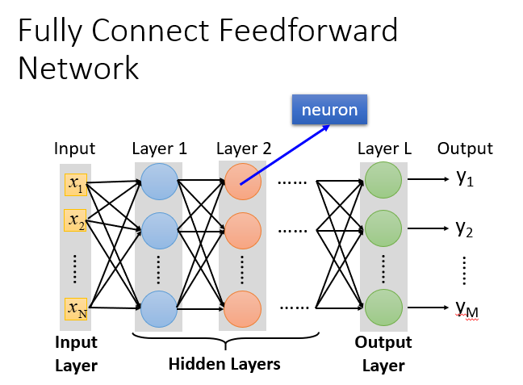
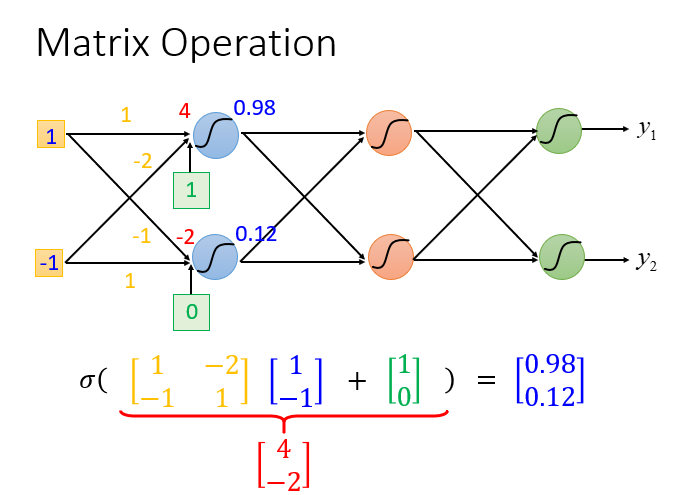
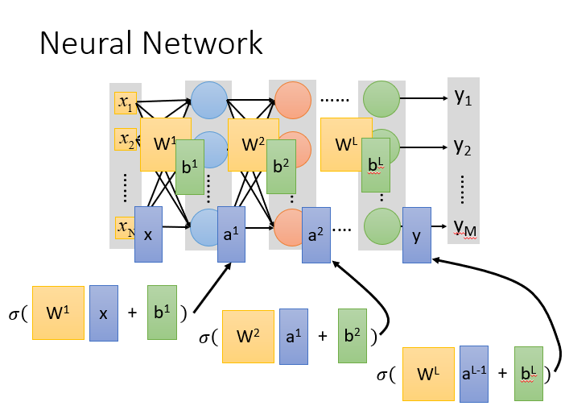
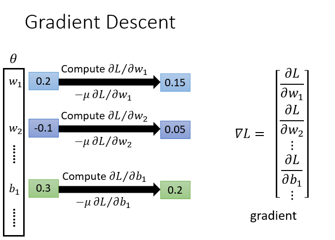
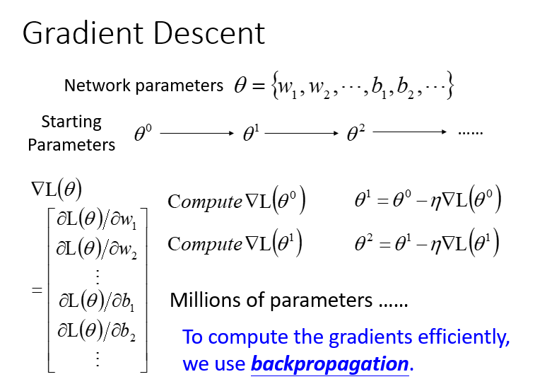

李宏毅老师主讲的机器学习MOOC课程的笔记，本篇记录的知识点有：深度学习算法介绍、反向传播机制。
<!--more--->

# 深度学习

深度学习大家已经很熟悉了。深度学习技术属于一类机器学习技术。使用深度学习解决问题的过程同样需要三步骤：

Step1：选择深度学习模型：神经网络（Neural network），神经网络有各种不同类型，比如前馈神经网络、卷积神经网络等；
Step2：模型评估（Goodness of function）；
Step3：选择最优函数（Pick best function），不同的网络结构需要定义不同的参数学习方法，比如反向传播算法；

接下来逐一介绍三个步骤的具体内容。

## 第一步：选择神经网络：从前馈网络开始

前馈（feedforward）也可以称为前向，从信号流向来理解就是输入信号进入网络后，信号流动是单向的，即信号从前一层流向后一层，一直到输出层，其中任意两层之间的连接并没有反馈（feedback），亦即信号没有从后一层又返回到前一层。

下图是一个由一层输入层、N层隐藏层和一层输出层构成的、每层包含M个神经元的全连接网络，神经元的激活函数为sigmoid：

为什么叫全链接呢？因为layer1与layer2之间两两都有连接，所以叫做Fully Connect；

为什么叫前馈呢？因为现在传递的方向是由后往前传，所以叫做Feedforward。

当隐藏层N非常大时，我们就说这个网络非常深。现如今的网络结构动辄几百层，随之带来很大的计算开销。一个一个计算神经元的输入输出是不现实的，一种加速方法是将神经网络的信息传递过程具象化为矩阵运算。

假设下图的前馈网络：

计算方法就是：sigmoid（权重w【黄色】 * 输入【蓝色】+ 偏移量b【绿色】）= 输出

如果有很多层，就进行嵌套

所以整个神经网络运算就相当于一连串的矩阵运算。矩阵运算是可以被GPU并行加速的，因此深度学习模型才能够在如今这个算力大爆发的年代大放异彩。

**深度学习的本质是利用隐藏层学习到了输入特征的有效表示方法，代替了之前依靠数据科学家的经验的特征工程。**

## 第二步：模型评估方法：选择损失函数

对于模型的评估，我们一般采用损失函数来反应模型的好差，所以对于神经网络来说，我们采用交叉熵（cross entropy）函数来对$y$和$\hat{y}$的损失进行计算，接下来我们就是调整参数，让交叉熵越小越好。

## 第三步：选择最优模型：梯度下降，以及用反向传播算法优化计算

梯度下降算法在之前的笔记已经讲过，神经网络的梯度下降算法也是相同的。

梯度下降的具体过程：

1. 给到$\theta$(weight and bias)
2. 先选择一个初始的 $\theta^0$，计算 $\theta^0$ 的损失函数（Loss Function）设一个参数的偏微分
3. 计算完这个向量（vector）偏微分，然后就可以去更新的你 $\theta$
4. 百万级别的参数（millions of parameters）
5. 反向传播（Backpropagation）是一个比较有效率的算法，让你计算梯度（Gradient） 的向量（Vector）时，可以有效率的计算出来