李宏毅老师主讲的机器学习MOOC课程的笔记，本篇记录的知识点有：卷积神经网络。
<!--more--->

## 为什么我们要用CNN？

要回答这个问题，首先要说明为什么全连接网络不适合做图像识别任务。

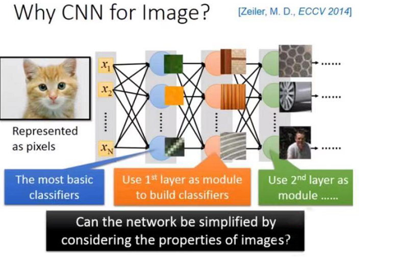

以图像为输入，会导致输入序列特别长。假设输入是一张`100*100`像素的图片，每个像素有`R/G/B`三个分量，要想将它整理为输入序列，每张图片的维度为`100*100*3=30000`。

输入层的参数过多，会导致中间层的参数过多，网络不仅训练代价提升，还有过拟合的风险。实际上图像分类任务用不着那么多参数，原因有三：

1. 每种特征所需的仅仅是图片的一小部分

从神经网络的可解释性上来说，网络的第一层学习到的是最简单的特征分类，比如一张输入图片”有没有绿色出现，有没有黄色出现，有没有斜的条纹“等等；第二层会学到更复杂一些的特征组合，越往后学到的特征越抽象。

但是对于一个检测”是否有鸟嘴“的分类器来说，不需要看整张图片就可以知道这件事；**输入序列可以从一整张图片优化为原图的一小部分**。

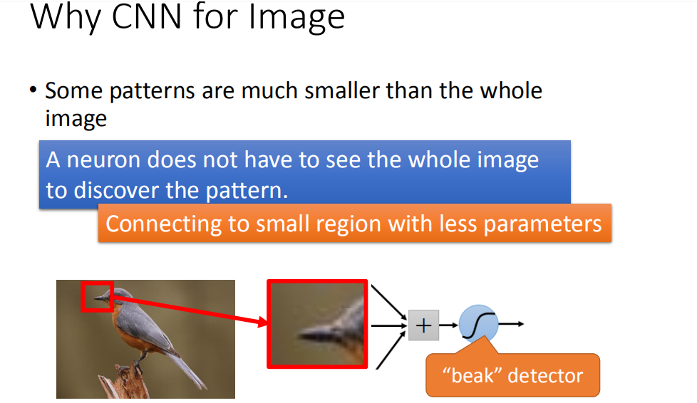

2. 识别同一特征的分类器的部分参数可以共享

对于检测鸟嘴的分类器而言，鸟嘴出现在图片的不同位置根本无所谓。我们不需要训练两组参数，来分别检测到底是左下方的鸟嘴还是右上方的鸟嘴。这意味着**做同一特征分类的参数可以共享**。

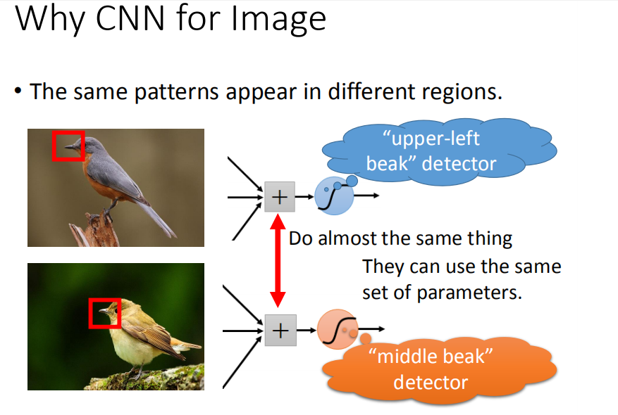

3. **输入序列的部分信息可以略过**

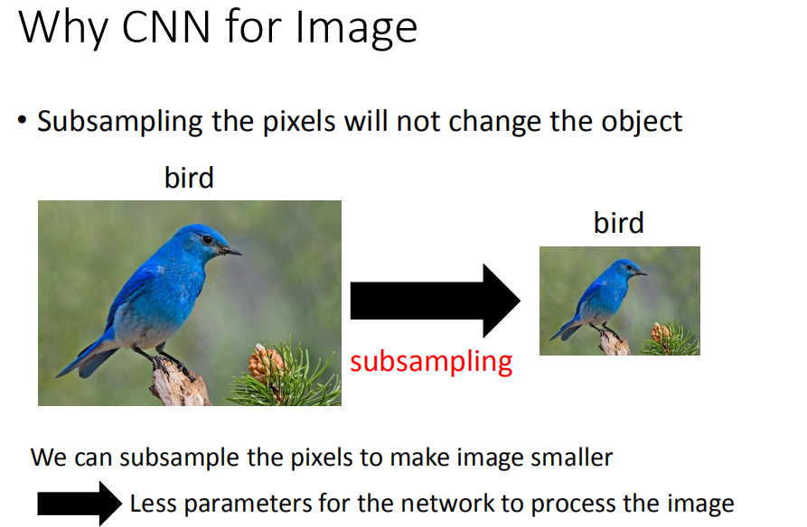

对图片进行采样，得到的像素更低的图片，并不会影响人对这张图片的理解。

## CNN 架构

卷积神经网络有两个基本单元：卷积层(Convolution Layers)和池化层(MaxPooling Layers)，可以实现上面三点性能优化。

一个完整的卷积神经网络大概长这样：

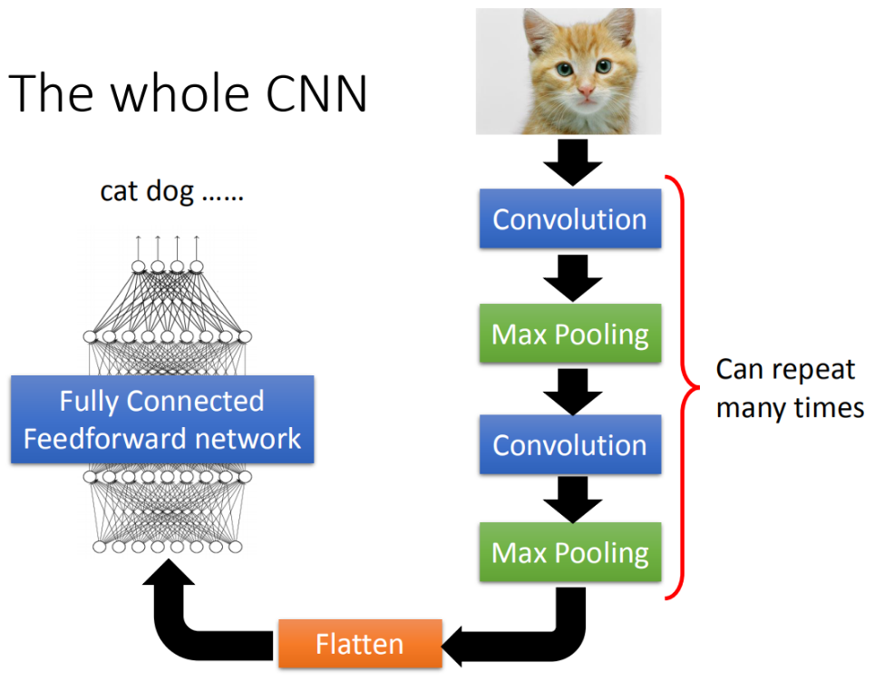

卷积层：是一种利用卷积操作提取图像的局部特征的网络结构。通过选择卷积核，不断执行卷积操作，得到原图像的特征图；后续的网络根据该特征图为输入，继续提取特征。

池化层：有最大池化和平均池化两种方式，最大池化是取滑动窗口内最大的元素作为输出。

## CNN 卷积层与全连接层的联系

卷积核中的权值每次滑动计算时只是局部连接，且在卷积列中的神经元共享参数——计算局部信息，而全连接层神经元的权值与所有输入相连——计算全局信息。

卷积层的作用是从输入数据中采集关键数据内容。全连接层在深度卷积神经网络中的作用是将前面经过多次卷积后高度抽象的特征进行整合。

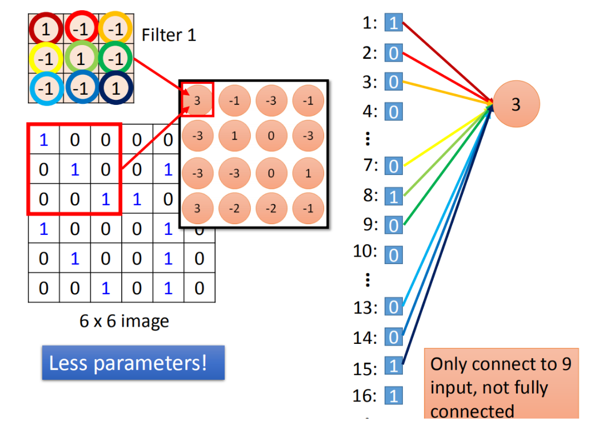

## 用Keras实现CNN网络

以[tensorflow的图像分类教程](https://www.tensorflow.org/tutorials/images/cnn)为例，实践使用keras搭建卷积模型的方法：

先导入相关包

```py
import tensorflow as tf

from tensorflow.keras import datasets, layers, models
import matplotlib.pyplot as plt
```

然后下载并准备 CIFAR10 数据集

```py
(train_images, train_labels), (test_images, test_labels) = datasets.cifar10.load_data()

# 归一化像素值到 0 ~ 1
train_images, test_images = train_images / 255.0, test_images / 255.0
```

验证数据

```py
class_names = ['airplane', 'automobile', 'bird', 'cat', 'deer',
               'dog', 'frog', 'horse', 'ship', 'truck']

plt.figure(figsize=(10,10))
for i in range(25):
    plt.subplot(5,5,i+1)
    plt.xticks([])
    plt.yticks([])
    plt.grid(False)
    plt.imshow(train_images[i])
    # The CIFAR labels happen to be arrays, 
    # which is why you need the extra index
    plt.xlabel(class_names[train_labels[i][0]])
plt.show()
```

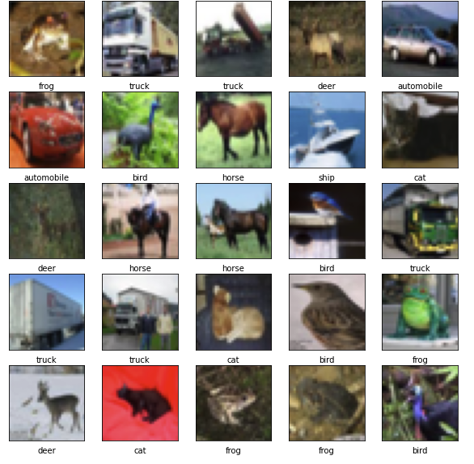

接下来开始搭建网络：

```py
model = models.Sequential()
model.add(layers.Conv2D(32, (3, 3), activation='relu', input_shape=(32, 32, 3)))
model.add(layers.MaxPooling2D((2, 2)))
model.add(layers.Conv2D(64, (3, 3), activation='relu'))
model.add(layers.MaxPooling2D((2, 2)))
model.add(layers.Conv2D(64, (3, 3), activation='relu'))
```

卷积网络被封装为`Conv2D`，其中第一个参数为卷积核个数，你可以理解为隐藏层神经元个数；我们这里定义为32个，它会提取32种不同类别的特征。

第二个参数是(3,3)，代表卷积核的大小是`3*3`的，这与李老师课堂上的示例一致；

第三个参数代表我们选择激活函数为`relu`；

第四个参数是只有在临近输入层的卷积层才会有的，代表输入向量的维度。这里的图像是彩色的，不但有长宽，还有通道数(channels)为3，因此输入向量的大小为(32,32,3)。

在搭建完第一层Conv2D后，紧接着会搭建最大池化层，池化层filter为`2*2`。后续的操作也是重复的，都是一层卷积、一层池化。到目前为止，模型结构如下：

```py
model.summary()
```

```
Model: "sequential"
_________________________________________________________________
 Layer (type)                Output Shape              Param #   
=================================================================
 conv2d (Conv2D)             (None, 30, 30, 32)        896       
                                                                 
 max_pooling2d (MaxPooling2D  (None, 15, 15, 32)       0         
 )                                                               
                                                                 
 conv2d_1 (Conv2D)           (None, 13, 13, 64)        18496     
                                                                 
 max_pooling2d_1 (MaxPooling  (None, 6, 6, 64)         0         
 2D)                                                             
                                                                 
 conv2d_2 (Conv2D)           (None, 4, 4, 64)          36928     
                                                                 
=================================================================
Total params: 56,320
Trainable params: 56,320
Non-trainable params: 0
_________________________________________________________________
```

我们可以看到，第一层Conv2D的输出向量的大小变成了(30,30,32)，这里32是我们之前定义的卷积核个数，`30*30`则是特征图大小。每次卷积操作都会导致宽度和高度的收缩。

参数量为896，这是如何计算来的呢？首先每个卷积核是`3*3`，同时图像有3个channel，因此每个卷积核的参数个数为`3*3*3`，再加上一个偏置量，就是28个参数。一共32个卷积核，最后的参数量即为`[(height * width * channel) + 1] * filter`。

卷积层只是特征提取器，最后为了完成分类操作，我们需要在卷积层后面拼接全连接层。不用太多，几层就够了：

```py
model.add(layers.Flatten())
model.add(layers.Dense(64, activation='relu'))
model.add(layers.Dense(10))
model.summary()
```

```
Model: "sequential"
_________________________________________________________________
 Layer (type)                Output Shape              Param #   
=================================================================
 conv2d (Conv2D)             (None, 30, 30, 32)        896       
                                                                 
 max_pooling2d (MaxPooling2D  (None, 15, 15, 32)       0         
 )                                                               
                                                                 
 conv2d_1 (Conv2D)           (None, 13, 13, 64)        18496     
                                                                 
 max_pooling2d_1 (MaxPooling  (None, 6, 6, 64)         0         
 2D)                                                             
                                                                 
 conv2d_2 (Conv2D)           (None, 4, 4, 64)          36928     
                                                                 
 flatten (Flatten)           (None, 1024)              0         
                                                                 
 dense (Dense)               (None, 64)                65600     
                                                                 
 dense_1 (Dense)             (None, 10)                650       
                                                                 
=================================================================
Total params: 122,570
Trainable params: 122,570
Non-trainable params: 0
_________________________________________________________________
```

卷积层的输出在输入两个 Dense 层之前需要被展平（Flatten）为形状为 (1024) 的向量。

仅添加了两层全连接层，参数量就多了65600+650个，可以看到全连接层真的比CNN多很多冗余参数。

最后编译并训练一下：

```py
model.compile(optimizer='adam',
              loss=tf.keras.losses.SparseCategoricalCrossentropy(from_logits=True),
              metrics=['accuracy'])

history = model.fit(train_images, train_labels, epochs=10, 
                    validation_data=(test_images, test_labels))

plt.plot(history.history['accuracy'], label='accuracy')
plt.plot(history.history['val_accuracy'], label = 'val_accuracy')
plt.xlabel('Epoch')
plt.ylabel('Accuracy')
plt.ylim([0.5, 1])
plt.legend(loc='lower right')
plt.show()

test_loss, test_acc = model.evaluate(test_images,  test_labels, verbose=2)
```

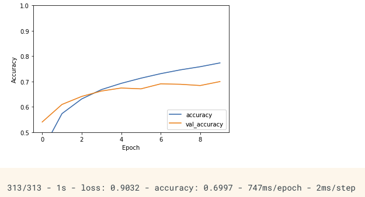

准确率只有不到70%，可以改进的地方还有很多。不过对于一个简单模型而言，在10分类任务上能达到如此成绩已是不容易了。

## CNN学到了什么？

分析第一层Conv到底学到了什么还是很容易的，因为每个卷积核实际上是在计算小范围内是否包含指定特征。但是后续Conv会根据该特征图计算更抽象的特征，我们该如何分析？

可以采用这种分析方法，首先固定参数，然后通过梯度下降法去找能够让某个神经元的输出值最大的输入图片。

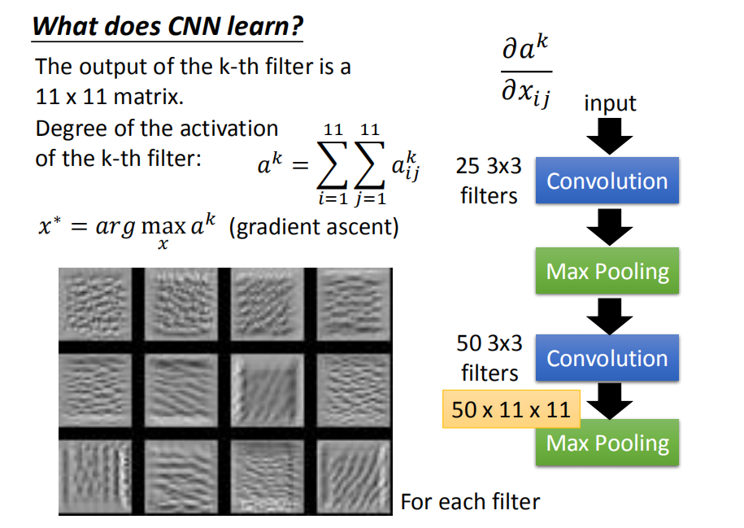

上面就是12个filter对应的结果，这些图片的特征是某种纹路在图上不断的重复。因此实际上神经元会对这种不断重复的花纹做出最大的反应。

当我们以同样的分析方法分析卷积网络最后的全连接层（这里汇聚了卷积层提取出来的各路特征），得到的图像为：

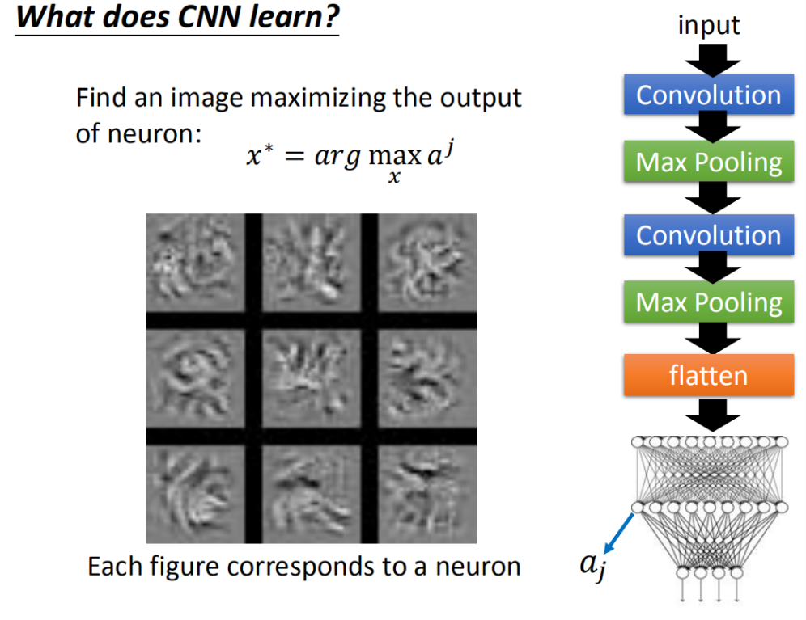

发现最能激活某个神经元的图片，不再是那些纹路单一的图像了，而是带有某种花纹，似乎有某些含义。

但是当我们用同样的方法分析输出层时，得到的图像理论上应该是确切的数字，实际上确实乱码一样无法被辨认的图片：

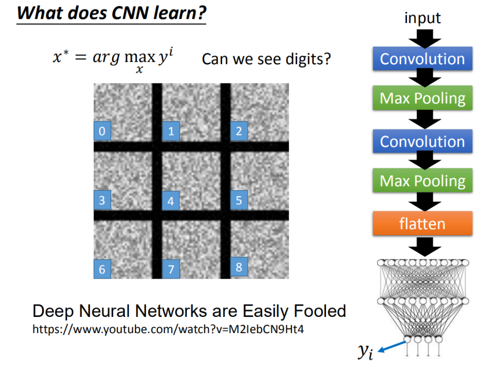

人类虽然无法辨识，但是机器十分确定地告诉我们，左上角的图片就是0，右下角就是8。这种现象很有意思。

这种思想被应用于对抗样本攻击之中，可以生成一些令模型误判的诡异图片，并将其改造原本的数据集，就可以令模型犯错。

关于文本领域对抗样本的讨论在[这里](https://superlova.github.io/2020/06/20/%E3%80%90%E8%AE%BA%E6%96%87%E9%98%85%E8%AF%BB%E7%AC%94%E8%AE%B0%E3%80%91Deep-Text-Classification-Can-be-Fooled/)

Deep Dream则利用该思想，将CNN变成一个图像生成器，夸大化原有的输入图像：

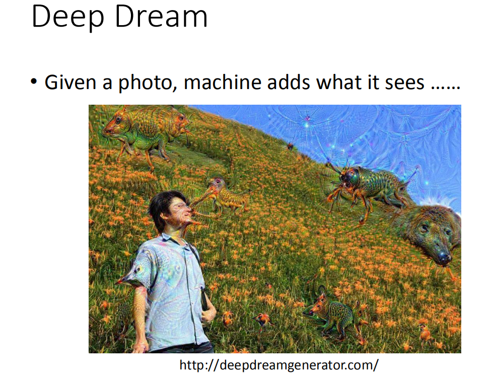

右边有一只熊，这个熊原来是一个石头(对机器来说，这个石头有点像熊，它就会强化这件事情，所以它就真的变成了一只熊)。

## CNN的其他应用场景

CNN可以应用于游戏领域，比如围棋

CNN可以应用于自然语言处理领域，比如文本分类、语音识别