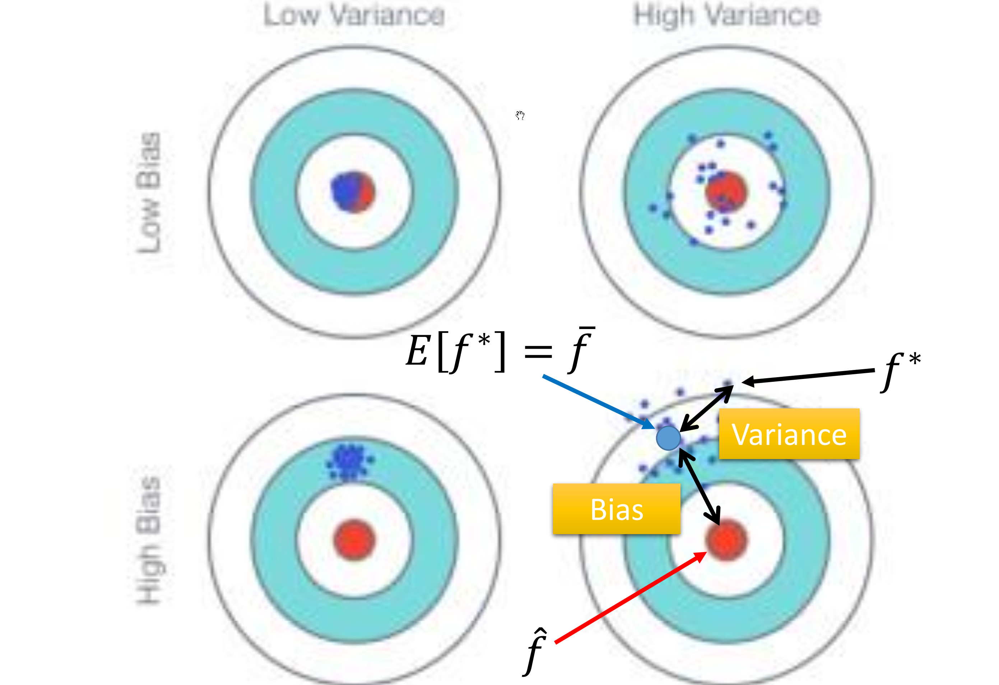
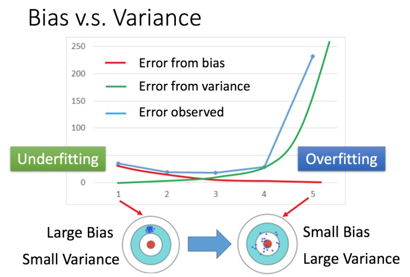
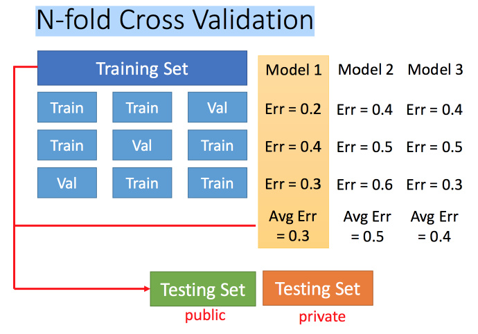

李宏毅老师主讲的机器学习MOOC课程的笔记，本篇记录的知识点有：偏差和方差、模型选择、梯度下降算法。
<!--more--->

# 一、误差的来源：偏差与方差

对学习算法除了通过实验估计其泛化性能，人们往往还希望能了解为什么具有这样的性能。误差来源于偏差 (bias) 和方差 (Variance)以及不可避免的噪声。

## 1. 偏差和方差的概念和来源

**偏差**度量了预测值与真实值的偏离程度，对应的是学习算法本身的拟合能力；**方差**度量了数据扰动对模型的影响，对应的是模型的稳定性；**噪声**则是对应问题对应的难度。

上面的结论说明，模型的性能是由模型能力、数据的充分性以及问题本身的难度决定的。由于噪音是问题本身的特性，不好解决，因此要想提升模型的性能，就需要采取措施降低偏差和方差。

## 4. 偏差和方差分解：重新考虑欠拟合、过拟合问题

为了避免过拟合，我们经常会在模型的拟合能力和复杂度之间进行权衡。拟合能力强的模型一般复杂度会比较高，容易导致过拟合。相反，如果限制模型的复杂度，降低其拟合能力，有可能导致欠拟合。因此，如何在模型的拟合能力与复杂度之间取得平衡，对机器学习算法来说十分重要。

偏差-方差分解为我们提供了一个很好用的分析工具。数学推导过程比较复杂，结论为：

**最小化期望错误等价于最小化偏差和方差之和。**

下图给出了机器学习模型四种偏差和方差的组合情况。



每个图的中心店为最优模型$f(x)$，蓝点为不同训练集上得到的模型$f^*(x)$。左上角的图是一种理想情况，方差和偏差都比较低；右上角为高偏差低方差的情况，表示模型的泛化能力很好，但是拟合能力不足，类似于我们之前的线性模型；左下角是低偏差高方差的情况，表示模型的拟合能力很好，但是泛化能力较差。当训练数据比较少的时候往往会出现这种情况，我们一般把他称之为过拟合；右下角为高偏差高方差的情况，是最差的情况，等于没训练。

方差一般会随着训练样本的增加而减小。当样本比较多，方差比较小，这是可以选择能力强的模型来减少偏差；当训练集比较有限时，最优的偏差和方差往往无法兼顾，我们称之为“偏差-方差窘境”。



偏差-方差窘境说的是，模型复杂度增加后，虽然你和能力变强导致偏差减少，但是方差会增大，过拟合现象会导致性能下降。

偏差-方差分解给机器学习模型提供了一种分析途径，能够指导我们解决过拟合和欠拟合的问题，但是实际操作中很难直接衡量。下面是一些通用的方法。

```
欠拟合现象：模型在训练集上的错误率很高，此时说明模型偏差较大。
欠拟合解决：
1. 增加数据特征
2. 提高模型复杂度
3. 减小正则化系数
```
```
过拟合现象：模型在训练集上的错误率较低，但是在测试集上较高，此时说明模型方差较大。
过拟合解决：
1. 降低模型复杂度；
2. 加大正则化系数；
3. 引入先验知识，比如数据清洗，剔除无用特征等；
4. 使用更多数据进行训练，但这个往往成本最高。
```
此外，还有一种降低方差的方法：集成模型，即通过多个高方差模型进行平均，来降低方差。这背后的原理在介绍集成学习时会介绍。

# 二、模型选择方法

前面讨论了机器学习的三个步骤，以及如何改进模型的性能。那么我们如何正确评估模型呢？

之前的例子中，我们把数据集分成两部分，Training Set、Test Set。一般比例控制在4:1左右。我们在训练结束后，使用测试集进行评估，并判断训练效果。

这样做其实存在问题。如果我们真的使用测试集来指导模型的选择、参数的改进等各个步骤，那算不算模型正在学习测试集的内容呢？就好像学生做完考卷后，老师虽然不会直接告诉学生正确答案，但是会不断地给学生机会，告诉你：你这里错了，那里错了。这算不算是另一种泄题呢？

上面的数据泄露现象是经常发生的。为了避免数据泄露，一般可以通过把数据分成三部分：训练集 (Training Set)、验证集 (Validation Set) 和测试集 (Test Set)。模型参数的改进、模型选择等过程，只使用验证集；最后评估模型时使用测试集。

但是这样又会带来另一个问题：本来数据就匮乏，又分割出两大部分不能使用，可供学习的数据就更少了。**k折交叉验证**可以解决这个问题。

## 2.1 交叉验证

交叉验证 (Cross-Validation) 是一种评估泛化性能的统计学方法。它比单次划分训练集和测试集的方法更加稳定。最常用的交叉验证方法是**k折交叉验证**。

首先把数据集分成大致相等的k个部分，每一部分叫做一折；接下来训练k个模型，第一个模型以第1折数据作为测试集，其他作为训练集；第二个模型以第2折数据作为测试集，其他作为训练集……最后我们得到了k个模型，以及对应的k个精度值。模型的最终精度就是这k个精度值的平均值。



交叉验证的优点：
1. 帮助更好评估模型的真实泛化性能，防止数据集分割时的随机性影响评估准确率；
2. 所有数据都有机会被训练，提高数据利用率；

交叉验证的缺点：
- 显著增加了计算成本，需要训练k个模型，是原来的k倍。

# 三、梯度下降算法详解，以及优化方法

目前，机器学习中参数学习的主要方式是通过梯度下降法来寻找一组最小化损失函数的参数。再具体视线中，梯度下降法可以分为：批量梯度下降、随机梯度下降以及小批量梯度下降三种形式。

本节还会介绍一些梯度下降算法的变种，他们大多改善了以下两部分的内容：1) 调整学习率，使优化更稳定；2) 梯度估计修正，提升训练速度。

## 3.1 梯度下降算法的类别

### 3.1.1 批量梯度下降

最传统的梯度下降算法，上篇笔记已经介绍。

梯度下降的具体过程是这样的：
1. 选择一个初始$\theta_0$
2. 计算该位置下$\theta$对L的微分，这个微分对应函数在此处下降最快的方向；
3. 将$\theta_0$朝着这个方向移动一小步$ \eta$
4. 在新的位置开始新一轮迭代计算，直到$w$不再变化为止。


其中$\eta$叫做学习率，它控制了每次梯度下降迭代的优化幅度。$\eta$越大，学习得越快。然而$\eta$并不是越大越好。


如果$\eta$过大，优化过程很可能会跨越最低点，从而永远达不到最优解；如果$\eta$过小，则会造成训练缓慢，甚至陷入局部最优解。因此调整学习率$\eta$是优化梯度下降算法的一大思路。

梯度下降算法的另一个问题是，当训练数据很大时（这很常见），梯度下降算法会花费很长时间去遍历整个训练集。大多数情况下，我们不必遍历所有训练集。

### 3.1.2 随机梯度下降

在训练机器学习模型时，训练数据的规模比较大的情况下，批量梯度下降的每次梯度迭代都要遍历整个数据集，这会造成计算资源的浪费。为了解决批量梯度下降算法导致的训练缓慢的问题，随机梯度下降算法应运而生。其思想是通过随机选取少量训练输入样本来计算$\nabla L_x$，进而估算$\nabla L$。

更准确地说，随机梯度下降通过随机选取少量的m个训练数据来训练。也叫做小批量梯度下降法 (Mini-Batch Gradient Descent)。

假设样本数量m足够大，我们期望$\nabla L_{X_j}$的平均值大致相等于整个$\nabla L_{x}$的平均值，即：

$$
\frac{\sum^m_{j-1}\nabla L_{X_j}}{m}\approx \frac{\sum_x \nabla L_x}{n}=\nabla L
$$

这里第二个求和符号实在整个训练数据上进行的。交换两边我们得到：

$$
\nabla L \approx \frac{1}{m}\sum^m_{j=1}\nabla L_{X_j}
$$

证实了我们可以进通过计算随机选取的小批量数据的梯度来估算整体的梯度。

影响小批量梯度下降的主要因素有：1）批大小m，2）学习率$\eta$，3）梯度估计方法。

## 3.2 批量大小选择

直观来说，批包含的数据越大，方差也就越小，训练越稳定。该种情况下，可以设置一个较大的学习率。学习率越大，需要的批大小就越大。

另外，根据经验，批越大越可能收敛到“尖锐最小值”；批越小越能收敛到“平坦最小值”。

## 3.3 学习率调整

学习率过大会导致模型不收敛，如果过小会导致收敛太慢。由此，有一些学者根据学习的不同阶段，制定了学习率的不同变化策略。

从经验上看，学习率一开始要保持大一些，来保证收敛到最优点附近；然后要减小学习率来避免震荡。那么我们自然可以想到，学习率跟随训练轮次变大逐渐变小。这就是**学习率衰减**。

在刚开始训练时，由于参数是随机初始化的，梯度也往往比较大，再加上比较大的初始学习率，会使得训练不稳定。因此我们希望刚开始几轮迭代的学习率较小，等梯度下降到一定程度时再恢复学习率。这种方法称之为**学习率预热**。等预热完毕后在进行学习率衰减。

### 3.3.3 AdaGrad 算法

AdaGrad算法的做法是，每次迭代时，每个参数的学习率都把它除上之前微分的均方根。

普通的梯度下降算法采用的参数更新思路：

$$
w^{t+1}\leftarrow w^t-\eta^tg^t \\
\eta^t=\frac{\eta^t}{\sqrt{t + 1}}
$$

则Adagram是这样更新的：

$$
w^{t+1}\leftarrow w^t-\frac{\eta^t}{\sigma^t}g^t \\
g^t =\frac{\partial L(\theta^t)}{\partial w}
$$

其中$\sigma^t$是之前参数的所有微分的均方根，对于每个参数都是不一样的。

Adagram的设计思路为，如果某个参数的偏导数累计比较大，其学习率就会相对较小；相反，如果偏导数累计较小，则学习率相对较大。但是整体上迭代次数越多，学习率越小。

AdaGram的缺点是，如果在经过一定次数的迭代，依然没有找到最优点时，由于学习率已经非常小，很难再继续优化了。

### 3.3.4 RMSprop 算法

## 3.4 梯度估计

### 3.4.1 动量法

### 3.4.3 Adam 算法

## 3.3 数据预处理

一般而言，样本特征由于来源以及度量单位不同，他们的尺度 (Scale) 即取值范围也不同。对于某些机器学习模型，会对那些尺度更大的数据更敏感。因此对于尺度敏感的模型，必须先对样本进行预处理，将各个维度的特征转换到相同的取值区间内，并且消除不同特征之间的相关性，才能取得理想的效果。

归一化 (Normalization) 方法泛指把数据特征转换为相同尺度的方法，比如把数据特征映射到 [0,1] 区间内，或者直接映射为均值为0、方差为1的正态分布。

**最小最大值归一化**：将每个特征缩放到 [0,1] 或者 [-1,1] 之间。假设我们有 N 哥样本 $\{x^{(n)}\}^{N}_{n=1}$，对每一维特征x，归一化后的特征为：

$$
\hat{x}^{(n)}=\frac{x^{(n)}-\min_n(x^{(n)})}{\max_n(x^{(n)})-\min_n(x^{(n)})}
$$

**标准化**：将每维特征都调整到标准正态分布：

$$
\hat{x}^{(n)}=\frac{x^{(n)}-\mu}{\sigma}
$$

## 3.4 梯度下降算法的局限性

上一篇笔记已经有提到该部分内容：

首先，**梯度下降算法容易陷入局部最优，找不到全局最优解**。

如下图所示，当梯度下降算法优化到local minima 时，前面有座高山，它的梯度是正的，优化算法会强迫我们往回走。


这个问题在我们的线性回归模型里暂时遇不到，因为线性模型非常简单，是一个凸函数。但当我们试图利用梯度下降算法训练复杂模型，比如神经网络时，就很有可能遭遇该问题。

有很多方法能够解决梯度下降算法的全局最优解问题，包括调整每次行进的步长$\eta$，使其更有希望跨越“大山”等手段等等。

其次，梯度下降算法要求目标函数是可微的，这在某些情况下会**产生相当大的计算代价**。假设我们的问题有上百万维，计算二阶偏导数就需要上万亿（百万的平方）次！

再次，**当训练数据相当多时，梯度下降算法会变得很慢**。在实践中，为了计算梯度$\nabla L$，我们需要为了每个训练样本x单独计算梯度$\nabla L_x$，然后求平均值。这会花费很长时间。