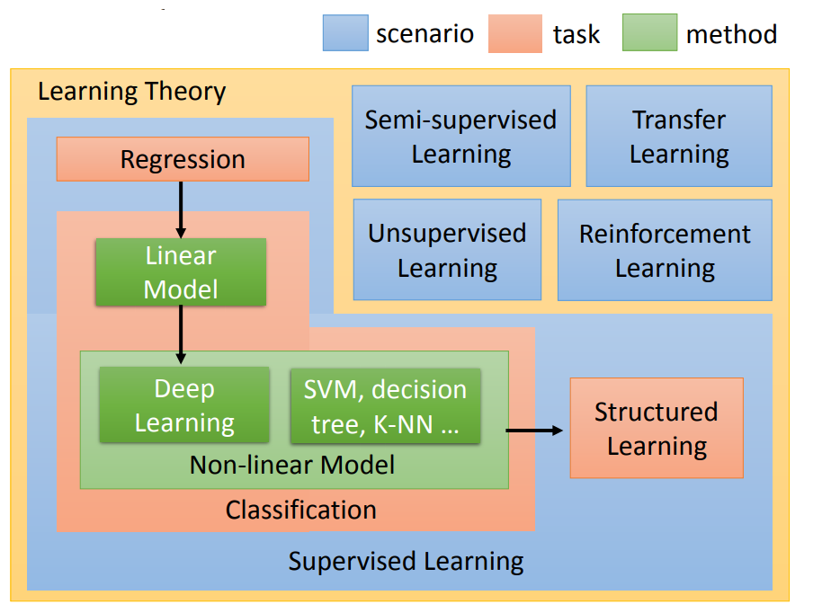

李宏毅老师主讲的机器学习MOOC课程的笔记，本篇记录第一、二、三、四个视频的知识点。
<!--more--->

### 一、[机器学习介绍](https://www.bilibili.com/video/av59538266)

说一下我学这门课的初衷吧。其实机器学习的课程在研究生阶段就已经上过了，但是工作之后才发现有一些基础没搞懂或者已经遗忘，因此在学习新知识时存在障碍。恰逢Datawhale给了这次组队学习的机会，我便想与群友们一起把这门基础课程搞定。

#### 1. 概要

本节通俗易懂地介绍了机器学习的概念，介绍了AI的发展历史，以及与传统规则的区别。简单来说，**机器学习**是一种从有限数据中学习规律并对未知数据进行预测的方法。

刚开始讲了比较多的名词和概念。老师最后的图里很好地总结了本次课的内容：

#### 首先，机器学习的过程分成三个步骤：
1. 根据问题的不同，选择模型（function）；
2. 根据模型的不同，定义能够度量学习效果的损失函数；
3. 从有限数据中持续训练模型，使得损失函数最小。

#### 其次，根据学习所需的数据是否存在标签，机器学习可以分成如下几类（图中蓝色框框的部分）：
1. 监督学习，指学习所需的数据是经过人工标注的；
2. 无监督学习，指学习所需的数据不需人工标注；
3. 其他学习方法，比如半监督学习、迁移学习、强化学习等。

#### 在监督学习里，根据想要解决的问题不同，可分为如下几类（图中黄色框框的部分）：
1. 分类问题，指我们希望模型给出yes或no这样具体的评价；
2. 回归问题，指我们希望模型能够给出一个数值，这个数值的大小有现实意义；
3. 结构化问题，我们希望模型直接输出结构化结果，比如语言翻译模型能够产出一段文本，dall-e能够生成图像，等等。

#### 分类问题是比较简单的问题，有很多模型可以解决分类问题（图中绿色框框的部分）：
1. 线性模型；
2. 非线性模型，比如深度学习、SVM、决策树等方法。

后续我们会学到什么是线性模型、什么是非线性模型，以及上面的具体模型的设计细节。

#### 为什么要学习机器学习这门课程？

~~当然是为了挣钱了~~

由于目前还没有一个普适的学习模型，能够解决世界一切可以用机器学习方法解决的问题，因此，我们需要依赖经验和知识，来根据不同的问题，选择不同的学习模型和和损失函数。还记得机器学习的三个步骤吗？选择模型、定义损失函数、训练模型过程的知识，都是能够帮助我们得到更加可靠的机器学习系统的技能。学习这门课程，能够帮助我们成为一名更好的机器学习工程师。

### 二、[机器学习案例——回归问题](https://www.bilibili.com/video/BV1Ht411g7Ef?p=3)

这部分以一个回归问题为引子，引导我们探索机器学习的三大步骤。回归问题比较普遍，像股票预测、温度预测、房价预测等，都是回归问题。

机器学习的三大步骤分别为：
1. 根据问题的不同，选择模型（function）；
2. 根据模型的不同，定义能够度量学习效果的损失函数；
3. 从有限数据中持续训练模型，使得损失函数最小。

#### 第一步，为回归问题选择合适的模型

这里我们使用线性模型试试水。所谓**线性模型** (Linear Model) 是把输入数据的各种特征，通过线性组合的方式进行预测。

$$
y=b+\Sigma\omega_{i}x_{i}
$$

其中y是预测值，x是特征本身，w是特征对应的参数。我们的学习目标就是找到正确的w，令预测值y尽可能靠谱。

#### 第二步，为线性模型选择合适的评估函数

知错能改，善莫大焉。每当模型预测得到一个值，为了让模型认识到自己的预测值y与真实值$\hat{y}$的差距，我们不妨直接取二者之差，作为计算差距的**损失函数** (Loss Function)。

$$
L(f)=\sum (y-\hat{y})
$$

这样肯定是有问题的，假设我们有两组数据，一组超过真实值0.5，另一组低于预测值0.5，它们与真实值的差值分别是0.5与-0.5。结果经过我们的计算，损失函数居然为0，也就是没有损失？

为了避免上述情况的出现，我们选择平方损失函数作为衡量差距的手段：

$$
L(f)=\sum (y-\hat{y})^2
$$

其实也有其他的损失函数定义方法可以规避第一个损失函数的问题，比如使用绝对值。但这里我们就钦定平方损失函数了，它有很多好处，但是我们先按下不表。

#### 第三步，进行训练，并利用损失函数指导训练过程

到目前为止，我们有很多带标签的数据 $(x,\hat{y})$，有线性模型，有损失函数。那我该怎么得到训练好的模型呢？

**最好的模型**到底是什么？对于线性模型来说，其实求解最优的$w$和$b$，从而可以让我们的模型无论输入什么$x$，都能准确得到与真实值相差无几的$y$。

让我们忘掉w和b的具体含义、晦涩不清的L函数，专心解决这个问题：如何优化L函数，求解最好的$w$和$b$？

一种解决问题的方法使用微积分来嗯算，通过计算导数去寻找L的极值点。运气好的话，L的变量不多，该方法看似可行；运气不好的话，我们面对的问题过于复杂、参数过多，问题就不好解决了。

有一种通用的最优化方法，叫做**梯度下降** (Gradient Descent) 方法，专门用于解决这种凸优化问题。