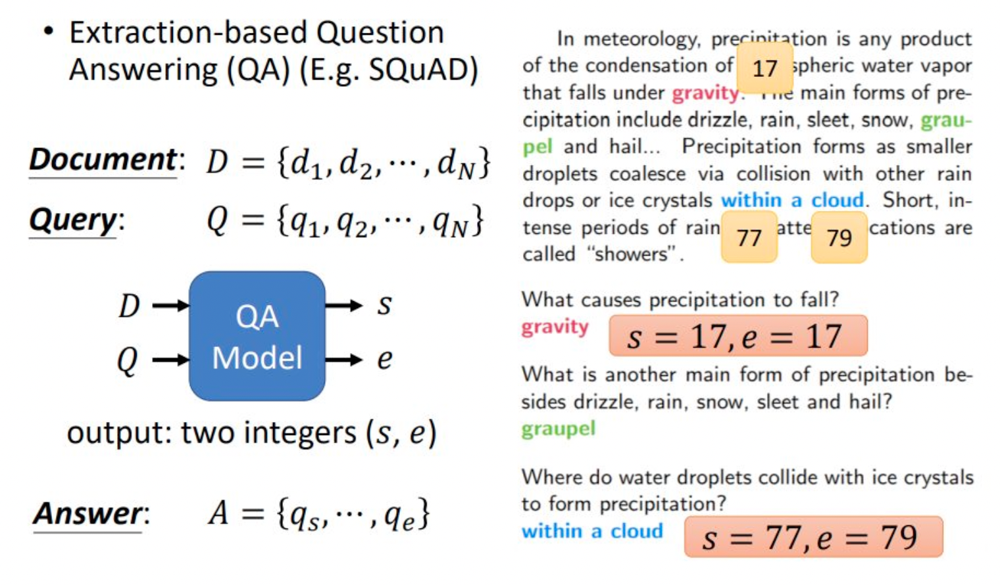
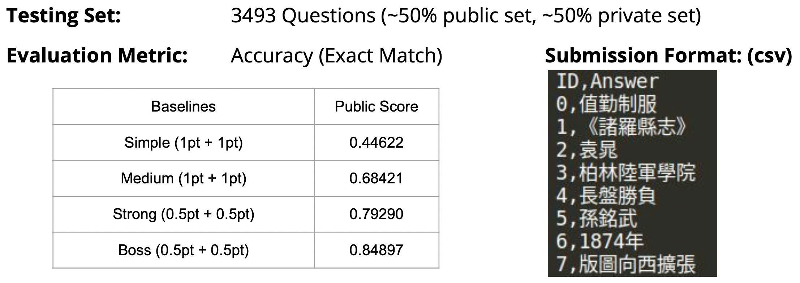
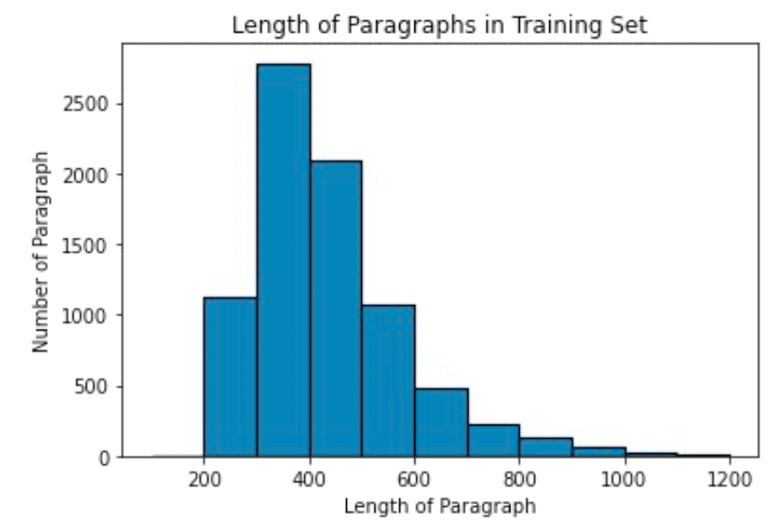
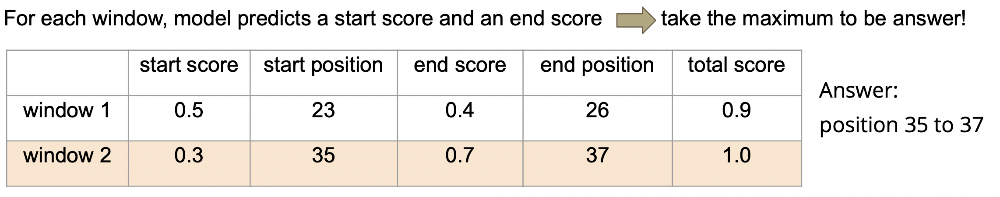
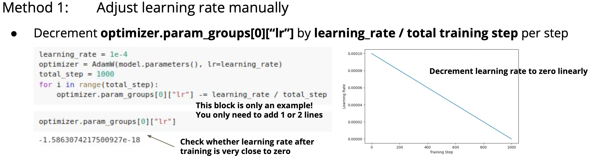
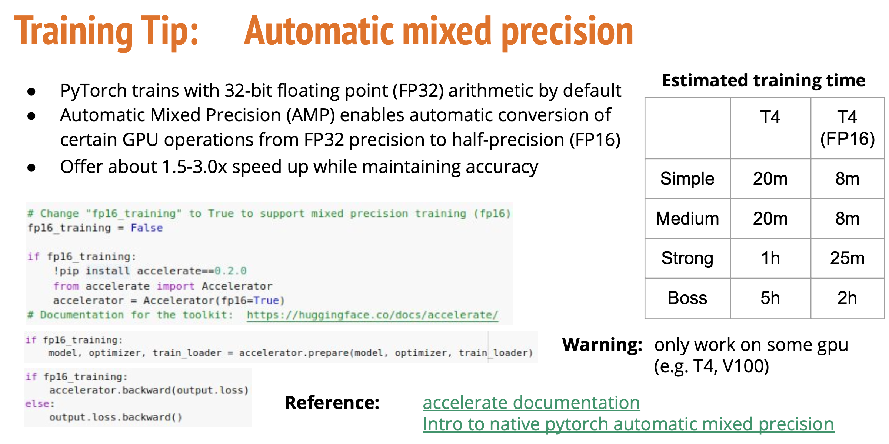

李宏毅老师主讲的机器学习MOOC课程的笔记，本篇会试着完成作业 7，以及分析问答模型的建模方法和优化方法。

<!--more--->

本篇博客记录课程作业 7 的做法。

## 一、任务目标

抽取式问答（Extractive Question Answering）任务是指：从一段文本中提取对应问题的答案。

一般而言，模型的输入为文本（Document）和问题（Question），输出答案在文本中的位置。如果模型认为文本中没有答案，则输出一个特定的占位符，比如“无答案（NoAnswer）”。



## 二、数据分析

本次数据集是繁体中文的阅读理解数据集。

首先我们来分析下数据集。从 [kaggle 的对应链接](https://www.kaggle.com/competitions/ml2021-spring-hw7/data) 就能下载本次作业所需的数据集。

数据集由三个文件组成，分别是训练集，测试集和验证集。每个文件都是一段 json 文本，可以由以下 python 代码读取：

```py
# 将 训练集 读入内存，并整理成 dict 的数据结构
def load_file(filename):
    with open(filename, 'r', encoding='utf-8') as f:
        data = json.loads(f.read())
    return data

train_file = "../data/hw7_train.json"
test_file = "../data/hw7_test.json"
dev_file = "../data/hw7_dev.json"

train_data = load_file(train_file)
test_data = load_file(test_file)
dev_data = load_file(dev_file)

print("Train Data Num: {0}\nTest Data Num: {1}\nDev Data Num: {2}".format(len(train_data["questions"]), len(test_data["questions"]), len(dev_data["questions"])))
```

以训练数据为例，数据被分成了两部分：questions 和 paragraphs 。

```py
train_data.keys()
# [OUT]: dict_keys(['questions', 'paragraphs'])

train_data["questions"][0]
# [OUT]: 
#  {'id': 0,
#  'paragraph_id': 3884,
#  'question_text': '羅馬教皇利奧三世在800年正式加冕誰為羅馬人的皇帝?',
#  'answer_text': '查理大帝',
#  'answer_start': 141,
#  'answer_end': 144}

train_data["paragraphs"][3884]
#[OUT]: '利奧三世開創的伊蘇里亞王朝在8世紀末期走上了末路...'
```

questions 部分储存了问题的编号，以及对应的文章储存在 paragraphs 中的下标。由于 questions 和 paragraphs 的数目不相等，有多个问题对应一篇文章，因此 questions 需要指定查找的文章。

questions 部分还储存有问题的文本，以及答案的文本，以及答案在文档中的开始位置和起始位置。如果要提取 paragraphs 的答案，直接使用 `train_data["paragraphs"][3884][answer_start:answer_end+1]` 即可。

paragraphs 部分则是纯文本。

训练集、测试集和验证集的大小如下所示：

```
Train Data Question Num: 26936
Test Data Question Num: 3493
Dev Data Question Num: 3524
Train Data Para Num: 8014
Test Data Para Num: 1000
Dev Data Para Num: 1000
```

测试集 test_data 则没有答案，answer 相关字段全部为 None 。

## 三、输出格式要求和得分标准

如果想要验证自己的模型效果，则提交到 kaggle 系统中进行自动评判即可。需要使用模型给出 test 测试集的所有推理结果，并将其整理成 `ID,Answer` 的 csv 文本，然后上传。



如果最终成绩能达到 0.84 以上，则说明成绩已经非常优秀。

## 四、上分技巧

### 1. 使用滑动窗口截取多段文本解决长文本问题

模型的输入长度为 问题长度 + 篇章长度 + 3（特殊字符个数）。对于 BERT 模型而言，最长输入长度为 512。这是由 self-attention 的计算量限制的。

下面是对训练集的 paragraphs 部分的长度直方图：



因此使用整篇文章作为输入是不现实的。

但是如果假定文章的大部分信息对回答问题没有帮助，我们可以只使用局部的信息进行训练。

具体做法是：训练时，在篇章的答案附近，仅截取一个固定长度的窗口内的所有文本，该窗口尽可能大，比如 32 个字符。

推理时，由于我们不知道答案到底在哪里，因此在篇章上滑动窗口切分多段文本，令模型在每段文本中寻找答案，最后 total_score 评分最高的就是最终的输出。



以上图的两个窗口举例， window_1 的答案中 start_position 的模型评分为 0.5， end_score 为 0.4，加起来为 0.9，低于 window_2 的 1.0，因此最终选择 window_2 的 start_pos 和 end_pos。

### 2. 动态调整学习率

手工调整学习率：



https://huggingface.co/docs/transformers/main_classes/optimizer_schedules#transformers.get_linear_schedule_with_warmup

https://pytorch.org/docs/stable/optim.html#how-to-adjust-learning-rate

### 3. 修改滑动窗口的步进字符数

doc_stride 指滑动窗口每次移动的字符个数。

实际使用模型做测试时，如果答案在窗口附近，横跨两个窗口的话，答案会被截断，模型会看不到正确答案。为了防止答案被截断，滑动窗口的步进个数必须比滑动窗口本身要小，下一个截取的字符串要与上一个有一定重合，即 overlapping window 。

应该减小 doc_stride ，才能做到重叠窗口的效果。默认的 doc_stride 为 150，我们可以减半为 75，以减少答案被截断的概率。

### 4. 滑动窗口切分位置的优化

baseline 中默认将答案的中点作为切分窗口的中点，导致切分出来的训练集大部分都是 `无用文本+答案+无用文本` ，模型学习到了很多无用文本。

实际上答案并不总在窗口的中间，在测试阶段窗口的划分是随机的，答案可能出现在窗口的前半部分或者后半部分。因此我们需要对训练集的窗口切分方式做优化，比如引入随机性。

### 5. 使用其他的预训练模型

https://huggingface.co/models

### 6. 模型后处理

我们可以通过添加规则，来规避模型的显著错误，比如 start_pos > end_pos 的情况显然是不可能的。

### 7. 自动混合精度

Pytorch 训练模型默认使用 float32 精度的浮点数。自动混合精度（Automatic mixed precision）能够允许你使用半精度浮点数 float16 来加速模型的训练过程。这个操作只在 T4/V100 等 GPU 上有用。



https://huggingface.co/docs/accelerate/index

https://pytorch.org/blog/accelerating-training-on-nvidia-gpus-with-pytorch-automatic-mixed-precision/

### 8. 梯度累加

当我们希望使用更大的 batch_size 但是显存不够时，可以使用梯度累加（Gradient Accumulation）的方法来节约显存。

https://kozodoi.me/python/deep%20learning/pytorch/tutorial/2021/02/19/gradient-accumulation.html