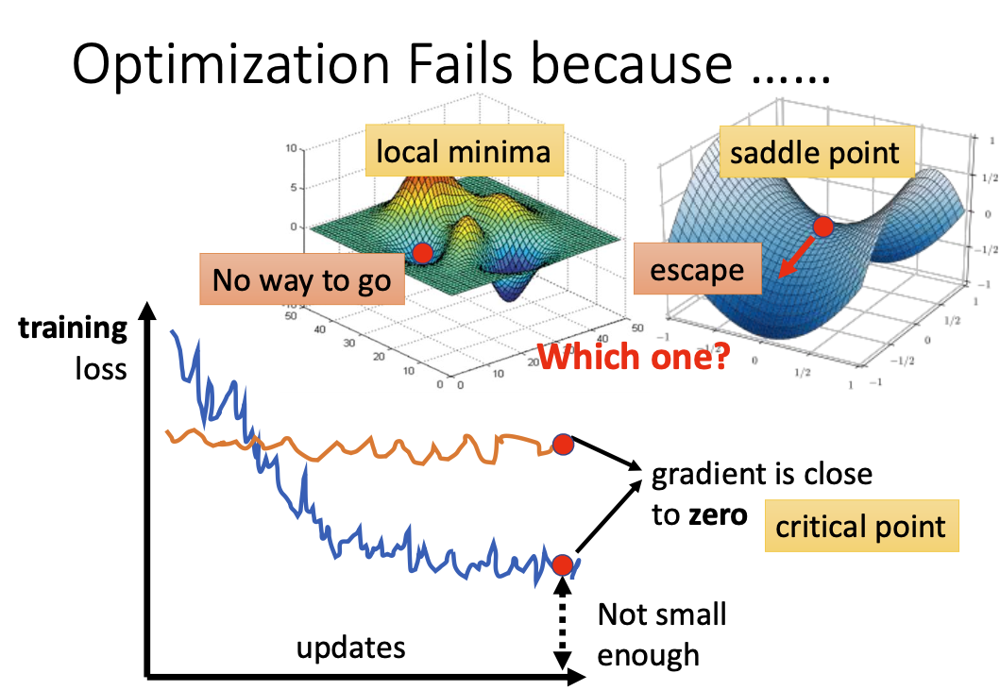
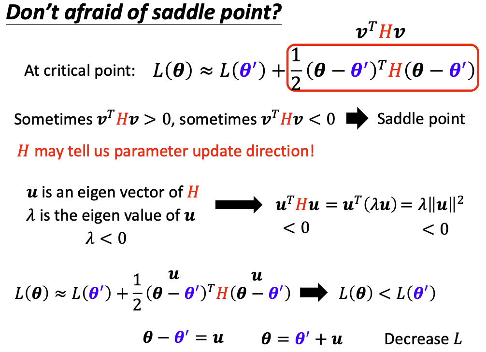
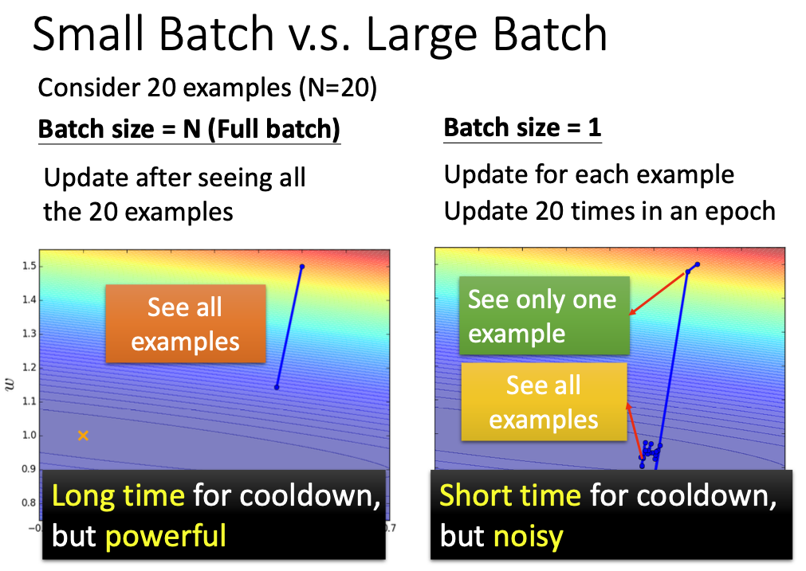
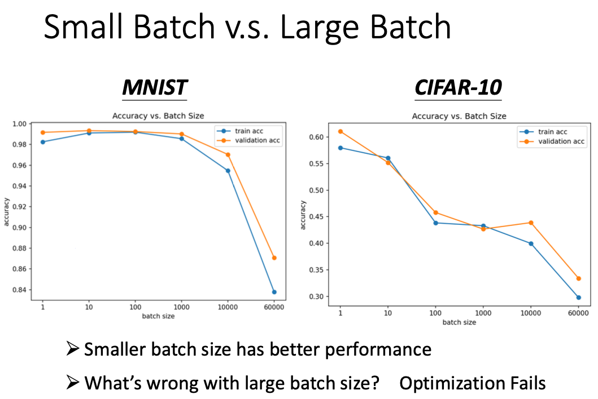
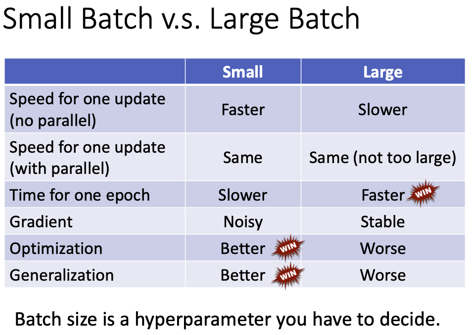
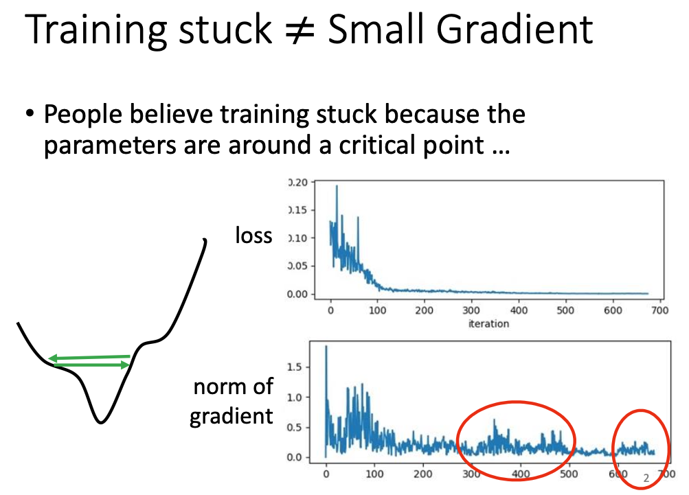
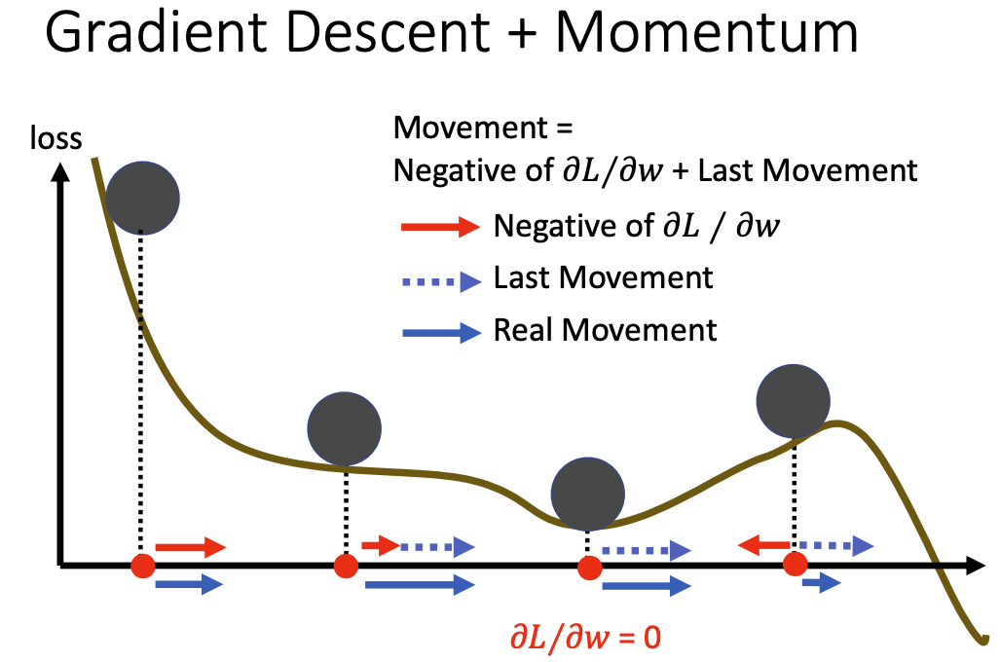
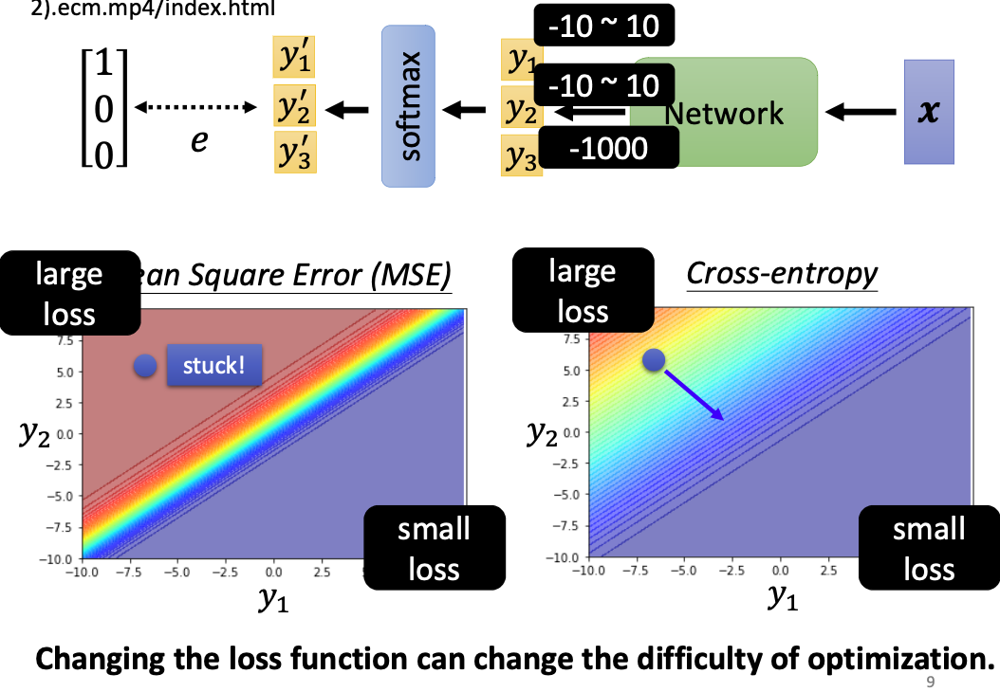

李宏毅老师主讲的机器学习MOOC课程的笔记，本篇记录的知识点有：深度学习算法的优化。
<!--more--->

神经网络训练不好怎么办？为什么loss不下降？这里讨论的训练不好，是指在训练过程中的loss始终降不下来。从数学优化的角度，此时可能陷入了局部最小值或者鞍点等微分为零的点。

## 1. 优化陷入鞍点 (Saddle Point) 或局部极小值 (Local Minima) 

鞍点是指在一个方向上的gradient=0，但是在其他方向的gradient不为零，说明loss仍有继续优化的空间。

局部最小点则是所有方向的gradient均为零，此时无论往哪个方向走都无法令loss继续变小。这种情况比较棘手。

如何确认到底是鞍点还是局部极值？

这里有个结论：如果该点处的二阶偏导数矩阵（海塞矩阵）是正定的，即该海塞矩阵的所有特征值都大于零，说明该点附近的所有值均大于该点，即该点为局部最小值。

如果海塞矩阵的特征值全为负，则说明这里是局部最大值。

其他情况下，如果海塞矩阵的特征值有正有负，说明这里是个鞍点。

求解该点处的二阶偏导数不但可以帮助判断是否为鞍点，还可以帮助我们选择优化的方向。如果该处是一个鞍点，则我们就选择一个海塞矩阵特征值为负值的特征向量，朝着这个特征向量的方向进行移动，就能够最快速走出鞍点。

实际上求海塞矩阵是一个计算量比较大的操作，除非有必要，否则这种方法其实很少使用。事实上，很少有优化算法具备把损失函数给优化到局部最小值或者鞍点的程度，在此之前我们会受到其他问题的困扰，比如batch没有选择好、优化方法并不够优秀等。

## 2. batch没有选择好

在使用随机梯度下降算法时，我们会定义一个batch大小，并把训练集分割成batch大小的一个个子集，每次梯度下降只在子集上进行遍历，每次训练完一个子集的内容叫做一个epoch。

batch的大小自然会影响网络训练的速度以及优化效果。小batch可以加速训练，缺点是小batch随机性更大，没办法代表整体的数据集。极端情况下，batch=1时，甚至会出现loss在原地不断震荡的情况。

然而batch过大则失去了意义，因为这会导致训练速度变慢。

如果引入并行计算（即GPU运算），那么batch_size在一定程度内都可以很快。但是不同GPU支持的batch_size是有极限的（取决于显存）。

batch_size 对最终的优化效果有影响吗？是有的。大的batch_size可能会导致优化阶段产生问题。

这种问题是怎么产生的呢？有一种解释是这样的，当我们试图以一个比较大的batch_size训练模型时，可能会卡在客观存在的局部极值点；但是如果我们使用比较小的batch，相当于人为引入了更多的随机性。w在batch_A上是局部极值点，但是在batch_B上就不一定了。

另外，在testing的时候，选择不同的batch也会让accuracy不一样。如果大的Batch对应的Testing结果差 ，代表 Overfitting 。

最后总结一下，batch_size可能造成的影响：

## 3. 虽然 gradient 没有降低到0，但是 loss 已经不再 变小 了（没有选择合适的优化算法）

多数情况下，不会有真正陷入 critical point 的机会，而是在 critical point 附近徘徊。

因此需要我们调整学习率。每个不同的参数应该在训练的不同阶段拥有不同的学习率。这种通过改变学习率来优化算法的训练速度的方法，在Note2中已有介绍。

常用的自适应改变参数学习率的算法有Adagrad算法、RMSProp算法等。

一种方法是使用带有momentum的优化算法。动量法在Note2里已有介绍，我们将梯度下降的优化过程比喻成小球滚落山坡的过程。但是梯度下降的优化过程忽略了小球本身具有动量，与现实中有一定区别。如果我们将梯度下降算法添加上动量的模拟，则小球在陷入局部最优解时，足够高的动量能帮助小球“冲”出局部最优解。

使用动量法的优化算法有Adam等。实际上，Adam是Adagrad和Momentum动量法的结合。

此外，从经验上看，学习率一开始要保持大一些，来保证收敛到最优点附近；然后要减小学习率来避免震荡。那么我们自然可以想到，学习率跟随训练轮次变大逐渐变小。这就是**学习率衰减**。

在刚开始训练时，由于参数是随机初始化的，梯度也往往比较大，再加上比较大的初始学习率，会使得训练不稳定。因此我们希望刚开始几轮迭代的学习率较小，等梯度下降到一定程度时再恢复学习率。这种方法称之为**学习率预热**。等预热完毕后在进行学习率衰减。

利用这两个思想，改进Adam后，就是优化算法RAdam。

4. 损失函数也会有影响

分类问题的损失函数可以选择MSE和Cross-entropy。现在我们更多选择交叉熵。为什么MSE不行呢？

MSE在loss大的地方非常平坦，梯度趋近于零，最后stuck卡住！难以优化。

Cross-entropy ：左上角有斜率，可以透过梯度，一路往右下角走。更易收敛。

5. 也许需要 normalization

一般而言，样本特征由于来源以及度量单位不同，他们的尺度 (Scale) 即取值范围也不同。对于某些机器学习模型，会对那些尺度更大的数据更敏感。因此对于尺度敏感的模型，必须先对样本进行预处理，将各个维度的特征转换到相同的取值区间内，并且消除不同特征之间的相关性，才能取得理想的效果。

归一化 (Normalization) 方法泛指把数据特征转换为相同尺度的方法，比如把数据特征映射到 [0,1] 区间内，或者直接映射为均值为0、方差为1的正态分布。

**最小最大值归一化**：将每个特征缩放到 [0,1] 或者 [-1,1] 之间。假设我们有 N 哥样本 $\{x^{(n)}\}^{N}_{n=1}$，对每一维特征x，归一化后的特征为：

$$
\hat{x}^{(n)}=\frac{x^{(n)}-\min_n(x^{(n)})}{\max_n(x^{(n)})-\min_n(x^{(n)})}
$$

**标准化**：将每维特征都调整到标准正态分布：

$$
\hat{x}^{(n)}=\frac{x^{(n)}-\mu}{\sigma}
$$

除此之外，还有Batch-Normalization和Layer-Normalization的算法。