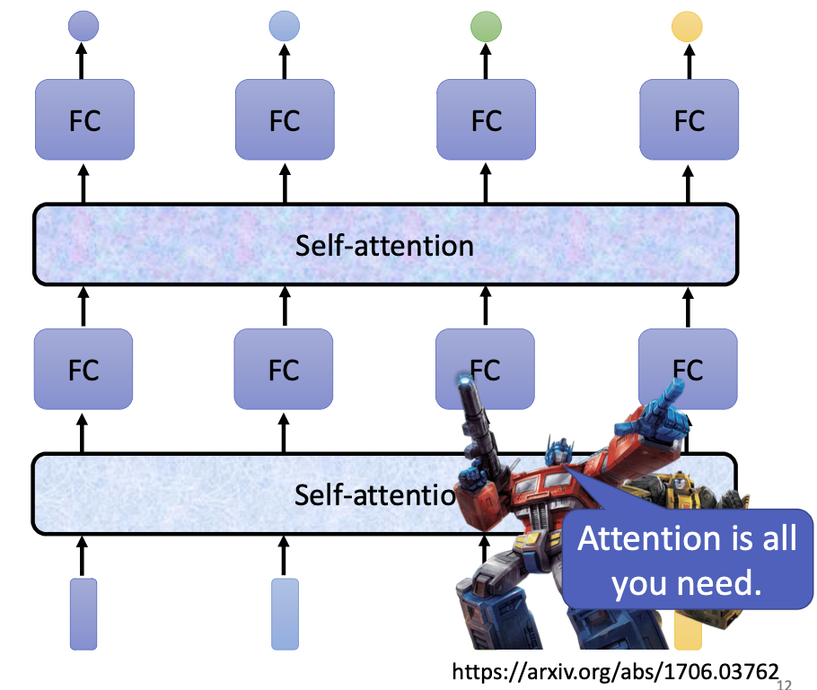

李宏毅老师主讲的机器学习MOOC课程的笔记，本篇记录的知识点有：自注意力机制。
<!--more--->

## 一、输入从图像到序列

图像分类任务的输入是固定的，比如都是28*28像素的黑白图片等等。但是一些输入和输出不是定长序列的任务，比如机器翻译、语音转文字等任务，传统模型在这些任务上的表现不好。


比如词性标注任务，模型的输入是N个向量，输出是N个分类标签；比如文本分类任务，模型的输入是N个向量，输出只是一个分类标签；比如文本翻译任务，模型的输入是N个向量，输出可能是N'个向量，此时N'是未知的，需要机器自己进行判断和学习；这种任务叫做 sequences to sequences (seq2seq) 。

这些任务的输入特点是，都有多个向量作为一个输入，且向量的相对位置会影响输入的含义。

以词性标注任务举例，该任务的输入和输出向量个数都为N。我们首先把一句话切分为N个词，然后利用一些编码方式（比如 one-hot 或者 word2vec）将其变成N个定长向量。我们将这N个向量作为一个输入序列，输入到模型中，寄希望于模型能够把每个词的词性标注出来。所以这其实是一个分类任务。

但是当我们输入句子”I saw a saw.“时，前后两个saw的词性是不同的，如果模型只以词汇向量为输入，不考虑上下文的话，是无法得知这件事的。

为此，前人们做了以下改进，试图使用传统模型解决这个问题：

1. 通过 N-gram 模型，将两三个词打包成一个新词，”I saw a saw“经过3-gram模型的编码，会产生如下输入序列：

    ```
    I saw a saw
    ->
    [i saw a], [saw a saw]
    ```

    由此，模型能够看到的上下文就扩展到了三个单词。但是该种方法会快速扩大单词量，增加计算负担，且无法把距离较远的上下文也加入进来。

2. 使用TextCNN

    TextCNN 是把图像领域大货成功的CNN模型的经验移植到了NLP领域的成果，它使用一维卷积核。但究其本质还是受限于卷积核的大小。


有没有一种方法能够考虑输入向量的全部上下文呢？ self-attention 可以做到。


self-attention 接受N个输入向量，输出N个输出向量。输出的向量不仅保留了原来向量的语义信息，还额外添加了该向量上下文的信息。

有了这个全新的向量，我们便不必使用诸如 n-gram 等特征工程手段了，self-attention 就能够产生非常好的稠密向量，该向量考虑的上下文范围是整篇文档。

self-attention 适合编码整篇文档的信息，产出向量后可以接一个全连接网络来进行具体的分类；也可以像之前的卷积网络一样，多层 self-attention + FC全连接进行堆叠。这实际上就是Transformer的基本思想。



self-attention 是怎么做到的呢？

## 二、self-attention 的实现原理

self-attention 的输入是N个向量组成的输入序列，输出也是N个向量组成的序列。区别在于，输入的向量本身不包含任何与上下文有关的信息，但是与输入向量对应的输出向量会包含一定的上下文信息。


如果要产生b1向量，其实是考虑了a1/a2/a3/a4全部四个向量后的结果。

具体地，首先我们需要考虑a1向量与其他向量a2/a3/a4之间的相关性，两个向量之间的相关性是一个标量，我们用$\alpha$来表示：


相关性是如何计算得到的？有很多做法可以实现相关性的计算。需要注意的是这里的**相关性**并非矩阵向量空间中的相似性，而是一个**需要机器从数据中学习**的参数。下图是两种不同的相关性的计算方式。


上图左边是一种常用的向量相关性计算法，首先把两个向量各自乘以一个参数矩阵，其中输入向量会得到对应的查询向量 query，上下文向量会得到对应的关键向量 key，然后我们把query和key进行点积，得到的就是两个向量的相关性。参数矩阵是可以通过数据进行学习的。


由此我们推广开来，每个输入向量都可以计算属于自己的查询向量query，以及其他输入向量的关键向量key。


输入向量还需要与自己计算相关性，这样凑齐4个相关性数值。由此我们就得到了输入向量a1与其他（包含自己的）四个向量之间的相关程度。

接下来我们需要做的，就是把四个输入向量都与该相关性进行乘积，然后相加，就得到了包含上下文相关信息的输出向量b1。


再分别对a2/a3/a4向量如法炮制，就可以分别得到四个输出向量。

需要注意，输入向量最后参与计算时，为了将其转化为稠密向量，也需要乘以一个矩阵后才能参与计算。

## 三、self-attention 的并行计算

向量的转化操作都是矩阵乘法，这意味着对向量进行转化的操作是可以并行计算的。

1. 通过参数学习，将输入向量（一般是稀疏的）转化为query/key/value（稠密向量），然后将向量拼合形成矩阵，得到矩阵Q、K、V：


2. 矩阵Q与K做点乘，得到相关性系数矩阵A


3. 相关性矩阵A经过softmax进行概率归一化后，与矩阵V进行点乘，得到输出向量B


**self-attention将输入向量转化为输出向量的过程到此结束。整个过程总结如下**：


## 四、多头注意力 Multihead Self-attention

多头注意力机制，就是同时学习多种相关性的机制。

这样做的理由是：语言是存在同义词、一词多义等现象的，即便是同一句话，在不同语境下阐述也会产生不同的效果。如果只算一种相关性，模型便无法掌握一词多义等能力，因此我们需要学习多个相关性矩阵A。

如果想要学习多个相关性矩阵A，
1. 就必须有多个输入矩阵Q/K/V与之对应，每多一个A，就要多学习一类参数矩阵；
2. 会产生多组输出矩阵B，需要再学习一个参数矩阵，将一系列的输出矩阵合并起来；

多头注意力机制在原有注意力机制的基础上，把原有的query向量再多乘n个参数矩阵，将query复制为n个子向量；key和value向量亦是如此：


query向量的第一个复制体会与各个key向量的第一个复制体进行计算相关性，生成相关性矩阵A1，第二个复制体会与各个key向量的第二个复制体计算相关性，生成相关性矩阵A2，以此类推。


由此会产出n份不同的输出向量，他们分别是考虑n种不同相关性下计算出来的输出向量。使用一个参数矩阵将他们合并起来：


这就是多头注意力机制的设计思路。如果要计算N种相关性，就叫做N头注意力机制。

## 五、位置编码

上面的机制只介绍了 self-attention 如何把输入向量和它的上下文信息进行编码，但是忽略了上下文也是有位置关系的，理论上离当前位置更近的上下文应该获得更多注意力。因此我们需要额外添加一个能够表示位置的参数。

做法也很简单，只需要在输入层为每个向量添加一个额外的位置向量即可。


这个位置向量可以是你自己定义的，也可以作为参数放到网络中进行学习。总之它理论上应该能够表示位置的远近关系。

## 六、self-attention 的具体应用

上面我们是以文本为例介绍的self-attention，实际上有很多其他任务也可以用self-attention来解决（虽然不见得是最佳方案）。

语音识别任务里，通过将一段音频按照一定时间窗口进行切分，也可以得到一个包含很多向量的输入序列；则处理方法与文本任务大同小异，只不过语音分割时产生的输入序列会非常长，此时需要对计算过程加以优化。例子：Truncate Self-Attention

图像识别任务里，每个图像按照像素进行分割，并逐行遍历，也可以形成一个序列，这个序列里的每个输入向量是(R,G,B)的三维向量。例子：Self-Attention GAN

## 七、其他变种 self-attention

## 八、总结和提问

### 1. Self-Attention 的核心思想？

通过综合考虑输入词与上下文之间的相关关系，得到包含上下文语义信息的输出向量。

### 2. Self-attention 是如何计算的？

$$
\text{Attention}(Q,K,V)=\text{softmax}(\frac{QK^T}{\sqrt{d_k}})V
$$

其中Q、K、V都是从输入向量学习而来的稠密向量组成的矩阵，它们不包含上下文的语义信息；

- Q：查询向量，目标字作为 Query；
- K：键向量，其上下文的各个字作为 Key；
- V：值向量，上下文各个字的 Value；

$d_k$是Q/K/V的维度。这样做是为了降低分量之间的方差，防止输入向量的维度过高导致点击出来的结果过大，使softmax出来的结果出现一些极端情况（比如只有一个分量是0.99999，其他分量都是0），进而导致训练困难的现象。

### 3. Self-Attention 和 CNN 的异同？

CNN是一类特殊的Attention，即将注意力聚焦于感受野（卷积核）中的一种self-attention网络结构。

而self-attention的感受野范围是整个序列，可以自行学习哪些是需要重点关注的。

这也就意味着self-attention相较于CNN而言更复杂、参数更多，需要更多数据进行训练。

有讨论二者关系的论文：

> On the Relationship between Self-Attention and Convolutional Layers

从所需的数据量和准确率比较上，可以辅证这一点：


那就是在数据量较小的情况下，CNN作为简单模型可以表现得更好；但是数据量充足时，self-attention具有更高的上限。

### 4. Self-Attention 与 RNN 的比较？

RNN虽然也能够学习长距离依赖关系，但是它的结构和运作方式（要想计算b2，必须先计算b1，存在先后依赖关系）决定了它难以并行化，这就导致它的训练过程非常缓慢。

另外RNN在输入序列过长时，也存在梯度消失或者梯度爆炸的问题，导致无法记忆长距离信息。

Self-Attention的内部有大量矩阵乘法运算，可以被GPU优化的很快。

### 5. MultiHead Attention 的生效原理？

借鉴了CNN中同一卷积层内使用多个卷积核的思想。类似于CNN中通过多通道机制进行特征选择。

Transformer中使用切头(split)的方法，是为了在不增加复杂度（$O(n^2 d)$）的前提下享受类似CNN中“不同卷积核”的优势。

在每个头的计算过程中，彼此之间相互独立，参数不共享，仅在最后将结果拼接起来，这样可以允许模型在不同的表示子空间里学习到相关的信息。

最后整合多个向量，把他们降维到一个向量的长度，这个过程也是在学习"到底哪个头学到的知识是有效的"。

### 6. 位置编码的计算方法？

Attention is all you need 论文中的位置编码的实现方式如下：

$$
\text{PosEncoding}_{(\text{pos}, 2i)}=\sin{(\frac{\text{pos}}{10000^{2i/d_{model}}})} \\
\text{PosEncoding}_{(\text{pos}, 2i+1)}=\cos{(\frac{\text{pos}}{10000^{2i/d_{model}}})}
$$

其中pos表示词在句子中的位置，i则表示向量的分量。这种计算方法无需学习任何参数。

在BERT论文中，采用的位置编码就变成了Embedding的方法自动学习得到。

## 附、self-attention 的代码实现