李宏毅老师主讲的机器学习MOOC课程的笔记，本篇记录的知识点有：Transformer。
<!--more--->

## 一、Seq2Seq

Transformer是一类Seq2seq结构的模型，输入长度为N的序列，输出长度为M的序列。其中M的长度是由模型决定的。诸如文本生成、语音合成、机器翻译等任务都需要应用seq2seq模型。

很多任务可以被转化为seq2seq任务，但不一定是最优解。

seq2seq模型由一个编码器（Encodeer）和一个解码器（Decoder）组成，基础架构如下：

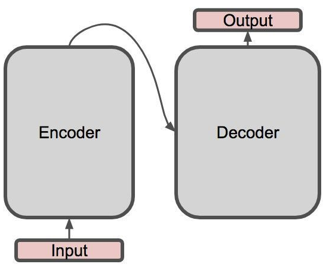

seq2seq模型是一种架构，只规定了输入输出，并没有规定必须使用哪种具体的模型。

## 二、Encoder

如图所示是Transformer的Encoder：

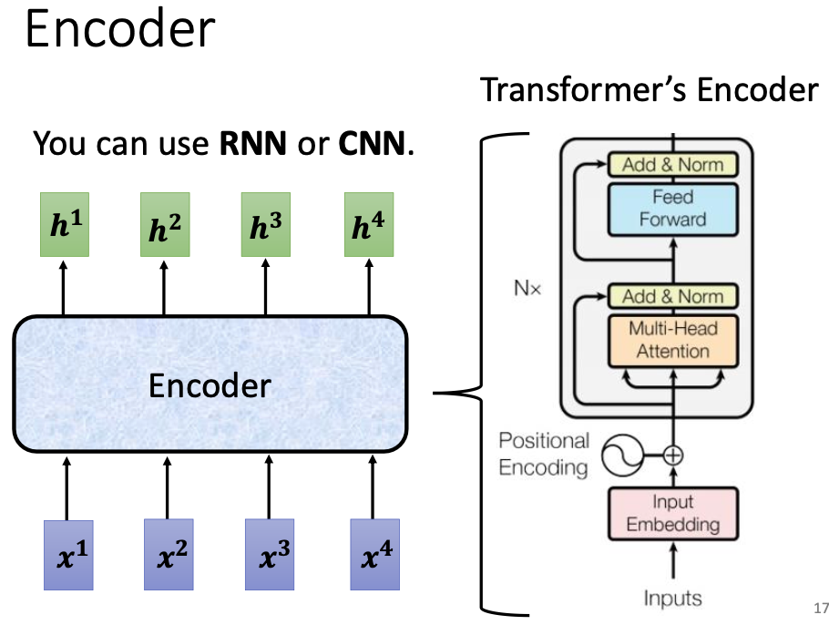

Transformer 的 Encoder 是由若干的 Block 构成的，每个 Block 包含一个 multihead self-attention 结构和一个全连接网络等，这些 Block 串联起来组成 Encoder。

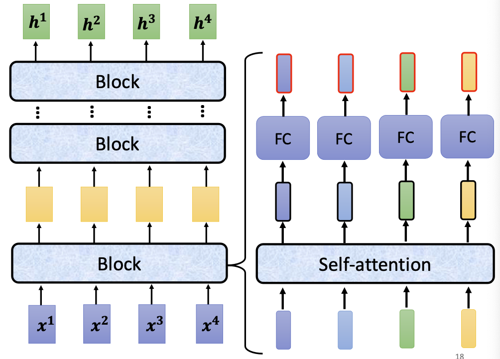

需要关注两个细节：

1. self-attention 层的向量输出后，需要经过一步残差运算，和原来的输入相加；
2. 残差运算后的向量需要 LayerNormalization 操作；
3. normalized 之后的向量需要输入内部的全连接网络，输出的向量同样要与这一步骤的输入进行残差；
4. 在输出前同样需要经过 normalization。

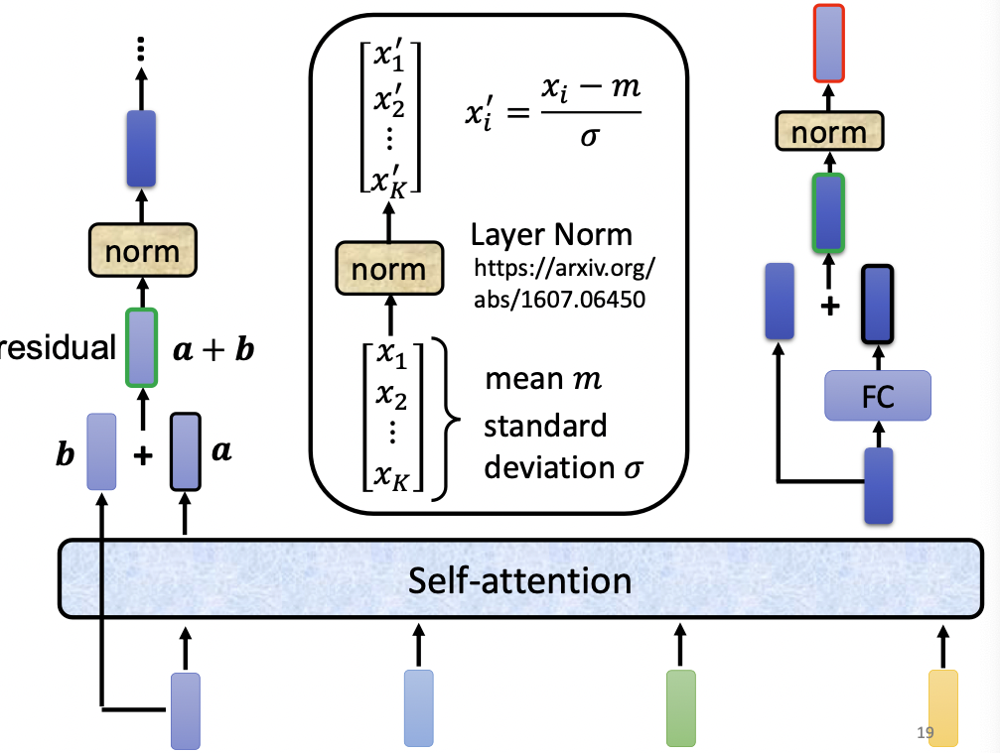

实际上，在具体实现时，上面的操作顺序是可以改变的，有若干文章已经在讨论 LayerNormalization 的执行时机对最终性能的影响。

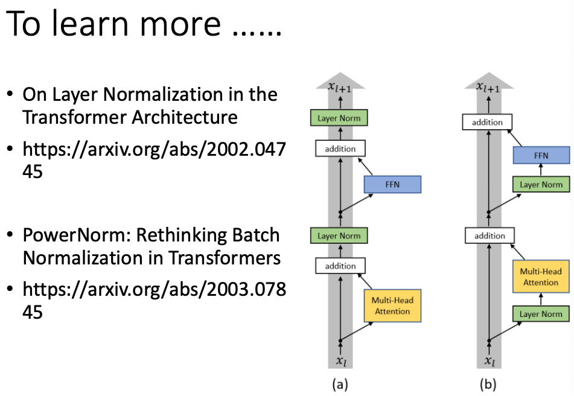

## 三、Decoder

Decoder负责以Encoder的输出为知识，生成一系列输出向量。

### 3.1 Decoder 的执行步骤

Transformer 的 Decoder 是一个自回归（AutoRegressive）模型，即使用自身以前的产出来预测将来的产出。

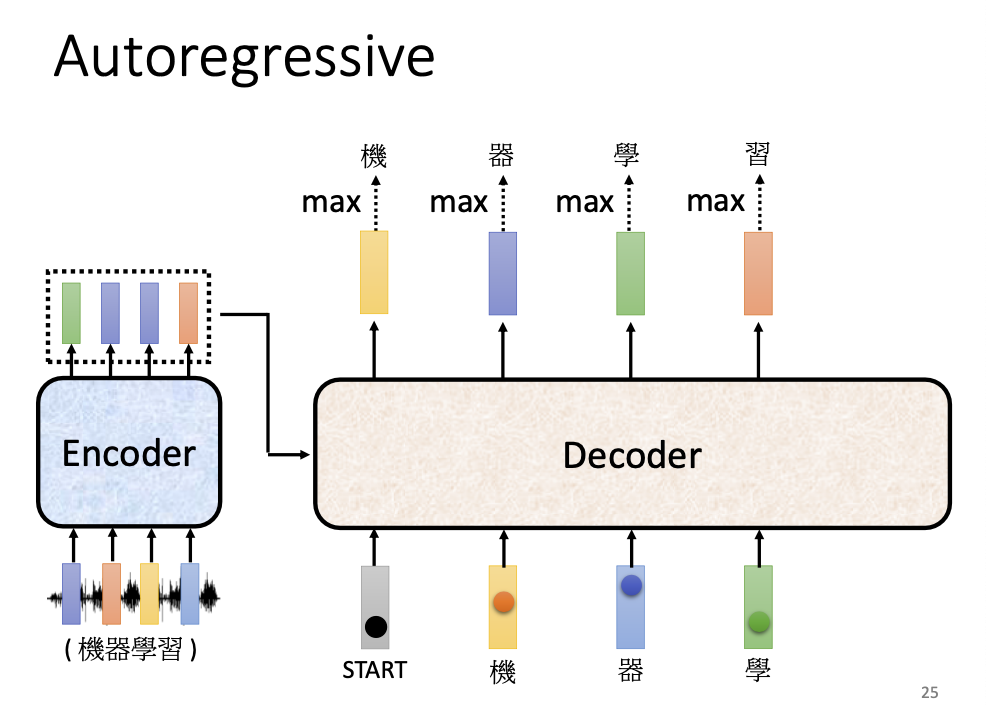

在这里我们以语音转文字任务为例，以一串音频为输入（在图示的例子中，是“机器学习”四个字），Encoder 首先学习适当的语义向量，并将其输入 Decoder 中，Decoder 执行如下操作：

1. Decoder 先以 [start] 符号作为输入，通过 Encoder 提供的知识，来预测该符号对应的输出是什么；
2. Decoder 产出的预测向量是一个长度为单词表大小的向量，向量的每个分量代表输出为该词时的概率值；
3. 紧接着 Decoder 会以该输出为输入，来预测输出；
4. 由此循环往复，直至 Decoder 认为模型的输出为特殊符号 [end]为止。

### 3.2 Decoder 的具体架构

Transformer 的 Decoder 与 Encoder 架构十分类似：

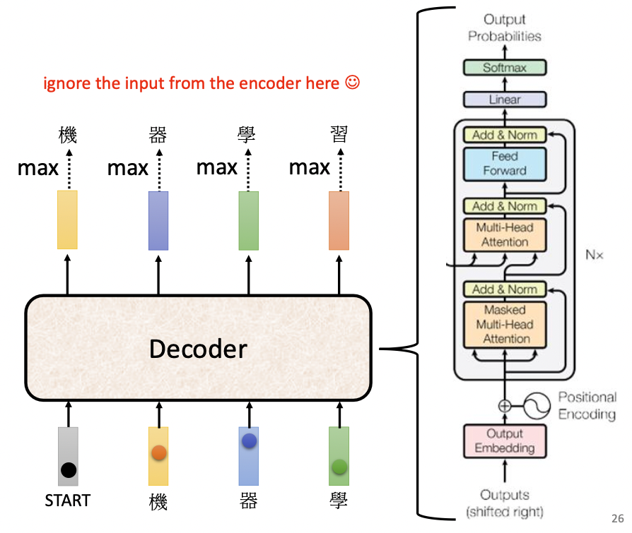

1. 接纳模型输入的 attention 层是 masked self-attention 层，它的特点是，在考虑某个输入向量$x_n$的输出时，self-attention 会综合所有的上下文信息，而 masked self-attention 只会考虑已经出现过的 $x_1~x_n$ 范围内的所有向量，而不会考虑它的下文；
    这样做是自然的，因为 Decoder 是以过去的输出预测将来的输出的自回归模型，它无法参考尚未生成的下文内容；
2. 经过 masked self-attention 的编码后的输出向量，会被当做下一层 self-attention 的 query 查询向量，然后与 encoder 得到的输出向量计算相关性；也就是说，query 来自 Decoder 的输入，而 key 和 value 都来自 Encoder 层。这一步骤叫做 Cross Attention。
    在 Decoder 中加入 Cross Attention ，是希望模型能够正确地利用 Encoder 提供的知识，并根据现有的输入，自动生成合适的输出表示。要完成这一步，Encoder 提供的先验知识与 Decoder 提供的查询词都是必不可少的。

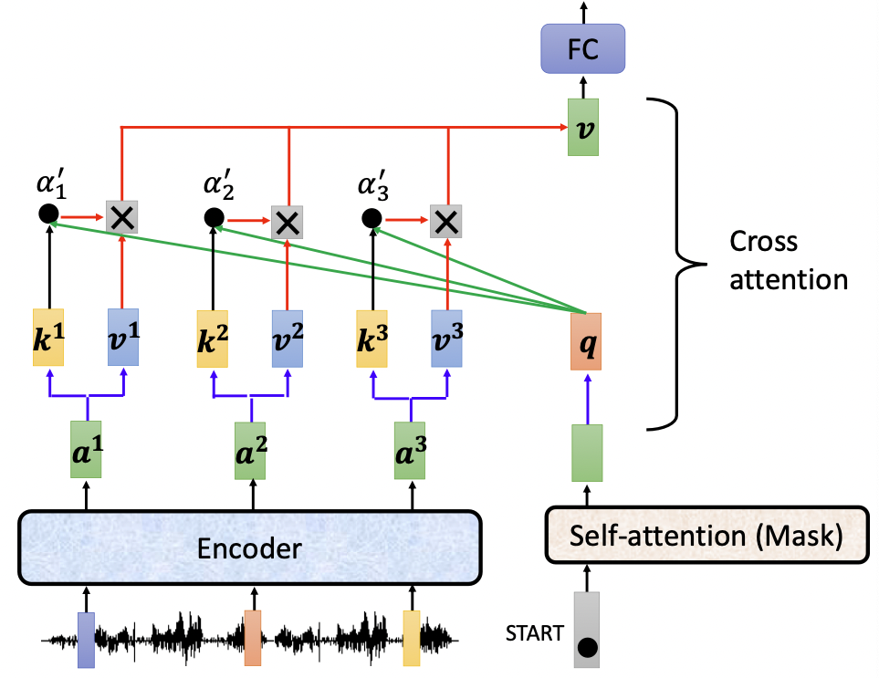

Transformer 的 Encoder 与 Decoder 的详细架构如图：

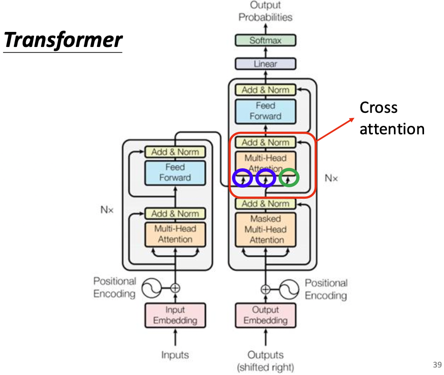

需要注意，原文中 Transformer 的多个 Decoder 结构使用的 Encoder 信息都来自于最后一个 Encoder，这样做是自然地，毕竟我们认为最后一层学习到的知识最抽象，泛化能力最强；

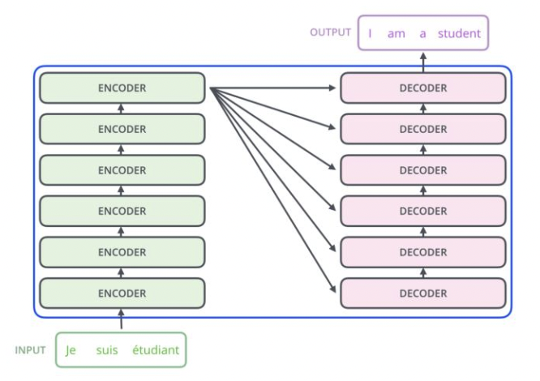

事实上并不总是这样，也有一些文章在研究令不同时期的 Encoder 产出的向量送给不同时期的 Decoder，并取得了一定的效果：

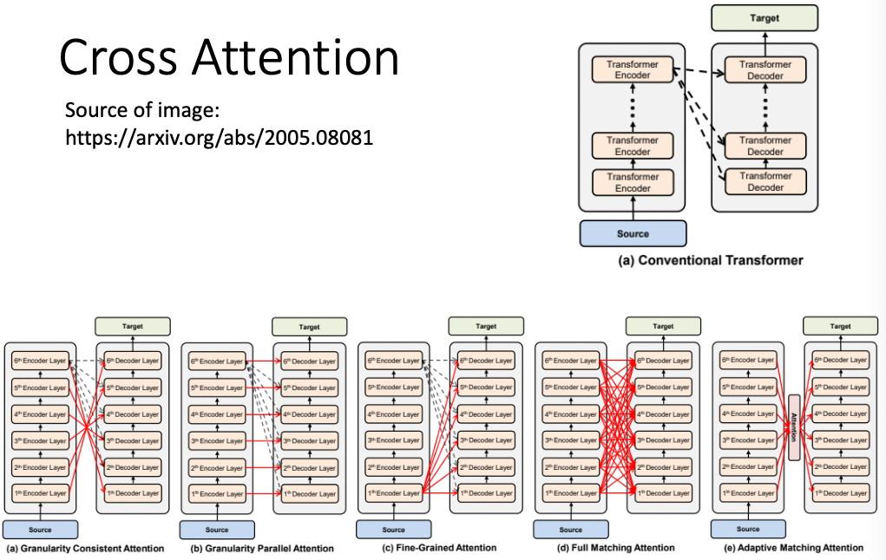

### 3.3 非自回归 Decoder

存在一些 None AutoRegressive Decoder，这些 Decoder 不是以自身之前的输出预测之后的输出，而是一次性给出整个输出序列。

自回归问题是通过在输出集合中添加特殊符号 [end] 来解决序列不停止的问题的，但是 非自回归 Decoder 一次性输出整个序列，它只能预先设定一个序列长度值，并依此长度进行输出。这种类型的 Decoder 当然也会输出 [end] ，但 Decoder 并不会根据此来终止后续字符的生成。最终的结果会截断 [end] 之后的字符。

部分非自回归 Decoder 可以通过另外训练一个分类器，通过学习输入序列长度与输出序列长度之间的关系来动态产生序列的长度。

非自回归 Decoder 的优点在于可并行化，快速；而且输出序列的长度是人为可控的；

缺点在于准确率等相对不如自回归 Decoder。

## 四、Transformer 的训练过程

其实就是训练一个分类问题。假设问题为一段语音，问题的答案为“我爱中国”四个字，则 Encoder 会学习该语音的向量表示并输出给 Decoder，Decoder 则会分别输入 `BOS、我、爱、中、国`，作为五个训练样本；他们的正确答案为`我、爱、中、国、EOS`，每个字对应一个 one-hot 向量。最后通过优化交叉熵损失函数，按照正常的梯度下降算法进行优化即可。

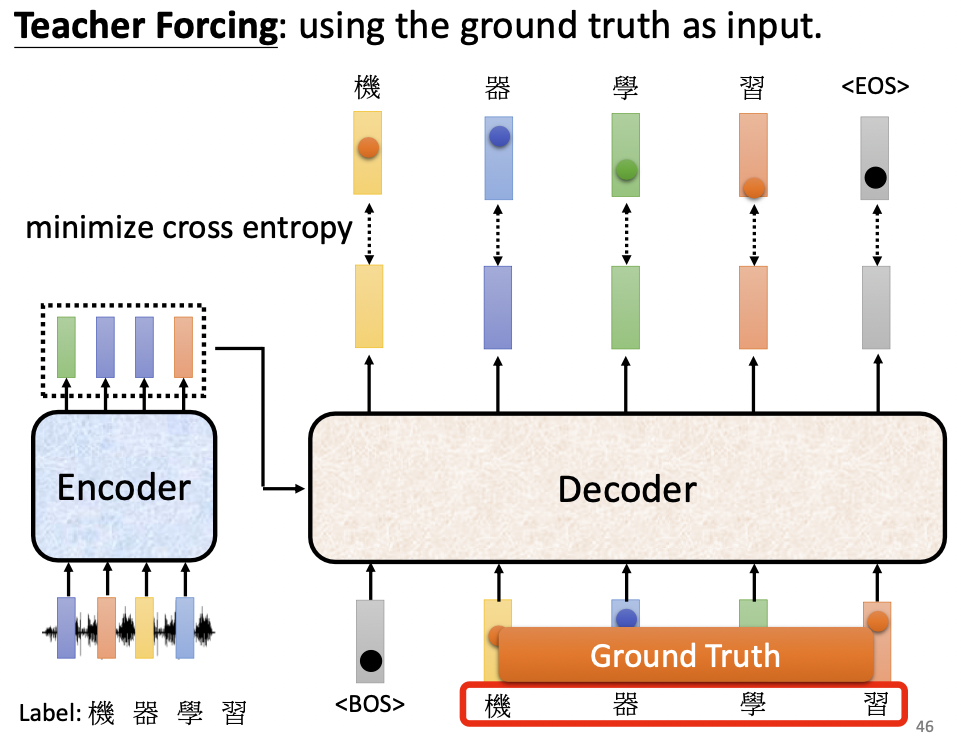

这种以正确答案为输入的训练方法称作 Teacher Forcing。

## 五、Transformer 训练技巧

### 5.1 Copy Mechanism

对于一些问答等问题，当输入中包含一些实体时，模型可以直接把该实体复制到输出序列中进行原样输出，称之为“复制机制”，这需要保证输入信息到输出信息之间的畅通。

实现 Copy Mechanism 的网络结构有指针网络等。

### 5.2 Guided Attention

通过人为限制注意力的学习方向、学习重点等，提升模型的学习能力。比如规定语音合成任务的注意力只能从左往右学习等。

### 5.3 Beam Search

Beam Search 是一种帮助找到最优解的方法，其思想类似于动态规划，是为了解决 Decoder 在贪心地选择最优输出时，错过了次优输出，导致后续输出全错的问题。

Beam Search 并不总一定能找到最优解，而且一味追寻最优解，在一些需要发挥创意的任务中，反而不好，比如新闻生成任务等。

### 5.4 优化评估指标

一般而言 Decoder 的损失函数都是交叉熵，这是因为交叉熵方便求导好训练；而评估模型时使用的往往是 BLEU。但如果我们使用 BLEU 这种相对科学一点的评估函数来做损失函数的话，可能需要借助强化学习（Reinforcement Learning, RL）的思想，强行把 BLEU 移植到模型中。

### 5.5 scheduled sampling

Decoder 在训练过程中，训练样本永远都是正确答案，缺乏一些负样本，告诉 Decoder 你不应该将预测值预测为该值。为了做到这一点，我们需要在训练时随机在输入序列中添加噪音，但这一举措可能会损失训练的并行化能力。

## 六、总结和问答

### 为什么要加入残差模块？

### 为什么要加入 LayerNormalization 模块？

### BatchNormalization 和 LayerNormalization 的区别？

###  Transformer 使用到的几种 Mask

### 前馈神经网络在 Transformer 中的作用

### Gelu 的作用

## 七、transformer 的代码实现