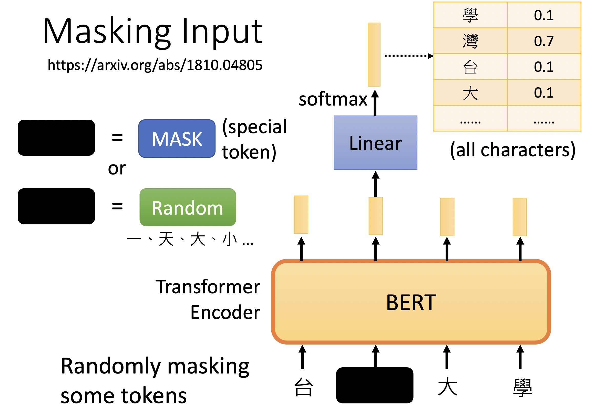
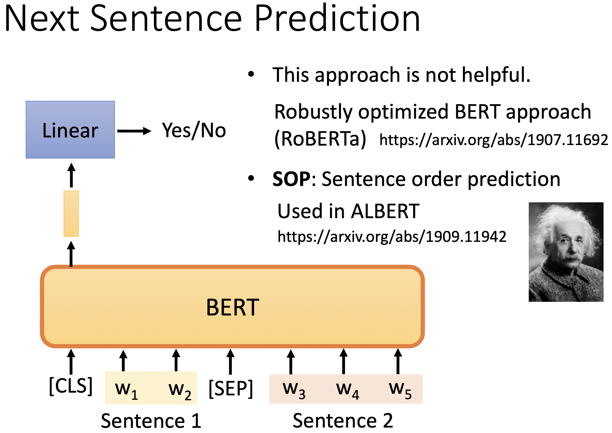
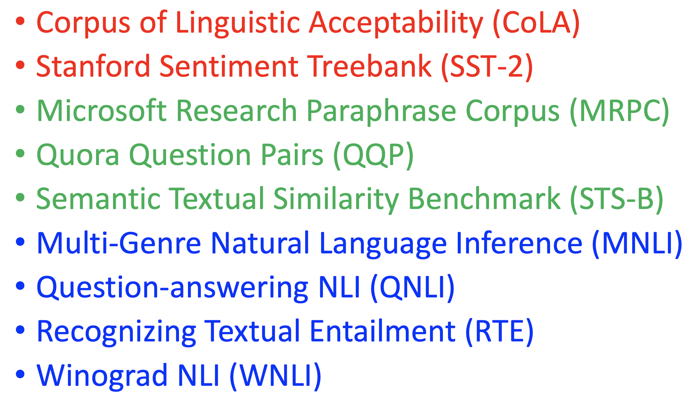
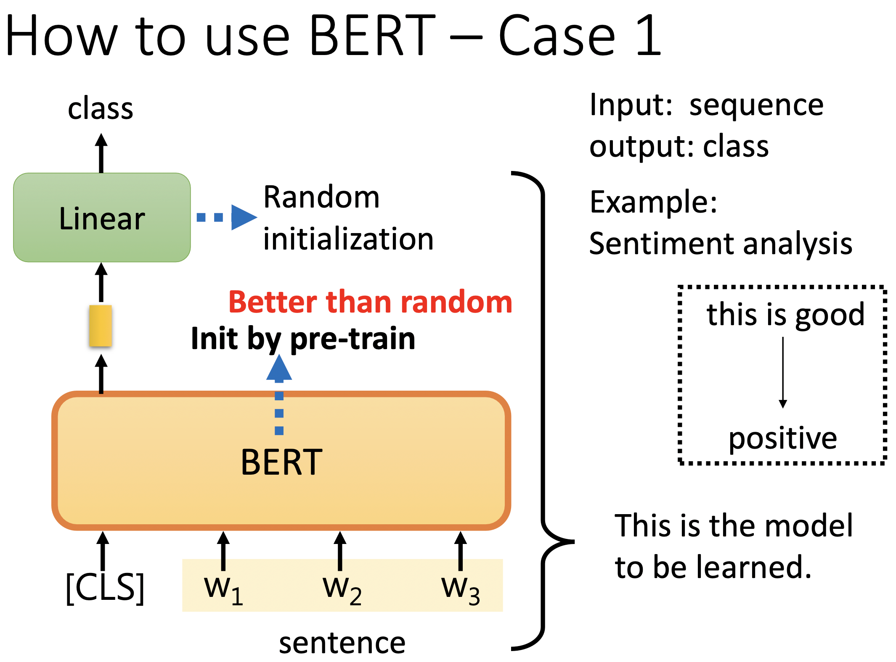
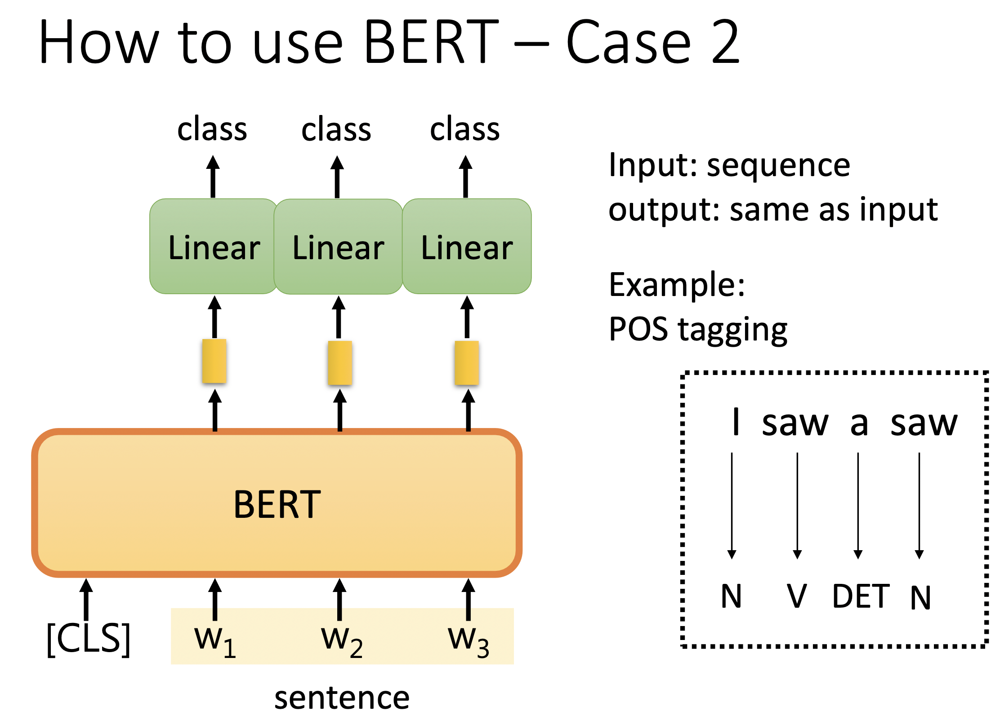
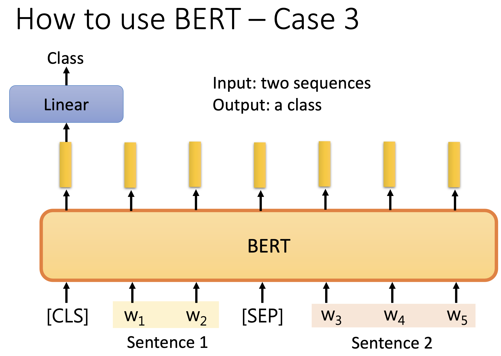
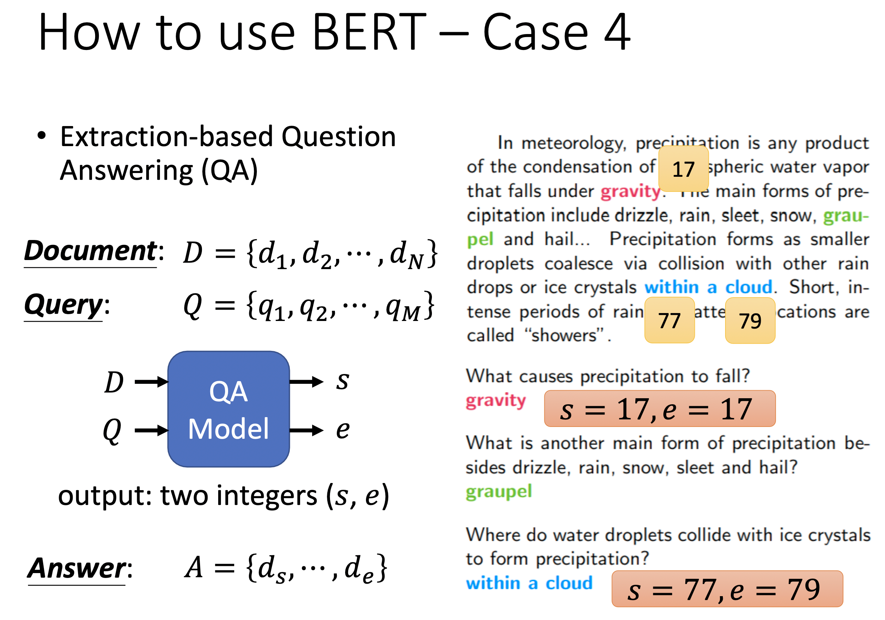
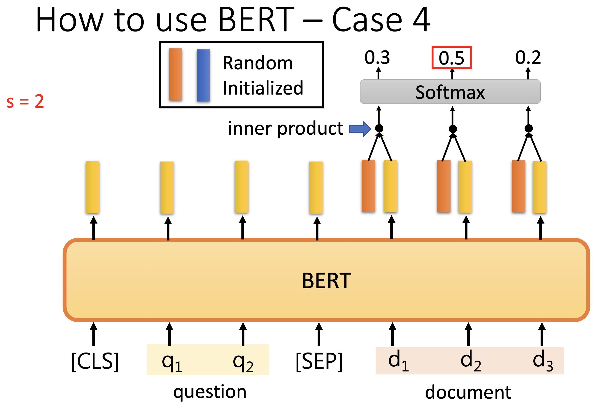
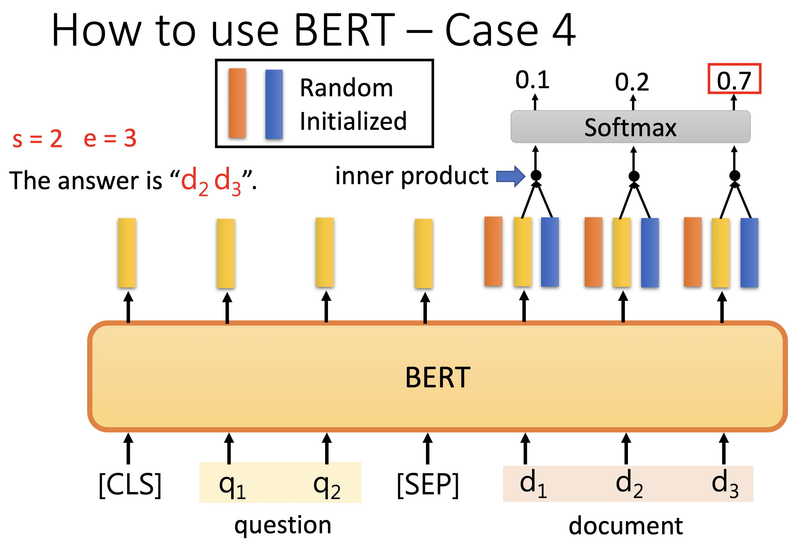

李宏毅老师主讲的机器学习MOOC课程的笔记，本篇记录的知识点有：自监督学习、BERT、GPT。

<!--more--->

## 二、自监督学习

自监督学习由 Yann LeCun 在 2019 年首次提出，模型会从无标签的数据中采取某些方法构建标签，然后进行学习。由于自监督学习不需要人为对数据进行标签，因此自监督学习可以看做无监督学习的一种。

自监督学习常用于训练大规模的语言模型，比如 BERT、GPT 等。由于这些模型的参数量非常大，因此训练模型所需的数据量也非常大，甚至大到人工标注无法完成的程度。

BERT 的训练数据包含整个维基百科的无标签号文本的大语料库中（足足有25亿字！） 和图书语料库（有8亿字）；使用自监督学习能更高效、更直接地从数据中学到知识，避免人工标注带来的成本。

下面介绍几个 BERT 使用到的自监督学习方法。

### 1. Masking Input

BERT 的输入是一个句子，句子由若干 token 组成。Masking Input 训练任务就是随机 Mask 句子中的词，来构建 {填空题, 答案} 这样的数据。

Mask 方法有很多，可以直接替换为 [MSK] 这种全新的特殊符号，或者替换为任意一个其他字。

到底用哪一种也是随机决定的。在原文中，80%的数据是由 [MSK] 特殊符号替换方法来生成的，10%的数据是以其他词进行替换生成的，还有 10%的数据是保持原样生成的。

这个过程 BERT 会预测 [MSK] 对应的字是哪一个，把盖住的部分对应的输出向量做线性变换，做 softmax 产出一个分布。由此，变成了一个监督学习的分类任务。



训练方法：与 ground truth 进行最小化交叉熵。

### 2. Next Sentence Prediction

选择句子A和B作为预训练样本：B有50%的可能是A的下一句，也有50%的可能是来自语料库的随机句子。

```
[cls] w1 w2 [sep] w3 w4 w5
```

只取 cls 对应的输出，然后预测 yes or no，判断这两个句子是否相接。



这一招不太有用，RoBERTa 舍弃了该方法。可能是这个任务太简单了，学不到太有用的东西。

### 3. Sentence Order Prediction

ALBERT 的训练方法，判断两句的顺序或者逆序。

### 4. 如何评估学习的效果？

评估方法：GLUE（General Language Understanding Evaluation）

有九大任务，评估预训练模型的好坏。



## 三、如何使用 BERT

预训练模型完成训练后，需要将模型学习到的知识迁移到其他领域。这个迁移的过程叫做微调（fine-tuning）。微调需要一定的标注数据，进行监督学习。根据下游任务不同，所需要的标注数据不同。

### 1. 文本分类：

文本分类以一串文本为输入，输出为一个概率分布，表明该串文本被分成各个类别的概率。

INPUT:
```
[cls] w1 w2 w3
```

OUTPUT:
看 [cls] 的输出分布，然后与真实标注进行对比，最小交叉熵。



训练时，linear 线性变换矩阵的参数是随机初始化的，预训练的参数是直接下载的。

fine tuning 时，所有部分的参数都会梯度下降进行优化。

### 2. 序列标注

输入一个序列，输出另一个序列。

```
[cls] w1 w2 w3 w4
```

BERT 以一个 [cls] 开头的序列为输入，对于每个 token，都会产出向量，并转化为预测该 token 的词性。



### 3. 语义推理

Natural Language Inference ，输入两个句子，输出两个句子的逻辑关系，多分类问题。



可以扩展到评论立场判断，输入原文+评论，输出读者对此的态度，支持反对还是中立。

### 4. 问答系统

给定一篇文章+一个问题，机器产出答案在原文中的位置，分别是起始节点和终止节点。



我们需要将输入整理成 query + document，输出两个位置，start_pos 和 end_pos ，在原文中 [start_pos, end_pos] 内的位置就是模型认为的答案。如果 start_pos 和 end_pos 都为 0，则模型认为没有答案。



在这里唯一需要从头开始训练的模块是如上图所示的<font color=Orange>橙色</font>和<font color=Blue>蓝色</font>向量。

首先把橙色向量跟每个 document 的 N 个词向量对应的输出向量做点积，算出 N 个数值，然后过一下 softmax 得到概率分布。取最高的值为 start_pos。



然后把蓝色向量跟每个 document 的 N 个词向量错对应的输出向量做点积，算出 N 个数值，同样取最大后决定 end_pos。

这个过程类比 self-attention，就好像我们要训练 query 向量对应的 Q 矩阵。

实际上 BERT 的输入序列一般为 512，而一整篇文章往往巨长无比，我们一般每次只拿一小段一小段 document 进行训练，只有一个有正例。

### ------


Bert 损失函数组成

第一部分是来自 Mask-LM 的单词级别分类任务；
另一部分是句子级别的分类任务；

所用的损失函数叫做负对数似然函数

BERT 则是通过「transformer 编码器」模块构建的。

