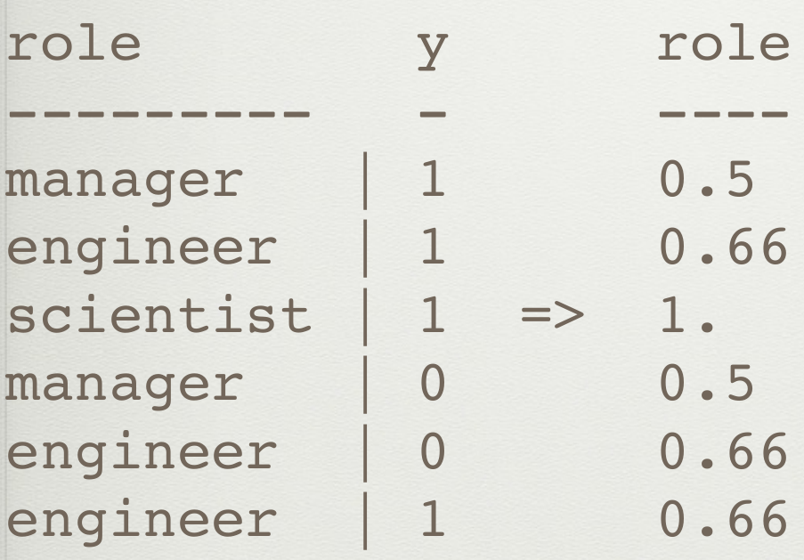

本文翻译自HJ van Veen的Feature Engineering一文，总结了数据竞赛中常用的特征工程方法。
<!--more--->

# 特征工程

本文翻译自HJ van Veen的Feature Engineering一文。由于原文以PPT方式呈现，信息高度压缩，因此在我整理本文过程中，添加了自己的理解。如有错误，敬请指正！


**全文概览：**


机器学习的特征工程是将原始的输入数据转换成特征，以便于更好的表示潜在的问题、提高预测模型准确性的过程。

特征工程是数据科学中最具创造性的部分，决定了机器学习模型的性能上限。

即便是号称端到端的神经网络也需要特征工程，比如cv需要获得HOG，SIFT，whitening, perturbation, image pyramids, rotation, z-scaling, log-scaling, frame-grams, external semantic data等信息。

机器学习的输入特征包括几种：

- 类别特征：如ID、性别等，值的大小无意义。
- 数值特征：包括整型、浮点型等，值的大小有意义。
- 时间特征：如月份、年份、季度、日期、小时等。
- 空间特征：经纬度等，可以转换成邮编，城市等。
- 文本特征：文档，自然语言，程序语句等。

## 一、类别特征

分类特征的特点是几乎总是需要处理后才能输入算法。

类别特征难以估算缺失数据，类别太多（数据维度高）会导致数据稀疏，因此类别特征是特征工程的重点。

### One-Hot编码

将每个特征编码成长度为K的向量，每个向量只有一个维度值为1，其他值为0。这样做的好处是简单易实现，且数据样本的长度也归一化了。

比如分类特征{黄，绿，蓝}可以编码成{001,010,100}；{男，女}=>{01,10}；{1,2,3,4,5,6,7,8,9}=>{000000001,...,100000000}

**通常丢弃第一列以避免线性相关。**

比如Pandas中，`get_dummies`函数有一个参数为`drop_first`，如果为True就丢弃One-Hot编码后数据的第一列，因为丢弃的一列可以通过其他剩余的k-1列计算得到，这一列也就变成了重复数据。

缺陷：容易造成数据稀疏，且现有的One-Hot编码实现方式，较难应对缺失数据和没出现过的变量。

对于类别不多的分类变量，可以采用独热编码。但其实自然语言处理任务中也广泛使用了One-Hot编码。要知道自然语言处理任务的词典大小动辄上万，那么一个单词的One-Hot向量长度也上万，一篇文档转化成One-Hot矩阵，这个数据量就非常可观了。

### Hash编码

无论采用什么编码，只要令每个特征能够独一无二地表示即可。可采用Hash思想。

对于类别数量很多的分类变量，利用哈希函数将一个数据点转换成一个向量。相比较One-Hot模型，哈希编码维度下降了很多。

若采用哈希函数
```
h(the) mod 5 = 0
h(quick) mod 5 = 1
h(brown) mod 5 = 1
h(fox) mod 5 = 3
```
则对于某句话：
`the quick brown fox`
来说，其使用哈希特转换的向量就是：
`(1,2,0,1,0)`
对比one-hot编码向量（在单词表里就这四个单词的情况下）：
`(0001,0010,0100,1000)`


哈希表有如下特性：

- 相同的输入可能有相同的输出（一般情况下比例不高）
- 不同的输出一定对应不同的输入
- 正向计算很简单，反向计算很困难
- 根据输入查找输出效率很高

本部分参考自 https://www.datalearner.com/blog/1051537932880901

### 标签编码

给予每个类别变量一个独一无二的数字ID。

假如有三种颜色特征：红、黄、蓝，那么你可能想令红=1，黄=2，蓝=3，这就是标签编码。

这种编码对于树算法等非线性算法比较有用，好处是不会升维，坏处是会让机器学习算法误以为颜色存在数值大小关系。

### 计数编码

将每个类别的编码定义为其在数据集中出现的次数。比如在数据集中'红'出现了300次，那么'红'的编码就是300。

`df.groupby(['category'])['target'].transform(sum)`
这种做法很常见，也很简单。缺点是对异常值敏感，且不同类别出现次数相同时可能引入冲突。

### 计数排序编码

根据类别变量在训练集中出现的次数**排序**

对异常值不敏感，不会引入冲突。在实际比赛中效果可能出乎意料的好。

### Target编码

将类别变量编码为分类为正的比例，类似于该类别对正类的贡献指数。

比如职业类别特征{'manager','engineer','scientist'}在数据集中，但凡scientist都使得target=1，那么scientist就编码成1.00。



### 类别嵌入

由神经网络得到每个类别的嵌入表达，将特征投影到更高维度的空间。在进行文档分类等，原本具有语义相似性的单词映射之后的向量之间的距离也比较小，进而可以帮助我们进一步进行机器学习的应用，这一点比独热模型好很多。

参考 https://arxiv.org/abs/1604.06737


### 把Nan也当作一个类别

只在Nan确定有意义时使用。

### 多元编码

将两个二元分类变量组合，形成四元向量表示


### 扩张编码

将一个Feature拆分成多个Feature

### 合并编码

将多个Feature合并成一个Feature

## 二、数值特征

### 舍入

过高的精度有时是噪音。

舍入后的数据可以被当作是类别变量。

舍入前可以log一下，log转换可以将范围很大的值缩小在一定范围内，这对某些异常值的处理也很有效。


### 按数值大小分箱（Binning）

数据分箱是一种将多个或多或少连续值分组为较少数量的“箱(bin)”的方法。通过分箱，数值特征转换成类别特征了。

例如一天24小时可以分成早晨[5,8)，上午[8,11)，中午[11,14)，下午[14,19)，夜晚[10,22)，深夜[19,24)和[24,5)。因为比如中午11点和12点其实没有很大区别，可以使用分箱技巧处理之后可以减少这些“误差”。

### 特征缩放（Scaling）

也称为数据标准化。可以将很大范围的数据限定在指定范围内。由于原始数据的值范围变化很大，在一些机器学习算法中，如果没有标准化，目标函数将无法正常工作。

特征缩放方法主要有：
- 转为标准正态
- 最大最小缩放
- 对数缩放
- 开方缩放 root scale

### 估算缺失数据（Imputation）

由于各种原因，许多真实世界的数据集包含缺失的值，通常编码为空白、NAN或其他占位符。简单删除该条数据项就太可惜了，一个更好的策略是估算缺失的值， 即从数据的已知部分推断它们。

缺失的值可以用提供的常量值来计算，或使用缺失值所在的每一列的统计数据(平均值不如中位数鲁棒)。处理缺失数据的方法还有很多。

sklearn的SimpleImputer类就是用来估算缺失值的。
https://www.studyai.cn/modules/impute.html

### 特征交叉(feature interactions)

在回归模型中加入交互项是一种非常常见的处理方式。它可以极大的拓展回归模型对变量之间的依赖的解释。

举个例子：[来源](https://www.datalearner.com/blog/1051508158689792)

不同特征之间可能相互影响，比如阳光和土壤质量同时决定树木生长高度，我们可以建模：

$$\text{Tree}=a\times \text{Sun}+b\times \text{Soil}+c$$

但是阳光本身也可能影响土壤质量，而我们建立的线性模型事实上是把土壤和阳光当作独立变量的。想要学习线性相关性，我们可以增加一个特征:

$$\text{Tree}=a\cdot\text{Sun}+b\cdot\text{Soil}+c\cdot(\text{Sun}\cdot\text{Soil})+d$$

特征交叉的方法有很多，比如不同特征间进行加减乘除、指数操作等。

### 非线性特征在线性模型中的应用


- 通过多项式核函数(polynomial kernel)和径向基核函数(RBF kernel)将线性不可分的数据映射到高维空间去

- Leafcoding（随机森林嵌入）（acebook的gbdt+lr这种思路）

- 遗传算法（典型代表gplearn）

- 局部线性嵌入 Locally Linear Embedding，频谱嵌入 Spectral Embedding，t-SNE （降维提取重要特征）

### 行统计

统计一行数据中Nan个数、0的个数、负数个数、最大值、最小值、中位数、峰度偏度等

## 三、时间特征

时间变量非常容易出错，需要更好的局部验证方案（如回测）

### 将时间映射成环（周期性变量）

Turn single features, like day_of_week, into two coordinates on a circle

Ensures that distance between max and min is the same as min and min +1.

含义是指周六和周天，与周天和周一的距离是一样的。

Use for day_of_week, day_of_month, hour_of_day, etc.

就是将大时间项，比如2019年11月11日分解成小时间项的意思。

### 趋势线

数据的变化趋势本身也是信息。因此不要使用诸如total_spend这种总结式变量，要有一些中间变量，诸如spend_in_last_week，spend_in_last_month。展现数据趋势，利于模型获取信息。

### 事件编码

将某日期与重大节日之间的距离也作为特征，比如法定假日、重大体育赛事、周末、每月的第一个星期六等。

## 四、空间特征

### 将地点视作分类特征

- 克里金法 Kriging，空间插值方法
- K-means 聚类
- 原始经纬度
- 将城市转换为经纬度
- 在街道名称中添加邮政编码

### 将某地点与关键地点之间的距离也作为特征

诸如大城市、超市等，对你的任务有重要影响的地区。

### 位置事件数据可以指示可疑行为

比如同时出现在不同城市的两笔交易、在与住所或送货地址不同的城镇中消费、从不在同一个位置消费。

## 五、数据探索

数据探索的目的是提前发现数据的潜在问题，诸如异常值、噪音；然后探索数据的特征工程方法、清洗方法，为数据预处理做准备。

一开始尝试简单统计量：min、max。

Incorporate the target so find correlation between signal.

我的理解是，探索该特征与该数据的label的相关性。

### 迭代和Debugging

特征工程是一个迭代的过程，确保你的Pipeline能够快速迭代。

Use sub-linear debugging: Output intermediate information on the process, do spurious logging

使用sub-linear debugging：输出有关过程的中间信息，进行伪记录。

使用一些帮助快速实验的工具。

一鸟在手胜过双鸟在林，想法太多不容易成功。

### Label工程

可以把数据集的标签label给变换一下，当成数据的特征（有点泄漏答案的意思）。

- log变换：$y\rightarrow\log{(y+1)}$、$\exp{y_{pred}}-1$
- 平方变换
- Box-Cox变换
- 创建一个评分，用来把二元分类target变成回归问题
- 训练回归模型，用于预测测试集中不可获取的特征

## 六、文本特征

与类别特征类似，特征工程手段更为丰富，举例：

- Lowercasing,
- Removing non-alphanumeric,
- Repairing,
- Encoding punctuation marks,
- Tokenizing,
- Token-grams,
- skipgrams,
- char-grams,
- Removing stopwords,
- Removing rare words
- and very common words,
- Spelling Correction,
- Chopping,
- Stemming,
- Lemmatization,
- Document features,
- Entitity Insertion & Extraction
- Simplification,
- Word2Vec and GloVe / Doc2Vec,
- String Similarity,
- Reading level,
- Nearest Neighbors,
- TF-IDF,
- BayesSVM, Vectorization, LDA, LSA.

### 数据清洗

从大写字母转换成小写，从unicode转换成ascii，移除非字母字符，修复源文本中的格式问题等。

### 分词

- 将句子分成单词token序列，英文可能好做一点，中文之类的语言就需要特定的工具了，比如jieba分词。
- 将标点符号也硬编码为token，因为标点可能也代表有用的信息。
- 词袋模型（bag-of-word model）
- N元分词：“I like the Beatles” -> [“I like”, “like the”, “the Beatles”]
- Skip-grams：“I like Beatles” -> [“I the”, “like Beatles”]
- Char-grams：“Beatles” -> [“Bea”, “eat”, “atl”, “tle”, “les”]
- Affixes：Same as char-grams, but only the postfixes and prefixe

### 删除词

- 删除停用词
- 删除罕见词
- 删除其他常见词，不能反映特征的词

### 还原词形 root

- 拼写检查
- Chop，只取每个token的前8个字符
- Stem，将token缩减为词根形式
- Lemmatize，词形还原

### 更多特征

- 文档特征，诸如统计空格、tab、换行、字符、token出现次数等
- 添加一些通用的描述，“Microsoft releases Windows” -> “Microsoft (company) releases Windows (application)”
- 语法分析树 Parse Tree，NLTK工具包有实现
- Reading level: Compute the reading level of a document.（国外的阅读分级制度）

### 相似度

- token相似度：计算两段文本中相同token数
- 压缩距离 Compression distance：一段句子是否能被压缩成另外一段
- Levenshitein、Hamming、Jaccard距离，用来衡量两个string的距离，计算将该文本转为另一个文本所需的最小操作次数
- word2vec、glove：计算两向量的余弦距离

### TF-IDF

- Term Frequency: 能够降低长文本造成的bias
- Inverse Document Frequency: 降低常用词造成的Bias
- TF-IDF: 辨别在document中最重要的token，删除不重要的token；或者用在数据预处理上，可以使维度下降

### 降维

- PCA: 将文本压缩到50~100维的向量
- SVD: 同上
- LDA: 与TF-IDF配套
- LSA: 创建主题向量

### 外部模型

- 感情分析器：获得text的情感倾向
- 主题模型：使用一个dataset创建主题向量，用于另一个任务

## 七、泄露的特征 / 黄金特征

特征工程能帮助发现泄露的特征，这些特征可能对你帮助很大。

- 比如“逆向”工程：
    - 用彩虹表破解MD5哈希。[彩虹表（Rainbow Table）](https://www.cnblogs.com/by-3ks/articles/4137562.html)是一种破解哈希算法的技术，可以破解MD5、HASH等多种密码。
    - 利用TF-IDF获得术语频率。
    - 编码样本数据集的顺序。
    - 编码文件创建日期。
- 比如规则挖掘：
    - 查找简单的规则（并对它们进行编码）以帮助模型决策。


## 八、案例研究

Quora重复问题数据集，约440000个问题，将其分成重复问题或非重复问题。作者将自己解决Quora重复问题的过程分享如下：

- First attempt: 词袋模型+逻辑回归
- Second attempt: token之间进行数据的多项式交互
- Third attempt: 使用NLTK的SnowballStemmer进行词干提取
- Fourth attempt: 使用2-grams分词
- Fifth attempt: 添加以下手工构造的特征：
    - 归一化问答对的长度
    - 归一化问答对的compression距离
    - 计算问答对的词向量之间的余弦距离
    - Chargram co-occurence between question pairs.
    - 计算word出现次数：which，what，where
- 还能想到更多的改进方法吗？
    - 外部或预训练模型？
    - Search engine models?
    - Logic based models?

## 九、其他资源参考

- **Kaggle forums & kernels:** Far0n, KazAnova, Fchollet, Abhishek, Gilberto Titericz, Leustagos, Owen Zhang, Gert Jacobusse …
- **Introduction:** http://machinelearningmastery.com/discover-feature-engineering-how-to-engineer-features-and-how-to-get-good-at-it/
- **Books:**
    - Mastering Feature Engineering (Alice Zheng),
    - Feature Extraction (Isabelle Guyon et al.)
-  **Blogs:**
    - https://smerity.com/articles/2016/architectures_are_the_new_feature_engineering.html
    - http://hunch.net/~jl/projects/hash_reps/
    - https://blogs.technet.microsoft.com/machinelearning/2014/09/24/online-learning-and-sub-linear-debugging/
    - http://blog.kaggle.com/2015/12/03/dato-winners-interview-1st-place-mad-professors/
    - http://blog.kaggle.com/2016/08/24/avito-duplicate-ads-detection-winners-interview-1st-place-team-devil-team-stanislav-dmitrii/
    - http://www.slideshare.net/DataRobot/featurizing-log-data-before-xgboost
- **Data:** https://data.quora.com/First-Quora-Dataset-Release-Question-Pairs
- **Software:** https://github.com/trevorstephens/gplearn