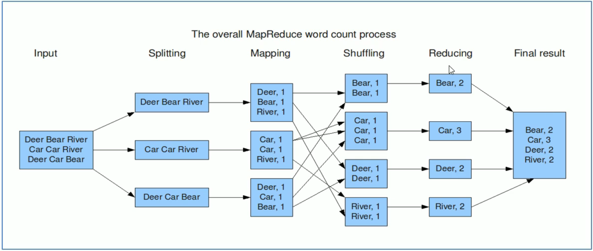

好像不管什么Hadoop学习都是从Word Count开始，跨越语言的Word Count

<!--more--->

Word Count是MapReduce 的经典入门案例，其目标是统计给定一系列文本文件的单词出现次数。

编程思路：

`map`阶段：把输入的数据进行分词，并将其组合成键值对的形式，key是单词，value全部标记为1。

`shuffle` 阶段：经过默认的排序分区分组，key相同的单词会作为一组数据构成新的键值对。

`reduce`阶段：处理 `shuffle` 完的一组数据，该组数据就是该单词所有的键值对。



## Map类的编写


```java
/**
 * @description: WordCount Mapper类，对应MapTask
 * @author: ZYT
 * KEYIN map阶段的输入
 * VALUEIN  todo MapReduce 有默认读取数据的组件：TextInputFormat
 *          todo 逐行读取。k是偏移量（LongWritable），无意义；v是每行的文本内容（Text）。
 * KEYOUT 单词类型，Text
 * VALUEOUT 次数，LongWritable
 */
public class WordCountMapper extends Mapper<LongWritable, Text, Text, LongWritable> {
    /**
     * 每当TextInputFormat返回一个键值对，map就调用一次。
     * 根据TextInputFormat的特性，事实上是每一行文本调用一次Map方法。
     * @param key
     * @param value
     * @param context
     * @throws IOException
     * @throws InterruptedException
     */
    @Override
    protected void map(LongWritable key, Text value, Context context) throws IOException, InterruptedException {
//        super.map(key, value, context);
        String text = value.toString();
        String[] words = text.split("\\s+");
        for (String word : words) {
            context.write(new Text(word), new LongWritable(1));
        }
    }
}
```

优化

```java
public class WordCountMapper extends Mapper<LongWritable, Text, Text, LongWritable> {

    private Text outKey = new Text();
    private static final LongWritable outValue = new LongWritable(1);

    /**
     * 每当TextInputFormat返回一个键值对，map就调用一次。
     * 根据TextInputFormat的特性，事实上是每一行文本调用一次Map方法。
     * @param key
     * @param value
     * @param context
     * @throws IOException
     * @throws InterruptedException
     */
    @Override
    protected void map(LongWritable key, Text value, Context context) throws IOException, InterruptedException {
//        super.map(key, value, context);
        String text = value.toString();
        String[] words = text.split("\\s+");
        for (String word : words) {
            outKey.set(word);
            context.write(outKey, outValue);
        }
    }
}
```

## Reduce类的编写

```java
public class WordCountReducer extends Reducer<Text, LongWritable, Text, LongWritable> {

    private LongWritable outValue = new LongWritable(0);

    /**
     * todo q: 当map的输出数据来到reduce之后该如何调用？
     * 1. 排序所有pair
     * 2. 分组pair，key相同的分成一组
     * 3. 每一组调用一次reduce
     * @param key
     * @param values
     * @param context
     * @throws IOException
     * @throws InterruptedException
     * 输出key：该组的单词
     * 输出value：该组所有次数的迭代器。
     */
    @Override
    protected void reduce(Text key, Iterable<LongWritable> values, Context context) throws IOException, InterruptedException {
//        super.reduce(key, values, context);
        long count = 0;
        for (LongWritable value : values) {
            count += value.get();
        }
        outValue.set(count);
        context.write(key, outValue);
    }
}
```

## Driver类的编写

```java
/**
 * 该类是MapReduce程序客户端驱动类。主要是为了构造Job对象，指定各种组件的属性。
 * 包括Mapper、Reducer、输入输出类型、数据路径、提交作业等。
 */
public class WordCountDriver {
    public static void main(String[] args) throws IOException, InterruptedException, ClassNotFoundException {
        // 创建配置对象
        Configuration conf = new Configuration();

        // 构建Job作业实例， 参数为Conf、Job名字
        Job job = Job.getInstance(conf, WordCountDriver.class.getSimpleName());

        // 设置MR程序运行的主类
        job.setJarByClass(WordCountDriver.class);

        // 设置本次MR程序的Mapper、Reducer类
        job.setMapperClass(WordCountMapper.class);
        job.setReducerClass(WordCountReducer.class);

        // 指定Mapper阶段输出的kv类型
        job.setMapOutputKeyClass(Text.class);
        job.setMapOutputValueClass(LongWritable.class);

        // 指定Reducer阶段kv类型，也是最终输出的kv类型
        job.setOutputKeyClass(Text.class);
        job.setOutputValueClass(LongWritable.class);

        // 配置本次作业的输入输出数据路径
        // todo: 默认组件 TextInputFormat、TextOutputFormat
        FileInputFormat.setInputPaths(job, new Path(args[0]));
        FileOutputFormat.setOutputPath(job, new Path(args[1]));

        // 提交作业
//        job.submit();
        // 采用waitForCompletion方式提交job 参数表示是否开启实时追踪作业执行情况的功能
        boolean res_flag = job.waitForCompletion(true);

        // 退出程序，和job结果进行绑定
        System.exit(res_flag ? 0 : 1);
    }
}
```

继承工具类Tool的Driver

```java
/**
 * 使用ToolRunner提交MapReduce作业
 */
public class WordCountDriver_v2 extends Configured implements Tool {
    public static void main(String[] args) throws Exception {
        // 创建配置对象
        Configuration conf = new Configuration();
        // 使用ToolRunner提交程序
        int status = ToolRunner.run(conf, new WordCountDriver_v2(), args);
        // 退出客户端
        System.exit(status);
    }

    @Override
    public int run(String[] args) throws Exception {

        // 构建Job作业实例， 参数为Conf、Job名字
        Job job = Job.getInstance(getConf(), WordCountDriver_v2.class.getSimpleName());

        // 设置MR程序运行的主类
        job.setJarByClass(WordCountDriver_v2.class);

        // 设置本次MR程序的Mapper、Reducer类
        job.setMapperClass(WordCountMapper.class);
        job.setReducerClass(WordCountReducer.class);

        // 指定Mapper阶段输出的kv类型
        job.setMapOutputKeyClass(Text.class);
        job.setMapOutputValueClass(LongWritable.class);

        // 指定Reducer阶段kv类型，也是最终输出的kv类型
        job.setOutputKeyClass(Text.class);
        job.setOutputValueClass(LongWritable.class);

        // 配置本次作业的输入输出数据路径
        // todo: 默认组件 TextInputFormat、TextOutputFormat
        FileInputFormat.setInputPaths(job, new Path(args[0]));
        FileOutputFormat.setOutputPath(job, new Path(args[1]));

        return job.waitForCompletion(true) ? 0 : 1;
    }
}

```

## 如何运行MapReduce程序？

MapReduce程序是单机运行还是分布式运行？

MapReduce程序需要的运算资源是Hadoop YARN分配还是本机自己分配？

运行在何种模式，取决于 mapreduce.framwork.name

yarn: 集群模式

local: 本地模式

如果不指定，默认是local模式。

在 mapred-default.xml 中定义。如果代码中（conf.set）、运行的环境中（mapred-site.xml）有配置，则会覆盖default的配置。