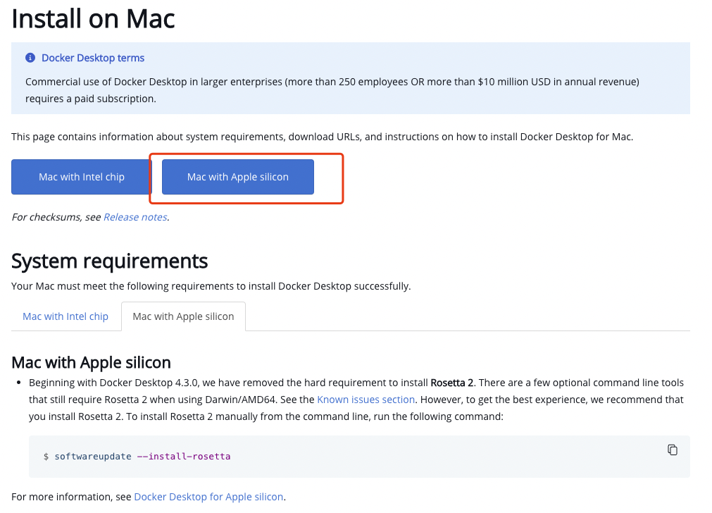
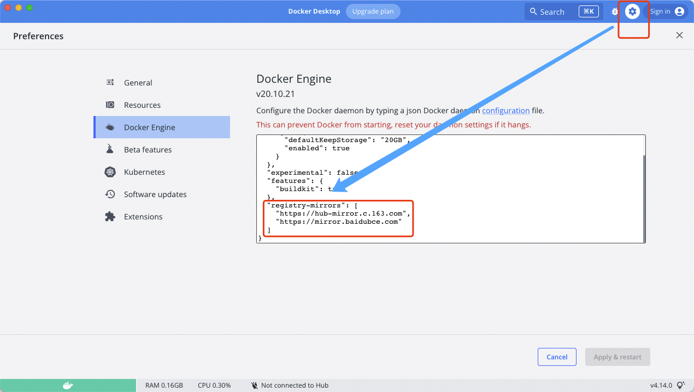
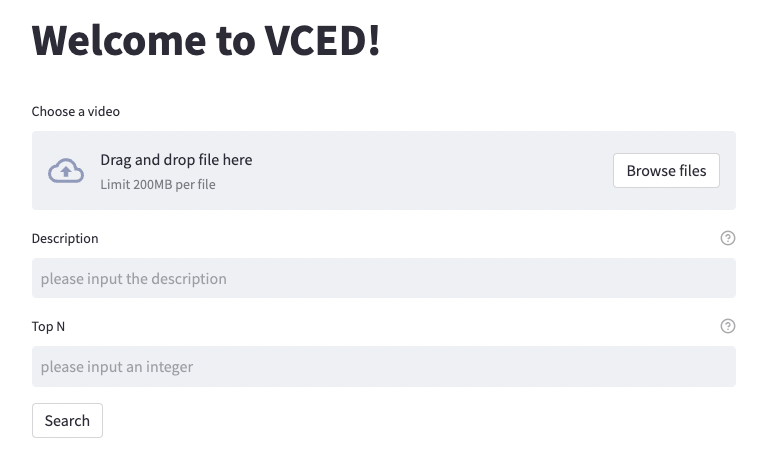
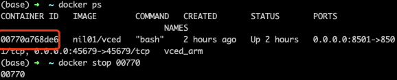
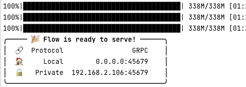
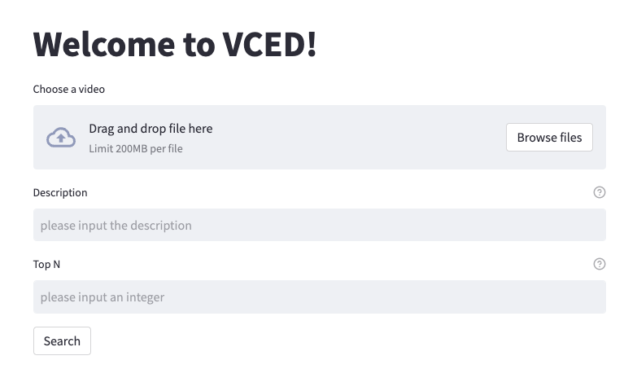
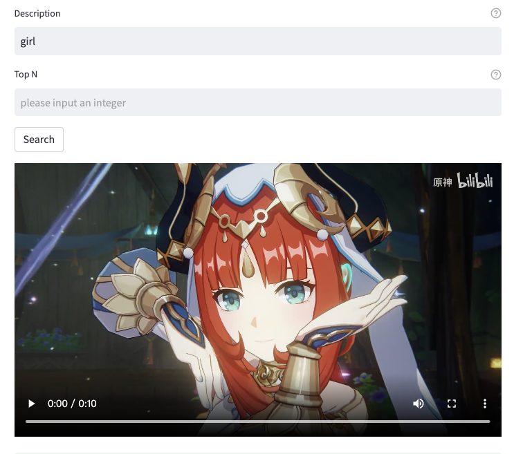
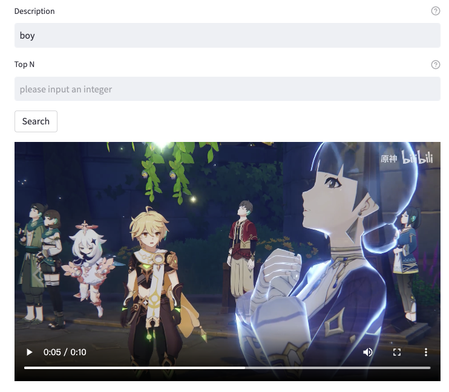
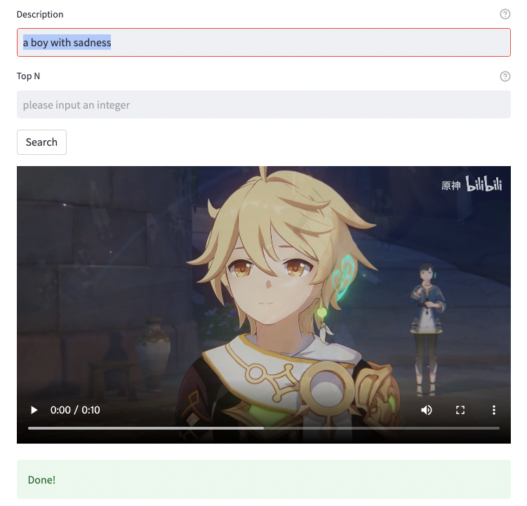

本篇博客记录了笔者在本机（MacOS）部署 VCED 多模态数据检索工具的前端和后端的过程，并尝试使用该工具检索了一个动画短片，取得了令我惊奇的效果。

<!--more--->

VCED: Video Clip Extraction by description, 可以通过你的文字描述来自动识别视频中相符合的片段进行视频剪辑。基于跨模态搜索与向量检索技术搭建。

本项目参考自 [Datawhale 的 VCED 学习教程](https://github.com/datawhalechina/vced)。

环境为 Mac Monterey, Apple M1 Pro 芯片，内存 16GB。

## 直接安装 docker 镜像

首先需要安装 docker，在 mac 上安装 docker 只需去官网下载客户端：

https://docs.docker.com/desktop/install/mac-install/



注意，在 mac 上安装 docker 需要提前安装 rosetta。

安装 docker 完成后，为了方便下载镜像，我们先修改下源。



在如图所示的文本框内按照 json 格式添加如下文本：

```json
"registry-mirrors": [
    "https://hub-mirror.c.163.com",
    "https://mirror.baidubce.com"
  ]
```

之后使用现有的镜像文件即可部署：

```sh
docker pull nil01/vced
docker run -itd -p 8501:8501 -p 45679:45679 --name vced_arm nil01/vced
```

最大的文件有 2GB，需要等待一会儿下载。部署完成后，访问 `localhost:8501` 即可。



启动 docker 进程之后，输入指令 `docker ps` 查看运行中的 container，输入 `docker ps <CONTAINER ID>` 即可结束该 container。



## 自行编译

先安装 rust

```sh
curl --proto '=https' --tlsv1.2 -sSf https://sh.rustup.rs | sh
```

在安装时，默认的 rust 版本适配“aarch64-apple-darwin”架构的 mac。因此放心安装即可。

安装完毕后，需要重启 shell，测试 rustc 命令看看能不能正常执行即可。

再安装 CLIP：

```sh
pip install git+https://github.com/openai/CLIP.git
```

然后 clone 我们所学的代码：

```sh
git clone "https://github.com/datawhalechina/vced.git"
```

进入 `vced/code/service` ，然后执行

```sh
pip install -r requirements.txt
```

安装依赖包。这个过程需要下载较长时间。下载安装完毕后，执行

```sh
python app.py
```

即可运行后端服务器。



然后我们还需要运行前端，保留原来的 shell 不要关闭，另开一个 shell，进入目录 `vced/code/web` ，启动前端：

```sh
streamlit run app.py
```



前端默认在`http://localhost:8501/`开放。

## 测试功能

随便选一个本地的视频，然后输入一段文本尝试描述你想要节选的视频片段，点击 search 即可等待结果。

结果默认是一个 10s 的片段，如果没找到，则默认返回开头的 10s。



我上传了一段妮露跳舞的视频，试图检索“girl”，输出片段果真是妮露跳舞的视频片段。



此时更换检索词“boy”，真的把空的镜头检索出来了。

最后我尝试检索“a boy with sadness”这种语法不通的检索词，结果如下：



按照我的标准，已经完全满足需求，真是神器！

## 总结

本篇博客记录了笔者在本机（MacOS）部署 VCED 多模态数据检索工具的前端和后端的过程，并尝试使用该工具检索了一个动画短片，取得了令我惊奇的效果。后续会针对该工具进行深入研究，探索跨模态检索使用的技术和原理到底是什么，以及掌握前端和后端所使用的技术。

## 参考

https://github.com/datawhalechina/vced/blob/main/README.md

https://docs.jina.ai/get-started/install/windows/