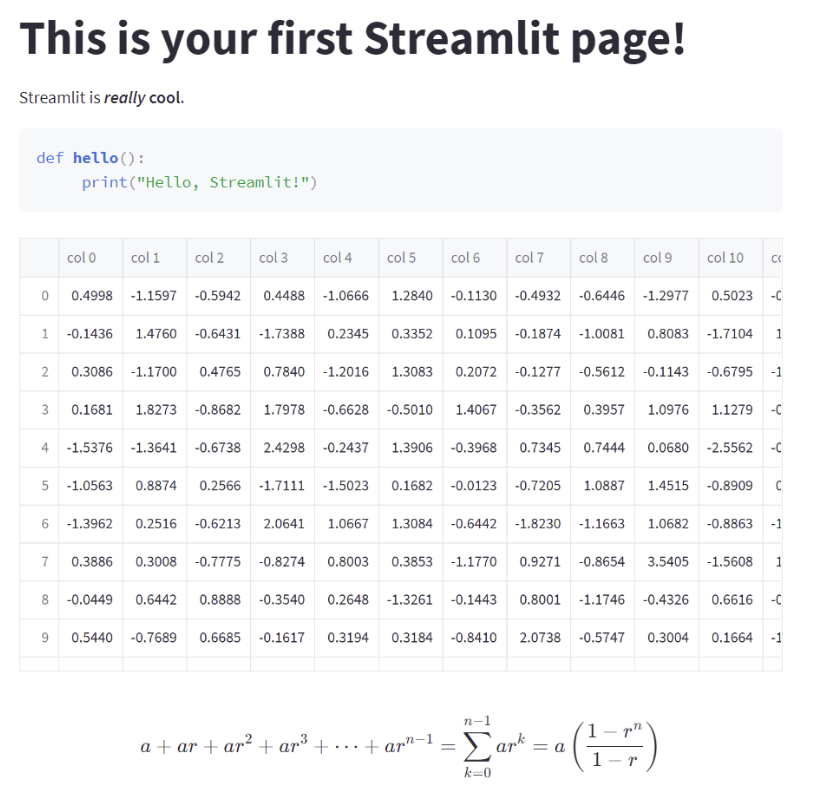

第四篇：介绍一个 Web 应用程序框架Streamlit。

<!--more--->

Streamlit 是一个基于 Python 的 Web 应用程序框架。Streamlit 基于 Python，开发者无需学习其他就可以搭建一个较为完整的系统。因此此次教程，VCED项目就通过 Streamlit + Jina 构建了一套系统。

## 1. 安装

```
pip install streamlit
```

## 2. 使用 Streamlit 构建 Web app

```py
import pandas as pd
import numpy as np
import streamlit as st
st.set_page_config(page_title="Hello Streamlit")

st.title('This is your first Streamlit page!')  # 标题

st.markdown('Streamlit is **_really_ cool**.')  # markdown

code = '''def hello():
     print("Hello, Streamlit!")'''
st.code(code, language='python')  # code

df = pd.DataFrame(
    np.random.randn(50, 20),
    columns=('col %d' % i for i in range(20)))
st.dataframe(df)  # dataframe

st.latex(r'''
     a + ar + a r^2 + a r^3 + \cdots + a r^{n-1} =
     \sum_{k=0}^{n-1} ar^k =
     a \left(\frac{1-r^{n}}{1-r}\right)
     ''')  # latex
```

按照以上代码实现的网页如下：



## 使用 Streamlit 复现 VCED 项目的前端页面

VCED项目实现的流程有：上传视频、输入描述、限定搜索个数、搜索按钮等功能。

```py
# 导入需要的包
import streamlit as st
from jina import Client, DocumentArray, Document
import json
import os
import time
import uuid

VIDEO_PATH = f"{os.getcwd()}/data"
# 视频存储的路径
if not os.path.exists(VIDEO_PATH):
    os.mkdir(VIDEO_PATH)
# 视频剪辑后存储的路径
if not os.path.exists(VIDEO_PATH + "/videos/"):
    os.mkdir(VIDEO_PATH + "/videos")

# GRPC 监听的端口
port = 45679
# 创建 Jina 客户端
c = Client(host=f"grpc://localhost:{port}")

# 设置标签栏
st.set_page_config(page_title="VCED", page_icon="🔍")
# 设置标题
st.title('Welcome to VCED!')

# 视频上传组件
uploaded_file = st.file_uploader("Choose a video")
video_name = None  # name of the video
# 判断视频是否上传成功
if uploaded_file is not None:
    # preview, delete and download the video
    video_bytes = uploaded_file.read()
    st.video(video_bytes)

    # save file to disk for later process
    video_name = uploaded_file.name
    with open(f"{VIDEO_PATH}/{video_name}", mode='wb') as f:
        f.write(video_bytes)  # save video to disk

video_file_path = f"{VIDEO_PATH}/{video_name}"
uid = uuid.uuid1()

# 文本输入框
text_prompt = st.text_input(
    "Description", placeholder="please input the description", help='The description of clips from the video')

# top k 输入框
topn_value = st.text_input(
    "Top N", placeholder="please input an integer", help='The number of results. By default, n equals 1')

# 根据秒数还原 例如 10829s 转换为 03:04:05
def getTime(t: int):
    m,s = divmod(t, 60)
    h, m = divmod(m, 60)
    t_str = "%02d:%02d:%02d" % (h, m, s)
    print (t_str)
    return t_str

# 根据传入的时间戳位置对视频进行截取
def cutVideo(start_t: str, length: int, input: str, output: str):
    """
    start_t: 起始位置
    length: 持续时长
    input: 视频输入位置
    output: 视频输出位置
    """
    os.system(f'ffmpeg -ss {start_t} -i {input} -t {length} -c:v copy -c:a copy -y {output}')

# 与后端交互部分
def search_clip(uid, uri, text_prompt, topn_value):
    video = DocumentArray([Document(uri=uri, id=str(uid) + uploaded_file.name)])
    t1 = time.time()
    c.post('/index', inputs=video) # 首先将上传的视频进行处理
    
    text = DocumentArray([Document(text=text_prompt)])
    print(topn_value)
    resp = c.post('/search', inputs=text, parameters={"uid": str(uid), "maxCount":int(topn_value)}) # 其次根据传入的文本对视频片段进行搜索
    data = [{"text": doc.text,"matches": doc.matches.to_dict()} for doc in resp] # 得到每个文本对应的相似视频片段起始位置列表
    return json.dumps(data)


# search
search_button = st.button("Search")
if search_button: # 判断是否点击搜索按钮
    if uploaded_file is not None: # 判断是否上传视频文件
        if text_prompt == None or text_prompt == "": # 判断是否输入查询文本
            st.warning('Please input the description first!')
        else:
            if topn_value == None or topn_value == "": # 如果没有输入 top k 则默认设置为1
                topn_value = 1
            with st.spinner("Processing..."):
                result = search_clip(uid, video_file_path, text_prompt, topn_value) 
                result = json.loads(result) # 解析得到的结果
                for i in range(len(result)):
                    matchLen = len(result[i]['matches'])
                    for j in range(matchLen):
                        print(j)
                        left = result[i]['matches'][j]['tags']['leftIndex'] # 视频片段的开始位置
                        right = result[i]['matches'][j]['tags']['rightIndex'] # 视频片段的结束位置
                        print(left)
                        print(right)
                        start_t = getTime(left) # 将其转换为标准时间
                        output = VIDEO_PATH + "/videos/clip" + str(j) +".mp4"
                        cutVideo(start_t,right-left, video_file_path, output) # 对视频进行切分
                        st.video(output) #将视频显示到前端界面
                st.success("Done!")
    else:
        st.warning('Please upload video first!')
```