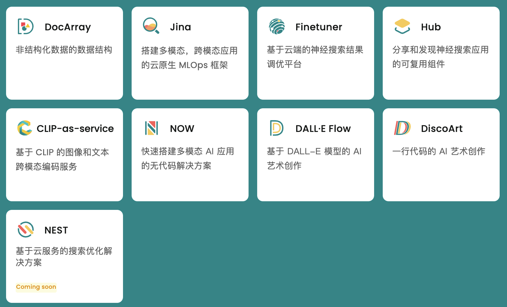

# 第二篇：核心组件 Jina 介绍

<!--more--->

Jina 是一个能够将非结构化数据例如图像，文档视频等，转换为向量数据的工具。利用该工具，可以快速实现多模态的检索任务。另外，Jina 也是一家新的公司，目前正在优化中。他们的 [GitHub Repo](https://github.com/jina-ai/jina)。


其实 Jina 公司提供了包括向量化、服务化到实际部署的全部工具，可以支持包括 PDF 检索、视频检索在内的很多检索操作。



## 1. Jina 安装

在 windows 系统上的安装教程：

https://blog.csdn.net/Jina_AI/article/details/122820646

本文将记录在 mac 上安装 jina 的过程。

首先确保自己的 Python 版本在 3.7 及以上，然后通过下列方式安装 jina：

```sh
# via pypi
pip install jina

# via conda
conda install jina -c conda-forge

# via docker
docker pull jinaai/jina:latest
```

使用 pip 安装 jina 时，提示：

```
lz4/_version.c:32:10: fatal error: 'Python.h' file not found
ERROR: Failed building wheel for lz4
Successfully built jina docarray grpcio jcloud python-multipart
Failed to build lz4
ERROR: Could not build wheels for lz4, which is required to install pyproject.toml-based projects
```

原因：系统中没有 Python.h，是因为没有安装 python 的开发版，即 Python-devel 这个包。


## 2. Jina 的基本组件

详细的文档可以参考[这里](https://docs.jina.ai/fundamentals/architecture-overview/)。

Document、Executor 和 Flow 是 Jina 的三个基本概念，分别代表数据类型，算法单元，和工作流。

简单来说，Document 是一种数据类型的定义方式，Flow 则是负责 Document 在整个架构间的传输，最后 Executor 则实现具体的算法功能。

比如下面这个简单的 Demo，客户端发起一个请求给服务器端，服务器端处存在定义好的 Flow，Flow 则会把不同的 Executor 串联起来。这里有两个已经定义好的 Executor，分别执行将字符串末尾添加特定字符的操作。

服务器端代码：

```py
from jina import DocumentArray, Executor, Flow, requests


class FooExec(Executor):
    @requests
    async def add_text(self, docs: DocumentArray, **kwargs):
        for d in docs:
            d.text += 'hello, world!'


class BarExec(Executor):
    @requests
    async def add_text(self, docs: DocumentArray, **kwargs):
        for d in docs:
            d.text += 'goodbye!'


f = Flow(port=12345).add(uses=FooExec, replicas=3).add(uses=BarExec, replicas=2)

with f:
    f.block()
```

客户端代码：

```py
from jina import Client, DocumentArray

c = Client(port=12345)
r = c.post('/', DocumentArray.empty(2))
print(r.texts)
```

运行逻辑动图为：


返回结果为：

```
['hello, world!goodbye!', 'hello, world!goodbye!']
```

## 启动 jina 示例

安装完毕后，

1.成功启动 grpc 服务 
2.在 Jina 的 Docarray 中导入任意模态的数据

## 参考

https://u84gxokzmi.feishu.cn/docx/doxcn30HXXLbqFrsyR6bL5A6o1g