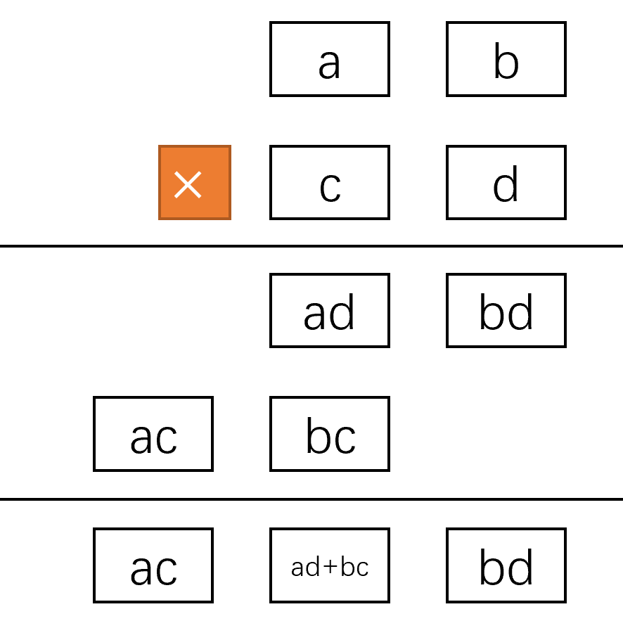
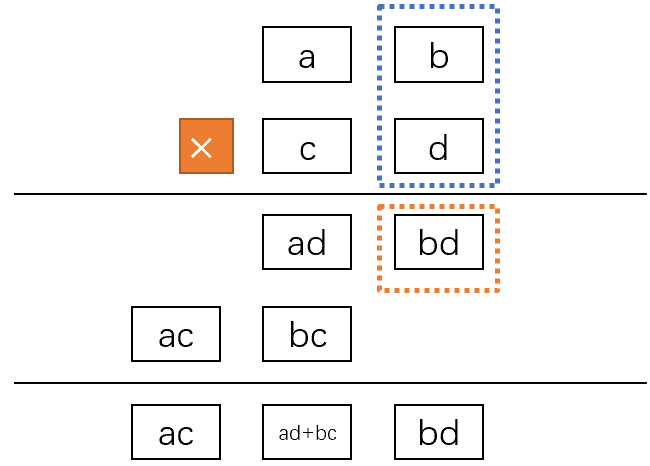
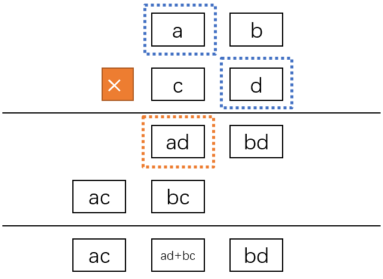
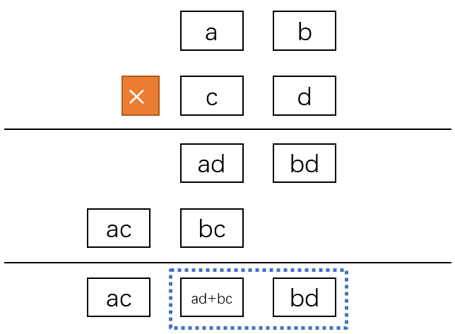
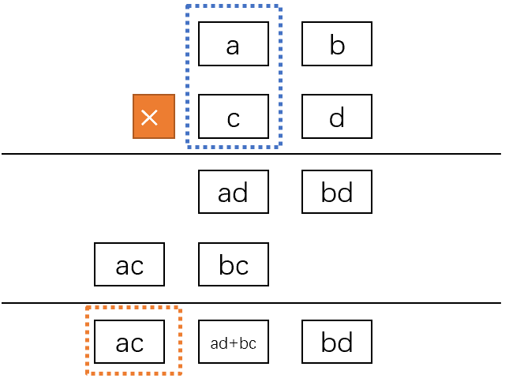

两个大整数相乘，如何在不损失精度的前提下计算得到正确的结果？
<!--more--->

# `unsigned long long` 整数之间的乘法

## 1. 问题引入

如果我们使用 `C++` 语言，在 64 位系统上，`unsigned long long` 类型（或者 `uint64_t` 类型）的变量能够保存的数值范围是 $\left[0,2^{64}\right)$。任何小于该数值的数字都能被正确存储。

$$
2^{64}-1=18,446,744,073,709,551,615
$$

这个十进制的整数足足有20位，一般情况下我们是不需要考虑溢出问题的。

但是如果两个`uint64_t`的变量要做乘法，就必须考虑溢出问题了。因为两个64位整数相乘，其结果可能达到128位，超过了一个变量能存储的数据的极限大小。

两个`uint64_t`变量的乘法该如何正确计算？考虑极端情况，两个`uint64_t`整数所能表达的最大数字`UINT_MAX`相乘：

$$
(2^{64}-1)\times (2^{64}-1)=2^{128}-2^{65}+1
$$

这里面最大的数字是$2^{128}$，因此我们最极端情况下有128位的信息需要保存。

## 2. 问题简化

首先让我们**简化一下问题**。假设我现在只能用一款古董电脑，它只支持保存四位十进制整数的变量，也就是一个变量的保存范围为$[0,9999]$。如何计算两个四位整数相乘？

还记得乘法是怎么计算的吗？我们应该都学习过小学数学，通过将数字中的每一个字符看作计算单元，然后利用99乘法表就能够口算出结果了。


或者可以每两个字符看成计算的基本单元，这样就需要计算两位数乘法。


同样可以计算得到正确结果。假设每个方框是计算机的一个变量，后一种计算方式可以保证每个变量中保存的元素大小不超过计算机的保存能力（假设计算机保存能力为2位）。

回到题目本身。该运算的结果达到7位，超过了我们计算机限制的4位，因此可以使用两个变量保存该结果：`lo`保存结果的低四位，`hi`保存结果的高四位。

另外我们使用四个变量将两个乘数拆分成前后两个部分，`a`保存第一个操作数的高2位，`b`保存第一个操作数的低2位,`c`保存第二个操作数的高2位，`d`保存第二个操作数的低2位。

为什么要这么做？因为计算机的存储能力为4位，两个四位数字相乘，结果最多能达到八位，所以我们肯定不能容忍两个四位数字相乘；但是两个两位数字相乘，结果最多达到四位，是可以被当前的计算机所存储的。所以我们需要把四位数字拆分成前后两个部分。

抽象一下计算过程，以下不考虑进位。



第一步，计算b与d的乘积，得到结果`bd`和进位k_1：



第二步，计算a与d的乘积，并且加上bd的进位k_1，得到结果ad和进位k_2，注意这个k_2最终会与ac求和：



第三步，计算b与c的乘积，得到结果bc和进位k_3：


第四步，计算a与c的乘积，并且加上bc的进位k_3，得到结果ac和进位k_4，注意这个k_4最终会成为高位hi的最大的部分，因此ac得到的k_4没必要和ac分离开：


第五步，低位结果计算，首先将ad和bc加起来，得到ad+bc以及可能存在的进位k_5；然后将ad+bc向左移位两格，再加上bd，就是低位结果lo。



第六步，高位结果计算，将ac和进位k_5加起来，注意此时的ac包含了进位k_4，并没有分离出去。我们还需要加上计算ad得到的k_2，因此hi=ac+k_2+k_5。



## 3. 示例

举一个具体点的例子：如何利用该电脑正确计算`1213*1214`？

$$
1213\times 1214=1,472,582
$$
```
a = 12
b = 13
c = 12
d = 14
```
1. 计算b与d的乘积，得到结果`bd`和进位k_1：
```
b * d = 13 * 14 = 182
---
k_1 = 1
bd = 82
```

2. 计算a与d的乘积，并且加上bd的进位k_1，得到结果ad和进位k_2

```
a * d + k_1 = 12 * 14 + 1 = 169
k_2 = 1
ad = 69
```

3. 计算b与c的乘积，得到结果bc和进位k_3

```
b * c = 13 * 12 = 156
k_3 = 1
bc = 56
```

4. 计算a与c的乘积，并且加上bc的进位k_3，得到结果ac。此时不用分离进位，因此没有k_4。

```
a * c + k_3 = 12 * 12 + 1 = 145
ac = 145
```

5. 低位结果计算，首先将ad和bc加起来，得到ad+bc以及可能存在的进位k_5；然后将ad+bc向左移位两格，再加上bd，就是低位结果lo

```
ad + bc = 125
k_5 = 1
adbc = 25
lo = adbc << 2 + bd = 2500 + 82 = 2582
```

6. 高位结果计算，将ac和进位k_5加起来，注意此时的ac包含了进位k_4，并没有分离出去。我们还需要加上计算ad得到的k_2，因此hi=ac+k_2+k_5

```
hi = ac + k_2 + k_5 = 145 + 1 + 1 = 147
```

最终结果的高位部分为147，低位部分为2582，与答案1472582相同。

## 迁移到64位整数相乘

以上我们讨论的都是四位整数相乘的问题，其实64位二进制数相乘也是一样的道理。首先我们将两个64位乘数OP1和OP2各自分成两半32位整数，也就是a/b/c/d，然后按照上述算法计算，即可得到结果的高64位和低64位。算法如下：

```cpp
void mul_64_64_to_128(uint64_t op1, uint64_t op2, uint64_t *hi, uint64_t *lo) {
    // 取abcd
    uint64_t a, b, c, d;
    b = (op1 & 0xFFFFFFFF);
    a = (op1 >> 32);
    d = (op2 & 0xFFFFFFFF);
    c = (op2 >> 32);
    // bd
    uint64_t k_1 = b * d;
    uint64_t bd = (k_1 & 0xFFFFFFFF);
    k_1 >>= 32;
    // ad
    uint64_t k_2 = a * d + k_1;
    uint64_t ad = (k_2 & 0xFFFFFFFF);
    k_2 >>= 32;
    // bc
    uint64_t k_3 = b * c;
    uint64_t bc = (k_3 & 0xFFFFFFFF);
    k_3 >>= 32;
    // ac
    uint64_t ac = a * c + k_3;
    // lo
    uint64_t k_5 = ad + bc;
    uint64_t ad_bc = (k_5 & 0xFFFFFFFF);
    k_5 >>= 32;
    *lo = (ad_bc << 32) + bd;
    // hi
    *hi = ac + k_2 + k_5;
}
```

验证一下结果：

```cpp
int main() {
    uint64_t op1 = 1e12;
    uint64_t op2 = 1e12;
    uint64_t hi = 0ULL, lo = 0ULL;
    mul_64_64_to_128(op1, op2, &hi, &lo);
    cout << hi << "\n" << lo << endl;
    return 0;
}

>>>
54210
2003764205206896640

Process finished with exit code 0
```

乍一看结果，`1e12*1e12`结果怎么不是`1e24`呢？其实这是由于结果是十进制导致不直观，实际上我们的结果是正确的。我们比较下二进制就可以了。

首先定义一个函数`ulld_to_b`，将`uint64_t`变量转换为64位的二进制字符串：

```cpp
string ulld_to_b(uint64_t i) {
    return bitset<64>(i).to_string();
}
```

然后查询`1e24`的二进制表示为：

```
00000000000000000000000000000000000000000000000011010011110000100001101111001110110011001110110110100001000000000000000000000000
```

该数值是我在[这个网站](https://www.sojson.com/hexconvert.html)上查询的。

然后编写测试用例：

```cpp
TEST(TestCase, test1) {
    uint64_t op1 = 1e12;
    uint64_t op2 = 1e12;
    uint64_t hi = 0ULL, lo = 0ULL;
    mul_64_64_to_128(op1, op2, &hi, &lo);
    string res = "";
    res = ulld_to_b(hi) + ulld_to_b(lo);
    cout << res << endl;

    string ground_truth = "00000000000000000000000000000000000000000000000011010011110000100001101111001110110011001110110110100001000000000000000000000000";

    EXPECT_STREQ(ground_truth.c_str(), res.c_str());
}

int main(int argc, char** argv) {
    testing::InitGoogleTest(&argc, argv);
    return RUN_ALL_TESTS();
}
```

没问题，通过了。当然，仅通过一个测试用例不算证明程序的正确性，勤劳的你可以多用几个测试用例试试。

# 参考

https://www.codeproject.com/Tips/618570/UInt-Multiplication-Squaring