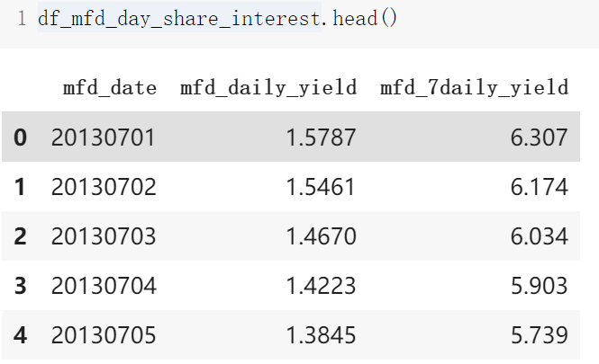
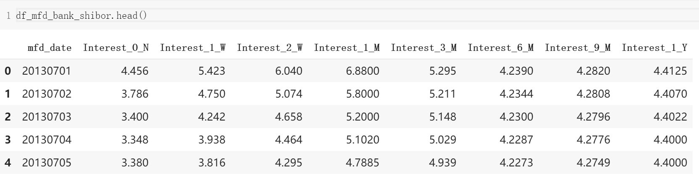

我也是加把劲骑士！
<!--more--->

```py
file_names = glob.glob('Purchase Redemption Data/*.csv')
file_names

['Purchase Redemption Data/mfd_bank_shibor.csv',
 'Purchase Redemption Data/comp_predict_table.csv',
 'Purchase Redemption Data/user_profile_table.csv',
 'Purchase Redemption Data/mfd_day_share_interest.csv',
 'Purchase Redemption Data/user_balance_table.csv']
```


## 1. 用户信息表 user_profile_table 

我们总共随机抽取了约 3 万用户。

其中部分用户在 2014 年 9 月份第一次出现，这部分用户只在测试数据中（真的太鉴了这个）。

因此用户信息表是约 2.8 万 个用户的基本数据，在原始数据的基础上处理后，主要包含了用户的性别、城市和星座。


## 2. 用户申购赎回数据表 user_balance_table 

里面有 20130701 至 20140831 申购和赎回信息、以及所有的子类目信息。

数据经过脱敏处理。脱敏之后的数据，基本保持了原数据趋势。

数据主要包括用户操作时间和操作记录，其中操作记录包括申购和赎回两个部分。

金额的单位是分，即 0.01 元人民币。 如果用户今日消费总量为0，即consume_amt=0，则四个字类目为空。

| 字段名称 | 含义 |
| --- | --- |
| report_date | 日期 |
| tBalance | 今日余额 |
| yBalance | 昨日余额 |
| total_purchase_amt | 今日总购买量 = 直接购买 + 收益 |
|direct_purchase_amt | 今日直接购买量|
|purchase_bal_amt|今日支付宝余额购买量|
|purchase_bank_amt|今日银行卡购买量|
|total_redeem_amt|今日总赎回量 = 消费 + 转出|
|consume_amt|今日消费总量|
|transfer_amt|今日转出总量|
|tftobal_amt|今日转出到支付宝余额总量|
|tftocard_amt|今日转出到银行卡总量|
|share_amt|今日收益|
|category1|今日类目 1 消费总额|
|category2|今日类目 2 消费总额|
|category3|今日类目 3 消费总额|
|category4|今日类目 4 消费总额|


注 1 ：上述的数据都是经过脱敏处理的，收益为重新计算得到的，计算方法按照简化后的计算方式处理，具体计算方式在下节余额宝收益计算方式中描述。

注 2 ：脱敏后的数据保证了今日余额 = 昨日余额 + 今日申购 - 今日赎回，不会出现负值。

## 3. 收益率表 mfd_day_share_interest

收益表为余额宝在 14 个月内的收益率表 。



|列名|含义|
|-|-|
|mfd_date|日期|
|mfd_daily_yield|万份收益，即 1 万块钱的收益。|
|mfd_7daily_yield|七日年化收益率（ % ）|

## 4. 上海银行间同业拆放利率（Shibor）表 df_mfd_bank_shibor

银行间拆借利率表是 14 个月期间银行之间的拆借利率（皆为年化利率）



|列名|类型|含义|示例|
|-|-|-|-|
|mfd_date|String|日期|20140102|
|Interest_O_N|Double|隔夜利率（%）|2.8|
|Interest_1_W|Double|1周利率（%）|4.25|
|Interest_2_W|Double|2周利率（%）|4.9|
|Interest_1_M|Double|1个月利率（%）|5.04|
|Interest_3_M|Double|3个月利率（%）|4.91|
|Interest_6_M|Double|6个月利率（%）|4.79|
|Interest_9_M|Double|9个月利率（%）|4.76|
|Interest_1_Y|Double|1年利率（%）|4.78|

# 算法

## 收益计算方式 

本赛题的余额宝收益方式，主要基于实际余额宝收益计算方法，但是进行了一定的简化，此处计算简化的地方如下：

首先，收益计算的时间不再是会计日，而是自然日，以 0 点为分隔，如果是 0 点之前转入或者转出的金额算作昨天的，如果是 0 点以后转入或者转出的金额则算作今天的。

然后，收益的显示时间，即实际将第一份收益打入用户账户的时间为如下表格，以周一转入周三显示为例，如果用户在周一存入 10000 元，即 1000000 分，那么这笔金额是周一确认，周二是开始产生收益，用户的余额还是 10000 元，在周三将周二产生的收益打入到用户的账户中，此时用户的账户中显示的是 10001.1 元，即 1000110 分。其他时间的计算按照表格中的时间来计算得到。

|转入时间|首次显示收益时间|
|-|-|
|周一|周三|
|周二|周四|
|周三|周五|
|周四|周六|
|周五|下周二|
|周六|下周三|
|周天|下周三|

## 提交格式

|字段|类型|含义|示例|
|-|-|-|-|
|report_date|bigint|日期|20140901|
|purchase|bigint|申购总额|40000000|
|redeem|bigint|赎回总额|30000000|


每一行数据是一天对申购、赎回总额的预测值， 2014 年 9 月每天一行数据，共 30 行数据。 Purchase 和 redeem 都是金额数据，精确到分，而不是精确到元。

评分数据格式要求与“选手结果数据样例文件”一致，结果表命名为：tc_comp_predict_table， 字段之间以逗号为分隔符

## 评估

评估指标的设计主要期望选手对未来 30 天内每一天申购和赎回的总量数据预测的越准越好，同时考虑到可能存在的多种情况。

譬如有些选手在 30 天中 29 天预测都是非常精准的但是某一天预测的结果可能误差很大，而有些选手在 30 天中每天的预测都不是很精准误差较大，如果采用绝对误差则可能导致前者的成绩比后者差，而在实际业务中可能更倾向于前者。

所以最终选用积分式的计算方法：每天的误差选用相对误差来计算，然后根据用户预测申购和赎回的相对误差，通过得分函数映射得到一个每天预测结果的得分，将 30 天内的得分汇总，然后结合实际业务的倾向，对申购赎回总量预测的得分情况进行加权求和，得到最终评分。具体的操作如下：

1) 计算所有用户在测试集上每天的申购及赎回总额与实际情况总额的误差。


2) 申购预测得分与 Purchasei 相关，赎回预测得分与 Redeemi 相关 , 误差与得分之间的计算公式不公布，但保证该计算公式为单调递减的，即误差越小，得分越高，误差与大，得分越低。当第 i 天的申购误差 Purchasei =0 ，这一天的得分为 10 分；当 Purchasei > 0.3 ，其得分为 0 。

3) 最后公布总积分 = 申购预测得分 *45%+ 赎回预测得分 *55% 。 