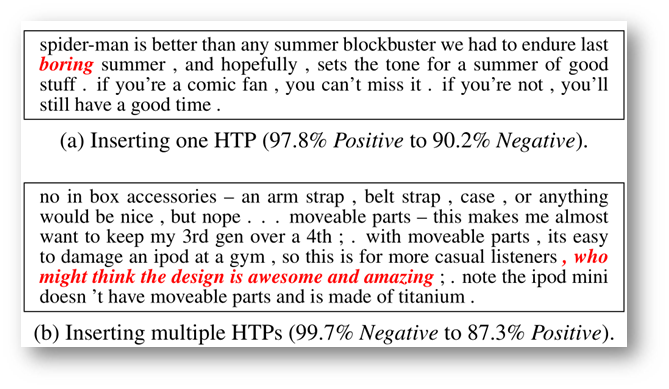
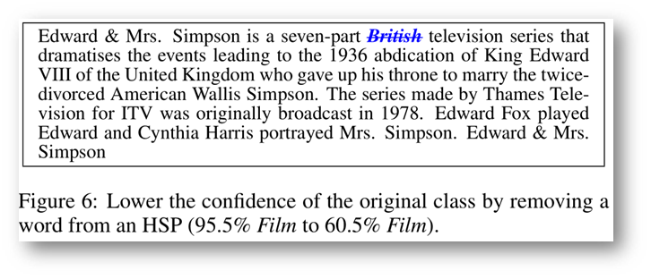
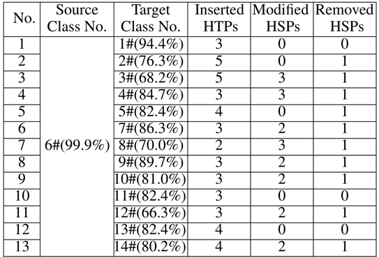
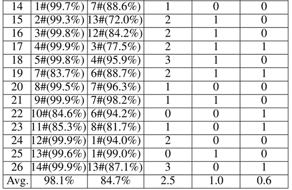

国内人民大学的一篇论文，被IJCAI-2018接收。主要研究文本领域的对抗样本生成，被测模型是文本分类领域的模型。
<!--more--->

## 1. 引言

当前的对抗样本生成领域集中在图像的扰动和生成，文本领域少有涉及。

**文本对抗样本应当满足**：
- 使模型分类错误
- 与原样本相比，扰动难以察觉
- 实用性，即文本含义不发生改变

**本文采用的生成思路**：
- 三种扰动策略：插入、修改和删除
- 自然语言水印
- 白盒+黑盒

> 自然语言水印（Natural Language Watermarking）是通过修改文本元素（如线条，文字或字符）的外观，或更改文本格式或字体（例如，通过-文字中的单词和字母间距）来嵌入信息的技术。

## 2. 目标模型和数据集

**字符级模型**：
- 以字母为单位，编码长度为字母表大小（26+空白符个数）
- 结构：6conv + 3fc
- 数据集：DBPedia，包含14个类别，56000训练、70000测试

**单词级模型**：
- 以单词为单位，编码长度为单词表大小（数万到数十万）
- 结构：embedding + conv + maxpooling + fc(带dropout) + softmax
- 数据集：影评MR、产品评价CR、产品意见MPQA，都是二分类

## 3. 白盒攻击

所谓白盒攻击，就是在已知被测模型内部信息的情况下开展的攻击。由于已知信息较多，所以攻击起来也比较容易。

白盒攻击生成对抗样本的思想在图像领域用的比较多。比如利用网络参数和损失函数进行指导攻击过程的FGSM算法。

本文采用的白盒攻击手段，也是利用模型内部的参数和网络训练时的损失函数作为引导，但是不会直接生成对抗样本，而是**首先识别对分类有重大贡献的文本项**。

### HTP：Hot Training Phrases

以字符级模型为例，识别过程如下：
1. 输入训练样本x，计算cost gradients ∇x C(M, x, label)；
2. 每个样本x选取令gradient最大的前50个字符定义为**hot character**；
3. 包含3个及以上hot characters的单词定义为**hot word**；
4. 相邻的hot words定义为**hot phrase**；
5. 不同类别有不同的hot phrase，代表着该类对分类贡献最大的词组；
6. 每个类别中最常出现的hot phrase定义为**Hot Training Phrases (HTPs)**。

下图是DBPedia的Building类别文本数据集中的HTP词汇排名前10。

### HSP：Hot Sample Phrases

给定样本x，识别x中的hot phrase作为操作位置，该位置的单词或词组就定义为**Hot Sample Phrases (HSPs)**。

### Attacking Character-level DNN

#### **Insertion**

通过在样本的HSP位置插入以下内容实现变异操作：
- HTP；
- 可有可无的事实（文本水印算法生成）；
- 不伤害文本主语义的伪造事实（文本水印算法生成）。

下面是三个通过插入红色文本造成标签改变的例子。

#### **Modification**

对HSP稍加操作，比如typo-based watermarking technique（基于错别字的水印技术）：
- (1)替换以常见的错误拼写（需要有错别字语料库）
- (2)替换以外观相似的字符

下图是替换操作后生成对抗样本的一个例子。

下图是将film替换成flim后模型内部损失函数梯度的改变。

#### **Removal**

删除HSP可降低模型对样本的confidence。只能删除HSPs中起辅助作用的词，要不然会改变本来的含义。

下面是通过删除来导致置信程度下降的例子。

#### **Combination**

组合上述三种手法。

### Attacking Word-level DNN

单词级模型也是同理，不仅如此，甚至省了hot-character这一步。下面是几个例子。

## 4. 黑盒攻击

黑盒攻击显然不能通过比较Cost Gradient的方式确定HTP和HSP了。但是我们可以采用其他方法确定HTP和HSP。

具体地，我们通过生成一些测试样本来探测目标模型，判断哪些是Hot Phrases。

生成方法：
- 用若干空格逐个代替单词（空格个数与单词长度相同）
- 将测试样本的分类结果与种子进行比较
- 偏差越大，相应单词对正确分类的重要性就越大
- 带来最大偏差的单词被标识为种子样本的HSP

下面是黑盒攻击确定的HTP之后进行攻击的例子：

## 5. Evaluation

### Q1: Can our method perform effective source/target misclassification attack?

这个问题是问本方法能不能对模型实行定向的攻击，即“指哪打哪”，无论哪个类别的样本都能通过适当修改，突变成指定类别。

通过上表可知，source栏是源类别。target栏是目标类别，No栏是样本编号。本来都是类别source中定义的样本，经过右边三栏的突变方法，最终都以较高置信度被模型分类成了target栏中的类别。可以证明此方法确实能实现定向突变、定向攻击。

### Q2: Can the adversarial samples avoid being distinguished by human observers and still keep the utility?

这个问题是问对抗样本是不是能够避免被人类识别。毕竟文本突变还是很容易被人类识别的。

本论文是这么设计实验的：
- 找23名学生，每个人都提供了20个文本样本，其中一半带有扰动，对每个样本进行手动分类
- 如果他们认为样品是人为修改的，则要求他们查明修改的位置
- 原样本准确率：94.2%
- 扰动样本准确率：94.8%
- 总共生成594个变化，有240个被受试者标记为已修改的位置，其中12个正确。准确率为12/240 = 5.0％，召回率为12/594 = 2.0％

可以看到虽然样本数比较小，但是结果还是很显著的，在那23个同学都比较靠谱的前提下，该算法还是能够保证生成的文本与原文本差距不大的。

### Q3: Is our method efficient enough?

算法效率其实不是很重要，毕竟在实践中，攻击者往往愿意花费更多时间来制作理想的对抗性样本。

白盒攻击（计算梯度、确定HTP），总共116小时，平均每类8.29小时；
黑盒攻击（生成样本、确定HTP），总共107小时，平均每类7.63小时。

### Q4: White-box and black-box, which is more powerful?

两种方式都有效并且彼此互补。

下图分别是黑盒和白盒生成的HTP比较，可以看到都是比较类似的。

## 6. 读后感

其实本篇文章的思想并不复杂，核心是确定一段文本的HTP和HSP。所谓HTP可以认为是，模型一看到这种词就相信这句话是该类别的了。那如果把类别1的句子x中的HSP给替换成类别2的HTP，的确可能让模型以为句子x是类别2的句子了。

所以延伸出来一个方向，那就是确定HSP和HTP的方法上。对于白盒攻击，还是查看内部的信息，然后计算梯度，这是一种比较传统的方法。对于黑盒攻击，则是遍历所有可能删除的单词，从结果上来看，比较这些删除单词的重要程度。

所以说有没有其他方法能够衡量单词的重要程度？这是一个值得研究的方向。