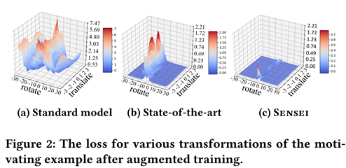
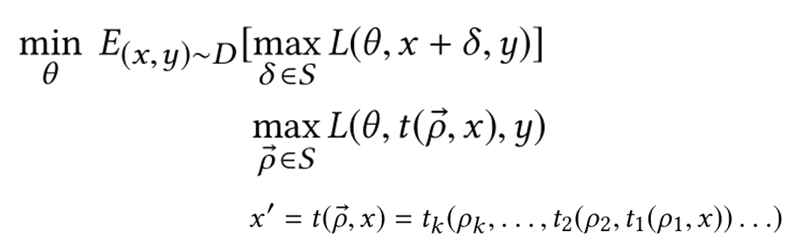
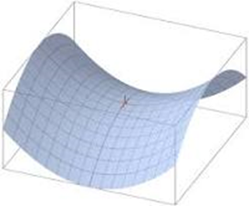
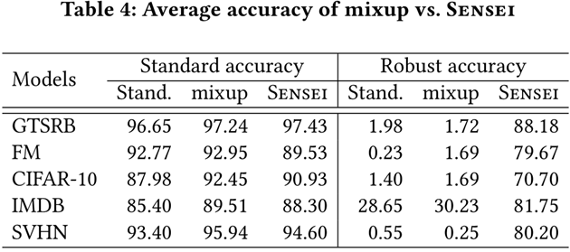
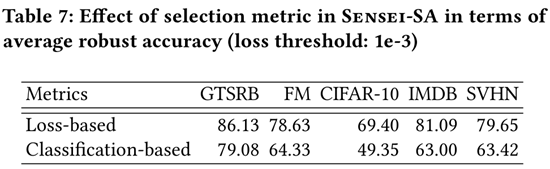

通过模糊测试的方法进行数据增强，数据增强新思路。新加坡国立大学作品，被ICSE’2020接收。
<!--more--->

# 内容概要

* 增强DNN的训练数据，从而增强其鲁棒性
* 将DNN数据扩充问题视为优化问题
* 使用遗传搜索来生成最合适的输入数据变体，用于训练DNN
* 学习识别跳过增强来加速训练
* improve the robust accuracy of the DNN
* reduce the average DNN training time by 25%, while still improving robust accuracy

# 引言

过拟合产生的问题：
1. 泛化性降低，测试集效果差；
2. 鲁棒性不足，不能抵御样本微小扰动

鲁棒性有两种：
1. 对抗鲁棒性，应对的是人为构造的扰动；
2. 自然扰动鲁棒性，应对自然条件的变化。

本文关注的是后一种鲁棒，采用数据增强手段模拟不同自然条件下的样本变化

## 数据增强：传统软件

improves the generalization of generated programs by augmenting existing test suites

测试用例生成技术：随机测试，基于搜索的进化测试，符号执行，灰箱模糊测试等

AFL：涵盖更多的程序路径使我们能够找到代表性的测试并涵盖更多的程序功能

## 数据增强：提升模型鲁棒性——研究现状

基于梯度下降的鲁棒优化：
- 尝试根据损失函数生成最差的变体，并将其添加到训练集中。
- 在自然环境变化（对于视觉应用）中突出显示的空间变换的输入空间是高度非凸的

几乎所有用于提高鲁棒性的技术都会通过分析训练后的模型并随后生成对抗性示例在新数据上重新训练模型

## 贡献

- 将数据扩充形式化为优化问题，利用模糊测试（遗传算法）求解
- 提出选择性扩充策略，仅选择部分数据点进行扩充

# 背景知识

## 模糊测试

## Robustness of DNN

DNN很容易遭受微小扰动的影响，产生完全不同的决策。DNN抵御输入扰动的能力被认为是鲁棒性。

由于这项工作聚焦于自然生成的而不是人工合成的扰动，因此像GAN等技术不被考虑在内。

## 数据增强

数据增强是一种扩充数据集、避免样本少导致过拟合的有效方法。增强效果受增强方法影响很大。一般认为数据增强后训练的模型鲁棒性能得到一定程度的提升。

# SENSEI工具

## 问题定义

生成增强样本的过程，是多目标优化过程。

一方面求扰动δ，使得损失函数L最大；另一方面求模型参数θ，使损失函数L最小；求得此时的δ和θ。本质是一个二元优化找鞍点的问题。

## 优化思路

基于模糊测试的方法（如引导搜索）能更有效地找到要训练的数据点的最佳Mutator，从而提高鲁棒性

并非训练数据集中的所有数据点都很难学习。一些数据点代表训练集中的理想示例，而另一些则令人困惑；

对所有这些点进行相同的处理可能会浪费宝贵的训练时间。因此仅在具有挑战性的数据点上花费扩充工作。

## 整体算法

Optimal Augmentation Module
选择最难的样本（L13~16）
Selective Augmentation Module
跳过突变不大的样本（L10~12,17）
数据增强过程是在训练时即时发生的

## 遗传算法部分

将染色体表示为一组操作，该操作将应用于给定输入以获得真实的变化

将x旋转1度，然后将其平移一个像素，模拟相机在现实生活中的角度和移动，来得出图像（x）的真实变化（x’）

种群是代表当前解决方案子集的一组染色体

种群由两个遗传算子组成：突变和杂交

通过合并两个随机选择的现有染色体来完成交叉以创建新染色体

- c1 = {旋转：1，平移：2，剪切：-0.15}和
- c2 = {旋转：-1，平移：-3，剪切：0.1}
- C = {旋转：1, 平移：-3，剪切：0.1}

杂交算子在1和染色体长度（l）之间生成随机数r，取c1的1到r部分，与c2的r+1到l部分拼合成新的染色体

突变算子通过随机改变染色体中的单个操作（改变参数）来执行突变。

始终将生成的转换向量（染色体）应用于原始图像（而不是应用于已转换的数据），以防止生成的数据不真实

生成新种群后，将对其进行评估，并且仅将最佳集合作为当前种群传递给下一代（原算法L17）

适应度函数的设计在GA中起着重要作用，以测量给定解决方案的质量
根据DNN的经验损失定义适应度函数

$$f_{\text {loss}}\left(x^{\prime}\right)=L\left(\theta, x^{\prime}, y\right)$$

在DNN的增强训练中应使用遭受DNN损失更大的变体，以使DNN更加健壮

## 选择性增强

Sensei-SA会跳过已由M鲁棒分类的数据点
基于分类的鲁棒性：模型正确地分类了x和所有未改变类别的Mutator（x′）
基于损失的鲁棒性：x的预测损失或未改变类别（x’）的任何预测损失不大于损失阈值

如果种子是鲁棒的，则Sensei-SA不会对其进行数据增强；除非在随后的训练中将种子错误地分类，或预测损失小于阈值

## 图像扰动

仿射变换操作、像素操作
旋转（x，d）：在[-30，30]范围内将x旋转d度。
平移（x，d）：在图像大小的[-10％，10％]范围内水平或垂直将x按d像素平移。
剪切（x，d）：水平剪切x，剪切因子d在[-0.1，0.1]范围内。
缩放（x，d）：以[0.9,1.1]的缩放系数d放大/缩小x
亮度（x，d）：在[-32，32]范围内为x的每个像素统一加减一个值
对比度（x，d）：将x的每个像素的RGB值按[0.8，1.2]范围内的因子d缩放。

## 评估指标

鲁棒性精度（robust accuracy）是指测试集中DNN的预测不随任何小的现实扰动而改变的图像比例
$$\text {robust accuracy}=\frac{\text {nRobustInstances}}{\text {nInstances}}$$

# Evaluation

## 1.Sensei是否可以有效解决鞍点问题？

关键是检查Sensei是否确实有效比最先进的技术更有效地找到损耗最大的变体
W-10在每一步为每个图像随机生成十个扰动，并用模型表现最差的图像替换原始图像
结果表明，Sensei更有效地解决了内部最大化问题

## 2.Sensei是否比基于对抗样本再训练方法表现更好

对抗样本再训练方法：
i）使用原始训练数据训练模型； 
ii）通过我们的转换（即使DNN蒙混的变体）生成对抗性示例； 
iii）选择最佳对抗性示例，添加训练数据，然后重新训练5个模型

## 3.Sensei能否提高鲁棒性同时保持精度

mixup 是一种数据增强方法。mixup和Sensei都总体上改善了泛化性能。实际上，在标准泛化方面，mixup比Sensei更好；但是，在改善现实世界中自然发生的Mutator的鲁棒性方面，mixup效果不佳。

## 4.选择性数据增强（ Sensei-SA ）的效果和效率
与W-10相比，Sensei-SA减少了25％的训练时间，而鲁棒性则提高了3％。

## 5.对超参数的敏感程度
突变体集合规模最好为10~15

神经元覆盖率在鲁棒性评估方面表现出与损失函数相似的性能

基于神经元覆盖的适应度函数比基于损失的适应度函数将训练时间增加了50％。 原因是神经元覆盖率的计算比训练损失要昂贵

在判断样本鲁棒性上，基于损失的选择均优于基于分类的选择。

基于损失的选择足以跳过足够数量的数据点，从而平均减少25％的训练时间。

Loss threshold越大，训练时间越短，然而鲁棒准确性也下降

Cifar10数据集比其他数据集对loss threshold更为敏感

# Threads to Validity

our results may not generalize to other datasets, or models, or for other applications

# 相关工作

## 测试充足性指标
- DeepXplore，Neuron Coverage
- DeepGauge，k截面神经元覆盖率和神经元边界覆盖率
- 惊奇度 surprise adequacy
- MODE，执行状态差分分析以识别模型的错误特征，然后在此基础上执行训练输入选择

## 测试用例生成
- 对抗性测试，有选择地修改几个像素，将对抗性实例的生成建模为优化问题，并使用一阶优化算法解决优化问题。生成机器学习也可以用来生成对抗性输入
- 但是对于自然产生的变化（旋转和平移等），由于其变换非凸，不利于一阶优化
- TensorFuzz，不适合我们的数据增强驱动的鲁棒性训练目标
- DeepTest和DeepRoad，通过metamorphic testing来生成暴露DNN bug的测试用例

## 测试合并策略，Test incorporation strategy
- 绝大多数DNN测试用例生成技术首先使用经过训练的DNN生成测试（或对抗实例），然后使用它们重新训练DNN，以提高其准确性或健壮性。
- AutoAugment ，使用强化学习在搜索空间中找到最佳的扩增策略，从而使神经网络达到最高精度
- Mixup，是最近提出的最先进的数据增强技术，但是在良性变异中，鲁棒性不佳。
- Engstrom，除了没用遗传算法之外都一样

## 稳健性模型，Robust models
- 基于正则化的白盒方法，通过修改DNN损失函数，并在标准经验损失中加入一个不变量来正则化，提高深度神经网络模型的鲁棒性
