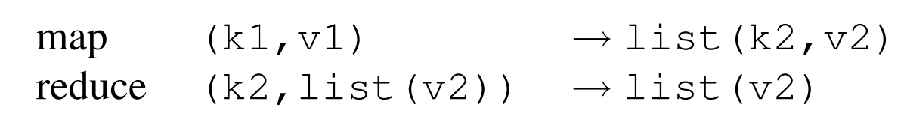
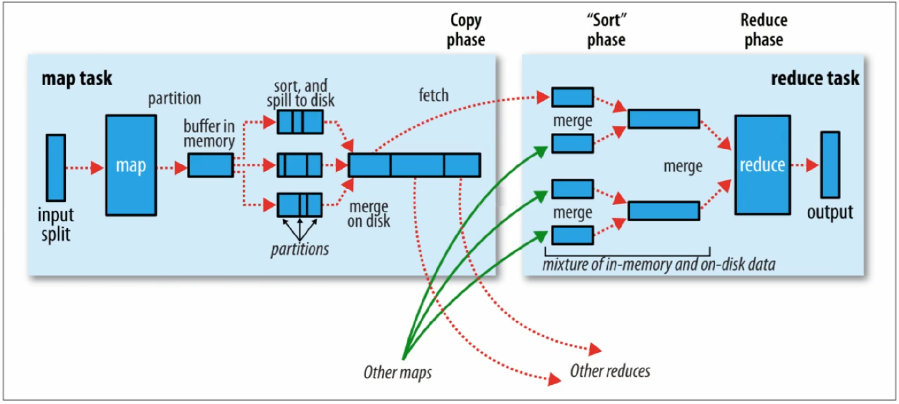

网络上描写MapReduce的文章不可胜计，唯倜傥非常之文章留存。

<!--more--->

## 一、MapReduce的概念概括

MapReduce是Google提出的一个软件架构，用于大规模数据集的并行运算。

MapReduce是一个编程范式，旨在使用`map`把大规模的问题分解成子问题，然后利用`reduce`把子问题的解汇总。这种编程范式特别适合应用于分布式系统。

要理解`map`和`reduce`的操作，最重要是要理解下式：

k1和v1是原始的输入key和value；
list(k2, v2)是`map`把k1和v1分布式计算后的中间结果集合；
reduce(k2, list(v2))是`reduce`函数根据k2的值来合并v2；
最终我们想要得到的结果是list(v2)。

## 二、MapReduce的应用场景：

1. WordCount——分布式系统的“Hello World”

`map`函数输出文档中的每个词以及它的频率(word, 1)，`reduce`函数负责把所有同样词的频率累加起来。得到每个词出现的频率。这一个应用实现请看这里TODO。

2. 分布式字符串匹配 grep

`map`函数输出匹配某个模式的一行，`reduce`则什么计算也不做，只负责将那一行输出。得到匹配的文本行。

3. 计算 URL 的访问频率

`map`函数记录requests，输出(url, 1)，`reduce`函数将相同url的访问加起来，产生(url, sum_of_count)。

4. 倒转网络链接关系

搜索引擎排序算法 pagerank 需要使用爬虫爬取所有页面 source 及页面内部的链接 target 。每个 source 内部可能存在多个 target。遇到门户网站，一个 source 有上千个 target 都不奇怪。

那么搜索引擎是如何决定哪个 target 比较重要的呢？

pagerank算法解决了这个问题，它假设如果一个网页被很多其他网页所链接，说明它受到普遍的关注和信赖，那么它的排名就高。同时，每个网页的权重不同，那些权重较大的网页拥有的链接更可靠，这些链接的排名往往更靠前。

这就需要网络爬虫统计每个链接 target 被哪些 source 引用过这种信息了。但是之前我们获得的是 (source, target)数据对，如何把这一部分数据转换成(target, list(source))呢？这就轮到MapReduce出场了。

`map`负责输出 (source, target) 对，`reduce` 负责将相同的 target 归并，生成 (target, list(source))。

5. 确定每个Host的检索词向量（Term-Vector） 

检索词向量是一系列（单词，词频）对，这些数据对能够总结一篇文档或者一系列文章的最重要单词（假设词频越高越重要）。

一个Host可能有非常多文档，如何确定一个Host的检索词向量？

`map`负责输出每个输入文档的(host, term-vector)，`reduce`负责汇总给定host的所有term-vector，丢弃所有低频词，输出最终唯一的(host, term-vector)。

6. 倒排索引

什么是正排索引？(document, {keys})这种索引形式，从文档出发，检索关键词。

不过正排索引在搜索引擎中显然没什么作用，因为我们的应用场景是根据关键词检索到对应的所有文档。因此我们更需要(key, {documents})这种索引形式。

倒排索引就是关键词到文档的映射。每个关键词都对应着一系列的文档。

`map`分析每个文档，为每个word生成(word, document)的映射，`reduce`汇总所有相同word的数据对，输出(word, {documents})（可能还会排序）。

## 三、MapReduce的实现

既然MapReduce这么好，那么究竟该怎么实现呢？

根据不同的集群以及节点性能，MapReduce有多种不同的实现方式。 

假设存在以下应用场景：普通配置的PC约1000台，机器之间使用交换机连接，网速为百兆，存储介质为廉价的IDE硬盘。用户希望能够通过向调度系统提交job，自动将job对应的一系列tasks分发到集群的各个节点上。

### 3.1 MapReduce执行流程概括

本节我会综合论文原文的 MapReduce 与 Hadoop MapReduce 的具体实现，给出二者的执行步骤。

#### 3.1.1 论文中的 MapReduce 执行流程

1. 在map阶段，MapReduce会对要处理的数据进行分片（split）操作，为每一个分片分配一个MapTask任务。将输入分成M部分，每部分的大小一般在16M~64M之间（用户来定义）。输出也分为R部分（？）。然后在各个机器上fork程序副本。

2. 选定集群中的一个机器为master节点，负责分发任务；其他节点是worker，负责计算和向master提交任务结果。

3. 之前指定了M个map任务和R个reduce任务，master节点给每个空闲的worker分配一个map任务或者一个reduce任务。

4. 被分配map任务的worker会读取对应的输入片段，输入用户定义的map函数，输出中间结果，将这些中间结果缓存在内存中。这些中间结果会定期地保存在本地此版中。由partition函数将其分成R部分。worker负责将这些缓存数据对在磁盘中的位置上传给master。

5. master负责收集map worker发送回来的数据对位置，然后把这些位置发送给 reduce worker。当一个reduce worker把这些中间结果读取完毕后，它会首先对这些中间结果排序，这样同样key的中间结果就会相邻了。

key很多种类的情况下，排序是有必要的吗？实践表明，排序是有必要的，因为数据分片后，往往同一key的数据在同一片M中。这体现了数据在空间上的局部性。

但是如果数据量过大，中间结果过多，我们可能需要外部排序。

6. reduce worker迭代所有中间结果，由于这些中间信息按照key排序过了，因此很容易获得同样key的所有键值对集合(key, {values})。将这一部分整合key后的信息传递给Reduce函数。Reduce函数的输出被追加到所属分区R的输出文件中。

7. 当所有Map和Reduce任务都完成后，master唤醒用户程序，用户程序返回调用结果。

下图是MapReduce论文中的流程概括图。

#### 3.1.2 Hadoop MapReduce 执行流程

1. **Map阶段执行过程**

对应流程图的左半部分。

- 1) 把输入目录下文件按照一定标准逐个进行**逻辑切片**，形成切片规划

默认切片大小和块大小是相同的，每个切片由一个MapTask来处理。

- 2) 对切片中的数据按照一定规则解析并返回(key,value)对

如果是文本数据，则调用TextInputFormat类。默认按行读取数据，key是每一行的起始偏移量，value是本行的文本内容。

key对应的偏移量是什么东西？打开notepad++，底栏的Pos就是当前光标所对应字符的偏移量。

- 3) 调用Mapper类中的map方法处理数据。

每读取解析出来的一个(key,value)，调用一次map方法。map方法是用户自己定义的业务逻辑。

- 4) 按照一定的规则对Map输出的键值对进行分区(partition)。分区的数量就是reduce task的数量。

- 5) Map输出数据写入内存缓冲区，达到一定比例后溢出(spill)到磁盘上。溢出的时候根据key排序(sort)。

- 6) 对所有溢出的文件进行合并(merge)，形成一个文件。

至此，Map阶段结束。map worker并不会将自己的结果发送给reduce，而是会静静地等待reduce worker来主动拉取数据。

2. **Reduce阶段执行过程**

对应流程图的右半部分。

- 1) Reduce task会主动从MapTask复制拉取其输出的键值对；

- 2) 把复制到Reduce worker的本地数据全部合并(merge)，再对合并的数据排序。

- 3) 对排序后的键值对调用Reduce方法。

键相等的键值对调用一次reduce方法。

最后把这些输出的键值对写入到HDFS文件中。

### 3.2 Master节点的数据结构

Master节点会保存每个map任务和reduce任务的执行状态（空闲 idle、正在执行 in-progress，执行完毕 completed），还会给被分配任务了的worker保存一个标注。

Master还会像一个管道一样储存map任务完成后的中间信息存储位置，并把这些位置信息传输给reduce worker。

### 3.3 容错机制

#### worker failure

master会周期性地ping每个worker，规定时间内没有返回信息，则master将其标记为fail。master将所有由这个失效的worker做完的（completed）、正在做的（in-progress）`map`任务标记为初始状态（idle），等待其他worker认领任务。

worker故障时，对于map任务结果和reduce任务结果的处理方法有所不同。map任务的结果由于需要通知master存储位置，中途中断会导致存储位置丢失，因此失败的map任务需要重新执行；reduce任务的结果存储位置在全局文件系统上，因此不需要再次执行。

当worker B接手了失败的worker A的task，所有reduce worker都会知晓。因此所有还没有从worker A哪里获得数据的reduce worker会自动向worker B获取数据。

#### master failure

首先要有检查点（checkpoint）机制，周期性地将master节点存储的数据保存至磁盘。

但是由于只有一个master进程，因此master失效后MapReduce运算会中止。由用户亲自检查，根据需要重新执行MapReduce。

#### Semantics in the Presence of Failures

Semantics，语义。这个词不太好理解，总之本节讨论Failure的出现对程序语义的影响。

个人理解，对于一个确定性的程序而言，程序的寓意就是程序的执行顺序；但是对于非确定性程序而言，也就是执行多次可能得到不同结果的程序而言，语义是否能保证，直接与最后结果是否正确相关。

MapReduce保证，当Map和Reduce的操作都是确定性函数（只要相同输入就会得到相同输出的函数），那么MapReduce处理得到的结果也都是确定性的，不论集群内部有没有错误、执行顺序。

这种强保证是由Map和Reduce中的commit操作的原子性来保证的。

每个 in-progress task 都将其输出写进私有临时文件中。每个reduce产生一个私有临时文件，每个map产生R个私有临时文件（因为对应R个reduce任务）。

当map任务完成，map worker发送给master的是那R个临时文件的名称，并标注“我做完了”。master在收到消息后，就将这R个文件名记录在自己的数据结构中。**如果这个时候由于某些错误**，master又收到一遍“我做完了”，master将会忽略。

当reduce任务完成，reduce worker把临时文件重命名为最终的输出文件名。重命名操作是原子的，即要不就全部重命名成功，要不就一个都不会重命名。这里存在一种语义风险，那就是如果同一个reduce task在多台机器上执行，同一个结果文件有可能被重命名多次。为保证最终文件系统只包含一个reduce任务产生的数据，MapReduce依赖底层文件系统提供的重命名操作（？）。

坦白说，关于弱语义如何保证这一块儿没看懂，等今后再回来补吧。TODO

### 3.4 存储位置

这一部分的设计要尽可能节约带宽，因为带宽是相当匮乏的资源。

MapReduce的解决方案是通过GFS (Google File System)将每个文件分成 64 MB的块，然后将每块保存几个副本（通常为3份）在不同的机器上。MapReduce 尽量将这些位置信息保存下来然后尽量将含有某个文件主机的任务分配给它，这样就可以减少网络的传递使用。如果失败，那么将会尝试从靠近输入数据的一个副本主机去启动这个任务。当在一个集群上执行大型的 MapReduce 操作的时候，输入数据一般都是本地读取，减少网络带宽的使用。

### 3.5 任务粒度

理想状况下，M和R应当与worker数目大很多，这样才能提高集群的动态负载均衡能力，并且能加快故障恢复的速度，原因是失效的worker上执行的map任务可以分布到所有其他的worker机器上执行。

但是M和R也是有限制的，这一部分限制主要是由于master需要执行O(M+R)次调度。

我们通常会按照这样的比例执行：M=200,000，R=5,000，worker有2,000台。

### 3.6 备用任务

长尾分布现象（或者说“水桶效应”）在MapReduce中也有体现，因为MapReduce计算时间往往取决于其运行速度最慢的worker。

有一个办法来减少“straggler”（落伍的人），master会在任务快完成时，调用backup进程来解决那些 in-progress 任务。这样，无论是原来的进程还是 backup 进程中的哪个先完成，master都立即将其标记为完成。

## 四、MapReduce调优技巧

### 4.1 分区函数

分区函数一般是Hash，`Hash(key) % R`，这样就能把key分成R份了。但是有的时候我们希望自己定义R的分区方法，比如在第二章的应用场景[Host Term-Vector](#1)中，我们希望以Host为分R标准，那么分区函数就可以这么写：`hash(Hostname(urlkey)) % R`。，这样具有相同的 hostname 的URL将会出现在同一个输出文件中。

### 4.2 顺序保证

在一个分区R中，MapReduce保证所有中间k/v对都是按key排序的。

### 4.3 Combiner

某些任务的中间结果在从map传输到reduce的时候可以先处理一下再传。比如word count应用，中间结果是一堆(word, 1)数据对，这个时候我们利用某个combiner函数，将本地的中间结果合并一下，比如合并相同的100个(word, 1)为(word, 100)，就大量降低了数据传输占用的带宽。

Combiner函数会在每台执行Map任务的机器上执行一次。通常情况下，Combiner函数和Reduce函数的实现代码是一样的。

### 4.4 输入和输出

MapReduce库支持不同的格式的输入数据。比如文本模式，key是行数，value是该行内容。

程序员可以定义Reader接口来适应不同的输入类型。程序员需要保证必须能把输入数据切分成数据片段，且这些话宿儒片段能够由单独的Map任务来处理就行了。

Reader的数据源可能是数据库，可能是文本文件，甚至是内存等。输入Writer同样可以自定义。

### 4.5 副作用

程序员在写Map和Reduce操作的时候，可能会处于方便，定义很多额外功能，比如生成辅助文件等。但应当时刻记住，Map和Reduce操作应当保证原子性和幂等性。

比如，一个task生成了多个输出文件，但是我们没有原子化多段commit的操作。这就需要程序员自己保证生成多个输出的任务是确定性任务。

### 4.6 跳过损坏的纪录

有时相比于修复不可执行的Bug，跳过该部分引起Bug的Record更加可取。因此，我们希望MapReduce检测到可能引起崩溃的Record时，自动跳过。

MapReduce如何自动检测这种现象？首先每个worker会通过一个handler来捕获异常，并利用一个全局变量来保存异常序号。worker会在之后发送给master的工作汇报中写上该signal序号（以UDP发送）。master看到该UDP包中存在多次故障，那么将来该worker失败了，master就不会重复执行该task，而是跳过该record。

### 4.7 本地执行

就是说一上来就在成千上万台机器上进行调试是非常棘手的，因此MapReduce开发了在本地计算机上模拟MapReduce任务的项目，方便调试。

### 4.8 状态信息

master内部有一个内置的HTTP服务器，可以用来展示一组状态信息页面。状态页面会显示计算进度，例如：已经完成的任务数量、正在执行的任务数量、输入的字节数、中间数据的字节数、输出的字节数、处理率等等。

这些页面也包含了指向每个任务的标准差以及生成的标准输出文件的链接。用户可以使用这些数据来预测计算需要多久才能完成，是否需要往该计算中增加更多资源。当计算消耗的时间比预期时间更长的时候，这些页面也可以用来找出为什么执行速度很慢的原因。

此外，顶层的状态页面会显示那些故障的worker，以及它们故障时正在运行的Map和Reduce任务。这些信息对于调试用户代码中的bug很有帮助。

这一点HDFS也有类似实现，比如HDFS 在启动完成之后，还会由内部的 Web 服务提供一个查看集群状态的网页：

http://localhost:50070/

**提供可视化监控界面，是提升分布式系统的可维护性的重要手段**。

### 4.9 计数器

MapReduce内部提供计数器机制，用来统计不同操作发生次数。要想使用计数器，程序员需要创建Counter对象，然后在Map和Reduce函数中以正确的方式增加counter。

当聚合这些counter的值时，master会去掉那些重复执行的相同map或者reduce操作的次数，以此避免重复计数（之前提到的备用任务和故障后重新执行任务，这两种情况会导致相同的任务被多次执行）。

有些counter值是由MapReduce库自动维护的，例如已经处理过的输入键值对的数量以及生成的输出键值对的数量。

## 五、MapReduce的性能评估
## 六、MapReduce使用经验

本文只关注MapReduce的技术细节，故第五、六节略过。

## 七、参考

Lassen S B . MapReduce: Simplified Data Processing on Large Clusters (work by Jeffrey Dean and Sanjay Ghemawat). 

https://chunlife.top/2020/04/18/Google-MapReduce%E4%B8%AD%E6%96%87%E7%89%88/