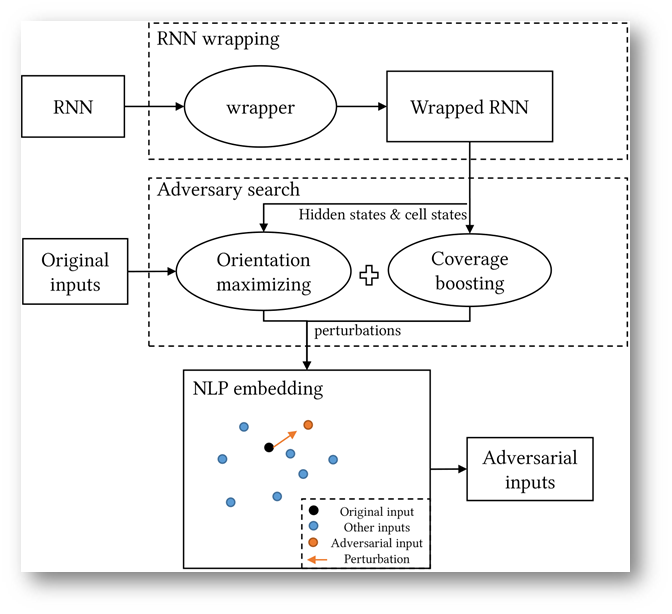

清华大学和北邮作者共著的大作，思想挺新颖但是至今为止都是挂在arxiv上。读完之后给人感觉像是草稿，机翻色彩严重……
<!--more--->

# 1. 引言

近年来对于对抗样本的研究主要集中于图像领域，少部分集中在音频领域。而这两种领域的突变攻击，都局限于DNN模型，RNN模型的对抗样本生成则鲜有研究（当时）。

RNN的对抗测试面临某些挑战，概括为三方面：

* 首先，没有明显的类别标签，就没有规则来识别对抗样本。因此传统的对抗性测试对于文本生成模型等无能为力。
* 其次，人类能够察觉在文本上的微小修改，且文本扰动很难保证语义不发生变化。
* 第三，现有的基于CNN的基于神经元的覆盖度量未能考虑RNN结构的特征，因此无法直接借鉴。

本文贡献主要有以下四点：

* 针对RNN的特定计算逻辑，定义三个覆盖率指标；
* 采用覆盖率指南来获取扰动，提出state inconsistency orientation作为引导对抗样本生成的方向，生成对抗样本；
* 提出了一种针对RNN的通用对抗测试框架RNN-Test；
* 利用RNN-Test测试并优化了PTB语言模型和拼写检查器模型。

本文提出的新颖思想有：

* 在整个输入中，我们仅保留一个单词/字符的扰动即可进行修改，从而确保了微小的修改。
* 通过利用测试模型的性能指标来评估对抗性输入的质量
* 实验发现，覆盖率值与对抗性输入的质量之间没有线性关系，因此应该付出更多的努力来提高输入质量，而不是覆盖率的值

# 2. RNN-Test

## 2.1 模块简介

RNN-Test工作流程如图所示：

RNN-Test三个重要组成部分：
- RNN wrapper
- adversary orientation maximizing
- coverage boosting.

**RNN Wrapper模块**负责提取RNN模型中的hidden states和cell states。

**adversary orientation maximizing模块**将三个orientation方法整合，这三个orientation方法分别是
- 本文提出的state inconsistency orientation方法，
- FGSM提到的优化方法，
- DLFuzz提到的优化方法。

**coverage boosting模块**则通过提升覆盖率，以图在RNN的未发现空间中搜索对抗样本

adversary orientation maximizing模块和coverage boosting模块的结果将集成起来，产生一个联合目标。对这个目标进行梯度上升联合优化求最优解。

在这里，我们只是从整个顺序输入中随机修改一个单词或字符，以确保所做的修改不足以保持原始语义。

单词在词嵌入空间中，因此我们以词嵌入空间中两点的距离作为辅助判断，选取突变距离最小的输入作为对抗样本。

RNN-Test不仅可以用于分类模型，而且可以应用于序列模型。

# 3. 覆盖率

为了方便后面解释，有如下定义：

* S: 时间步个数
* L: 层数
* B: 批数
* E: 隐状态集合大小
* h: 隐状态集合，|h|=E
* c: cell集合
* g: gate集合
* e: 一个隐状态，e∈h

## 3.1 状态覆盖率的意义

每个RNN单元在每个时间步$t$的输出都是隐藏状态向量$h_t$。当输入$x$到了最后一个单词，即执行到最后一个时间步$tp$的时候，输出的还是隐状态$h_{tp}$，只不过此时的$h_{tp}$能够真正代表整个序列$x$的所有信息了。之前的$h_t$是在没能读完$x$的情况下做出的草率判断。

对于LSTM单元，输出还包含表示为$c$的单元状态向量，长度与$h$相同。如果说$h$代表短期记忆，那么$c$就代表长期记忆。

对于一个输入$x$，如果特定的隐藏状态具有RNN单元输出的最大值，则其映射部分在预测结果中的概率也将更高。
> 其实这句话我没看懂，原文如下：
> For one input, if a ***specific hidden state*** has ***the maximum value of the RNN cell outputs***, the probabilities of ***its mapping part of the prediction result*** tend to be higher as well.  
> As covering the permutations of each hidden state of the RNN cell is extremely time-consuming, covering all **the maximum hidden states** is a feasible solution.

猜想作者应该是想要在所有时间步的$h_t$中选择一个最大的$h_{t'}$，计算覆盖率时只要覆盖该$h_{t'}$的就算是覆盖了。

$h$和$c$的所有分量大小在[-1,1]内，都是通过tanh函数计算得到的。本文将这个值域分割成等距离的五个部分，[-1，-0.8，-0.2、0.2、0.8、1]。通过将值范围划分为多个部分，然后记录每个部分的覆盖范围。

## 3.2 门覆盖率的意义

采用与状态覆盖相同的机制来计算门的覆盖范围。由于门的值域在[0,1]，因此划分区间[0、0.1、0.4、0.6 ，0.9，1]。

## 3.3  覆盖率定义

### **Hidden state coverage**

RNN中的所有Hidden State集合表示成H，H的形状为[S, L, B, E]。S为时间步个数，L为层数，B为batch数，E是每个状态向量的长度。

对于一个具体地隐状态h向量，形状为(s,l,b)，其中$s\in\{1,2,\dots,S\}$，$l\in\{1,2,\dots,L\}$，$b\in\{1,2,\dots,B\}$，$E=|h|$。

如果一个状态分量$e\in h$且$e=\max{(h)}$，也就是说$e$是该状态分量中的最大值，那么可以说该状态$e$被覆盖了。覆盖率计算公式如下：

$$\text{HS\_C}=\frac{|\{e\in h|e=\max{(h)}\}|}{S\times L\times B\times E}$$

### **Cell state coverage**

RNN中的所有Cell State集合表示成C，C的形状也为[S,L,B,E]。cell state的值域[-1,1]被分割成Sec块，分别是$sec_1, sec_2, \dots, sec_{Sec}$。每个sec可以表示成$sec_i=[v_{i-1}, v_i],-1\leq v_i\leq 1$。

如果一个cell状态分量$e\in c$而且$\tanh(e)\in sec_i, i\in\{1,2,\dots, Sec\}$，就说状态分量$e$在$sec_i$中被覆盖了（$e$ is covered in $sec_i$）。覆盖率公式如下：

$$\text{CS\_C}=\frac{|\{e\in c|\tanh(e)\in sec_i\}|}{S\times L\times B\times E}$$

### **Gate coverage**

用$g$来代表门，$g\in \{i,o,f\}$。用来计算这些gate的状态定义为$G_g$，$G_g$的形状是[S, L, B, $E_g$]，$E_g$是状态大小。

如果一个状态$e\in g$并且$\text{activation}(e)\in sec_i$，$\text{activation}$代表计算该gate所需的激活函数，那么就称状态$e$在$sec_i$中被覆盖了。门覆盖率的计算公式如下：

$$G_g\_C_{sec_i}=\frac{|\{e\in g|\text{activation}(e)\in sec_i\}|}{S\times L\times B\times E_g}$$

### **DX coverage**

这个覆盖率是仿照DeepXplore在DNN上定义的覆盖率，将其迁移到RNN上的结果。

对于CNN，DeepXplore将每个特征图（卷积层的输出，数百个值的矩阵）视为神经元，并将平均值作为输出。

如果我们将每个单元格的隐藏状态向量$h$视为神经元，此时像PTB模型这样的普通RNN将仅由一层少于100个神经元组成。这样只需几次输入，覆盖率值便可达到100%。因此，我们将每个隐藏状态向量分量$e$视为神经元。

对于所有的隐状态集合$H$，有状态$e\in H$。如果输出值在经过max-min normalization之后$\text{out}(e)>t$，t是某个阈值，此时就称状态$e$被覆盖。计算公式如下所示：

$$DX\_C=\frac{|\{e|\text{out}(e)>t\}|}{S\times L\times B\times E}$$

# 4 对抗定向优化方法

与训练过程相反，该过程通过使得输入变异，试图升高预先定义的orientation，来引导变异过程，最终使得模型判断错误。

可以选择的orientation有以下三个：
## 1) state inconsistency orientation
$$\text {obj\_orient}=h_{t-1}^{l}+c_{t}^{l}-h_{t}^{l}$$
t时刻的orientation，与t-1时刻的hidden state正相关，与t时刻的cell state正相关，与t时刻的hidden state负相关。

也就是说如果想优化state inconsistency orientation，就必须找到一个$x_t$，令$h_{t-1}$和$c_t$越大越好，$h_t$越小越好。

$$\left[\begin{array}{c}
\tilde{\boldsymbol{c}}_{t} \\
\boldsymbol{o}_{t} \\
\boldsymbol{i}_{t} \\
\boldsymbol{f}_{t}
\end{array}\right]=\left[\begin{array}{c}
\tanh \\
\sigma \\
\sigma \\
\sigma
\end{array}\right]\left(\boldsymbol{W}\left[\begin{array}{c}
\boldsymbol{x}_{t} \\
\boldsymbol{h}_{t-1}
\end{array}\right]+\boldsymbol{b}\right)$$

$$\boldsymbol{c}_{t}=\boldsymbol{f}_{t} \odot \boldsymbol{c}_{t-1}+\boldsymbol{i}_{t} \odot \tilde{\boldsymbol{c}}_{t}$$

$$\boldsymbol{h}_{t}=\boldsymbol{o}_{t} \odot \tanh \left(\boldsymbol{c}_{t}\right)$$

基于LSTM的设计理念，c代表较长的记忆，h代表短期记忆。

按公式可看出$c_t$、$h_t$、$h_{t-1}$应该是同增同减、状态一致。因此使$c_t$、$h_{t-1}$和$h_t$分开，就是使状态不一致程度上升。

## 2) Cost orientation

FGSM论文中提到的方法。全称为Fast Gradient Sign Method。该方法的优化目标是模型训练时使用的loss函数，然后利用一遍优化，计算对抗样本。

一个对抗样本攻击过程，与训练过程可以对比如下：

$$L_{t r a i n}(\theta)=C\left(y^{0}, y^{t r u e}\right)$$

训练时loss函数作用是，在输入x固定的条件下，通过改变模型参数$\theta$来优化loss使之最小化。

对抗样本攻击则是在参数$\theta$固定的条件下，通过改变输入x，来优化loss使之最大化。

如果只是想要让模型出错，这种攻击手段成为无目标攻击 (Non-target Attack)
$$L\left(x^{\prime}\right)=-C\left(y^{\prime}, y^{t r u e}\right)$$

如果指定了目标，试图让x向着指定的类别突变，这种攻击就被称为 (Target Attack)。

$$L\left(x^{\prime}\right)=-C\left(y^{\prime}, y^{t r u e}\right)+C\left(y^{\prime}, y^{f a l s e}\right)$$

但是突变程度有一定限制，要求突变前后图片变化小于一个阈值，意思是不要被发现。
$$d\left(x^{0}, x^{\prime}\right) \leq \varepsilon$$

总的来说，一个突变算法可以选择不同的优化方法，也许要选择不同的限制方法。

而FGSM算法选取的攻击手段是“一次求导”，通过依次计算损失函数对输入x的每个分量的偏导，如果为正数则值=1，负数则=-1，无论其大小。

效果就是每个像素点要不就+$\epsilon$，要不就-$\epsilon$。

## 3) Decision boundary orientation

决策边界定向旨在降低原始预测标签的概率，并增加其他前k个标签在预测中的概率。

$$\text {obj\_orient}=(\sum^{k}_{i=0}\hat{y}_{t_i})-\hat{y}_{t}$$

$\hat{y}_{t}$是softmax层的输出向量。

# 5. 对抗样本搜索的过程

## 5.1 RNN-Test整体算法

在keras的Sequence模型中，可以通过修改参数设置，使模型输出所有时间步的hidden state和cell state。

在1~8行，通过`retrieve_state`获得模型此时的state信息。其实我比较感兴趣`retrieve_state`方法是如何实现的

首先获得模型内部信息，根据优化目标计算能够最大化提升该目标的梯度方向。

然后第9~10行，根据梯度上升法，优化并生成新的变异体x。

11~13行，判断是否真的生成了能够使模型出错的对抗样本。

在15行，衡量此时模型的性能，如果是分类模型就看loss大小，如果是生成文本模型就看perplexity。

在第22~27行，生成对抗样本的过程中，对一段文本的变异方法，是通过在词嵌入空间中搜索最近的单词/字符，替换该时间步t对应的字符。

## 5.2 覆盖率提升方法

选择n个没被覆盖到的state，RNN-Test会尽可能提升他们的值。

$$o b j_{-} c o v=\sum_{i=0}^{n} e, e \in\{h, c\}$$

RNN-Test还会挑选在边界或者端点的state，将它们的值设成边界值。

> 这一块我看的很乱，可能不是我的问题而是作者写作的问题。

# 6.总结

1. 本文肯定不是作者的终稿，还有很多没说明白的地方，遣词造句也有一股中式英语的风味。
2. 新颖的地方包括覆盖率，但是这一块没看懂，作者也没把公式定义明白。
3. 其二是采用状态不一致程度来衡量模型不稳定性，并以此引导生成对抗样本，本来思想很新颖，但是突变样本的方法就是最简单的文本替换，在词嵌入空间中搜一个最近的单词向量。杀鸡焉用牛刀？