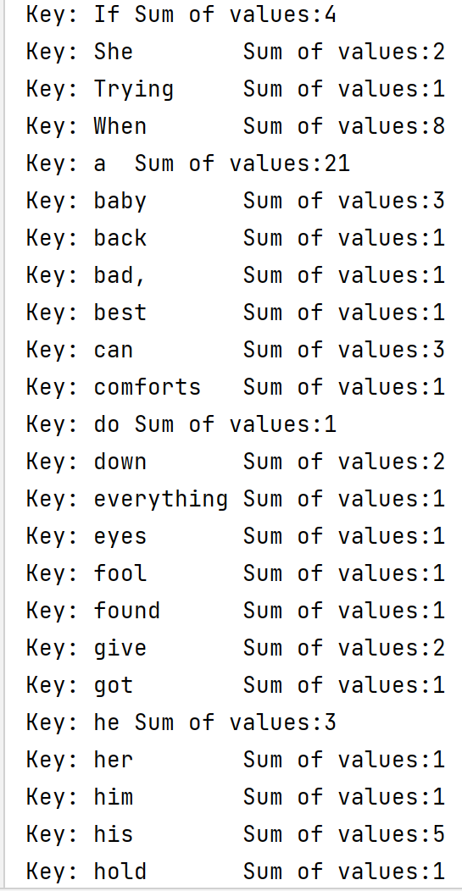

给出一个Map和Reduce的具体实现，去除了所有分布式的特性【可能今后会添加】

<!--more--->

MapReduce文章最后的附录A有一段C++代码，描述了Map和Reduce函数的编写和使用方法。但是仅靠看代码总是不能深入理解MapReduce的实现细节，阅读其他人的MapReduce学习曲线又太过陡峭。因此我决定自己实现Map函数和Reduce函数，并尽可能使用替代方法将那些没有给出的api实现。

促使我写这篇文章的另一个原因是，网络上的大部分实现Word Count的文章都是依赖于某某框架的，比如依赖Hadoop。但我觉得过早依赖于某个平台不利于深入理解背后的原理，因此我决定自己实现各种api，体会程序设计者可能遇到的问题。今后在学习分布式系统、分布式框架时，便能够对症下药、有的放矢。

不过还请各位原谅，这里的Map和Reduce只能运行在单机环境啦。

下面给出原文中的C++代码：

```cpp

#include "mapreduce/mapreduce.h"
//用户map函数
class WordCounter : public Mapper {
public:
    virtual void Map(const MapInput& input) {
        const string& text = input.value();
        const int n = text.size();
        for (int i = 0; i < n; ) {
            //跳过前导空格
            while ((i < n) && isspace(text[i]))
                i++;
            // 查找单词的结束位置
            int start = i;
            while ((i < n) && !isspace(text[i]))
                i++;
            if (start < i)
                Emit(text.substr(start,i-start),"1");
        }

    }

};

REGISTER_MAPPER(WordCounter);
//用户的reduce函数
class Adder : public Reducer {
    virtual void Reduce(ReduceInput* input) {
        //迭代具有相同key的所有条目,并且累加它们的value
        int64 value = 0;
        while (!input->done()) {
            value += StringToInt(input->value());
            input->NextValue();
        }
        //提交这个输入key的综合
        Emit(IntToString(value));
    }

};
REGISTER_REDUCER(Adder);
int main(int argc, char** argv) {
    ParseCommandLineFlags(argc, argv);
    MapReduceSpecification spec;
    // 把输入文件列表存入"spec"
    for (int i = 1; i < argc; i++) {
        MapReduceInput* input = spec.add_input();
        input->set_format("text");
        input->set_filepattern(argv[i]);
        input->set_mapper_class("WordCounter");
    }
    //指定输出文件:
    // /gfs/test/freq-00000-of-00100
    // /gfs/test/freq-00001-of-00100
    // ...
    MapReduceOutput* out = spec.output();
    out->set_filebase("/gfs/test/freq");
    out->set_num_tasks(100);
    out->set_format("text");
    out->set_reducer_class("Adder");
    // 可选操作:在map任务中做部分累加工作,以便节省带宽
    out->set_combiner_class("Adder");
    // 调整参数: 使用2000台机器,每个任务100MB内存
    spec.set_machines(2000);
    spec.set_map_megabytes(100);
    spec.set_reduce_megabytes(100);
    // 运行
    MapReduceResult result;
    if (!MapReduce(spec, &result)) abort();
    // 完成: 'result'结构包含计数,花费时间,和使用机器的信息
    return 0;
}
```

## 抽象基类 Mapper、Reducer

首先我打算实现`WordCounter`的父类`Mapper`和`Adder`的父类`Reducer`。

```cpp
class Mapper {
public:
    virtual void Map(const MapInput& input) = 0;
};

class Reducer {
public:
    virtual void Reduce(ReduceInput* input) = 0;
};
```

简单实现Map和Reduce接口，并把它们设置成纯虚方法。

## WordCounter类

```cpp
class WordCounter : public Mapper {
public:
    void Map(const MapInput& input) override {
        const string& text = input.value(); // 读取一行文本
        const int n = text.size();
        for (int i = 0; i < n; ) {
            // 跳过行首空白
            while ((i < n) && isspace(text[i])) i++;
            // 确定单词的开头和结尾
            int start = i;
            while ((i < n) && !isspace(text[i])) i++;
            if (start < i)
                Emit(text.substr(start, i-start), "1");
        }
    }
};
```

这一部分相较于原文没什么变化。其主要作用在于分词，然后每个单词组建成一个键值对，以(word, 1)的结构发射出去。发射到哪里呢？我就偷懒直接持久化到本地的消息存储装置了。

```cpp
static void Emit(const string& key, const string& value) {
    mw.put(key, value);
}
```

mw 是 MiddleWare 的实例，是一个用于保存Emit输出的键值对的全局变量。后续会继续讲解。

## 用于保存 Mapper 得到的键值对的 MiddleWare 类

```cpp
class MiddleWare {
private:
    vector<pair<string, string>> kv_pairs;
    static bool compare_pair(const pair<string, string>& lhs, const pair<string, string>& rhs) {
        return lhs.first < rhs.first;
    }
public:
    MiddleWare() = default;
    void put(const string& key, const string& value) {
        kv_pairs.emplace_back(key, value);
    }
    vector<pair<string, string>> get() {
        std::sort(kv_pairs.begin(), kv_pairs.end(), compare_pair); // 将其按照key相同的一组来排序
        return kv_pairs;
    }
};

MiddleWare mw; // 全局变量：消息队列
```

这是我为本地运行顺利而凭空构建出来的类，作用是储存(key, value)对。为了方便使用，内部有get和put方法。其中如果Reducer需要get数据了，那么首先会按照key对这些pair进行排序。这也是与MapReduce的流程相吻合的。

既然是排序，那么就要定义比较器 compare_pair。我的比较器直接使用string的比较，确保相同key值的pair在相邻位置。

## Adder类

```cpp
// 用户自定义 Reduce 函数
class Adder : public Reducer {
public:
    void Reduce(ReduceInput* input) override {
        // 迭代所有拥有相同key的键值对，把它们的values加起来
        int64_t value = 0;
        string currentKey = input->key();
        while (!input->end() && currentKey == input->key()) { // 直到下一个键值对的key与当前键值对的key不同为止
            value += std::stoi(input->value());
            input->NextValue(); // 找到下一个拥有相同key的键值对
        }
        // Emit sum for input->key()
        Emit(to_string(value));
    }
};
```

与论文中的Adder有逻辑出入，主要变化在把同样key分成不同组的逻辑上，我直接保存了当前组的key。原来论文里是没有这种操作的。

## Map 的输入 MapInput

观察一下Map的参数里有一个MapInput类型的对象，那么第二步就是新建一个MapInput类。要想跑通Map函数的代码，这个类必须实现value()方法。

猜测一下，MapInput是Map的输入，而MapReduce框架的输入输出都应该是键值对的形式。因此每个MapInput都应该包含一个key和一个value成员。

```cpp
class MapInput {
private:
    string map_value;
    string map_key;
public:
    explicit MapInput(string filename, string text) : map_key(std::move(filename)), map_value(std::move(text)) { }
    [[nodiscard]] const string& value() const {
        return map_value;
    }
};
```

MapInput的构造函数接收两个参数，第一个参数是文本文件名，第二个参数是文件的内容。其实第一个参数在我们的程序中没啥作用，但是为了格式的统一，就写上吧。

explicit修饰构造函数，代表该类的对象禁止发生隐式类型转换，要想转换必须以**明确的(explicit)**方式进行显式类型转换。

冒号后面的初始化列表中，使用了move特性，避免了函数传参导致的变量复制。

[[nodiscard]] 含义是该函数的返回值必须被使用，不能丢弃。C++ 17版本新增了几个中括号标识的提示符，当代码不符合要求的时候，编译器也会真的警告。相当于把以前的注释加强了。除[[nodiscard]]之外，还有表示switch语句中不必加break的[[fallthrough]]、变量定义之后没有使用也没关系的标识符[[maybe_unused]]。

## Reduce 的输入 ReduceInput

ReduceInput的设计就比较麻烦了。首先Reduce函数的输入是ReduceInput的指针，使用到的接口有done()/value()/NextValue()/key()，然后根据Reduce函数的使用方法，感觉ReduceInput像是一个迭代器。

```cpp
class ReduceInput {
private:
    vector<pair<string, string>> data;
    int currentKey = 0;
public:
    explicit ReduceInput(vector<pair<string, string>> _data) : data(std::move(_data)) {  }
//    bool done() {
//        // 直到下一个键值对的key与当前键值对的key不同为止
//        // 如果到了末尾，或者下一个key不一样，都是done
//        if (currentKey == 0) return false;
//        if (end() || data[currentKey].first != data[currentKey-1].first) return true;
//        return false;
//    }
    const string& value() {
        return data[currentKey].second;
    }
    const string& key() {
        return data[currentKey].first;
    }
    void NextValue() {
        currentKey++;
    }
    bool end() {
        return currentKey >= data.size();
    }
};

```

上面是我实现的ReduceInput，偷个懒把所有数据存放到ReduceInput中方便遍历，在真实场景的设计中不会像我这样的。

此外，Done函数的逻辑是有问题的。关键在于Reduce函数中的这句话：

```cpp
while (!input->done()) {
    value += StringToInt(input->value());
    input->NextValue();
}
```

表面上看起来是希望input作为一个迭代器，当它迭代到key与下一个key不同时，终止迭代（即done返回true表明迭代完成），然而下次迭代的开始还是从这个位置，其结果从程序逻辑上来讲，却又希望返回false。同一个位置，我们希望返回两个不同的值，这显然是说不通的。因此我在Reduce最终实现的主代码部分做了适当的逻辑修改。

## 输出结果的单参数Emit

为了输出方便，最终我定义了单参数的重载Emit，不保存Reducer的计算结果，直接输出：

```cpp
static void Emit(const string& key) {
    cout << "Sum of values:" << key << endl;
}
```

## 最后的main

```cpp
int main(int argc, char* argv[]) {
    ifstream in(R"(C:\Users\zyt\CLionProjects\leetcode_2021\lyrics.txt)");
    string content((istreambuf_iterator<char>(in)), istreambuf_iterator<char>());
    MapInput minput("lyrics.txt", content);
    cout << "minput:\n" << minput.value() << endl;

    WordCounter wc;
    wc.Map(minput);

    auto *rinput = new ReduceInput(mw.get());

    while (!rinput->end()) {
        cout << "Key: " << rinput->key() << "\t";
        Adder adder; // 模拟很多 adder
        adder.Reduce(rinput);
        rinput->NextValue();
    }
    return 0;
}
```

ifstream读入本地文本文档，注意ifstream的参数得是绝对路径（相对路径不知道为什么读取不出来东西）。

然后WordCount把分词结果的键值对保存在全局变量mw中，使用mw构建ReduceInput，再把ReduceInput输入进Adder里面。

注意一个Reducer处理一个Group（我把key相同的一组键值对称之为Group），那么我就以While循环来代替啦。

这就是代码的所有内容了！



```cpp
#include "stdafx.h"
using namespace std;

class MiddleWare {
private:
    vector<pair<string, string>> kv_pairs;
    static bool compare_pair(const pair<string, string>& lhs, const pair<string, string>& rhs) {
        return lhs.first < rhs.first;
    }
public:
    MiddleWare() = default;
    void put(const string& key, const string& value) {
        kv_pairs.emplace_back(key, value);
    }
    vector<pair<string, string>> get() {
        std::sort(kv_pairs.begin(), kv_pairs.end(), compare_pair); // 将其按照key相同的一组来排序
        return kv_pairs;
    }
};

MiddleWare mw; // 全局变量：消息队列

class MapInput {
private:
    string map_value;
    string map_key;
public:
    explicit MapInput(string filename, string text) : map_key(std::move(filename)), map_value(std::move(text)) { }
    [[nodiscard]] const string& value() const {
        return map_value;
    }
};

class ReduceInput {
private:
    vector<pair<string, string>> data;
    int currentKey = 0;
public:
    explicit ReduceInput(vector<pair<string, string>> _data) : data(std::move(_data)) {  }
//    bool done() {
//        // 直到下一个键值对的key与当前键值对的key不同为止
//        // 如果到了末尾，或者下一个key不一样，都是done
//        if (currentKey == 0) return false;
//        if (end() || data[currentKey].first != data[currentKey-1].first) return true;
//        return false;
//    }
    const string& value() {
        return data[currentKey].second;
    }
    const string& key() {
        return data[currentKey].first;
    }
    void NextValue() {
        currentKey++;
    }
    bool end() {
        return currentKey >= data.size();
    }
};

static void Emit(const string& key, const string& value) {
    mw.put(key, value);
}

static void Emit(const string& key) {
    cout << "Sum of values:" << key << endl;
}

class Mapper {
public:
    virtual void Map(const MapInput& input) = 0;
};

class Reducer {
public:
    virtual void Reduce(ReduceInput* input) = 0;
};

class WordCounter : public Mapper {
public:
    void Map(const MapInput& input) override {
        const string& text = input.value(); // 读取一行文本
        const int n = text.size();
        for (int i = 0; i < n; ) {
            // 跳过行首空白
            while ((i < n) && isspace(text[i])) i++;
            // 确定单词的开头和结尾
            int start = i;
            while ((i < n) && !isspace(text[i])) i++;
            if (start < i)
                Emit(text.substr(start, i-start), "1");
        }
    }
};

// 用户自定义 Reduce 函数
class Adder : public Reducer {
public:
    void Reduce(ReduceInput* input) override {
        // 迭代所有拥有相同key的键值对，把它们的values加起来
        int64_t value = 0;
        string currentKey = input->key();
        while (!input->end() && currentKey == input->key()) { // 直到下一个键值对的key与当前键值对的key不同为止
            value += std::stoi(input->value());
            input->NextValue(); // 找到下一个拥有相同key的键值对
        }
        // Emit sum for input->key()
        Emit(to_string(value));
    }
};

int main(int argc, char* argv[]) {
    ifstream in(R"(C:\Users\zyt\CLionProjects\leetcode_2021\lyrics.txt)");
    string content((istreambuf_iterator<char>(in)), istreambuf_iterator<char>());
    MapInput minput("lyrics.txt", content);
    cout << "minput:\n" << minput.value() << endl;

    WordCounter wc;
    wc.Map(minput);

    auto *rinput = new ReduceInput(mw.get());

    while (!rinput->end()) {
        cout << "Key: " << rinput->key() << "\t";
        Adder adder; // 模拟很多 adder
        adder.Reduce(rinput);
        rinput->NextValue();
    }
    return 0;
}

```