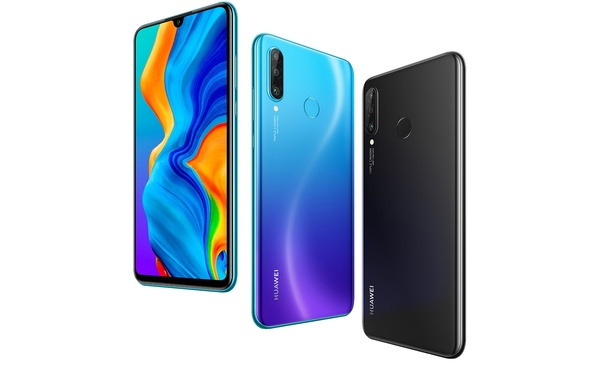

# 美国将华为列入了黑名单，实施一系列与针对中兴类似的、外科手术式的精准打击。华为在劫难逃。那么华为或中国可以做什么来应对呢？中国会采取哪些手段？

华为被列为美国“实体清单”无疑是当下最受关注的话题。显然，美国是想采取一系列精准打击，妄图将华为推入和中兴一样的境地。因此，无论是国内还是国外，线上还是线下，华为和中国的反应无疑是最受人关注的。鉴于国内新闻平台罕有客观分析的文章，我通过Quora论坛（又称作美国版知乎）摘录并翻译了Janus Dongye Qimeng对于该问题的精彩回答。他回答于5月22日，截至目前（25日）收获了5.9k个赞同。让我们来欣赏Janus对于该问题的精彩回答吧。

链接：[US blacklisted Huawei in what is evidently ZTE style surgical strike. It appears Huawei is pretty much dead. What can Huawei or China do to overcome this or to retaliate? What will China do?](https://www.quora.com/US-blacklisted-Huawei-in-what-is-evidently-ZTE-style-surgical-strike-It-appears-Huawei-is-pretty-much-dead-What-can-Huawei-or-China-do-to-overcome-this-or-to-retaliate-What-will-China-do)

Janus Dongye Qimeng：

不谈观点，只说事实。

下面是华为2019年最畅销的P30手机的供应链：

华为P30手机的“大脑”是由海思公司设计的麒麟980系统芯片（System-on-Chip，SOC）。而海思是华为旗下的子公司。为什么称它为系统芯片？因为该芯片集成了许多由世界其他地方设计的组件。

该系统芯片背后是什么？

**指令集架构**（Instruction set architecture）：海思购买了**英国**剑桥ARM的CPU和GPU架构许可证。通过许可，海思可以使用ARM指令集（armv8）并开发自己的64位CPU架构。AMBA等总线标准也是ARM授权的。

**CPU，GPU**：海思在中国深圳拥有数百名员工，负责设计CPU内核、加速器和IP组件。为了设计自己的CPU，他们需要使用Synopsis，Cadence和Xilinx的电子设计自动化（EDA）工具。这些EDA公司都是**美国**加利福尼亚州的公司。海思需要支付许可费才能使用他们的工具来设计和模拟自己的CPU。

> 译者注：电子设计自动化（英语：Electronic design automation，缩写：EDA）是指利用计算机辅助设计（CAD）软件，来完成超大规模集成电路（VLSI）芯片的功能设计、综合、验证、物理设计（包括布局、布线、版图、设计规则检查等）等流程的设计方式。

同时，海思还可以集成ARM设计的现有软核，如强大的核心Cortex A76和高效的核心Cortex A55。 两者都在同一芯片中。大核心在**美国**德克萨斯州奥斯汀市设计，小核心在**英国**剑桥设计。一些低端CPU核心也从中国台湾联发科购买。同时，海思还可以从ARM购买其他知识产权，包括Mali T830 GPU和互连子系统。Mali GPU设计在**英国**剑桥的ARM总部。

**内存**：海思在存储器控制器和SRAM系统中设计了自己的逻辑电路。SRAM和DRAM单元由**韩国**三星授权。未来的7nm 3D堆叠RAM也将由三星设计，但在中国大连制造。

**DSP和相机**：海思购买了德国徕卡相机的相机镜头设计知识产权和控制系统，其中大部分系统都是在**德国**韦茨拉尔设计的。实际镜头由中国台湾的大立光电（Largan Precision）和中国大陆的舜宇光学科技（Sunny Optical Technology）制造。用于驱动相机改变焦点的电动马达由三美电机（Mitsumi）在日本Tsurumaki制造。为了将光转换为信号，光敏胶片由中国深圳的欧菲光（O-film）设计（也是iPhone X的供应商）。海思从**美国**亚利桑那州凤凰城的安森美（ON Semiconductors）购买了用于自动聚焦和图像稳定的硬件解决方案。高清视频处理芯片由**日本**索尼授权。海思设计了自己的图像处理硬件加速器（ISP），从**美国**加利福尼亚州的CEVA购买了许多DSP专利，并从中国北京购买了来自寒武纪科技（Cambricon Technologies）的AI芯片。

**通信模块**（Baseband）：海思购买了许可证，使用来自**美国**加利福尼亚州圣何塞的博通（Broadcom）的WIFI、GPS和蓝牙。对于3G支持，海思必须向**美国**加利福尼亚州圣地亚哥高通公司持有的专利支付许可使用费。对于后来的4G LTE和5G，海思拥有自己的专利和通信模块处理器，称为Balong，由中国数百人设计。海思还从中国科学院购买了北斗导航系统。请注意，一些芯片验证任务由**印度**海得拉巴的工程师执行。

**射频模块**（Radio frequency，缩写为RF）：要在各种通信信号之间进行多路复用并将模拟信号放大到不同的无线频率，它们需要射频集成电路（RFIC）。RFIC的大多数专利都是由**美国**北卡罗来纳州的RF Micro Devices公司持有，现在在与TriQuint合并后成为Qorvo。RFIC芯片需要一些功率放大器，这由**日本**京都的Murata Manufacturing制造的高端电容器提供。 还需要TST台湾和Microgate在深圳设计和制造的表面声波（SAW）传感器。还需要一些由**美国**Skyworks Solutions设计并由Skyworks在中国制造的绝缘硅绝缘体开关。对于天线组件，它们由深圳的Sunway公司和位于中国上海的Rosenberger（**美国**）工厂设计和制造。在5G时代，华为模拟设备也必须使用来自**美国**，**日本**和中国的这些设备。

**NFC和触控设备**：**荷兰**的恩智浦半导体为华为提供NFC解决方案。该芯片由英飞凌在**德国**西门子开发。深圳Goodix Co提供指纹传感器。USB Type-C解决方案由深圳Everwin Precision提供。

**芯片装配**：在海思将所有知识产权和零件集成到一个系统芯片SOC之后，该设计被送到台湾半导体制造公司（TSMC）进行物理布局和制造。SOC芯片的制造过程是一项非常复杂的任务。对于最重要的步骤，TSMC需要导入由**荷兰**ASML设计的掩模对齐系统（MAS）。他们还需要使用来自**日本**的Shin-Etsu，来自**德国**的Siltronic AG和来自**日本**Minato的SUMCO Corporation的大量晶圆化学品。

**源材料**：但是，大多数化学产品和半成品都是从中国进口的。最具代表性的是中国的稀土金属。对于包括玻璃和钢材在内的其他材料，比亚迪在深圳负责制造手机梯度框架和高密度眼镜。盛意电子为手机生产所有PCB板。

**屏幕**：华为P30采用三星OLED硬屏，但P30 Pro采用京东方科技在中国设计的OLED软屏。有些屏幕也由**韩国**LG在中国广州制造。现在，韩国和中国公司都在屏幕市场占据主导地位。

**组装**：华为随后从每个服务提供商处订购所有组件，并将组件运送到中国郑州的富士康公司。富士康的工人将所有组件组装成一个完整的手机。

这是华为单个手机的供应链。华为的主要产品不只是手机，但他们的手机仍然成功击败苹果，成为未进入美国市场的第二大智能手机公司。华为的主要优势在于其通信基础设施和解决方案。因为这方面我并不熟悉，所以我并不打算写。

现在请计算这些供应商来自美国，中国，日本和韩国的数量。对于上面列出的每家公司，请访问他们自己的网站，查看他们的产品实际销售到华为或中国市场的份额，以及他们的材料从中国进口的数量。你会惊讶地发现，华为通常是他们最大的客户，他们再也不能离开中国了。

这意味着如果你杀死了华为，那么大多数供应商也会受到很大的伤害。有些公司会陪葬。他们中的大多数是韩国和日本唯一的高价值公司。他们会遭受40％及以上的市场损失。这将对韩国和日本经济造成巨大打击。

很显然，特朗普背后的智囊并不了解半导体行业的现状。我想Quora的大多数人都不知道。

华为已死？

当然没有。十年前，华为已经启动了美国政府的各种情景备胎计划。他们甚至有针对当整个中国被阻止使用x86指令集场景的极端备份计划。

### 中国会采取什么手段？

让我们来看看中国采取的最新的应对措施：

[由于贸易紧张局势加剧，中国削减了芯片制造商的税收](https://www.scmp.com/tech/enterprises/article/2139699/china-cuts-taxes-chip-makers-promote-industry-development)

中国宣布所有国内半导体供应商公司将获得五年免税。他们五年不需要纳税！这意味着他们可以降低运营成本并击败其外国竞争对手。这是美国一直在抱怨中国的地方。现在中国一直在做，不管美国有什么话要说。

如果华为找不到美国的供应商，那么他们会找到替代品，主要是中国的国内供应商。这些供应商在中国免税。这将为国内公司带来巨大的推动力，因为它们可以同时降低成本和获得客户。

我一直在与中国半导体行业不同领域的许多中国学者交谈。他们说，华为之所以从这么多来源购买知识产权，并不是说华为没有这项技术，更重要的是，对于他们最重要的领域，他们并不打算**重新发明轮子**（reinvent the wheels），他们希望与世界共享利益。

确实有一些中国仍然落后的关键技术，如制造工艺和射频芯片。但我们应该明白。中国能达到目前为止的技术水平，正是由于巴黎多边出口管制协调委员会的技术封锁和制裁，中国被禁止使用所有高端技术。多亏了他们，中国有机会自己“重新发明轮子”。

同时，由于采用了华为技术，北京的地铁已经安装并覆盖了5G信号。

但现在，我坐在伦敦的地铁上。我的手机没有任何信号。因此，我必须离线阅读关于一篇精彩的英国脱欧文章的帖子。我周围的人都在看华为手机上的离线小说。

有关软件方面“供应链”的分析，请参考我的答案：

[Janus Dongye Qimeng's answer to How badly will Huawei's smartphone business be affected by Google's response to US placing Huawei on "Entity" list? (Huawei loses access to Google proprietary apps and services but is still be able to run the Android Open Source license (AOSP).](https://www.quora.com/How-badly-will-Huaweis-smartphone-business-be-affected-by-Googles-response-to-US-placing-Huawei-on-Entity-list-Huawei-loses-access-to-Google-proprietary-apps-and-services-but-is-still-be-able-to-run-the-Android-Open/answer/Janus-Dongye-Qimeng)

我希望你能通过本文了解更多关于现状的信息。

> Talk is cheap. Show me the code.
> — Linus Torvalds
> 空谈误国，实干兴邦。

本文由**Superlova**翻译自Quora平台Janus Dongye Qimeng对[US blacklisted Huawei in what is evidently ZTE style surgical strike. It appears Huawei is pretty much dead. What can Huawei or China do to overcome this or to retaliate? What will China do?](https://www.quora.com/US-blacklisted-Huawei-in-what-is-evidently-ZTE-style-surgical-strike-It-appears-Huawei-is-pretty-much-dead-What-can-Huawei-or-China-do-to-overcome-this-or-to-retaliate-What-will-China-do)的回答，翻译并传播的初心是用作英语翻译习作和思想交流。郑重声明：本文的观点并不代表译者的观点。转载本译文请注明本译文出处！