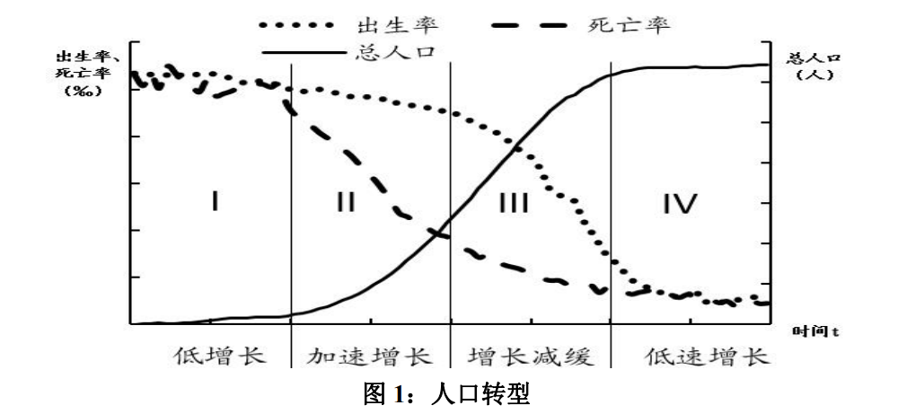
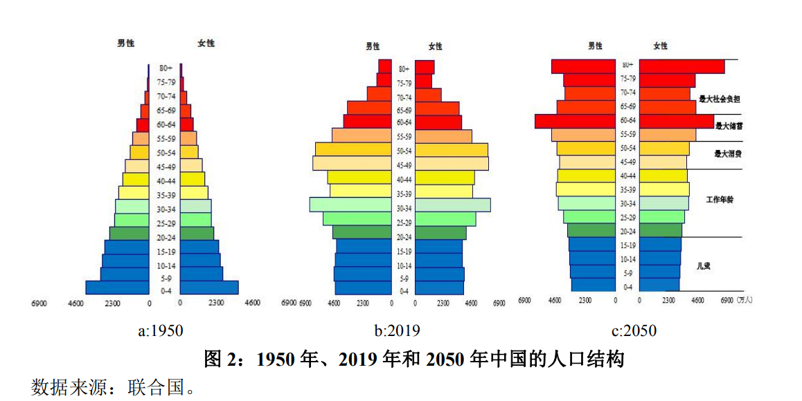
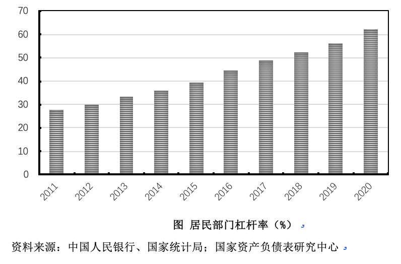
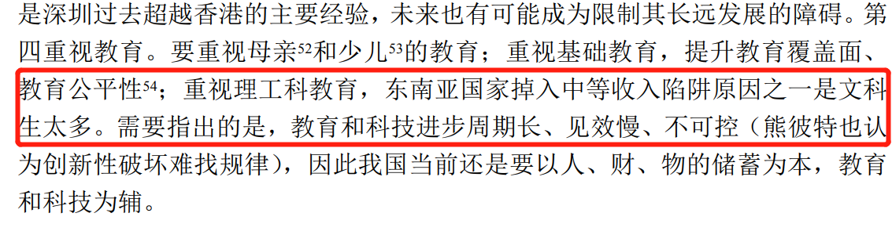

央行（中国人民银行）在2021年3月26日发表了一篇工作论文《关于我国人口转型的认识和应对之策》。论文一经发表便引起了全网的大讨论，新浪微博上的相关点击量达到3.2亿次。然而网络上的消息难免囿于其碎片话叙事风格，使人产生偏见。因此笔者抱着批判性学习的心态，拜读了该篇论文，并试图梳理主要内容，最后就相关观点提出自己的评论。
<!--more--->

声明：本文并非学术文章，而是代表个人见解的社会评论；针对的也仅限于该篇文章，而不能涵盖文章所涉及的所有相关议题。本文写作目的仅出于学习和交流。本文作者并非研究人口与社会问题的专业人士，因此观点未免存在疏漏和幼稚之处，望读者海涵。

这篇工作论文的四名作者均是中国人民银行下属研究机构的经济学博士。作者还向当局提出放开计划生育、控制房价、重视储蓄和投资等建议。

所有的中国人民银行工作论文可在如下网站查看：
http://www.pbc.gov.cn/yanjiuju/124427/133100/index.html

# 论文原文内容摘录

以下将《关于我国人口转型的认识和应对之策》简称为“论文”。灰色引用部分和图表为原文内容，其余部分为本人评注。

## 一、人口转型的规律

该部分讨论了经济社会发展和出生率与死亡率的关系问题。

> 经济社会的发展将导致出生率和死亡率下降，但是死亡率会先于出生率下降，因此论文将人口增长状态分为四个阶段：低增长（I）、加速增长（II）、增长减缓（III）和恢复低增长（IV）。

> 发达经济体已经位于IV阶段，而大多数发展中经济体位于II或III阶段。

什么是人口红利？人口红利是指生育率下降带来的劳动人口占比提升的现象。在人口红利时期，因为抚养子女和老人的压力变小，更多的人口能够从事经济发展有关的工作，因此这个地区相较于其他地区增长快。具体表现为居民储蓄率高、投资高等。

人口红利是一个地区发展的机会，但是能否利用这个机会，则有赖于社会和政治条件所创造的生产性就业和投资环境。

劳动适龄人口占多数的时期是短暂的（约50年），这一部分劳动人口终究会老去并成为负担，届时新一代人将成为社会发展的主力。这种人口红利之后的现象称之为人口转型。

什么是中等收入陷阱？经济水平长期处于中等收入水平的国家，经济社会发展长期停滞在该水平，受限于各种因素而无法跻身富裕国家行列，看起来好像陷入了一个“陷阱”之中。与“中等收入陷阱”类似的概念还有“贫困陷阱”。

## 二、国外应对人口转型的经验和教训

发达经济体早在工业革命时期就已经积累了一定的人口转型方面的经验和教训。具体表现在：

> 教训：
> - 没料到会出现人口转型；
> - 低估了人口对经济增长的作用；
> - 低估了老龄化和少子化的危害。

前两点不言自明。而对于第三点，论文认为体现在：

> 1）发达国家其一高估了教育和科技的作用；2）高估了鼓励生育的效果；3）高估了养老保障政策和养老产业的作用。

> 经验：
> - 资本扩张
> - 移民

论文提到了这两点是十分行之有效的做法。但这就意味着要求国家发展到国际产业链的顶端，要“当大哥”才能获得这份利益。

## 三、我们该如何应对人口转型？

### 3.1 目前问题很严峻

论文指出，一方面我们同样面临人口红利即将结束的人口转型问题，

另一方面我们的问题比发达国家更为严重，我们“未富先老”；而且由于计划生育政策，我们的生育率下降得更快。在可以预见的将来，经济发展停滞，甚至是物价疲软、资产价格通缩、高负债等现象都可能出现。

选取美国和印度两个典型的国家进行比较，美国由于技术移民和资本扩张，人口结构问题并不是很突出。而印度正处于人口红利初期，具体可看下图：

预计2050年，中印美三国的人口结构如下图所示：

> 如果说过去四十年我国缩小与美国的差距，靠的是廉价的劳动力和巨大的人口红利，那未来三十年要靠什么？这值得我们深思。

### 3.2 应对方案

> 用调控经济的思路去应对人口转型，多半事与愿违。所以一定要有提前量，并且搞得多多的，这样才不至于积重难返；一定要坚持，这样才有成效。

> #### 3.2.1 全面放开生育。

这应当是解决人口结构问题的大前提。

> #### 3.2.2 重视储蓄。

老龄化会导致储蓄率下降。未雨绸缪不仅适用于个人，而且对于国家而言同样重要。从其仅次于第一点就能看出，储蓄率对解决人口结构问题至关重要。事实上储蓄率是国家和政府主导投资的核心，是经济发展的直接动力源之一。

> #### 3.2.3 重视投资。

重视对我国中西部的投资、对亚非拉地区的投资，以及对科技的投资。

> #### 3.2.4 推进养老制度从即时支付型向储蓄型转移。

我国的养老保险制度由三大支柱组成。第一支柱是基本养老保险，即人们常说的养老金；第二支柱即企业年金和职业年金；第三支柱包括个人储蓄性养老保险和商业养老保险。第三支柱以个人主导，工作时有一部分钱税前缴纳，退休取的时候再征税。

> 削弱第一支柱的养老金，增强个人储蓄保险和商保的占比。这两者最大的区别，就是前者是政府兜底，而后者是市场化产品，政府不会补贴。

[个人储蓄养老保险制度](https://www.163.com/dy/article/G55MIAN2053907LI.html)参考这个网站。

不仅如此，论文还提到应该早点降低养老金、延长退休年龄，越早改革越好。用通俗的话来说，就是“别指望政府给你养老”。

> 我国延迟退休可早做的一个原因在于，**我国有社会主义的优越性，集体主义精神更强有利于避免发达国家延迟退休中的社会动荡；老一辈的人更能忍让、更能吃苦。**

这一点经不起推敲，而且越读越让人感觉味道不对。

很喜欢王小波的一句话：“声称‘东方和西方的思考方式不一样’的人，其目的都是在掩饰一些自己也觉得不体面的事情。都是同一个物种，怎么会思想方式不同呢？”

而且，总不能因为班里同学好欺负，就挑软柿子捏，还说这是“软柿子的思想境界高”吧。

制定政策如果真的是为人民服务的，就应该接收人民群众的监督、承受一部分人的意见，并耐心回复和解答，这才是人民民主专政。

综上，笔者认为这一点不如不说。

> #### 3.2.5 促进教育和科技进步。

> 给创新以兜底的社保；把握创新与监管的平衡；控房价；重视母亲和少儿的教育；重视基础教育；重视理工科教育，**东南亚国家掉入中等收入陷阱原因之一是文科生太多**；

笔者非常赞成关于控房价相关的论述。不仅如此，笔者认为控制房价还有助于提升居民储蓄率，进一步提升经济发展水平。

文科与理科的大讨论，不是一两句话能说明白的。简单讲，在没有明确“文科”和“理科”的定义之前，擅自对文理进行评价，是不妥当的。

当然，单纯以毕业生就业情况来看，以自动化、电子、机械、计算机等专业为首的理工科专业的确要比以语言、传媒、艺术等专业要方便就业。

但是就社会贡献来看，文科尤其是社会科学对社会的贡献要不亚于理工科学。毕竟我们国家的国策就是在马克思主义的指导下建立的。因此在概念模糊的时候不宜“捧一踩一”。

> 老话讲，**爹戳戳一个，娘戳戳一窝**，所以教育好母亲比教育其他人事半功倍。事实上，教育母亲不是一句空话，可以从很多具体的小工作做起。比如，有发达国家就给每个育龄妇女分发孕前、孕中、孕后、育儿知识的小册子（政府组织专家编写，简单易懂，免费提供），而不是让大家去市场上买厚厚的、良莠不齐的、五花八门的生育指南。这样花钱不多，又成效显著。

出自俗语“兵熊熊一个,将熊熊一窝”。

重视对母亲的教育，其实还是囿于传统文化的固有成见，即女性应该承担更多哺育孩子的任务。

如若从制度角度平衡两性之间的家庭职责，并令政府承担一部分新生儿抚养职能，比如给男性以产假、设立新生儿的政府统一抚养等，比单纯教育母亲要人性化得多。

> 教育和科技进步周期长、见效慢、不可控，因此我国当前还是要以人、财、物的储蓄为本，教育和科技为辅。

> 不一定要建那么多学校、养那么多老师，可以用互联网技术让优质教育资源共享。

这一点确实值得提倡。因为中国东西部教育资源分配不均现象，可以被互联网技术轻易解决。给贫困山区孩子配备一块显示器，然后去北京四中网校下载相应视频，孩子就能享受一流名师的教育教学了。

然而教育资源可不仅仅是课堂资源，生理指导、心理干预、学习习惯的形成等都需要老师手把手地进行指导。

今后老师的职能也许会从单纯的课堂教学，逐渐转化为学习、生活等方面的导师，引导学生们的发展。

这里减少老师和学校数目的倡议，应当是为了应对今后一段时间内新生儿数目减少所导致的需求降低。互联网技术的发展与老师数目的需求之间并无直接关系。

# 简评

## 1. 文笔

从行文上来看，本片工作论文与其说是一篇论文，不如说是一篇由央行背书的社会评论。从其观点的严谨程度到行文的文笔上都不够“学术”，更加口语化。

例如在第三章第二小节中的一段关于人口与经济的关系的论述如下所示：

* 人口与经济的关系**似乎有点像**物价。过快增长不好，萎缩更糟糕，**也许就像**温和的通胀一样，适度、可持续的人口增长才有利于经济社会发展。

再比如论文第14页的脚注中，关于日本“失去的二十年”的相关注解：

* **有人说**，日本失去的二十年的主要原因是日本泡沫经济，而非人口老龄化。……（即便是上世纪三十年代的大萧条，持续时间即使算满，**也就**十年）。**还有人说**，……。 

并且“有人说”之后也没有跟随参考文献，不由得让人怀疑该“人”的存在性。如此种种不一而足。

## 2. 储蓄率如何提升？

本节参考自[《居民储蓄率与经济的关系》](https://zhuanlan.zhihu.com/p/95800733)一文。

论文中提到要“高度警惕和防止储蓄率过快下降的趋势”，并列举了一组数字：我国国民储蓄率从 2010 年的 47.8%，下降到 2018 年的 44.4%，8 年下降了 3.4 个百分点，其中居民储蓄率降幅更大，下降 7.3 个百分点。

储蓄率下降过快，会使得人口红利期积累下来的财富得不到保存。

虽然论文在解决方案的第二点就提到了“提升储蓄率”作为解决老龄化问题的方案，但是既没有讨论储蓄率下降的原因，也没有讨论储蓄率如何提升。

本节将讨论三个问题：

1. 储蓄率是什么？对经济发展重要吗？
2. 储蓄率的影响因素有哪些？
3. 既然储蓄率对国家如此重要，如何提升储蓄率？

### 2.1 居民储蓄率和经济之间的关系

首先需要明确，经济增长的三驾马车是消费、净出口和投资，其中投资依赖于本国储蓄率和外债。

储蓄率是指用于最终消费后的余额占所有可支配收入的比率。我国的国民储蓄中，居民储蓄是主要部分。

改革开放以来，中国经济的发展一直依赖于政府主导的大规模投资和大量出口。投资的钱怎么来？银行，银行的钱来自哪里？居民的高储蓄率。

说白了，你在银行里的存款越多，对政府的投资贡献越大。说不定高铁的一块铁轨、一个地铁站就用了你的一部分存款。

因此中国的投资大部分依赖于居民储蓄率，储蓄率的下降对经济发展有较大负面影响。

### 2.2 老龄化和居民储蓄率之间的关系

储蓄率和人口结构是有关系的，只不过关系不那么明显。

人的一生中，消费和储蓄模式会发生变化。

一个人从事劳动的年份，他们的收入大于消费，由此产生的盈余用于抚养子女以及存入银行。

而老年人一般将其收入的大部分花在住房和社会服务方面，另外保健和长期护理方面的需求可能会上升，娱乐、交通运输方面的需求可能会下降。

因此，理论上，当社会中有收入的青壮年逐步减少、没有收入的老人越来越多时，居民的储蓄率就会下降。

不过储蓄率往往受其他因素影响，因此老龄化与居民储蓄率之间的关系并不是绝对相关的。

### 2.3 影响居民储蓄率的其他原因

虽然老龄化会对居民储蓄率产生一定程度的影响，但还有很多其他因素影响人们的储蓄行为，比如：

- 收入水平、资产价值和分配情况
- 对未来发展的估计
- 税率
- 现行养恤金制度
- 老年医疗和临终关怀等

其中居民存款的增长与否与居民收入有很大关系。当经济向好时，居民收入有大幅增长，存款就增大；当经济下行时，居民收入增长较缓，存款增长就放缓。

既然老龄化和居民收入等原因都会影响居民储蓄率，那么究竟什么是中国居民储蓄率快速下降的主要原因？

### 2.4 储蓄率降低的主要原因

> “房价太高，再怎么放开生育我都不会生的。”

由于近年教育、医疗、房产等的价格的上升，居民在以上几项当中的消费额增加，致使居民储蓄率下降。特别是房地产在家庭资产配置当中占有非常大的比例，已经大大超过了存款。

据央行一季度金融统计数据新闻发布会消息，2020年居民杠杆率为 45.7% ，比2019年上升了 7.1% 。

http://finance.sina.com.cn/zl/china/2021-04-18/zl-ikmxzfmk7496559.shtml

居民部门杠杆率增幅较大主要是受房地产市场影响。数据显示，在全部居民债务中，占最大比例的即是居民中长期消费贷款（主要是住房按揭贷款），占到了全部居民贷款的65%。

让我们再说得明白些。居民买房的首付使用了六个钱包，这六个钱包中或许还包含私人借债，因此实际居民借债率可能远高于这个数字。

中国居民已经逐渐由资金供给方变为资金的需求方。高房价掏空了年轻人们的钱包，房贷车贷负债累累，谈何储蓄？

### 2.5 如何令居民储蓄率上升？

2.5 和 2.6 参考自[《从养老负担和储蓄率之间的关系，深入解析中国“老龄化》](https://www.thepaper.cn/newsDetail_forward_11420531)一文。

目前我国的储蓄中，有较大的份额是来自政府和企业，这是国民经济分配失衡所造成的。调整分配，使居民的收入份额上升，对缓解养老压力十分关键。同时，调整政府支出结构，增加公共物品供给，使居民用于这类产品的支出降下来，增加他们的净财富，有助于他们提高养老保障能力。

在高储蓄率下，之所以仍然面临巨大的养老压力，与过高的收入分配差距有关，低收入人群的养老风险较高的，他们需要为养老而储蓄，但是恰恰是他们的收入水平过低，无力储蓄。所以对养老问题并不能从问题本身来谈论。应对措施也应该更具有综合性和整体性，调节收入分配尤其重要。

### 2.6 如何提升养老金缴费比率？

目前中国的养老金缴费率比较低。中国的非正规就业规模较大，这部分就业者主要是中低收入人群，他们之所以不愿意参保，原因在于缴纳养老金并不符合他们的利益最大化目标。

有两个比较明显的直接原因。

一是中国近年来的通货膨胀率较高，这就意味着未来的领取的养老金现值也较少；

二是中国的城市住房价格快速上涨，住房投资的回报率较高，这也促使劳动者更愿意领取较高的工资而不太看重养老金，因为当前领取工资收入，可以尽早积累起足够的资金用于买房或者其他投资，而养老金只能到退休以后才能领取。

高通胀和资产价格膨胀使人们增强了流动性偏好，而缴纳养老金对个人来说意味着增加了流动性较低的资产，劳动者更愿意选择哪怕是略微高一些的工资，而不是一个较低的工资加上一份养老保险。

因而在这种情况下，强制缴纳养老保险的规定往往难以得到落实，企业和雇员会努力采取措施规避这种规定。即使政府出台严格的规定，强制企业缴纳养老保险，个人和企业也都有很强的动机来规避。

当然，社会养老保障的参保率提高缓慢的原因是多方面的，例如缴费在地区间不可携带，高通胀和资产回报较高可能是一个重要原因。因此，治理通胀和维持房价稳定有助于养老体制的完善。

## 3. 文理之争

“文科生太多”的说法在网络上引发轩然大波。话题“#文科生太多会影响国家发展吗”在中国社交媒体微博上的阅读量超过3.2亿次，大部分网友对此持批评态度。

众所周知，我国理科生与文科生素来不睦，前者蔑视后者没逻辑，后者鄙夷前者没文化。

不过在网上的论战中，理科生底气更足一些。毕竟社会上一直流传着“学好数理化、走遍天下都不怕”的说法。相对地，文科一直被认为“无用”。

2020年，一名来自湖南省的高考状元因在大学选择了考古专业，再度在社交媒体引发争论。有网友认为考古专业“没钱途”，规劝她换专业。

但是人们在讨论文科和理科的时候，是否能够确切说出什么是“文科”，什么是“理科”呢？

关于文科生和理科生的定义，建议看下[这篇文章的介绍](https://matters.news/@xiemeng/%E4%BB%8E%E7%BF%BB%E8%AF%91%E7%A4%BE%E4%BC%9A%E5%AD%A6%E7%9A%84%E8%A7%92%E5%BA%A6%E7%9C%8B%E6%96%87%E7%A7%91%E7%94%9F%E4%B8%8E%E7%90%86%E7%A7%91%E7%94%9F%E7%9A%84%E4%BA%92%E7%9B%B8%E9%84%99%E5%A4%B7-bafyreicrdy7y4fnmjktwnsxv6ljmkiq3ga4yqo5lvjzn3ng74fog32a6jm)，相当全面。

透过现象看本质，现实情况是一些中国大学文科毕业生确实面临“就业难”和“薪资低”的困境。

加上2019年国务院发布的职业教育改革方案，能够看出国家其实是想解决一些行业人口过剩但高级技工人才短缺的问题。所以问题不在于文理之争，而在于人才分配不均。

# 总结

人口结构问题已成为中国未来发展所必须面对的问题。央行论文提出了一揽子解决方法，包括解除生育限制、提升储蓄率、稳房价和鼓励创新等；但也包含一些本人所不理解的观点，如储蓄率与人口结构的关系，关于“吃苦”的论述，以及“爹戳戳一个，娘戳戳一窝”的观点等。笔者就上述部分观点进行了深入调研和思辩。

# 参考文献

胡翠, 许召元. 人口老龄化对储蓄率影响的实证研究[J]. 经济学 (季刊), 2014, 13(4).

United Nations. Department of Economic and Social Affairs. World Economic and Social Survey 2007: Development in an ageing world[M]. UN, 2007.

一些参考文章链接已直接在原文列出。