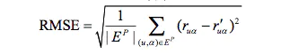
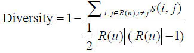
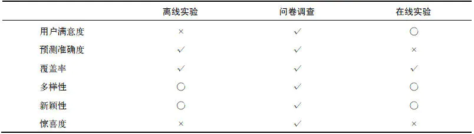

看到一篇介绍推荐系统的评价方法与指标的文章，刚好本课题组也有个同学在做推荐系统相关的课题，并且该文章的评价指标部分对我目前的课题有启发作用，因此转载。
<!--more--->

# 如何评价推荐系统以及其他智能系统

## 1. [评价推荐系统](https://www.jianshu.com/p/9d7c228eee59)

评测一个推荐系统时，需要考虑用户、物品提供商、推荐系统提供网站的利益，一个好的推荐系统是能够令三方共赢的系统。比如弹窗广告就不是一个好的推荐系统。

### 1.1 评测实验方法

#### 1.1.1 离线实验（offline experiment）

离线实验的方法的步骤如下：

a）通过日志系统获得用户行为数据，并按照一定格式生成一个标准的数据集；
b）将数据集按照一定的规则分成训练集和测试集；
c）在训练集上训练用户兴趣模型，在测试集上进行预测；
d）通过事先定义的离线指标，评测算法在测试集上的预测结果。

从以上步骤看出，离线实验的都是在数据集上完成的。意味着，它不需要一个实际的系统作为支撑，只需要有一个从日志中提取的数据集即可。

离线实验的优点是：

* 不需要有对实际系统的控制权；
* 不需要用户参与实践；
* 速度快，可以测试大量算法；

缺点是：

* 数据集的稀疏性限制了适用范围，例如一个数据集中没有包含某用户的历史行为，则无法评价对该用户的推荐结果；
* 评价结果的客观性，无法得到用户主观性的评价；
* 难以找到离线评价指标和在线真实反馈(如 点击率、转化率、点击深度、购买客单价、购买商 品类别等)之间的关联关系；

#### 1.1.2 用户调查（user study）

用户调查需要一些真实的用户，让他们在需要测试的推荐系统上完成一些任务。在他们完成任务时，需要观察和记录用户的行为，并让他们回答一些问题。

最后，我们通过分析他们的行为和答案，了解测试系统的性能。

用户调查的优点是：

* 可以获得用户主观感受的指标，出错后容易弥补；

缺点是：

* 招募测试用户代价较大；
* 无法组织大规模的测试用户，统计意义不足；

#### 1.1.3 在线实验（online experiment）

在完成离线实验和用户调查之后，可以将系统上线做AB测试，将它和旧算法进行比较。

在线实验最常用的评测算法是【A/B测试】，它通过一定的规则将用户随机分成几组，对不同组的用户采用不同的算法，然后通过统计不同组的评测指标，比较不同算法的好坏。

它的核心思想是:

a) 多个方案并行测试;
b) 每个方案只有一个变量不同;
c) 以某种规则优胜劣汰。

其中第2点暗示了A/B 测试的应用范围：A/B测试必须是单变量。

对于推荐系统的评价中，唯一变量就是--推荐算法。

有个[很棒的网站](http://www.abtests.com)，里面有很多通过实际AB测试提高网站用户满意度的例子。

AB测试的优点是：

* 可以公平获得不同算法实际在线时的性能指标，包括商业上关注的指标；

缺点是：

* 周期较长，必须进行长期的实验才能得到可靠的结果；

#### 1.1.4 总结

一般来说，一个新的推荐算法最终上线，需要完成上述的3个实验。

* 首先，通过**离线实验**证明它在很多离线指标上优于现有的算法；
* 其次，通过**用户调查**确定用户满意度不低于现有的算法；
* 最后，通过**在线AB测试**确定它在我们关心的指标上优于现有的算法；

### 1.2 评测指标

评测指标用于评测推荐系统的性能，有些可以定量计算，有些只能定性描述。

#### 1）用户满意度

用户满意度是评测推荐系统的重要指标，无法离线计算，只能通过用户调查或者在线实验获得。

调查问卷，需要考虑到用户各方面的感受，用户才能针对问题给出准确的回答。

在线系统中，用户满意度通过统计用户行为得到。比如用户如果购买了推荐的商品，就表示他们在一定程度上满意，可以用购买率度量用户满意度。

一般情况，我们可以用用户点击率、停留时间、转化率等指标度量用户的满意度。

#### 2）预测准确度

预测准确度，度量的是推荐系统预测用户行为的能力。 是推荐系统最重要的离线评测指标。

大部分的关于推荐系统评测指标的研究，都是针对预测准确度的。因为该指标可以通过离线实验计算，方便了学术界的研究人员。

由于离线的推荐算法有不同的研究方向，准确度指标也不同，根据研究方向，可分为：预测评分准确度和TopN推荐。

##### a）预测评分准确度

预测评分的准确度，衡量的是算法预测的评分与用户的实际评分的贴近程度。

这针对于一些需要用户给物品评分的网站。

预测评分的准确度指标，一般通过以下指标计算：

**平均绝对误差（MAE）**

MAE因其计算简单、通俗易懂得到了广泛的应用。但MAE指标也有一定的局限性，因为对MAE指标贡献比较大的往往是那种很难预测准确的低分商品。

所以即便推荐系统A的MAE值低于系统B，很可能只是由于系统A更擅长预测这部分低分商品的评分，即系统A比系统B能更好的区分用户非常讨厌和一般讨厌的商品，显然这样区分的意义不大。

**均方根误差（RMSE）**

Netflix认为RMSE加大了对预测不准的用户物品评分的惩罚（平方项的惩罚），因而对系统的评测更加苛刻。

研究表明，如果评分系统是基于整数建立的（即用户给的评分都是整数），那么对预测结果取整数会降低MAE的误差。

##### b）TopN推荐

网站提供推荐服务时，一般是给用户一个个性化的推荐列表，这种推荐叫做TopN推荐。

TopN推荐的预测准确率，一般通过2个指标度量：

**准确率（precision）**

**召回率（recall）**

R(u)是根据用户在训练集上的行为给用户做出的推荐列表，T(u)是用户在测试集上的行为列表。

TopN推荐更符合实际的应用需求，比如预测用户是否会看一部电影，比预测用户看了电影之后会给它什么评分更重要。

**ROC曲线、AUC曲线、F值**

分类任务一般都有这三兄弟。

除此之外，还有Hit Rate (HR)等。

#### 3）覆盖率

覆盖率（coverage）是描述一个推荐系统对物品长尾的发掘能力。

最简单的定义是，推荐系统推荐出来的物品占总物品的比例。

假设系统的用户集合为U，推荐系统给每个用户推荐一个长度为N的物品列表R(u)，覆盖率公式为：

覆盖率是内容提供者关心的指标，覆盖率为100%的推荐系统可以将每个物品都推荐给至少一个用户。

除了推荐物品的占比，还可以通过研究物品在推荐列表中出现的次数分布，更好的描述推荐系统的挖掘长尾的能力。

如果分布比较平，说明推荐系统的覆盖率很高；如果分布陡峭，说明分布系统的覆盖率较低。

信息论和经济学中有两个著名指标，可以定义覆盖率：

**信息熵**

p(i)是物品i的流行度除以所有物品流行度之和。

**基尼系数（Gini Index）**

p(ij)是按照物品流行度p()从小到大排序的物品列表中第j个物品。

**评测马太效应**

马太效应，是指强者越强，弱者越弱的效应。推荐系统的初衷是希望消除马太效应，使得各物品都能被展示给对它们感兴趣的人群。

但是，很多研究表明，现在的主流推荐算法（协同过滤）是具有马太效应的。评测推荐系统是否具有马太效应可以使用基尼系数。

如，G1是从初始用户行为中计算出的物品流行度的基尼系数，G2是从推荐列表中计算出的物品流行度的基尼系数，那么如果G1>G2，就说明推荐算法具有马太效应。

#### 4）多样性

为了满足用户广泛的兴趣，推荐列表需要能够覆盖用户不同兴趣的领域，即需要具有多样性。

多样性描述了推荐列表中物品两两之间的不相似性。假设s(i,j)在[0,1]区间定义了物品i和j之间的相似度，那么用户u的推荐列表R(u)的多样性定义如下：

推荐系统整体多样性可以定义为所有用户推荐列表多样性的平均值：

#### 5）新颖性

新颖性也是影响用户体验的重要指标之一。它指的是向用户推荐非热门非流行物品的能力。

评测新颖度最简单的方法，是利用推荐结果的平均流行度，因为越不热门的物品，越可能让用户觉得新颖。

此计算比较粗糙，需要配合用户调查准确统计新颖度。

#### 6）惊喜度

推荐结果和用户的历史兴趣不相似，但却让用户满意，这样就是惊喜度很高。

目前惊喜度还没有公认的指标定义方式，最近几年研究的人很多，深入研究可以参考一些论文。

#### 7）信任度

如果用户信任推荐系统，就会增加用户和推荐系统的交互。

提高信任度的方式有两种：

* 增加系统透明度：提供推荐解释，让用户了解推荐系统的运行机制。
* 利用社交网络，通过好友信息给用户做推荐

度量信任度的方式，只能通过问卷调查。

#### 8）实时性

推荐系统的实时性，包括两方面：

* 实时更新推荐列表满足用户新的行为变化；
* 将新加入系统的物品推荐给用户；

#### 9）健壮性

任何能带来利益的算法系统都会被攻击，最典型的案例就是搜索引擎的作弊与反作弊斗争。

健壮性（robust，鲁棒性）衡量了推荐系统抗击作弊的能力。

2011年的推荐系统大会专门有一个推荐系统健壮性的教程，作者总结了很多作弊方法，最著名的是行为注入攻击（profile injection attack）。

就是注册很多账号，用这些账号同时购买A和自己的商品。此方法针对亚马逊的一种推荐方法，“购买商品A的用户也经常购买的其他商品”。

评测算法的健壮性，主要利用模拟攻击：

* a）给定一个数据集和算法，用算法给数据集中的用户生成推荐列表；
* b）用常用的攻击方法向数据集中注入噪声数据；
* c）利用算法在有噪声的数据集上再次生成推荐列表；
* d）通过比较攻击前后推荐列表的相似度评测算法的健壮性。

提高系统健壮性的方法：

* 选择健壮性高的算法；
* 选择代价较高的用户行为，如购买行为比浏览行为代价高；
* 在使用数据前，进行攻击检测，从而对数据进行清理。

#### 10）商业目标

设计推荐系统时，需要考虑最终的商业目标。不同网站具有不同的商业目标，它与网站的盈利模式息息相关。

总结：

作者认为，对于可以离线优化的指标，在给定覆盖率、多样性、新颖性等限制条件下，应尽量优化预测准确度。

### 1.3 评测维度

如果推荐系统的评测报告中，包含了不同维度下的系统评测指标，就能帮我们全面了解系统性能。一般评测维度分3种：

用户维度，主要包括用户的人口统计学信息、活跃度以及是不是新用户等；
物品维度，包括物品的属性信息、流行度、平均分以及是不是新加入的物品等；
时间维度，包括季节，是工作日还是周末，白天还是晚上等；

## 2. 评价智能系统

【未完成】