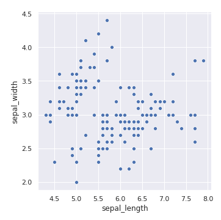
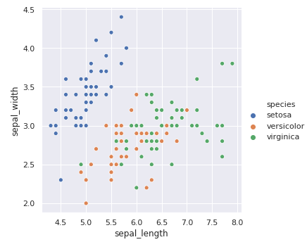
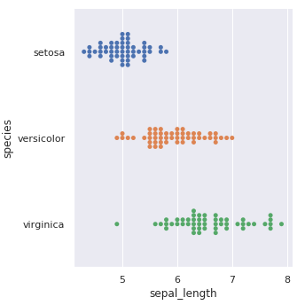
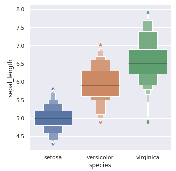

# 一、使用matplotlib绘制图像

matplotlib是一个Python的数据可视化2D图形库。matplotlib的特点是可以采用面向对象的方法，模仿MATLAB中的图形命令。matplotlib经常与numpy、pandas等库结合起来使用。
matplotlib可以采用MATLAB的命令风格使用，也可以采用面向对象的风格使用。


## matplotlib的图像中各组件名称


## 新建图像

```python
fig, axes = plt.subplots(2,1,figsize=(5,10)) #两行一列组成一张图，图像大小宽5高10
```
上面的语句创建了一个figure，由两个ax组成。把它想象成一张画布上面的两个贴画，会比较容易理解。

plt.figure()函数的前两个参数是设置figure是由几行几列的ax组成。figure(2,1)说明figure是由两行一列的ax一共两个ax组成。

后面的figsize参数设置画布的宽和高，单位为英寸。

# 二、使用Seaborn绘制图像

首先确定我们需要可视化的数据的结构。以iris鸢尾花数据集为例，


每一行代表一个数据对象，每一列代表数据对象的一个属性。但是现实生活的数据很多不长这样，只不过组织成一个表格的形式，内容大相径庭。因此在进行数据可视化时一定要保证你的数据也是**用行代表数据对象，用列表示数据的属性**。

## 2.1 关联图

我们是用 `relplot`函数进行进一步绘制。实际上，`relplot` 可以看作是 `scatterplot` 和 `lineplot` 的结合版本。但是relplot包装层级更加高，这意味着它更适合快速应用，不适合自定义。如果你对它的效果不满意，恐怕还是得诉诸`scatterplot` 和 `lineplot`等与matplotlib结合更紧密的api，或者直接使用matplotlib。

```python
sns.relplot(x="sepal_length", y="sepal_width", data=iris)
```


x为花萼长度，y为花萼宽度。这样分x，y其实有一定道理，我们的目的是能够把不同类型的数据对象在图上区分开。因为同类花朵一般个头差不多，花萼的长度和宽度聚集在图的一部分区域。但是在上图我们是看不出来的。我们希望给不同类别添加不同颜色。

```python
sns.relplot(x="sepal_length", y="sepal_width", hue="species", data=iris)
```

可以看到我们添加了`hue`字段，并要求按照`species`进行进一步分类。`hue`字段就是进行二次分类的参数。



如果是论文，则我们要使得读者在黑白打印的条件下也能发现区别。添加`stype`参数为`species`或许会有帮助。

```python
sns.relplot(x="sepal_length", y="sepal_width",
            hue="species", style="species", data=iris)
```


不只是散点图，该方法还支持线形图，只需要指定 `kind="line"` 参数即可。

```python
sns.relplot(x="sepal_length", y="sepal_width",
            hue="species", style="species", kind="line", data=iris)
```


上图其实就是折线图，我们使用一个与matplotlib结合更紧密的api来探究花萼长度和花瓣长度之间的关系。

```python
sns.lineplot(x="sepal_length", y="petal_length",
             hue="species", style="species", data=iris)
```


## 2.2 类别图

懒人函数是`catplot`，`catplot`是下面几个底层函数的封装：

- 分类散点图:
    - [`stripplot()`](https://seaborn.pydata.org/generated/seaborn.stripplot.html) (`kind="strip"`)
    - [`swarmplot()`](https://seaborn.pydata.org/generated/seaborn.swarmplot.html) (`kind="swarm"`)

- 分类分布图:
    - [`boxplot()`](https://seaborn.pydata.org/generated/seaborn.boxplot.html) (`kind="box"`)
    - [`violinplot()`](https://seaborn.pydata.org/generated/seaborn.violinplot.html) (`kind="violin"`)
    - [`boxenplot()`](https://seaborn.pydata.org/generated/seaborn.boxenplot.html) (`kind="boxen"`)

- 分类估计图:
    - [`pointplot()`](https://seaborn.pydata.org/generated/seaborn.pointplot.html) (`kind="point"`)
    - [`barplot()`](https://seaborn.pydata.org/generated/seaborn.barplot.html) (`kind="bar"`)
    - [`countplot()`](https://seaborn.pydata.org/generated/seaborn.countplot.html) (`kind="count"`)

我们想知道不同类别下花萼长度的散点图。

```python
sns.catplot(x="sepal_length", y="species", kind='strip',data=iris)
```


`kind="swarm"` 可以让散点按照 beeswarm 的方式防止重叠，可以更好地观测数据分布。

```python
sns.catplot(x="sepal_length", y="species", kind="swarm", data=iris)
```


箱线图
```python
sns.catplot(x="sepal_length", y="species", kind="box", data=iris)
```

变种箱线图
```python
sns.catplot(x="species", y="sepal_length", kind="boxen", data=iris)
```

提琴图
```python
sns.catplot(x="sepal_length", y="species", kind="violin", data=iris)
```

点线图
```python
sns.catplot(x="sepal_length", y="species", kind="point", data=iris)
```

柱状图
```python
sns.catplot(x="sepal_length", y="species", kind="bar", data=iris)
```


## 2.3 分布图

如果想看一个变量到底是正态分布、卡方分布还是指数分布，此时就要使用分布图进行可视化了。一维分布图比较常见，二维以上分布图不太直观。绘制分布图的函数有这几个：`jointplot` `pairplot` `distplot` `kdeplot`。

`distplot`可以方便的查看单变量的分布图。
```python
sns.distplot(iris["sepal_length"])
```

图上那条曲线是根据数据拟合出来的核密度估计kde曲线（原理有待学习）。如果不想要这条线，可以在参数中设置`kde=False`。更可以只要kde曲线，设置`hist=False`即可。

`jointplot`绘制二元变量的分布图，比如花瓣长度和宽度的关系。
```python
sns.jointplot(x="petal_length", y="petal_width", data=iris)
```


kde估计图也可以在二元变量分布图中出现。还有蜂巢图`kind="hex"`、回归图`kind="reg"`等。
```python
sns.jointplot(x="petal_length", y="petal_width", data=iris, kind="kde")
```


最后注意到我们的鸢尾花数据集含有四组属性。我们想探究这四组属性两两之间的关系，就需要用到`pairplot`

```python
sns.pairplot(iris, hue="species")
```


## 2.4 回归图

`regplot` 绘制回归图，只会绘制一组回归曲线。
```python
sns.regplot(x="sepal_length", y="sepal_width", data=iris)
```


`lmplot` 可以引入`hue`变量，绘制不同类别数据的回归图
```python
sns.lmplot(x="sepal_length", y="sepal_width", hue="species", data=iris)
```


## 2.5 矩阵图

`heatmap`用来画热图，数据值大的格子颜色比较深。热力图在某些场景下非常实用，例如绘制出变量相关性系数热力图。
`clustermap`用来画层次聚类结构图。对于iris数据集来说，这两类图没有用武之地。
