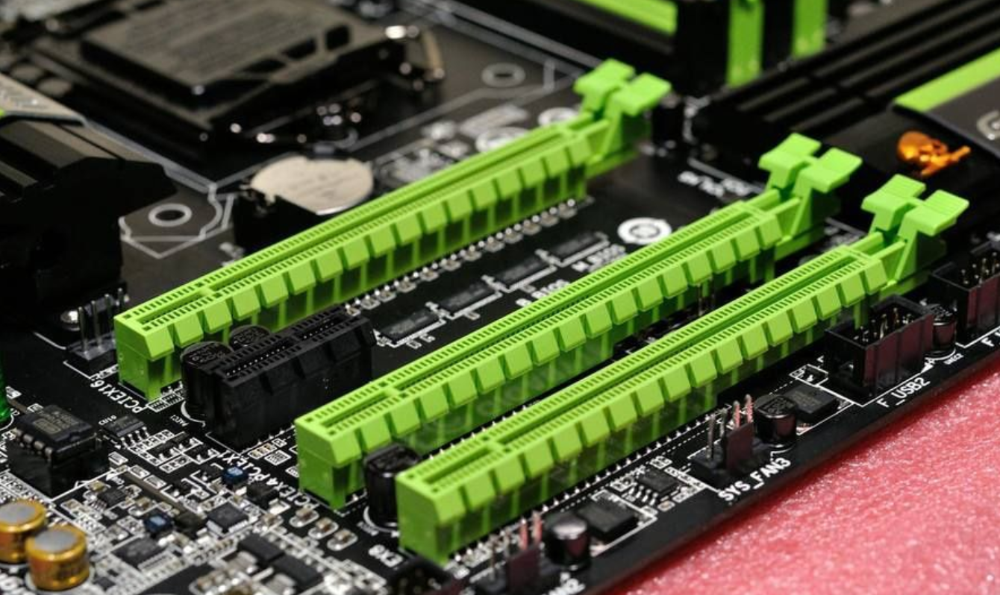
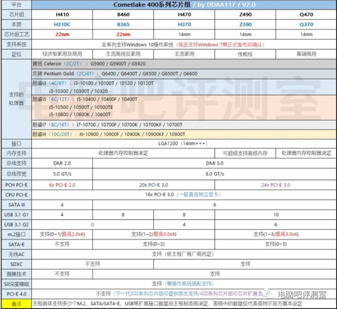
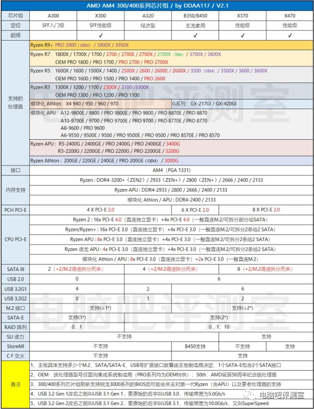
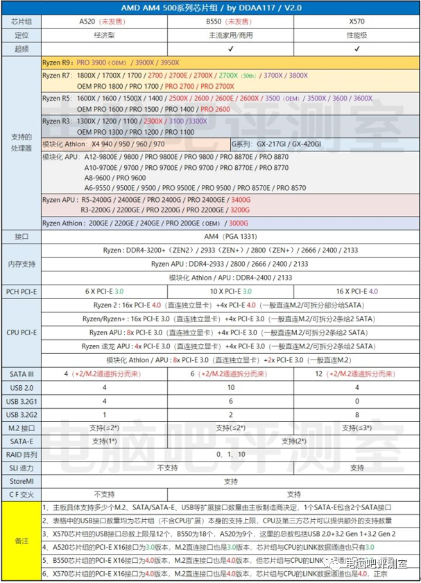
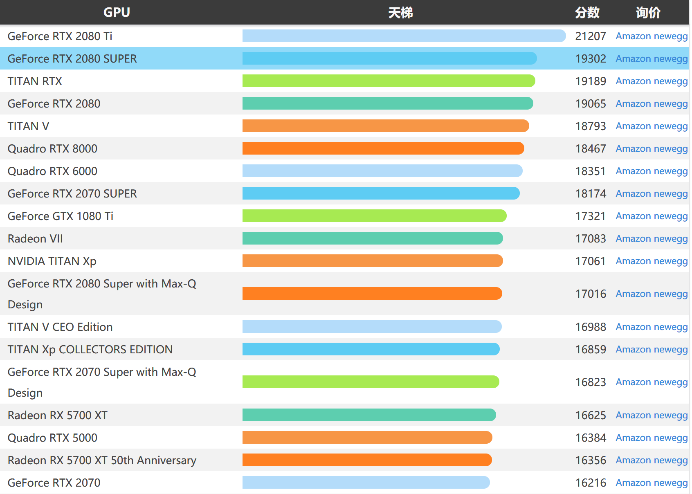
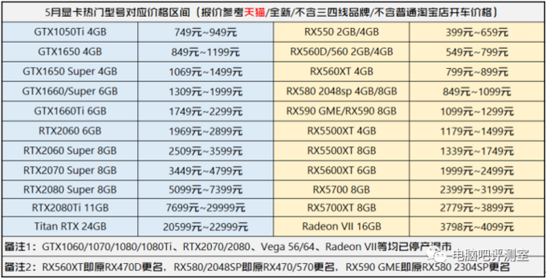

# 服务器调研 2020年5月10日

**调研目标：**
* 目前典型的计算机，包括商用台式机、工作站、服务器
* 搭配目前典型的GPU卡
* GPU适配计算机，需要厂家网站公开的列表，特别是对于服务器。如果厂家没有，需要致电厂商（非销售商）的技术支持。

## 1. 制约性能的典型项目

### 1.1 主板
Intel部分芯片组不支持PCIe 3.0接口，无法发挥显卡的最佳速度。

#### 名词解释：

**PCI Express / PCI-e**
PCI-E的全名叫PCI Express，简称PCI-E，官方简称PCIe，他是计算机内部的一种高速总线。PCI-E既是通道，也是接口，当他以接口形式存在的时候，就是我们主板上那长长的槽。PCI-E接口目前最大的作用就是插显卡

**PCI Express 修订版 / PCIe版本**
PCIe所能承受的带宽一般以版本和长度来区分，目前最流行的PCIe版本是3.0，最新的版本是4.0，目前只有高端主板支持4.0，只有比2080ti还要高端的显卡才需要4.0。

**PCI Express 配置**
通俗的说就是插槽长度。X1长度是最短的，所能承受的带宽大约是986MB/S。X2长度就是2GB/S，X4长度就是4GB/S，那X16长度就是16GB/S。当前主流显卡，均采用PCIE×16插槽结构。只要具有PCIE×16插槽的主板，都是可以安装独立显卡的。
英特尔官网的意义没大看懂，真正有意义的是“支持的处理器 PCI Express 端口配置”这一项。

**支持的处理器 PCI Express 端口配置**
以Z390主板为例，该主板1x16 or 2x8 or 1x8+2x4，意思就是可以插1个长度为16X的显卡，也可以插两个长度为8X的固态硬盘之类的，但是如果同时插上显卡和固态硬盘，就会出现抢通道的现象：显卡占用16个通道，两个固态占用16个通道，然而**PCI Express 通道数的最大值**就只有24个，通道不够用就会导致限速，甚至无法正常运转。

以上是当前在售处理器搭配主板（芯片组）的特性支持情况，仅供参考，并不是说某块主板用了上述某个芯片组芯片就会具备这么多的扩展接口及能力，具体还要看主板厂商针对这个版型作出什么样的“阉割”调整。

### 1.2 电源

## 2. 目前典型计算机

服务器对显卡的支持不如工作站，台式机的性能过低，因此本调查汇聚于工作站查询。

### 2.1 服务器
服务器按外形划分可以划分为：塔式服务器、机架式服务器、刀片式服务器。
服务器除了一些低端的塔式机能用显卡以外，其他的都不支持显度卡，当然机架式服务器很薄根本就没有显卡的空间。
如果购买服务器，官方售后将不会主动为你安装个人家用系列显卡，转而推销商业计算卡。

截至2020年5月，服务器热销品牌Top-10（取自[ZOL网](http://top.zol.com.cn/compositor/server.html)）：
Dell、华为、浪潮、联想、惠普、H3C、ThinkServer、中科曙光、宝德、IBM。

### 2.2 工作站
工作站的机箱主要以塔式为主，和一般家用主机机箱差距不大。
工作站对显卡的支持比服务器强很多，具体来说，工作站的主板对PCI-E的接口支持更好。

以下价格和资料全部取自于北京市政府采购网。

**神舟**
HFMPB2O8型号支持双路2080ti或TITAN
[HFMPB2O8](http://114.255.53.119:81/bgpc_office_manage/produce/parmsInfo.htm?topPk=1r6e15444412038777n5&tiitPk=BG_002X&tioPk=)    78,016.00 自带2080ti
[HFMPB99K](http://114.255.53.119:81/bgpc_office_manage/produce/parmsInfo.htm?topPk=2g0v15681729710791z0&tiitPk=BG_002X&tioPk=)  55,691.28   自带2080ti
[HFMPB3IR](http://114.255.53.119:81/bgpc_office_manage/produce/parmsInfo.htm?topPk=6u7m15621197126648s6&tiitPk=BG_002X&tioPk=)  32,870.00   C422可更换更高级显卡
[HFMPB3J9](http://114.255.53.119:81/bgpc_office_manage/produce/parmsInfo.htm?topPk=8n5x15444417182251i6&tiitPk=BG_002X&tioPk=)  29,980.00   自带2080

**联想**
[Think Station P520](http://114.255.53.119:81/bgpc_office_manage/produce/parmsInfo.htm?topPk=6h7y15571256822209c5&tiitPk=BG_002X&tioPk=)   46,920.00    C422可更换更高级显卡
[ThinkStation P720](http://114.255.53.119:81/bgpc_office_manage/produce/parmsInfo.htm?topPk=1s8z15571265520623u2&tiitPk=BG_002X&tioPk=) 35,000.00   C622可更换更高级 

**宏碁**
[AP150 F4](http://114.255.53.119:81/bgpc_office_manage/produce/parmsInfo.htm?topPk=7w0g15281019011939v9&tiitPk=BG_002X&tioPk=) 38,500.00    C622可更换更高级 

**浪潮**
浪潮是自研主板，不过其主板支持PCIe 16x，理论上只要供电足够即可安装包括2080Ti在内的显卡
[P8000](http://114.255.53.119:81/bgpc_office_manage/produce/parmsInfo.htm?topPk=3f4m15287143876139q2&tiitPk=BG_002X&tioPk=)    37,260.00

**惠普**
[HP Z4 G4](http://114.255.53.119:81/bgpc_office_manage/produce/parmsInfo.htm?topPk=4g2q15281081290990x3&tiitPk=BG_002X&tioPk=)  15,900.00   C622可更换更高级 
[HP Z6 G4](http://114.255.53.119:81/bgpc_office_manage/produce/parmsInfo.htm?topPk=4v9p15281082398434h6&tiitPk=BG_002X&tioPk=)  23,500.00   C622可更换更高级 
[HP Z8 G4](http://114.255.53.119:81/bgpc_office_manage/produce/parmsInfo.htm?topPk=0z0m15314586871347z2&tiitPk=BG_002X&tioPk=)  35,800.00   C622可更换更高级 

**苹果**
苹果的主板仅支持AMD的显卡，A卡不能用作深度学习。

### 2.3 商用台式机

即普通台式机。普通台式机难以支撑深度学习任务。

## 3. 显卡介绍
显卡分为Nvidia显卡和AMD显卡，其中Nvidia显卡可以用来深度学习训练和推理。

比较显卡性能，可以去[这个网站](https://versus.com/cn)

### 3.1 Nvidia显卡简介

[2020年显卡天梯图](https://www.bybusa.com/gpu-rank)

目前最强的显卡是2080ti。预计在2020年底的3080ti发布之前，2080ti还会持续称霸显卡江湖。

### 3.2 游戏显卡

对游戏显卡的调研，参考[“什么值得买”上的调研](https://post.smzdm.com/p/a6lrwk3e/)以及[这个网址](https://www.cnblogs.com/xiaozhi_5638/p/10923351.html)。

**Geforce系列**

这个系列是销量最多、大众最为熟悉的显卡，一般用来打游戏。价格便宜，最新出来的旗舰卡RTX 2080Ti京东售价大概1w左右，根据不同的品牌，价格有所波动。低配置的便宜的一千就能买到。官方定位是消费级，但是它在深度学习上的表现也非常不错，很多人用来做推理、训练，单张卡的性能跟深度学习专业卡Tesla系列比起来其实差不太多，但是性价比却高很多。比如已经停产的GTX 1080显卡的参数基本和深度学习入门级显卡Tesla P4一样，用来做训练和推理的效果比Tesla P4还要好，可是GTX 1080一张卡才卖5000~6000左右，而Tesla P4要卖到1.4w。

究其原因，很大程度上在于英伟达官方禁止使用GTX、RTX系列显卡用于深度学习等用途，一经使用，自动过保。除了商业考虑外，还包括：Tesla多块显卡合起来的性能不会受很大影响，且Tesla系列显卡功耗优化非常明显，基本都是被动散热，不提供风扇，更适合数据中心机房工作环境等。

### 3.3 计算显卡
专业级显卡的介绍参考[“什么值得买”上的调研](https://product.pconline.com.cn/itbk/diy/graphics/1802/10846244.html)以及[这个网址](https://www.cnblogs.com/xiaozhi_5638/p/10923351.html)。

**Quadro系列**
Quadro系列显卡一般用于特定行业，比如设计、建筑等，图像处理专业显卡，比如CAD、Maya等软件，一般人很少用到，价格相对来讲也稍微贵一些，最新的包括RTX 3000/4000/6000/8000型号。

**Tesla系列**
Tesla系列显卡定位并行计算，一般用于数据中心，具体点，比如用于深度学习，做训练、推理等。阿里云、Amazon云有非常多的GPU服务器，基本都采用Tesla系列显卡。这个系列显卡有个特别明显的特征，那就是贵。Tesla系列入门级显卡 Tesla P4，前面提到过，用来做深度学习的效果比GTX 1080还差，但是价格是后者的3倍多。像其他更高级别的Tesla V100、Tesla P100 价格高达8w、4w，这种价位的显卡虽然性能强劲，但是一般人是买不起的，只有企业数据中心才会部署这种显卡。

### 3.4 显卡性能指标
本部分请参考[这里](https://www.cnblogs.com/xiaozhi_5638/p/10923351.html)。

### 3.4 显卡罗列

政府采购网上，值得采购的显卡如下

| 型号 | 价格 |
| --- | --- |
| p5000 | 27000 |
| p6000 | 43500 |
| 2080 | 13500 |
| k4000 | 42450 |
| p4000 | 6800 |
| 2070s | 8000 |
| 8000 | 93350 |
| 2080ti | 16000 |
| 1080ti | 8620 |
| p4 | 28000 |
| 2080 | 10290 |
| 2060 | 5000 |
| titan rtx | 30000 |
| p1000 | 3500 |
| 2070 | 7500 |
| m2000 | 2982 |
| titan v | 37500 |

