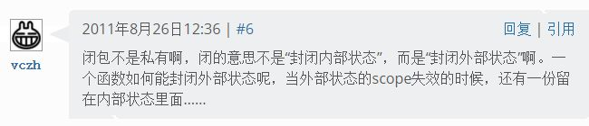

闭包是什么？如果你与我有同样的疑问，敬请阅读。
<!--more--->

## [什么是闭包？](https://www.ibm.com/developerworks/cn/linux/l-cn-closure/#note_1)

这个问题困扰了我很长时间。

第一次接触闭包这个概念，是在“形式语言”这门课上。好像“离散数学”这门课上也教过闭包，但是这都不重要，因为我们这里讨论的闭包与数学上的闭包没什么关系。本文讨论的闭包，是程序设计语言中的闭包。

### 专业概念：


闭包是在其词法上下文中引用了自由变量的**函数**，自由变量是指除局部变量以外的变量。

又有一种说法是闭包**不是函数**，而是由函数和与其相关的引用环境组合而成的实体。

[维基百科](https://zh.wikipedia.org/wiki/%E9%97%AD%E5%8C%85_(%E8%AE%A1%E7%AE%97%E6%9C%BA%E7%A7%91%E5%AD%A6))的解释：闭包在实现上是一个结构体，它存储了一个函数（通常是其入口地址）和一个关联的环境（相当于一个符号查找表）。

看到这里我彻底懵逼了。是是是，你们说的都对！


身为新手小白，我需要通过判断闭包是做什么的，之后再讨论为什么叫做闭包。

## 闭包有什么用？

如果你是从C++来的，那么阅读下面没有什么障碍。如果不是也没有关系，反正各种语言的设计原理都是类似的，只要你掌握的语言有**匿名函数**的功能即可。

我们都知道，C++11标准引入了lambda表达式，就是一个匿名函数。这个函数长成这样：

```cpp
[](const string&a, const string&b) {
    return a.size() < b.size();
};
```
上面的这个匿名函数负责比较两个字符串的大小。匿名函数的好处就是节省代码。

比如我现在想要实现自定义字符串排序函数，按照字符串长度从小到大排序，而不是按照字典排序。这个排序函数就可以用lambda表达式定义。

```cpp
stable_sort(words.begin(), words.end(), 
            [](const string&a, const string&b) {
                return a.size() < b.size();
};)
```

lambda前面的中括号是干啥的？是用来捕获外部变量的。比如我想判断字符串长度有没有大于阈值threshold，这个threshold是在函数外面定义的。按照C++的语法，一般的函数不能访问函数外部的变量。但是lambda可以把外部的变量“捕获”，就像下面这样：

```cpp
int threshold = 10;
[threshold](const string& a) {
    return a.size() > threshold;
};
```

可以看到，这个lambda不但使用了lambda内部的变量和参数，而且还“偷取”了不属于它的全局变量threshold。**我们把lambda表达式定义的这种函数叫做闭包。**

## 为什么叫做闭包？

有人说这不是脑子有坑吗，闭包哪里“闭”了？这明明比普通函数更“开放”好吧？是不是名字起错了？

其实不然。闭包并不是对内部封闭，而是给当前外部环境取了个快照，相当于封闭了外部状态。下面是著名营养快线经销商vczh的回答：



## Python中的闭包

Python中写闭包就要方便多了，毕竟Python的设计哲学就是“一切皆对象”，函数都是对象。

我们来看这样一个问题：利用闭包和生成器返回一个计数器函数，每次调用它返回递增整数。

```python
# 利用闭包和生成器返回一个计数器函数，每次调用它返回递增整数。
def createCounter():    
    [...]

# 检验部分
counterA = createCounter()
print(counterA(), counterA(), counterA(), counterA(), counterA()) # 1 2 3 4 5
counterB = createCounter()
if [counterB(), counterB(), counterB(), counterB()] == [1, 2, 3, 4]:
    print('测试通过!')
else:
    print('测试失败!')
```

你想怎么写？我能想到的，就是在函数内部定义一个生成器，每次调用生成一个整数；然后利用next函数构造一个迭代器，每次调用让这个整数+1，最后返回这个迭代器。

```python
def createCounter():    
    def counter():
        '''定义一个生成器
        '''
        n = 0
        while 1:
            n += 1
            yield n
    g = counter() # 取生成器
    def g_fn():
        '''定义一个迭代器，利用next迭代生成器g
        '''
        return next(g)
    return g_fn # 返回这个迭代器
```

我们看一下上面这个函数，函数内部定义的`g_fn`函数，它使用了外部变量`g`，也就是说`g_fn`是个闭包。

## 总结一下：

**引用了自由变量的函数，就是闭包。**