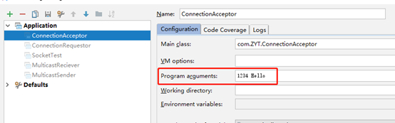

# 实验二
## 一、实验目的

尝试实现一个无连接的数据报Socket进程间通信（UDP）

## 二、实验内容

1. 创建两个进程，使用无链接的数据报Socket实现交换一个字符串。一个叫做Sender.java ，用于向一个名为Receiver.java的进程发送一个字符串。
2. Sender.java需要一个命令行参数，用于表示传递消息的端口号.
3. Receiver.java 需要一个命令行参数用于表示接受消息的端口号。
4. 接受方需要阻塞直到从发送方收到一个消息。如果发送放在接受运行之前发送出消息，消息会丢失。这种情况在此实验中是允许的。
5. 消息缓冲可以是定长的。如果发送的消息比消息缓冲长，接受方就看不到完整的消息。这种情况在此实验中是允许的。例如，消息缓冲的长度是5，而发送方发送一个消息 “123456789”，则接受方只能看到“12345”。

## 三、实验设计

### 实验背景：

**UDP简介**

[JAVA Socket 实现 UDP 编程](https://blog.csdn.net/qq_23473123/article/details/51464272)

UDP协议全称是用户数据报协议，在网络中它与TCP协议一样用于处理数据包，是一种无连接的协议。在OSI模型中，在第四层——传输层，处于IP协议的上一层。UDP有不提供数据包分组、组装和不能对数据包进行排序的缺点，也就是说，当报文发送之后，是无法得知其是否安全完整到达的。UDP用来支持那些需要在计算机之间传输数据的网络应用。包括网络视频会议系统在内的众多的客户/服务器模式的网络应用都需要使用UDP协议。

UDP协议的主要作用是将网络数据流量压缩成数据包的形式。一个典型的数据包就是一个二进制数据的传输单位。每一个数据包的前8个字节用来包含报头信息，剩余字节则用来包含具体的传输数据。

**什么时候应该使用UDP：**
当对网络通讯质量要求不高的时候，要求网络通讯速度能尽量的快，这时就可以使用UDP。 

比如，日常生活中，常见使用UDP协议的应用如下：

QQ语音、QQ视频……

**Java中的UDP**

在Java中，实现UDP连接和数据传输的类主要是DatagramPacket和DatagramSocket。

DatagramSocket类表示用来发送和接收数据报包的套接字。

数据报套接字是包投递服务的发送或接收点。每个在数据报套接字上发送或接收的包都是单独编址和路由的。从一台机器发送到另一台机器的多个包可能选择不同的路由，也可能按不同的顺序到达。

在 DatagramSocket 上总是启用 UDP 广播发送。在接收端（Receiver），DatagramSocket只需输入空闲端口即可初始化对象。在消息发送端（Sender），DatagramSocket不需要任何参数初始化，直接新建对象。

DatagramSocket对象拥有send()和receive()方法，参数是DatagramPacket对象，即发送和接收数据包。

DatagramPacket类表示数据报包。

数据报包用来实现无连接包投递服务。每条报文仅根据该包中包含的信息从一台机器路由到另一台机器。从一台机器发送到另一台机器的多个包可能选择不同的路由，也可能按不同的顺序到达。不对包投递做出保证。

发送方（sender）要负责在数据报包上面贴好标签，注明收信人（地址和端口），这样才能够准确地被收信人（receiver）收到。

在DatagramPacket包中的函数 int getLength()返回实际接受的字节数，
byte[] getData()返回接受到的数据。

要想接受端给发送端回信息，就需要知道发送端的IP地址InetAddress getAddress()和发送端进程所绑定的端口号int getPort()。

数据报套接字发送成功之后，就相当于建立了一个虚连接，双方可以发送数据。

### 实验环境：

Intellij IDEA, JDK 1.8, Windows 10

### 实验思路：

1. 新建两个类，Sender和Receiver。由于逻辑简单，具体代码可直接在main中实现；
2. Sender和Receiver类需要接收命令行参数，可利用Intellij IDEA的类运行设置来输入参数，利用main函数的args参数来传递命令行参数，避免了操作命令行界面的不便；


3. Sender：定义地址、端口号、数据；创建数据报包，包含发送的数据信息；创建DatagramSocket对象；向服务器发送数据报包。
4. Receiver：创建服务器端DatagramSocket，指定端口；创建数据报，用于接收客户端发送的数据；接收客户端发送的数据；读取数据。

### 相关代码：

`Sender.java`

```java
public class Sender {
    public static void main(String[] args) throws IOException {
        /*
         * 向Receiver发送数据
         * java Sender 192.168.1.101 12 hello
         */
        // 1.定义服务器的地址、端口号、数据
        if (args.length != 3) {
            System.out.println("参数个数不正确！" + args.length);
            return;
        }
        System.out.println(args[0]);
        System.out.println(args[1]);
        System.out.println(args[2]);
        InetAddress address = InetAddress.getByName(args[0]);
        //InetAddress address = InetAddress.getByName("localhost");

        int port = Integer.parseInt(args[1]);
        byte[] data = args[2].getBytes();

        // 2.创建数据报，包含发送的数据信息
        DatagramPacket packet = new DatagramPacket(data, data.length, address, port);
        // 3.创建DatagramSocket对象
        DatagramSocket socket = new DatagramSocket();
        // 4.向服务器端发送数据报
        socket.send(packet);
    }
}

```

`Receiver.java`

```java
public class Receiver {
    /*
     * 接收Sender发送的数据
     * java Receiver 12
     */
    public static void main(String[] args) throws IOException {
        // 设置缓冲区大小
        int bufferLength = 5;
        // 设置参数格式
        if (args.length != 1) {
            System.out.println("参数个数不正确！" + args.length);
            return;
        }
        // 1.创建服务器端DatagramSocket，指定端口
        DatagramSocket socket = new DatagramSocket(Integer.parseInt(args[0]));
        // 2.创建数据报，用于接收客户端发送的数据
        byte[] data = new byte[bufferLength];
        DatagramPacket packet = new DatagramPacket(data, data.length);
        // 3.接收客户端发送的数据
        System.out.println("****服务器端已经启动，等待客户端发送数据");
        socket.receive(packet);// 此方法在接收到数据报之前会一直阻塞
        // 4.读取数据
        String info = new String(data, 0, packet.getLength());
        System.out.println("我是服务器，客户端说：" + info);

    }
}

```

## 四、实验结果与分析

编译过程略去。

1. 运行Reciever

2. 运行Sender

3. 此时的Receiver


### 实验分析：

缓冲区大小可以修改。修改后的缓冲区大小为5，可以看到，Sender中的消息`Hello!`发送给Receiver后，尾部的感叹号被削去。

通过本次实验，我了解了UDP连接的原理与优缺点，掌握了在Java中建立UDP连接的方法。

--------

# 实验三
## 一、实验目的

尝试通过面向流模式的socket实现通信。

## 二、实验内容

1.	创建一个名为Acceptor.java的程序。此程序可以接受一个连接并用流模式socket接受一个消息。创建一个名为 Requestor.java 的程序。此程序可以请求一个连接，并使用流模式socket。
2.	Acceptor.java 有2个命令行参数，分别用于表示本进程使用的服务器socket的端口号，以及要发送的消息。
3.	Requestor.java 有2个命令行参数，分别表示连接acceptor的主机名和连接acceptor的端口号。

## 三、实验设计

### 实验背景：

[Java 通过 Socket 实现 TCP 编程](https://blog.csdn.net/qq_23473123/article/details/51461894)

**TCP简介**

TCP（Transmission Control Protocol 传输控制协议）是一种面向连接的、可靠的、基于字节流的传输层通信协议。

**Java Socket简介**

所谓socket 通常也称作”套接字“，用于描述IP地址和端口，是一个通信链的句柄。应用程序通常通过”套接字”向网络发出请求或者应答网络请求。

ServerSocket用于服务器端，Socket是建立网络连接时使用的。在连接成功时，应用程序两端都会产生一个Socket实例，操作这个实例，完成所需的会话。对于一个网络连接来说，套接字是平等的，并没有差别，不因为在服务器端或在客户端而产生不同级别。不管是Socket还是ServerSocket它们的工作都是通过SocketImpl类及其子类完成的。

**Java Socket常用方法**

. Accept方法用于产生”阻塞”，直到接受到一个连接，并且返回一个客户端的Socket对象实例。”阻塞”是一个术语，它使程序运行暂时”停留”在这个地方，直到一个会话产生，然后程序继续；通常”阻塞”是由循环产生的。

. getInputStream方法获得网络连接输入，同时返回一个InputStream对象实例。 
. getOutputStream方法连接的另一端将得到输入，同时返回一个OutputStream对象实例。

注意：其中getInputStream和getOutputStream方法均会产生一个IOException，它必须被捕获，因为它们返回的流对象，通常都会被另一个流对象使用。

**Java 操作流对象**

建立Socket连接后，两台机器之间便以流模式进行通信。在Java API中，可以从其中读入一个字节序列的对象称做输入流，而可以向其中写入一个字节序列的对象称做输出流。这些字节序列的来源地和目的地可以是文件，而且通常都是文件，但是也可以是网络连接，甚至是内存块。抽象类InputStream和OutputStream构成了输入/输出（I/O)类层次结构的基础。

本次实验我选择利用Scanner作为读取流的手段，用PrintWriter作为写入流的手段。

### 实验环境：

Intellij IDEA, JDK 1.8, Windows 10

### 实验思路：

1. 新建两个类，ConnectionAcceptor和ConnectionRequestor。由于逻辑简单，具体代码可直接在main中实现；
2. ConnectionAcceptor和ConnectionRequestor类需要接收命令行参数，可利用Intellij IDEA的类运行设置来输入参数，利用main函数的args参数来传递命令行参数，避免了操作命令行界面的不便；
3. ConnectionRequestor：建立连接；接收数据；发送数据；关闭连接。
4. ConnectionAcceptor：接收请求；发送数据；接收数据；断开连接。

### 相关代码：

`ConnectionRequestor.java`

```java
public class ConnectionRequestor {
    /*
     * java ConnectionRequestor 192.168.1.101 12
     */
    public static void main(String[] args) throws IOException {
        // 检查参数个数
        if (args.length != 2) {
            System.out.println("Wrong parameters!");
            return;
        }
        // 1. 建立连接
        String host = args[0];
        int port = Integer.parseInt(args[1]);
        Socket socket = new Socket(host, port);
        // 2. 接收数据
        InputStream inputStream = socket.getInputStream();
        Scanner scanner = new Scanner(inputStream);
        String line = scanner.nextLine();
        System.out.println("收到来自发送方的消息：" + line);
        // 3. 发送数据
        OutputStream outputStream = socket.getOutputStream();
        PrintWriter printWriter = new PrintWriter(outputStream, true);
        printWriter.println("我已收到消息，内容是" + line);
        // 4. 关闭连接
        socket.close();
    }
}

```

`ConnectionAcceptor.java`

```java
public class ConnectionAcceptor {
    /*
     * java ConnectionAcceptor 12 Hello
     */
    public static void main(String[] args) throws IOException {
        // 检查参数个数
        if (args.length != 2) {
            System.out.println("Wrong parameters!");
            return;
        }
        // 1. 接受请求
        int port = Integer.parseInt(args[0]);
        ServerSocket serverSocket = new ServerSocket(port);
        Socket socket = serverSocket.accept();
        // 2. 发送数据
        OutputStream outputStream = socket.getOutputStream();
        PrintWriter printWriter = new PrintWriter(outputStream, true);
        printWriter.println(args[1]);
        // 3. 接收数据
        InputStream inputStream = socket.getInputStream();
        Scanner scanner = new Scanner(inputStream);
        String line = scanner.nextLine();
        System.out.println("服务器应答：" + line);
        // 4. 断开连接
        socket.close();
    }
}

```

## 四、实验结果与分析

编译过程略去。

1. 运行ConnectionAcceptor

2. 运行ConnectionRequestor

3. 此时的ConnectionAcceptor


### 实验分析：

通过本次实验，我了解了TCP连接的原理与优缺点，掌握了TCP和UDP的主要不同之处，掌握了在Java中建立TCP Socket连接的方法，掌握了流处理的基本方法。


------

# 实验四
## 一、实验目的

创建进程之间的多播。

## 二、实验内容

1.	MulticastSender.java用于发送多播消息给多播接收程序。多播IP地址是239.1.2.3 端口号为1234。
2.	MulticastReceiver.java 用于接收多播消息并显示消息。
3.	实验最终效果要求：至少开启两个以上的MulticastReceiver进程，MulticastSender发送的消息，均可被MulticastReceiver收到。

## 三、实验设计

### 实验背景：

[java--------多播编程-----MulticastSocket](https://blog.csdn.net/zhouzixin053/article/details/22823521)

**单播：**

一个单个的发送者和一个接受者之间通过网络进行的通信。

1、服务器及时响应客户机的请求

2、服务器针对每个客户不同的请求发送不同的数据，容易实现个性化服务。

**多播：**

一个发送者和多个接受者之间的通信。

广播特点：主机之间“一对所有”的通讯模式，网络对其中每一台主机发出的信号都进行无条件复制并转发，所有主机都可以接收到所有信息（不管你是否需要）。

1、网络设备简单，维护简单，布网成本低廉。

2、由于服务器不用向每个客户机单独发送数据，所以服务器流量负载极低。

多播的地址是特定的，D类地址用于多播。D类IP地址就是多播IP地址，即224.0.0.0至239.255.255.255之间的IP地址。

**多播程序设计的框架**

要进行多播的编程，需要遵从一定的编程框架。多播程序框架主要包含套接字初始化、设置多播超时时间、加入多播组、发送数据、接收数据以及从多播组中离开几个方面。其步骤如下：

（1）建立一个socket。

（2）然后设置多播的参数，例如超时时间TTL、本地回环许可LOOP等。

（3）加入多播组。

（4）发送和接收数据。

（5）从多播组离开。

**Java MulticastSocket**

多播通过多播数据报套接MulticastSocket类来实现

重要的构造方法：
```java
MulticastSocket()//创建多播套接字
MulticastSocket(int port)//创建多播套接字并将其绑定到特定端口
MulticastSocket(SocketAddress bindaddr)//创建绑定到指定套接字地址的MulticastSocket
```
常用的方法：
```java
void joinGroup(InetAddress meastaddr)//加入多播组
void leaveGroup(InetAddress meastaddr)//离开多播组
void send(DatagramPacket p)//从此套接字发送数据包
public void receive(DatagramPacket p)//从此套接字接收数据包
```

### 实验环境：

Intellij IDEA, JDK 1.8, Windows 10

### 实验思路：

1. 新建两个类，MulticastSender和MulticastReciever。由于逻辑简单，具体代码可直接在main中实现；
2. 为了体现多播的广播特性，MulticastReciever的进程要多几个，随着MulticastSender的启动，全部收到信息才行。
3. MulticastSender：新建多播连接；构造数据包；广播数据；关闭连接。
4. MulticastReciever：新建多播连接；构造数据包；接收数据；关闭连接。

### 相关代码：

`MulticastSender.java`

```java
public class MulticastSender {
    public static void main(String[] args) throws IOException {
        // 新建多播连接
        int port = 1234;
        String address = "239.1.2.3";
        MulticastSocket multicastSocket = new MulticastSocket(port);
        InetAddress groupAddress = InetAddress.getByName(address);
        multicastSocket.joinGroup(groupAddress);
        // 构造数据包
        byte[] message = "Hello!".getBytes();
        DatagramPacket datagramPacket = new DatagramPacket(message, message.length, InetAddress.getByName(address), port);
        // 广播数据
        multicastSocket.send(datagramPacket);
        // 关闭连接
        multicastSocket.close();
    }
}

```

`MulticastReciever.java`

```java
public class MulticastReciever {
    public static void main(String[] args) throws IOException {
        // 新建多播连接
        int port = 1234;
        String address = "239.1.2.3";
        MulticastSocket multicastSocket = new MulticastSocket(port);
        InetAddress groupAddress = InetAddress.getByName(address);
        multicastSocket.joinGroup(groupAddress);
        // 构造数据包
        byte[] message = new byte[1024];
        DatagramPacket datagramPacket = new DatagramPacket(message, message.length, InetAddress.getByName(address), port);
        // 接收数据
        multicastSocket.receive(datagramPacket);
        System.out.println("接收到了广播消息：" + new String(message));
        // 关闭连接
        multicastSocket.close();
    }
}

```

## 四、实验结果与分析

编译过程略去。

1. 运行MulticastReciever（6个）

2. 运行MulticastSender

3. 此时的MulticastReciever


剩下三个略去不表，结果相同。

### 实验分析：

通过本次实验，我了解了多播的原理和相对于单播的优点，掌握了在Java中建立多播MulticastSocket连接的方法。